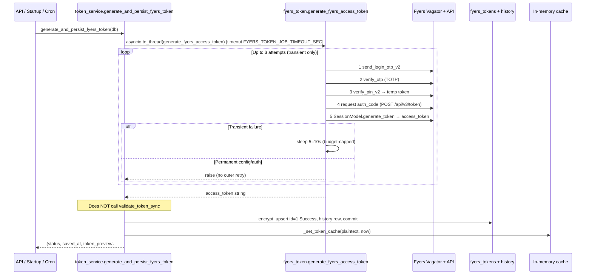

# Access Token Generation Process

**Document:** `Access_Token_Generation_Process.md`  
**Status:** Verified against current codebase (2026-07-23)  
**Scope:** How the FYERS daily access token is **generated**, **validated**, **saved**, and **cached**

> **Note:** This file was not previously present in the repository. It was created from the live implementation so ops and developers have a single accurate reference. Related: `Automatic_Token_To_Scanner_Workflow.md` (startup → token → auto-scanner).

---

## 1. Overview

The system has **two distinct save paths** for a FYERS access token:

| Path | Purpose | Generate? | Live FYERS validate before save? | History note |
|------|---------|-----------|----------------------------------|--------------|
| **A. Automated generate + persist** | Cron / startup / internal API | Yes (TOTP headless) | **No** (generator is authoritative) | `Automated headless token generation` |
| **B. Manual save** | UI / paste existing token | No | **Yes** (unless `APP_ENV=test`) | `Manual save via UI` |
| **C. OAuth exchange** | Browser OAuth callback | Yes (code → token) | No (exchange response is source) | `Auto-generated via FYERS OAuth` |

All paths ultimately write the **encrypted** token into PostgreSQL table `fyers_tokens` (singleton row **id=1**), update **in-memory cache**, and never log the raw secret.

---

## 2. Environment Variables (generation credentials)

Required for automated generation (`fyers_token.generate_fyers_access_token`):

| Variable | Role |
|----------|------|
| `FYERS_CLIENT_ID` | Fyers user id (e.g. YJ08718) |
| `FYERS_APP_ID` | API app id |
| `FYERS_APP_SECRET` or `FYERS_SECRET_ID` | App secret |
| `FYERS_TOTP_SECRET` | Base32 TOTP secret |
| `FYERS_PIN` | 4- or 6-digit login PIN |
| `FYERS_REDIRECT_URI` | Optional OAuth redirect override |

Operational / security:

| Variable | Default | Role |
|----------|---------|------|
| `SCHEDULER_SECRET` | — | Required header for `/api/token/generate` and `/fyers/token/generate` |
| `TOKEN_ENCRYPTION_KEY` | — | Fernet key material for encrypting tokens at rest |
| `FYERS_TOKEN_CACHE_MINUTES` | `60` | In-process plaintext cache TTL |
| `FYERS_TOKEN_JOB_TIMEOUT_SEC` | `180` | Hard timeout around generation in `generate_and_persist_fyers_token` |
| `FYERS_TOKEN_DB_WRITE_TIMEOUT_SEC` | `30` | Hard timeout on DB commit |
| `FYERS_HTTP_TIMEOUT_SEC` | `10` | Per-request HTTP timeout in generator |
| `FYERS_RETRY_BUDGET_SEC` | `35` | Wall-clock budget for full generate under retries |
| `AUTO_TOKEN_SCANNER_ON_STARTUP` | `true` | Startup bootstrap (see Automatic_Token_To_Scanner_Workflow) |
| `AUTO_SCANNER_AFTER_TOKEN` | `true` | Auto Market Scanner after token ready |

---

## 3. Path A — Automated generation + persistence (canonical daily path)

### 3.1 Entry points

| Entry | How |
|-------|-----|
| `POST /api/token/generate` | Header `X-Scheduler-Secret: <SCHEDULER_SECRET>` |
| `POST /fyers/token/generate` | Same secret gate |
| `POST /internal/refresh-fyers-token` | Same secret gate |
| App startup bootstrap | `token_scanner_bootstrap_service.ensure_daily_access_token` → `generate_and_persist_fyers_token` |
| CLI (generate only) | `python fyers_token.py` → prints raw token to stdout (**does not save to DB**) |

### 3.2 Sequence



### 3.3 Generation steps (inside `fyers_token.py`)

Implemented in `generate_fyers_access_token()`:

1. **OTP request** — `POST https://api-t2.fyers.in/vagator/v2/send_login_otp_v2`
2. **TOTP verify** — `POST .../verify_otp` (fresh TOTP each attempt; one inner window retry)
3. **PIN verify** — `POST .../verify_pin_v2` → temporary access token
4. **Auth code** — `POST https://api-t1.fyers.in/api/v3/token` (fallback: legacy GET generate-authcode)
5. **Final token** — `SessionModel.generate_token` → app **access_token**

### 3.4 Retry policy (generator)

| Rule | Value |
|------|--------|
| Max attempts | **3** (`MAX_TOKEN_ATTEMPTS`) |
| Delay between attempts | Random **5.0–10.0** seconds |
| Wall-clock budget | `FYERS_RETRY_BUDGET_SEC` (default 35s) |
| Transient | Network, timeouts, 5xx, some auth flakes |
| Permanent (fail-fast) | Missing config, invalid TOTP secret, hard auth failures |

Retries live **inside** `generate_fyers_access_token`.  
`generate_and_persist_fyers_token` does **not** add an outer retry loop.

### 3.5 Persist steps (`generate_and_persist_fyers_token`)

File: `backend/app/services/token_service.py`

1. Run generator off the event loop (`asyncio.to_thread`) with job timeout.  
2. Reject empty token.  
3. Encrypt via `token_crypto.encrypt_secret` / `_encrypt_for_storage`.  
4. Decode JWT `exp` → `expires_at` when possible.  
5. **Single transaction:**
   - Deactivate other active rows (`is_active=False`, `status=inactive`) where `id != 1`
   - Upsert **`fyers_tokens.id = 1`**:
     - `access_token` = ciphertext  
     - `is_active = True`  
     - `status = "Success"`  
     - `last_error = NULL`  
     - `access_token_saved_at = now`  
     - `validated_at = now`  
     - `expires_at = ...`  
   - Insert `FyersTokenHistory` (masked only; note = automated)  
6. Commit with timeout.  
7. **Only after commit:** `_set_token_cache` + invalidate `token_status` response cache.  
8. Return `{ status: "Success", saved_at, token_preview }` — **never raw token**.

### 3.6 Failure handling (automated path)

On any exception after/during generation:

1. Record metrics (`failure_total`, `last_error_type`).  
2. `_record_generation_failure`:
   - Sets `status="Failed"`, `last_error=<truncated message>`
   - **Does not wipe** a prior good `access_token` (keeps trading on last valid credential when possible)
   - Empty/missing credential stays inactive  
3. Re-raises for API/cron exit codes.

### 3.7 Important accuracy notes

| Claim | Correct? |
|-------|----------|
| Automated path validates against FYERS after generate before save | **No** — code explicitly skips live re-validation (“generation is authoritative”) |
| Automated path uses `save_access_token` | **No** — separate atomic persist path (tests assert this) |
| CLI `python fyers_token.py` saves to Neon | **No** — prints token only; host must call persist API/service |
| Token stored as plaintext in DB | **No** — encrypted with Fernet when `TOKEN_ENCRYPTION_KEY` is configured |
| Multiple active rows are intended | **No** — singleton **id=1** is the active credential |

---

## 4. Path B — Manual save (UI / API)

### 4.1 Entry points

| Entry | Body |
|-------|------|
| `POST /api/token/save-access-token` | `{ "access_token": "..." }` |
| `POST /fyers/token` | Same payload (save only, no generate) |

### 4.2 Sequence (`save_access_token`)

1. Log start (length + **masked** preview only).  
2. **Live validate** via `FyersService.validate_token_sync` (15s timeout), unless `APP_ENV=test`.  
3. On validation failure → return `{ status: "error", message }` — **do not save**.  
4. Transaction:
   - Deactivate all active tokens  
   - Upsert id=1 encrypted token, `status=Success`, timestamps  
   - History note: `Manual save via UI`  
5. After commit: warm in-memory cache + invalidate status cache.  
6. Return `{ status: "ok", saved_at }`.

### 4.3 After successful manual save

`POST /api/token/save-access-token` may **auto-trigger Market Scanner** once/day (window + not already running/completed) via `token_scanner_bootstrap_service.maybe_trigger_auto_scanner`.  
Response may include `auto_scanner: { started, skipped_reason }`.

---

## 5. Path C — Browser OAuth exchange

| Entry | Flow |
|-------|------|
| `GET /fyers/auth/url` | Build OAuth URL |
| `POST /fyers/auth/exchange` | Exchange `auth_code` → access_token → encrypt + upsert id=1 |

Implemented in `token_service.exchange_auth_code`. History note: `Auto-generated via FYERS OAuth`.

---

## 6. Read path (how the rest of the app uses the token)

```text
get_current_access_token(db) / get_current_access_token_sync()
  1. If in-memory cache valid (TTL) → return plaintext
  2. Else load active FyersToken from DB
  3. Decrypt ciphertext
  4. _set_token_cache
  5. Return plaintext (never logged)
```

Status API: `GET /api/token/status` — DB-derived fields + `connection_status` + automation metrics; **no raw token**.

---

## 7. Database model

**Table:** `fyers_tokens` (`backend/app/models/fyers_token.py`)

| Column | Role |
|--------|------|
| `id` | Primary key; production uses **1** as singleton |
| `access_token` | Encrypted secret (Text) |
| `is_active` | Active credential flag |
| `status` | `Success` / `Failed` / `inactive` (monitoring) |
| `access_token_saved_at` | Last successful save time |
| `validated_at` | Last validation / save stamp |
| `expires_at` | JWT exp when parseable |
| `last_error` | Failure message (truncated); prior token preserved on fail |
| `created_at` | Row create time |

**Table:** `fyers_token_history` — masked preview + status + note (audit trail only).

---

## 8. In-memory cache

| Item | Detail |
|------|--------|
| Globals | `_CACHED_TOKEN`, `_TOKEN_EXPIRY`, `_TOKEN_SAVED_AT` |
| TTL | `FYERS_TOKEN_CACHE_MINUTES` (default 60) |
| Set | After successful DB commit only |
| Clear | Auth failures, save failures, explicit invalidation |
| Thread safety | `_TOKEN_LOCK` for sync readers |

---

## 9. Startup integration (daily token)

On application lifespan (non-quarantine, singleton worker):

1. `schedule_startup_bootstrap()`  
2. If **today’s** valid token (IST) exists → skip generation  
3. Else → `generate_and_persist_fyers_token`  
4. Bootstrap then live-validates the loaded token  
5. On success → may auto-start Market Scanner (once/day, window 08:30–22:00 IST)

See **`Automatic_Token_To_Scanner_Workflow.md`** for full scanner coupling.

---

## 10. Logging keys (searchable)

| Phase | Log / message |
|-------|----------------|
| API accept | `TOKEN_GENERATE_ACCEPTED` / `FYERS_TOKEN_GENERATE_ACCEPTED` |
| Job start | `TOKEN_PERSISTENCE_JOB \| outcome=start` |
| Gen steps | `step=otp_request\|totp_verify\|...` in `fyers_auth` logger |
| Job success | `TOKEN_PERSISTENCE_JOB \| outcome=Success` |
| Job failure | `TOKEN_PERSISTENCE_JOB \| outcome=Failed` |
| Manual save | `SAVE ACCESS TOKEN STARTED` → `TOKEN_SAVE_SUCCESS` |
| Validation | `TOKEN_VALIDATION_FAILURE` / `TOKEN_AUTH_RECOVERED` |
| Cache | `TOKEN_CACHE_HIT` / `TOKEN_CACHE_MISS` / `TOKEN_INVALIDATED` |

---

## 11. Error matrix

| Failure | Behavior |
|---------|----------|
| Missing env credentials | `FyersConfigError` → API 400; no token write of new secret |
| Permanent bad auth | Fail-fast; monitoring `Failed` + `last_error` |
| Transient network | Up to 3 attempts + delay; then `FyersConnectionError` / exhausted error |
| Job timeout | `TimeoutError` after `FYERS_TOKEN_JOB_TIMEOUT_SEC` |
| DB commit fail | Logged; metrics failed; exception propagates; cache not updated with new token |
| Manual validation fail | Save aborted; DB unchanged |
| Decrypt fail on read | Treated as no usable token |

---

## 12. Security rules

1. **Never** return raw access token from generate APIs (masked preview only).  
2. **Never** log full token (mask last-4 style via `token_crypto` / `_mask_token`).  
3. Encrypt at rest when `TOKEN_ENCRYPTION_KEY` is set.  
4. Scheduler secret required for automated generate endpoints.  
5. History stores **masked** values only.

---

## 13. Files and functions (source of truth)

| File | Functions / role |
|------|------------------|
| `fyers_token.py` | `generate_fyers_access_token`, retry policy, CLI |
| `backend/app/services/token_service.py` | `generate_and_persist_fyers_token`, `save_access_token`, `get_current_access_token`, cache helpers, `exchange_auth_code` |
| `backend/app/core/token_crypto.py` | `encrypt_secret` / `decrypt_secret` / `mask_secret` |
| `backend/app/routes/token.py` | `/api/token/generate`, `/save-access-token`, `/status`, internal refresh |
| `backend/app/routes/fyers.py` | `/fyers/token/generate`, `/fyers/token`, OAuth helpers |
| `backend/app/models/fyers_token.py` | ORM `FyersToken` |
| `backend/app/services/token_scanner_bootstrap_service.py` | Daily ensure + optional auto-scanner |
| `backend/app/main.py` | Lifespan schedules bootstrap |

---

## 14. How to run / verify

### Generate only (no DB)

```powershell
# From repo root, with .env loaded
python fyers_token.py
# Expect: single line raw token, exit 0
```

### Generate + save (API)

```http
POST /api/token/generate
X-Scheduler-Secret: <SCHEDULER_SECRET>
```

Expect JSON (no raw token):

```json
{
  "status": "Success",
  "saved_at": "...",
  "token_preview": "****abcd",
  "connection_status": "Connected",
  "access_token_active": true,
  "message": "Fyers access token generated and stored"
}
```

### Manual save

```http
POST /api/token/save-access-token
Content-Type: application/json

{ "access_token": "<pasted token>" }
```

### Status

```http
GET /api/token/status
```

---

## 15. Verification checklist (doc vs code)

| Document claim | Code status |
|----------------|-------------|
| Headless TOTP 5-step login | Correct (`fyers_token.py`) |
| Max 3 retries, 5–10s delay | Correct |
| Persist encrypts + upserts id=1 | Correct |
| Cache after durable commit | Correct |
| Automated path skips live re-validation | Correct (bootstrap may validate *after* load) |
| Manual path validates live before save | Correct |
| CLI does not auto-persist | Correct |
| APIs never return raw token | Correct |
| Failure preserves prior token | Correct |

---

## 16. Related documents

- `Automatic_Token_To_Scanner_Workflow.md` — after token ready, auto Market Scanner  
- `specs/007-fyers-totp-token/` — generation feature  
- `specs/008-fyers-token-retry/` — retry policy  
- `specs/009-db-storage-monitoring/` — persist + monitoring  
- `specs/010-fyers-internal-api/` — cron/internal API  

---

**Last verified against:** `fyers_token.py`, `backend/app/services/token_service.py`, `backend/app/routes/token.py`, `backend/app/routes/fyers.py`, `backend/app/services/token_scanner_bootstrap_service.py`, `backend/app/main.py`.
