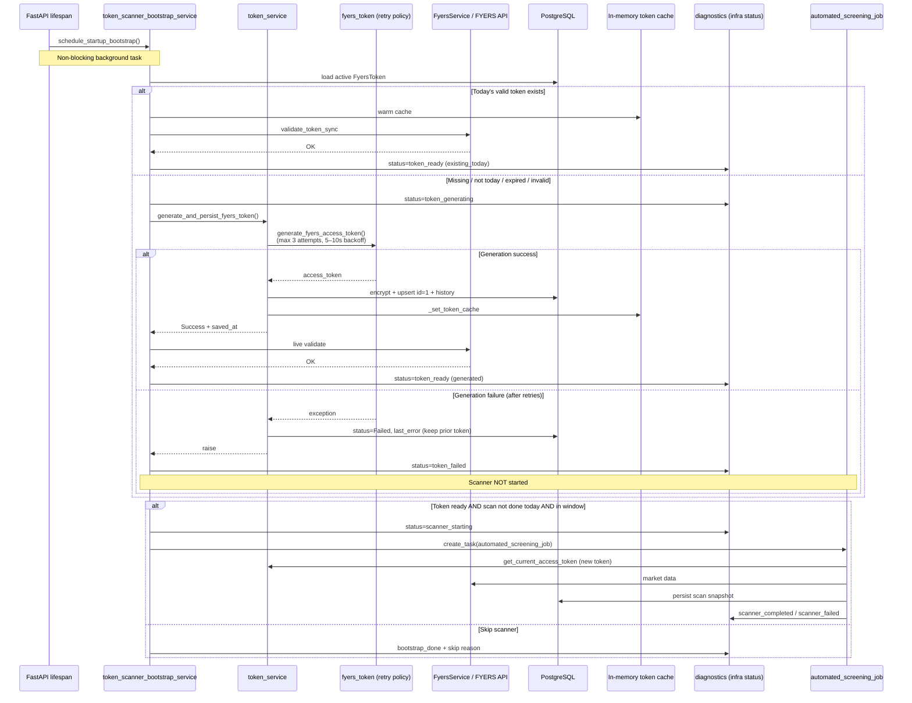

# Automatic Token → Scanner Workflow

**Document:** `Automatic_Token_To_Scanner_Workflow.md`  
**Status:** Implemented  
**Timezone for “day” boundaries:** Asia/Kolkata (IST)

---

## 1. Objective

After the daily FYERS Access Token is successfully **generated, validated, and saved**, the system **automatically starts the Market Scanner** without manual action. The workflow runs primarily on **application startup** (singleton worker) and can also run after successful token API generate/save.

---

## 2. Complete Workflow

### 2.1 High-level steps

| Step | Action | On failure |
|------|--------|------------|
| 1 | On startup, check whether **today’s** Access Token exists and is valid (IST calendar day) | Continue to generation |
| 2 | If missing / not today / expired / live validation fails → **generate** new token | Do **not** start scanner; log; record infra status; rely on existing generator retry policy |
| 3 | **Validate** token against FYERS | Do not start scanner; clear cache; log |
| 4 | Confirm token **saved to database** and **memory cache updated** | Do not start scanner; log |
| 5 | If scanner already completed for today’s token → **skip** | Log skip reason |
| 6 | If within auto-scan window (08:30–22:00 IST) and not already running → **start Market Scanner** | Log failure; infra status `scanner_failed` |
| 7 | Scanner uses token via existing `token_service` cache/DB path | Same as manual/cron scan |

### 2.2 Once-per-day rules

| Resource | “Already done today” definition | Effect |
|----------|----------------------------------|--------|
| **Access Token** | Active usable row with `access_token_saved_at` on **today IST**, JWT not expired, live FYERS validation OK | Skip generation |
| **Market Scanner** | Completed `scan_snapshots` row on **today IST** with `scan_timestamp >= token_saved_at`, **or** process already triggered scanner today | Skip auto-start (manual trigger still allowed via existing endpoints) |

Process-local guards prevent double-trigger on the same process day; the database remains the cross-restart source of truth.

### 2.3 Feature flags (environment)

| Variable | Default | Meaning |
|----------|---------|---------|
| `AUTO_TOKEN_SCANNER_ON_STARTUP` | `true` | Schedule bootstrap on app lifespan startup |
| `AUTO_SCANNER_AFTER_TOKEN` | `true` | Allow auto Market Scanner after a ready token |

Also skipped when `quarantine_mode` is enabled (same as scheduler/market engine).

---

## 3. Sequence Diagram



---

## 4. Files Modified / Added

| File | Change |
|------|--------|
| `backend/app/services/token_scanner_bootstrap_service.py` | **New** — orchestration service |
| `backend/app/main.py` | Schedule bootstrap on startup (replace passive token log-only path) |
| `backend/app/services/diagnostics_service.py` | `token_scanner_bootstrap` status + history for infra views |
| `backend/app/routes/system.py` | Expose bootstrap status on shadow-run status |
| `backend/app/routes/token.py` | Auto-scanner after `/generate` and `/save-access-token` |
| `backend/tests/unit/test_token_scanner_bootstrap.py` | **New** — unit coverage |
| `Automatic_Token_To_Scanner_Workflow.md` | **New** — this document |

**Unchanged but used:**

| File | Role |
|------|------|
| `backend/app/services/token_service.py` | `generate_and_persist_fyers_token`, cache, status |
| `fyers_token.py` | Headless generation + **retry policy** (max 3, 5–10s, budget) |
| `backend/app/services/fyers_service.py` | `validate_token_sync` |
| `backend/app/main.py` → `automated_screening_job` | Market Scanner execution |
| `backend/app/services/latest_scan_service.py` | Detect scan already completed today |

---

## 5. Functions Involved

### 5.1 Bootstrap service (`token_scanner_bootstrap_service.py`)

| Function | Responsibility |
|----------|----------------|
| `schedule_startup_bootstrap(app_state)` | Create background task at lifespan startup |
| `run_token_to_scanner_bootstrap(trigger_source)` | Full workflow entry (token → optional scanner) |
| `check_todays_valid_token(db)` | Today IST + expiry + live validate |
| `ensure_daily_access_token(db, result)` | Generate if needed; validate; confirm save/cache |
| `has_scanner_completed_for_todays_token(db, token_saved_at)` | Once-per-day scanner gate |
| `maybe_trigger_auto_scanner(...)` | Start `automated_screening_job` if allowed |
| `_live_validate_token(token)` | FYERS live validation with timeout |
| `_record_infra(status, message, detail)` | Diagnostics + logger_service + DB log |
| `reset_bootstrap_guards_for_tests()` | Test helper |

### 5.2 Existing dependencies

| Function | Module |
|----------|--------|
| `generate_and_persist_fyers_token` | `token_service` |
| `get_current_access_token` / `_set_token_cache` | `token_service` |
| `generate_fyers_access_token` | `fyers_token` (retries) |
| `validate_token_sync` | `FyersService` |
| `automated_screening_job` | `main` (late-imported) |
| `get_latest_completed_scan` | `LatestScanService` |
| `record_token_scanner_bootstrap` | `diagnostics` |

---

## 6. Error Handling

| Edge case | Behaviour |
|-----------|-----------|
| **Token generation failure** | Exception from `generate_and_persist_fyers_token` after generator retries; `status=Failed` + `last_error` in DB; **scanner not started**; infra `token_failed` |
| **Database save failure** | Handled inside token_service (commit timeout / rollback); re-raised; bootstrap aborts; scanner not started |
| **Cache update failure** | Logged; for existing token path treated as non-fatal (DB remains source of truth). Generation path sets cache only after durable commit inside token_service |
| **Live validation failure** | After generation: clear cache, do not start scanner, infra `token_failed` |
| **Scanner failure** | Logged; infra `scanner_failed`; does not invalidate the token |
| **Network / API errors** | Covered by generator retry policy + validation timeouts (`asyncio.wait_for`) |
| **Scanner already running** | Skip auto-start (`scanner_already_running`) |
| **Outside 08:30–22:00 IST** | Skip auto-start (`outside_scan_window`); token still generated/saved if needed |
| **Quarantine mode** | Bootstrap not scheduled |
| **Concurrent bootstrap** | Process lock; second call skips (`bootstrap_already_running`) |

---

## 7. Logging Flow

All key lines use structured messages (searchable in logs / system log UI).

| Phase | Log message / key |
|-------|-------------------|
| Bootstrap start | `TOKEN_TO_SCANNER_BOOTSTRAP \| outcome=start` |
| Token check | `STARTUP_TOKEN_CHECK \| valid=... \| reason=...` |
| Generation start | `Token generation started \| reason=...` |
| Generation success | `Token generated successfully \| ...` |
| DB save | `Token saved to database \| saved_at=...` |
| Cache | `Memory cache updated \| step=...` |
| Validation | `Token validated \| step=begin/success` |
| Validation fail | `Token validation failure after generation \| ...` |
| Generation fail | `Token generation failure \| scanner_will_not_start=true` |
| Scanner start | `Scanner started automatically \| trigger_source=...` |
| Scanner done | `Scanner completed \| trigger_source=...` |
| Scanner fail | `Scanner failed \| trigger_source=...` |
| Skip reasons | `Scanner auto-start skipped \| reason=...` |
| Bootstrap done | `TOKEN_TO_SCANNER_BOOTSTRAP \| outcome=done \| ...` |

Infrastructure status is also written to:

- `diagnostics.token_scanner_bootstrap` (in-memory; exposed on `/system/shadow-run/status`)
- `logger_service` (JOB / TokenScannerBootstrap)
- `log_to_db` when an event loop is available

### 7.1 Bootstrap status values

`bootstrap_started` → `token_generating` → `token_ready` | `token_failed` → `scanner_starting` → `scanner_completed` | `scanner_failed` → `bootstrap_done` | `error`

---

## 8. Validation Steps

1. **Startup path**
   - Restart backend outside quarantine.
   - Confirm log: `Startup token→scanner bootstrap task scheduled`.
   - If no today’s token: `Token generation started` → success/failure logs.
   - If success in window: `Scanner started automatically`.
   - If today’s scan already exists: `scanner_already_completed_for_todays_token`.

2. **Token already present**
   - Save a valid token today via UI/API.
   - Restart app.
   - Expect: `token_existing_valid` / generation **skipped**; scanner may still run if not completed today.

3. **Generation failure**
   - Break credentials or block network; restart.
   - Expect: `token_failed`, **no** `Scanner started automatically`.
   - `GET /system/shadow-run/status` → `token_scanner_bootstrap.status` reflects failure.

4. **API generate**
   - `POST /api/token/generate` with `X-Scheduler-Secret`.
   - Response may include `auto_scanner.started` / `skipped_reason`.

5. **Manual scanner still works**
   - Existing scheduler/scanner routes remain available independent of auto-once-per-day guard for intentional re-runs (auto path only skips).

6. **Unit tests**

```bash
cd backend
python -m pytest tests/unit/test_token_scanner_bootstrap.py -q
```

---

## 9. Operational Notes

- Token generation can take up to ~`FYERS_TOKEN_JOB_TIMEOUT_SEC` (default 180s) plus internal retries; bootstrap runs as a **background task** so API lifespan is not blocked for the full duration.
- The scanner job validates the token again before screening and loads it via `get_current_access_token`, so it uses the **newly generated** credential after cache/DB update.
- Manual re-run of the scanner is never blocked by this feature’s process guard when invoked through the normal scanner APIs / `automated_screening_job` scheduling outside this bootstrap (only the **auto** path checks once-per-day).

---

## 10. Summary

The system now:

1. Checks for **today’s valid Access Token** on startup.  
2. **Generates, validates, saves, and caches** when needed (with existing retry policy).  
3. **Auto-starts the Market Scanner** only after a confirmed good token.  
4. **Never starts the scanner** on token failure.  
5. Enforces **once-per-day** semantics for token generation and automatic scan.  
6. Emits **detailed logs and infrastructure status** at every step.
