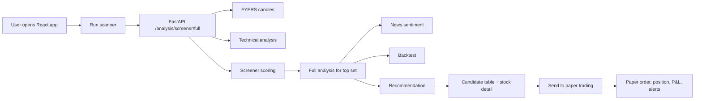
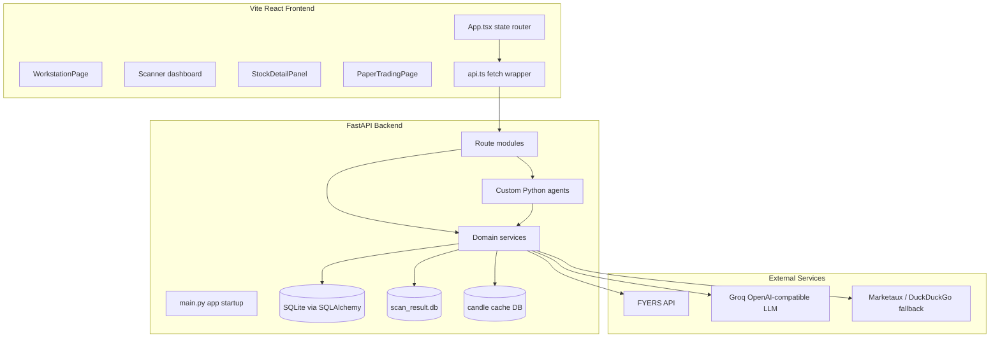
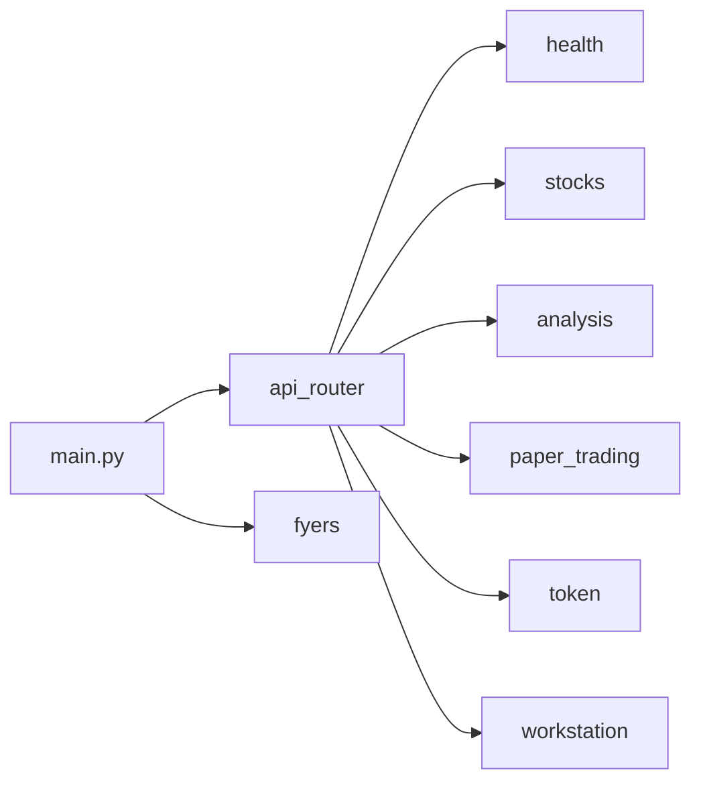
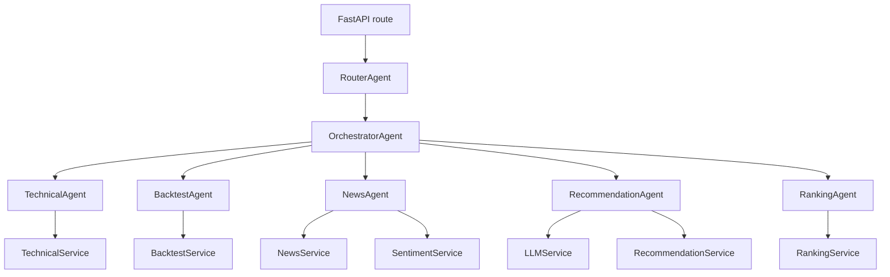
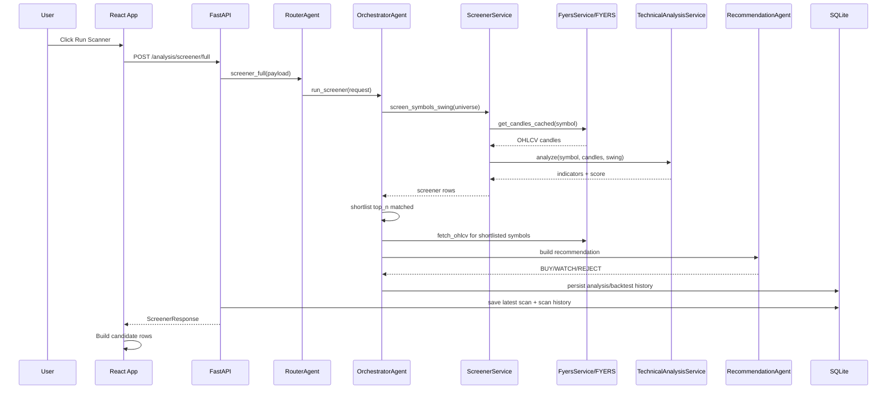
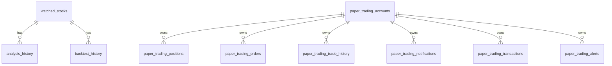
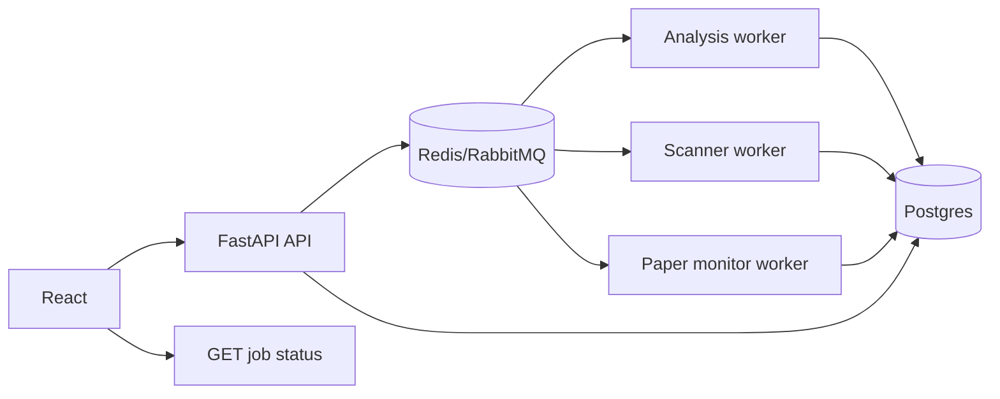

# Trading System Technical Documentation

Generated for client interviews, architecture walkthroughs, React + Python interview preparation, AI workflow explanations, and system design discussions.

This document is based on the actual implementation in this repository. Where requested topics such as CrewAI, MAF, PII redaction, file uploads, queues, or authentication are not implemented in code, the documentation states that directly and explains the closest existing mechanism.

---

# 1. Project Overview

## Project Name

Trading System: Stock Analysis, Swing Scanner, and Paper Trading Workstation.

## Business Goal

The application helps a manual trader scan Indian equity symbols, evaluate technical setups, review news/backtest context, and practise trade execution through paper trading without placing real live orders.

## Problem Solved

Manual traders often waste time checking hundreds of stocks one by one. This project automates the repetitive analysis workflow:

- Fetch market candles and live prices from FYERS.
- Run technical indicator calculations.
- Shortlist symbols with a staged screener.
- Add news sentiment and backtest context.
- Generate an advisory recommendation.
- Let the user practise entries, stops, targets, and P&L using a paper trading simulator.

## End Users

- Retail swing traders using NSE symbols.
- Learners practising position sizing and stop-loss discipline.
- Developers/interviewers evaluating a full-stack financial analytics workflow.
- Client stakeholders who need an advisory-only dashboard rather than broker-side live execution.

## Core Workflow



## High-Level Architecture



## Tech Stack

| Layer | Technology | Actual Usage |
|---|---|---|
| Frontend | React 18 + TypeScript + Vite | Single-page UI with internal view state, scanner, stock detail, paper trading, workstation |
| Charts | Recharts + custom SVG | Recharts dependency plus custom candlestick drawing in `StockDetailPanel.tsx` and `PaperTradingPage.tsx` |
| Backend | FastAPI | HTTP APIs, startup/shutdown hooks, middleware, CORS |
| Data models | SQLAlchemy 2 | SQLite-backed domain models |
| Validation | Pydantic v2 | Request and response schemas |
| Market data | FYERS API v3 | LTP, historical OHLCV, quote profile |
| Technical indicators | pandas + `ta` | EMA, SMA, MACD, RSI, Supertrend approximation, ATR, Bollinger |
| AI reasoning | Groq OpenAI-compatible chat API | Optional JSON-only reasoning generation with deterministic fallback |
| Scheduling | APScheduler + asyncio task | Nightly candle sync and live paper-trading monitor |
| Storage | SQLite files | Main app DB, scan result DB, candle cache |
| Deployment target | Render + Vercel | Render backend URL is hardcoded fallback in frontend API client; Vite build for frontend |

## Why These Technologies Were Chosen

- FastAPI fits the Python analytics stack and provides automatic OpenAPI docs, Pydantic validation, and simple route composition.
- React + Vite gives a fast frontend development loop and static deployment path for Vercel.
- SQLite is simple for a single-user/prototype advisory system and avoids operational database setup.
- pandas and `ta` are natural choices for indicator-heavy financial calculations.
- FYERS is the live data provider for Indian market prices.
- Groq is used as an optional LLM reasoning provider while preserving deterministic fallback behavior when AI is unavailable.

---

# 2. Complete Folder Structure

## Root Folder

Purpose: Project-level configuration, docs, scripts, datasets, and generated local DB/log files.

Key files:

- `README.md`: Phase-1 setup and endpoint overview.
- `requirements.txt`: Backend dependency mirror.
- `plan.md`: Current roadmap and known production gaps.
- `ind_nifty500list.csv`: NSE symbol/company metadata source.
- `openapi.json`: Stale or external artifact titled "SDD AI Summary System"; it does not match the current trading backend routes.
- `PROJECT_TECHNICAL_DOCUMENTATION.md`: This file.

Responsibilities:

- Hold project documentation and environment-level artifacts.
- Provide CSV symbol metadata used by settings and market info fallback.

Entry points:

- Backend: `backend/app/main.py`
- Frontend: `frontend/src/main.tsx`

## `backend/`

Purpose: Python FastAPI backend.

Key files:

- `backend/requirements.txt`: Python dependencies.
- `backend/tests/test_gap_replay.py`: Tests for offline target/stop-loss replay.
- `backend/scripts/bulk_backfill.py`: FYERS candle backfill utility.

## `backend/app/`

Purpose: Main backend package.

Key files:

- `main.py`: FastAPI app, CORS, middleware, scheduler, startup tasks.
- `config/settings.py`: Environment config and universe loading.
- `routes/`: HTTP API endpoints.
- `agents/`: Custom orchestration layer.
- `services/`: Business logic and external integrations.
- `models/`: SQLAlchemy tables.
- `schemas/`: Pydantic contracts.
- `core/`: Logging, server state, gap replay.
- `db/`: SQLAlchemy session plus scan/candle-related storage helpers.

## `backend/app/routes/`

Purpose: API surface.

Key route modules:

- `analysis.py`: Analysis, scanner, stock detail, latest scan.
- `paper_trading.py`: Paper trading dashboard, orders, positions, alerts, analytics, notifications.
- `workstation.py`: Home/workstation data, saved scans, scan history, alerts, risk settings, health.
- `token.py`: Manual FYERS access token save/status/history.
- `fyers.py`: Legacy/direct FYERS token endpoints.
- `stocks.py`: Compatibility stock analyze endpoint.
- `health.py`: Health check.
- `__init__.py`: Combines routers into `api_router`.

## `backend/app/agents/`

Purpose: Custom Python agent facade and orchestration. There is no CrewAI dependency or crew/task framework in the implementation.

Key files:

- `router_agent.py`: Dispatches route calls to `OrchestratorAgent`.
- `orchestrator_agent.py`: Main analysis and screener conductor.
- `technical_analysis_agent.py`: Wraps `TechnicalAnalysisService`.
- `backtest_agent.py`: Wraps `BacktestService`.
- `news_analysis_agent.py`: Wraps `NewsService` and `SentimentService`.
- `recommendation_agent.py`: Combines technical, news, backtest, LLM reasoning, and recommendation scoring.
- `ranking_agent.py`: Wraps `RankingService`.

## `backend/app/services/`

Purpose: Domain logic and external integrations.

Key services:

- `fyers_service.py`: FYERS client, LTP, candles, quote profile, caches.
- `technical_analysis_service.py`: Indicator calculation and technical scoring.
- `screener_service.py`: Parallel symbol screening with rate limiting and retries.
- `backtest_service.py`: EMA/RSI/MACD strategy backtest.
- `recommendation_service.py`: Final action, confidence, score, and trade plans.
- `llm_service.py`: Optional Groq JSON prompt call with fallback reasoning.
- `news_service.py`: News article fetch.
- `sentiment_service.py`: Simple sentiment aggregation.
- `ranking_service.py`: Rank recommendations.
- `paper_trading_service.py`: Paper account, orders, positions, alerts, notifications, analytics.
- `workstation_service.py`: Saved scans, market overview, scan history, risk settings, API health.
- `token_service.py`: Manual FYERS access token persistence.
- `market_info_service.py`: Company metadata from CSV and optional quote profile.
- `candle_store.py`: SQLite candle cache.
- `ohlcv_store.py`: OHLCV persistence helpers.

## `backend/app/models/`

Purpose: SQLAlchemy persistence models.

Important tables:

- `watched_stocks`
- `analysis_history`
- `backtest_history`
- `paper_trading_accounts`
- `paper_trading_positions`
- `paper_trading_orders`
- `paper_trading_trade_history`
- `paper_trading_notifications`
- `paper_trading_transactions`
- `paper_trading_alerts`
- `saved_scans`
- `scan_history_snapshots`
- `workstation_alerts`
- `risk_settings`
- `fyers_tokens`
- `fyers_token_history`

## `frontend/`

Purpose: Vite React frontend.

Key files:

- `package.json`: React, ReactDOM, Recharts, TypeScript, Vite.
- `vite.config.ts`: Vite dev server with `/api` proxy to `http://127.0.0.1:8000`.
- `src/main.tsx`: React root mount.
- `src/App.tsx`: Main app state router and scanner dashboard.
- `src/api.ts`: Backend API client and response normalization.
- `src/types.ts`: Frontend response and view types.
- `src/styles.css`: Global styling.

## `frontend/src/components/`

Purpose: UI components.

Key components:

- `WorkstationPage.tsx`: Home control room.
- `DashboardHeader.tsx`: Scanner controls.
- `FilterBar.tsx`: Candidate filtering.
- `SummaryRow.tsx`: Scanner summary metrics.
- `CandidateTable.tsx`: Main shortlist.
- `AllAnalyzedStocksTable.tsx`: Full analyzed/rejected table.
- `StockDetailPanel.tsx`: Overview, Technicals, Trade Plan, News, Backtest, Chart tabs.
- `PaperTradingPage.tsx`: Paper trading workspace and tabs.
- `TokenStatus.tsx`: FYERS access token UI.
- `NotificationBell.tsx`: Paper-trading notifications.
- `InfoTooltip.tsx`: Tooltips.

## `.github/`

Purpose: Agent instruction files for Speckit workflows. There are no GitHub Actions workflows in `.github/workflows`.

---

# 3. Frontend Architecture (React)

## App Structure

The frontend is a Vite single-page React app. It does not use Next.js routing or React Router. Navigation is controlled by local React state in `frontend/src/App.tsx`.

Important state:

- `mainView`: `"home" | "scanner" | "paper-trading"`
- `detailViewOpen`: whether the stock detail page is open.
- `selectedRow`: selected candidate row.
- `screenerResult`: latest scanner result.
- `filters`: candidate filter state.
- `timeframe`, `topN`, `selectedUniverseName`, `customSymbolsInput`: scanner controls.

## Routing

There is no file-based or URL-based route tree. `App.tsx` conditionally renders:

- `WorkstationPage`
- Scanner dashboard
- `StockDetailPanel`
- `PaperTradingPage`

## State Management

State is local React `useState`/`useEffect`. There is no Redux, Zustand, React Query, or Context-based global store.

State persistence:

- Local scan history is kept in `localStorage` by `loadScanHistory()` and `saveScanHistory()`.
- Latest scan is also restored from backend `/analysis/scan/latest`.

## API Integration

All API calls go through `frontend/src/api.ts`.

The API client:

- Uses `VITE_API_BASE_URL` when present.
- Falls back to `https://trading-system-1efs.onrender.com`.
- Logs request and response diagnostics to the browser console.
- Normalizes stock-detail naming variants such as `year52_high`, `52_week_high`, `technical_extras`, and `backtest_extras`.

Key functions:

- `runPresetScreener()`
- `fetchSymbolDetail()`
- `fetchPaperTradingDashboard()`
- `placePaperOrder()`
- `closePaperPosition()`
- `fetchMarketOverview()`
- `fetchSavedScans()`
- `fetchScanHistory()`
- `saveAccessToken()`
- `getTokenStatus()`

## Authentication Flow

There is no user authentication flow in the frontend. The app directly calls backend APIs. FYERS token management is not user login; it is a provider access key saved to the backend through `/api/token/save-access-token`.

Interview note: This is a major production gap. A real multi-user deployment needs application authentication, user ownership of paper accounts, and authorization checks on every account/order endpoint.

## Component Structure

The UI is componentized by major feature:

- Scanner controls and tables are small focused components.
- Stock detail is a large tabbed component with nested tab functions.
- Paper trading is a large workspace component with account summary, ticket, tables, analytics, alerts, and chart subcomponents.

## Form Handling

Forms are controlled by React state:

- Scanner form: timeframe, universe, lookback, top set, saved scan name.
- Paper order ticket: symbol, side, order type, quantity, prices, stop loss, target, notes.
- Token form: FYERS access token password input.
- Workstation forms: saved scans, price alerts, scan-entry alerts, risk profile.

## Validation

Frontend validation is mostly lightweight:

- Required fields are checked through input state and disabled/error UI.
- Hard validation lives in backend Pydantic schemas, for example `qty >= 1`, `limit_price > 0`, and `top_n <= 50`.

## Error Handling

Frontend error handling includes:

- Scanner-specific FYERS error messaging for token expiry, invalid token, rate limit, and FYERS API failure.
- Retry button for scan failure.
- Initial paper dashboard retry up to 3 times with 2-second delay.
- Console diagnostics in `fetchWithDiagnostics()`.

## Performance Optimization

Current optimizations:

- Scanner backend parallelizes symbol screening.
- Frontend filters/sorts local candidate rows instead of refetching.
- Paper trading polls only the relevant dashboard/quote endpoints.

Current limitations:

- No virtualized tables.
- No React Query caching.
- No bundle splitting.
- Polling is fixed interval rather than WebSocket/server-sent events.

## Environment Config

Frontend environment:

- `VITE_API_BASE_URL`: Primary backend URL.
- If absent, hardcoded Render backend URL is used.

Dev proxy:

```ts
server: {
  proxy: {
    "/api": {
      target: "http://127.0.0.1:8000",
      rewrite: (path) => path.replace(/^\/api/, ""),
    },
  },
}
```

Note: Most frontend API calls use absolute backend URLs, so the proxy is mainly useful when calls are made through `/api`.

## Build and Deployment

Frontend scripts:

```json
{
  "dev": "vite",
  "build": "vite build",
  "preview": "vite preview"
}
```

Deployment target is Vercel-style static hosting. No `vercel.json` was found.

## Major Pages

### Home / Workstation

Purpose: Operational dashboard for universes, market overview, saved scans, scan history, alerts, risk settings, and API health.

Data flow:

- `WorkstationPage` calls `/workstation/universes`, `/market-overview`, `/saved-scans`, `/scan-history`, `/alerts`, `/risk-settings`, and `/api-health`.
- Saved scan load hands config back to `App.tsx`.

User actions:

- Load/delete saved scan.
- Compare scan history.
- Create/delete alerts.
- Update risk settings.
- Refresh market overview and API health.

### Scanner / Dashboard

Purpose: Run swing scanner and show BUY/WATCH/REJECT candidates.

Data flow:

- `App.tsx` calls `runPresetScreener()`.
- API returns `ScreenerResponse`.
- `buildCandidateRows()` maps analysis + screener rows to UI candidates.

API interactions:

- `POST /analysis/screener/full`
- `GET /analysis/scan/latest`
- Workstation APIs for saved scan support.

User actions:

- Choose timeframe/lookback/top set/universe.
- Run scanner.
- Filter and sort candidates.
- Save scan.
- Export CSV.
- Open stock detail.

### Stock Detail Page

Purpose: Explain a single stock through six tabs.

Data flow:

- Receives scanner row from `App.tsx`.
- Calls `GET /analysis/symbol/{symbol}/detail`.
- Normalizes extra detail fields in `api.ts`.

Tabs:

- Overview
- Technicals
- Trade Plan
- News
- Backtest
- Chart

User actions:

- Switch tabs.
- Return to scanner.
- Send candidate levels to paper trading.

### Paper Trading

Purpose: Simulate trading without real money.

Data flow:

- Initial and periodic dashboard calls to `/paper-trading/dashboard`.
- Live quote polling through `/paper-trading/symbols/{symbol}/quote`.
- Notifications polling through `/paper-trading/notifications`.

Tabs:

- Positions
- Open Orders
- History
- Analytics
- Alerts
- Account

User actions:

- Place market/limit/stop/GTT paper orders.
- Edit/cancel orders.
- Close positions.
- Square off all positions.
- Update stop loss/target.
- Create price alerts.
- Reset or update account capital.
- Save FYERS access token.

---

# 4. Backend Architecture (Python)

## Framework

The backend is FastAPI with SQLAlchemy and Pydantic.

Entry point:

- `backend/app/main.py`

## Startup Flow

Startup behavior in `main.py`:

- Calls `setup_logging()` and `configure_logging()`.
- Calls `init_db()` to create SQLAlchemy tables and apply best-effort SQLite schema patches.
- Configures CORS for local origins and Vercel preview URLs.
- Includes route modules through `api_router` and `fyers_router`.
- Starts APScheduler with a nightly candle sync at 18:30 IST.
- Starts a background position monitor loop every 5 seconds.
- Runs offline gap replay and stores the summary in `app.state.last_gap_replay`.

## API Structure



## Middleware

`log_http_requests()` logs:

- Method
- URL path
- Client host
- Status code
- Elapsed milliseconds
- Exceptions

## Services and Business Logic

Business logic is kept mostly out of routes:

- Route modules parse/validate HTTP requests.
- Agents coordinate analysis workflows.
- Services implement data fetching, indicators, scoring, backtesting, paper trading, and persistence.

## Models and Schemas

Models are SQLAlchemy persistence objects. Schemas are Pydantic API contracts.

Important schema families:

- `analysis.py`: analysis, screener, stock detail building blocks.
- `paper_trading.py`: account, orders, positions, alerts, analytics.
- `workstation.py`: saved scans, scan history, alerts, risk settings, health.
- `fyers_token.py`: FYERS token payload.
- `health.py`: health response.

## Validation

Pydantic validation examples:

- `AnalysisRequest.symbols`: min length 1, max length 25, uppercase/deduplicated.
- `ScreenerRequest.top_n`: 1 to 50.
- `PaperOrderCreateRequest.qty`: 1 to 100000.
- `PaperOrderCreateRequest.limit_price`, `stop_loss`, `target`: positive when present.
- `SavedScanCreate.lookback_window`: 30 to 730.
- `RiskSettingsRequest.max_risk_per_trade_pct`: 0.1 to 10.0.

## Logging

Logging is implemented in several layers:

- `backend/app/core/logger.py`: root logger, `app.log`, `errors.log`, `token_operations.log`.
- `backend/app/core/log_manager.py`: `latest_scan.log`, `fyers_api.log`, `paper_trading.log`.
- Route and service loggers via `get_logger()`.

Observability is log-based. There is no Prometheus, OpenTelemetry, Sentry, or centralized tracing implementation.

## Error Handling

Implemented patterns:

- FYERS-specific exceptions: expired token, invalid token, rate limit, generic API error.
- `/analysis/symbol/{symbol}/detail` maps FYERS errors to 401, 429, and 502.
- Paper trading routes convert service `ValueError` to 400 or 404.
- Background monitor catches and logs per-position/per-alert errors without stopping the loop.
- Screener converts per-symbol failures into failed `ScreenerConditionResult` rows so one bad symbol does not kill the scan.

## Async Processing and Background Jobs

Implemented:

- APScheduler nightly sync.
- Async background monitor loop for paper-trading exits and alerts.
- Startup gap replay.
- ThreadPoolExecutor inside `ScreenerService` for bounded parallel symbol scanning.

Not implemented:

- External queue.
- Celery/RQ/Redis worker.
- Job status API.
- Webhooks.

## Storage Handling

Storage types:

- SQLAlchemy main DB from `DATABASE_URL`, defaulting to SQLite `trading_system.db`.
- `backend/app/db/scan_result.db` stores only the latest scan payload.
- Candle cache through `candle_store.py`.
- Optional MongoDB helper exists in `db/mongo.py`, but no route flow depends on it in the scanned code.

## External Integrations

FYERS:

- Reads manually saved token from `fyers_tokens` row id 1.
- Fetches LTP through quotes.
- Fetches candles through history.
- Fetches quote profile for 52-week and company fields.

LLM:

- Groq OpenAI-compatible API.
- JSON response format.
- Deterministic fallback.

News:

- Intended Marketaux configuration exists in settings.
- `NewsService` has a provider/fallback model, but the implementation should be reviewed because settings uses `news_base_url` while service code may expect a different property name in older paths.

## Important APIs

### `POST /analysis/screener/full`

Request:

```json
{
  "mode": "swing",
  "timeframe": {
    "intraday": "5m",
    "swing": "1d",
    "lookback_window": 260
  },
  "symbols": [],
  "top_n": 20
}
```

Response:

```json
{
  "scanned_symbols": 500,
  "screener_name": "NIFTY 500 Combined Swing Scanner (500)",
  "data_valid_symbols": ["HINDZINC-EQ"],
  "eligible_symbols": ["HINDZINC-EQ"],
  "shortlisted_symbols": ["HINDZINC-EQ"],
  "buy_candidate_symbols": [],
  "watch_candidate_symbols": ["HINDZINC-EQ"],
  "matched_symbols": ["HINDZINC-EQ"],
  "matches": [],
  "all_analyzed_stocks": [],
  "analysis": {
    "items": [],
    "rankings": {},
    "disclaimer": "...",
    "generated_at": "2026-05-13T..."
  },
  "disclaimer": "...",
  "data_source": "FYERS_PRIMARY",
  "data_warning": "FYERS is configured as the only market data source.",
  "market_context": {
    "status": "not_evaluated",
    "note": "Index, sector breadth, and VIX filters are not yet connected. Treat market confirmation as manual.",
    "market_filter_pass": false
  },
  "scan_stages": [],
  "stopped_at_stage": null,
  "duplicate_symbols_skipped": 0
}
```

Internal flow:

- Route initializes candle cache.
- `RouterAgent.screener_full()`
- `OrchestratorAgent.run_screener()`
- `ScreenerService.screen_symbols_swing()`
- Full analysis only for top matched symbols.
- Save latest scan to `scan_result.db`.
- Record scan snapshot through `WorkstationService.record_scan_history()`.

AI involvement:

- LLM reasoning is used only during full analysis of shortlisted symbols through `RecommendationAgent`.

### `GET /analysis/symbol/{symbol}/detail`

Purpose: Stock detail page data.

Current response shape:

```json
{
  "symbol": "HINDZINC-EQ",
  "ohlcv": [],
  "technical": [],
  "news_articles": [],
  "news_summary": "string",
  "news_sentiment_label": "neutral",
  "news_sentiment_score": 0.0,
  "backtests": [],
  "recommendation": {
    "action": "WATCH",
    "confidence": 65.0,
    "score": 70.0,
    "reasoning": {
      "bullets": [],
      "risk_factors": [],
      "invalidation_signals": []
    },
    "trade_plans": [],
    "summary": "string"
  },
  "disclaimer": "string",
  "data_source": "FYERS_PRIMARY",
  "data_quality": {},
  "trade_readiness": "Wait for entry",
  "confidence_breakdown": {},
  "year52_high": 620.0,
  "year52_low": 380.0,
  "52_week_high": 620.0,
  "52_week_low": 380.0,
  "company_name": "Hindustan Zinc Ltd.",
  "company_description": null,
  "sector": "Metals & Mining",
  "industry": "Zinc",
  "market_cap": null,
  "technical_extras": {
    "atr": 12.45,
    "atr_pct": 2.41,
    "atr_class": "high",
    "bollinger_status": "near_upper",
    "bollinger_position": "near_upper",
    "multi_timeframe": {
      "daily": "bullish",
      "weekly": "bullish"
    }
  },
  "backtest_extras": {
    "mode": "swing",
    "strategy_name": "sma_rsi_macd",
    "total_return": 18.2,
    "avg_return": 18.2,
    "cagr": 17.6,
    "max_drawdown": 8.4,
    "win_rate": 62.5,
    "profit_factor": 1.8,
    "trade_count": 8,
    "total_trades": 8,
    "verdict": "favorable",
    "equity_curve": [],
    "monthly_returns": [],
    "sharpe_ratio": 1.2,
    "sharpe": 1.2,
    "best_trade": null,
    "worst_trade": null,
    "trades": []
  },
  "news_extras": {
    "corporate_events": null,
    "social_sentiment": 0.0
  }
}
```

Internal flow:

- Builds `AnalysisRequest` for one symbol in swing mode.
- Runs `RouterAgent.full_analysis()`.
- Computes 52-week range from OHLCV.
- Builds ATR, Bollinger, and multi-timeframe extras.
- Gets CSV/FYERS quote profile metadata.
- Selects swing backtest extras.

### `POST /analysis/full`

Purpose: Run full analysis for up to 25 symbols.

Internal flow:

- `RouterAgent.full_analysis()`
- `OrchestratorAgent.run_full()`
- `_analyze_symbol()` for each symbol
- Ranking through `RankingAgent`

### `POST /paper-trading/orders`

Purpose: Place simulated paper order.

Request:

```json
{
  "symbol": "HINDZINC-EQ",
  "side": "BUY",
  "type": "LIMIT",
  "product_type": "CNC",
  "qty": 10,
  "limit_price": 500,
  "stop_loss": 470,
  "target": 550,
  "notes": "Scanner candidate"
}
```

Internal flow:

- Validate request with `PaperOrderCreateRequest`.
- `PaperTradingService.place_order()`.
- Fetch price snapshot.
- Create order.
- Try immediate fill if order conditions are met.
- Update account, position, transactions, notification.

### `GET /paper-trading/dashboard`

Purpose: Full paper trading state.

Response includes:

- Account summary.
- Open positions.
- Open orders.
- Order history.
- Trade history.
- Symbols.
- Optional selected workspace with candles, EMA20, supertrend, current price.

### `POST /api/token/save-access-token`

Purpose: Save a manually generated FYERS access token.

Request:

```json
{
  "access_token": "redacted-token-value",
  "note": "optional"
}
```

Security note:

- The route logs token length and payload keys, not the full token.
- The token is stored in the database as plaintext. This should be encrypted for production.

---

# 5. AI / Agentic Architecture

## Current Reality

The codebase does not implement CrewAI, MAF, LangGraph, AutoGen, or a formal multi-agent framework. It uses a custom Python orchestration layer named `agents`.

This is still agentic in structure because responsibilities are separated into coordinator and specialist components, but execution is deterministic Python method calls rather than autonomous crew/task execution.

## Custom Agent Architecture



## RouterAgent

Responsibility:

- Acts as a facade between HTTP routes and the orchestration layer.

Inputs:

- `AnalysisRequest` or `ScreenerRequest`.

Outputs:

- `AnalysisResponse`, `FullAnalysisResponse`, `RankingsResponse`, or `ScreenerResponse`.

Dependencies:

- `OrchestratorAgent`.

Execution order:

- Route calls `RouterAgent`.
- Router delegates to orchestrator.

Important caveat:

- `technical_only`, `news_only`, `backtest_only`, and `final_recommendation` currently all call `run_partial()`, which performs the full per-symbol flow instead of isolated-only analysis.

## OrchestratorAgent

Responsibility:

- Main conductor for full analysis and screener flow.

Inputs:

- Symbols, mode, timeframe, lookback, top set.

Outputs:

- Full analysis response or screener response.

Dependencies:

- `FyersService`
- `ScreenerService`
- `TechnicalAnalysisAgent`
- `NewsAnalysisAgent`
- `BacktestAgent`
- `RecommendationAgent`
- `RankingAgent`

Execution order for full analysis:

1. Resolve modes.
2. Fetch OHLCV per mode from FYERS.
3. Return unavailable result if candles are missing.
4. Run technical analysis.
5. Run backtest.
6. Fetch news and sentiment.
7. Build final recommendation.
8. Enforce strict BUY gate.
9. Persist analysis and backtest history.
10. Rank results.

Execution order for screener:

1. Build prioritized universes: NIFTY 500, NIFTY NEXT 500, BSE 500, BSE 1000.
2. Deduplicate symbols by canonical symbol.
3. Run `ScreenerService` for the stage.
4. Keep matched symbols.
5. Analyze only top set.
6. Split BUY and WATCH.
7. Stop early when BUY candidates are found.

## TechnicalAnalysisAgent

Responsibility:

- Thin wrapper over `TechnicalAnalysisService`.

Inputs:

- Symbol, candles, analysis mode.

Outputs:

- `TechnicalAnalysisResult`.

Important calculations:

- EMA/SMA trend.
- MACD.
- RSI.
- Supertrend.
- Structure checks such as higher high / higher low.
- Liquidity and hard filters.

## BacktestAgent

Responsibility:

- Thin wrapper over `BacktestService`.

Inputs:

- Symbol, mode, candles.

Outputs:

- `BacktestResult`.

Strategy:

- Intraday: `ema_rsi_volume`
- Swing: `sma_rsi_macd`

## NewsAnalysisAgent

Responsibility:

- Fetch articles and summarize sentiment.

Inputs:

- Symbol.

Outputs:

- Articles, sentiment score, sentiment label, news summary.

Dependencies:

- `NewsService`
- `SentimentService`

## RecommendationAgent

Responsibility:

- Combines technical, news, backtest, current price, and optional LLM reasoning.

Inputs:

- Technical results.
- News sentiment.
- Backtests.
- Candle map.

Outputs:

- `FinalRecommendation`.

Prompt used:

```text
You are a trading analysis assistant. Respond with valid JSON only.
Keep output advisory-only and never mention automated execution.
Return keys: bullets, risk_factors, invalidation_signals, summary.
```

User prompt shape:

```text
Symbol: {symbol}
Context: {json prompt_context}
Write 3 concise reasoning bullets, 2 risk factors, 2 invalidation signals, and a 1-2 sentence summary.
```

Prompt engineering details:

- Requires JSON object output.
- Uses low temperature `0.2`.
- Limits expected keys.
- Falls back to deterministic reasoning if call fails or schema is invalid.

## RankingAgent

Responsibility:

- Ranks final stock analysis items.

Inputs:

- List of `StockAnalysisResult`.

Outputs:

- Overall rankings, BUY rankings, WATCH rankings, best intraday candidate, best swing candidate.

## MAF Architecture

No MAF implementation was found in the repository. There are no MAF imports, framework setup files, memory abstractions, tool registries, or agent graph definitions.

Closest equivalent:

- `RouterAgent` + `OrchestratorAgent` + specialist agents form a manual orchestration facade.

How to explain in interviews:

- "The current implementation uses a lightweight custom agent orchestration pattern rather than adopting a heavyweight multi-agent framework. This gave us explicit control over latency, data validation, and deterministic fallback behavior."

## CrewAI Architecture

No CrewAI implementation was found. There are no CrewAI agents, crews, tasks, processes, or tools.

If CrewAI were added:

- Technical analyst, news analyst, backtest analyst, and risk analyst could become CrewAI agents.
- The current `OrchestratorAgent` would map naturally to a crew manager.
- Existing service classes would become tools.

## Context Passing

Context is passed as typed Python objects:

- Candles: `list[OHLCVPoint]`
- Technicals: `list[TechnicalAnalysisResult]`
- Backtests: `list[BacktestResult]`
- Sentiment: score and label
- LLM context: compact JSON dictionary with technical signal, score, sentiment, backtest verdict, return, current price, and modes.

## Tool Usage

There is no dynamic LLM tool calling. Tools are normal Python services called by the orchestrator.

## Decision Logic

Key deterministic decisions:

- Screener match requires broad eligibility and score threshold.
- Recommendation action comes from score thresholds in `RecommendationService`.
- Strict BUY gate downgrades BUY to WATCH unless live data, technical score, and risk/reward are strong enough.
- Paper trading fills orders based on order type and current price snapshot.
- Background monitor exits positions when target or stop loss is hit.

## Retry Handling

Implemented:

- `ScreenerService._process_symbol_safe()` retries FYERS rate limits up to 3 times with exponential backoff.
- Frontend paper dashboard initial load retries 3 times.
- External LLM failure falls back deterministically.

Not implemented:

- General-purpose retry library.
- Circuit breaker.
- Queue retry and dead-letter handling.

## Memory Handling

No LLM memory is implemented.

Persistent domain memory exists through:

- Analysis history.
- Backtest history.
- Scan history snapshots.
- Paper trade history.
- Token history.
- Latest scan payload.
- Candle cache.

## Human-in-the-Loop

The system is advisory-only. Human-in-the-loop behavior is implemented by design:

- App does not place live trades.
- User manually reviews scanner output.
- User manually sends trade plan to paper trading.
- User manually confirms paper orders.

## Failure Handling

AI/provider failure handling:

- LLM failure returns deterministic reasoning.
- Missing FYERS candles returns unavailable analysis result.
- Screener symbol failure returns row-level failed result.
- Paper monitoring logs per-symbol failures and continues.

## Observability

Current observability:

- Structured-ish logs with named loggers.
- Latest scan log overwritten per scan.
- FYERS API log.
- Paper trading log.
- Token operations log.
- Error log.

Missing observability:

- Metrics.
- Distributed tracing.
- Alerting.
- Request correlation IDs.
- LLM prompt/response audit store.

## Why Agentic AI Was Chosen

The project separates analysis into specialized responsibilities:

- Technical analysis.
- Backtest analysis.
- News/sentiment review.
- Recommendation reasoning.
- Ranking.

This makes the workflow explainable and extensible. The AI is not allowed to directly trade; it only contributes advisory wording and risk framing.

## Traditional Coding vs AI Orchestration

Traditional deterministic coding handles:

- Data validation.
- Technical indicators.
- Backtests.
- Score thresholds.
- Paper order simulation.

AI reasoning handles:

- Natural language explanation of why a setup matters.
- Risk factors.
- Invalidation signals.

This split reduces hallucination risk because the trade decision is not left entirely to the LLM.

## Tradeoffs

Benefits:

- Lower complexity than CrewAI.
- Predictable execution order.
- Easier debugging.
- Strong fallback behavior.

Costs:

- Less flexible autonomous planning.
- No dynamic tool selection.
- No built-in agent memory or crew observability.

## Scaling Challenges and Cost Considerations

Scaling concerns:

- FYERS rate limits.
- Synchronous analysis in web workers.
- CPU-heavy pandas calculations.
- LLM call latency/cost for every shortlisted symbol.
- SQLite limitations under concurrent write workloads.

Cost controls:

- Analyze only top screener candidates.
- Use deterministic fallback when LLM key is absent.
- Cache candles.
- Stop scan stages early when BUY candidates are found.

---

# 6. End-to-End Request Flow

## Real Flow: User Runs NIFTY500 Swing Scanner



## Data Transformations

1. UI form state becomes `ScreenerRequest`.
2. `ScreenerRequest.symbols` is cleaned and deduplicated by Pydantic.
3. FYERS candle arrays become `OHLCVPoint` objects.
4. Candles become pandas DataFrames.
5. Technical indicators become `TechnicalAnalysisResult`.
6. Screener rows become `ScreenerConditionResult`.
7. Shortlisted rows become full `StockAnalysisResult`.
8. API JSON becomes frontend `ScreenerResponse`.
9. `buildCandidateRows()` creates UI-friendly `CandidateRow`.

## Async Boundaries

- HTTP request is synchronous from the client perspective.
- Symbol screening is internally parallel via `ThreadPoolExecutor`.
- Background monitor and nightly sync run outside request flow.
- No external queue boundary exists.

## Retry Logic

- FYERS rate-limit retry is per symbol in `ScreenerService`.
- Frontend retry exists for initial paper trading dashboard load.
- LLM failure falls back immediately.

## Error Handling

- Per-symbol screener errors become failed rows.
- Full scanner route logs entry/exit and persists latest result only after response construction.
- If FYERS token fails in stock detail, the route returns typed HTTP errors.

---

# 7. Database + Storage

## Database Structure

Default database:

```text
sqlite:///./trading_system.db
```

The database is created by `init_db()` through SQLAlchemy metadata.

## Important Tables

### Stock and Analysis

`watched_stocks`

- Stores unique symbol and display name.

`analysis_history`

- Stores technical score, sentiment score, backtest score, recommendation, confidence, reasoning.

`backtest_history`

- Stores summary backtest metrics.

### Paper Trading

`paper_trading_accounts`

- Account balance, starting balance, risk settings.

`paper_trading_positions`

- Open simulated positions.

`paper_trading_orders`

- Pending, filled, cancelled, rejected paper orders.

`paper_trading_trade_history`

- Closed paper trades and P&L.

`paper_trading_transactions`

- Cash movement ledger.

`paper_trading_notifications`

- User notifications.

`paper_trading_alerts`

- Paper trading price alerts.

### Workstation

`saved_scans`

- Scanner presets.

`scan_history_snapshots`

- Historical scan payloads and counts.

`workstation_alerts`

- Home/workstation alerts.

`risk_settings`

- Risk profile configuration.

### Tokens

`fyers_tokens`

- Current FYERS token, refresh token, status, timestamps.

`fyers_token_history`

- Masked token history.

## Relationships



SQLAlchemy relationships are explicitly defined only for `WatchedStock` to analysis/backtest history. Paper trading models use foreign key columns but do not define ORM relationship attributes.

## Storage Architecture

Main persisted storage:

- SQLAlchemy DB for domain records.
- `scan_result.db` for latest scan payload.
- Candle store SQLite for cached candles.
- `server_state.json` for last startup/shutdown timestamps.
- Log files under backend logs folders.

## Metadata Handling

Company metadata:

- Loaded from `ind_nifty500list.csv` through settings and `MarketInfoService`.
- FYERS quote profile enriches 52-week high/low and company fields when available.

Scan metadata:

- Saved in `scan_history_snapshots` as full payload JSON plus count fields.

## File Lifecycle

No user file upload lifecycle exists in this trading application.

Generated/local file lifecycle:

- Latest scan DB is overwritten to keep one row.
- Latest scan log is overwritten each scan.
- Rotating logs are capped by size and backup count.
- Server state JSON is updated on startup/shutdown.

## Caching

Implemented:

- In-memory LTP and OHLCV caches in `FyersService`.
- Candle cache through `candle_store.py`.
- Latest scan cache through `scan_result.db`.

Not implemented:

- Redis.
- CDN/API cache.
- Distributed cache invalidation.

---

# 8. Security

## Authentication

No application authentication is implemented. Any caller that can reach the backend can call scanner, token, paper trading, and risk-setting APIs.

Production recommendation:

- Add user auth through OAuth/OIDC or JWT.
- Associate paper accounts and FYERS tokens with authenticated users.
- Protect all write endpoints.

## Authorization

No role-based access control is implemented.

Needed:

- User ownership checks for paper-trading account data.
- Admin-only access for health/risk/config endpoints.

## PII Handling

No explicit PII redaction pipeline was found.

The app handles financial account access tokens, which are sensitive secrets. Token endpoint logs only token length and payload keys, but the token is stored plaintext in the DB.

Needed:

- Encrypt FYERS tokens at rest.
- Redact secrets in all logs.
- Avoid checking `.env` into source control.

## Input Validation

Implemented through Pydantic schemas:

- Symbol normalization.
- Numeric constraints.
- Enum restrictions for order types and side.
- Saved scan constraints.

Missing:

- Global request size limits.
- Rate limiting per client.
- Authentication-aware validation.

## Secure Uploads

No upload endpoints exist in the current trading backend.

The stale root `openapi.json` references an unrelated upload summarization API, but that route is not part of the active FastAPI route modules.

## Secrets Management

Current:

- `.env` is loaded by `settings.py`.
- FYERS token is saved manually through UI to DB.
- Groq key is read from `GROQ_API_KEY`.

Production:

- Use Render/Vercel secret stores.
- Encrypt stored provider tokens.
- Rotate tokens.
- Avoid printing token values.

## Prompt Injection Protection

Current LLM prompt input is compact system-generated JSON, not raw user documents. This reduces prompt-injection exposure.

Still missing:

- Formal prompt-injection scanner.
- LLM output schema validation beyond key existence.
- Prompt/response audit with redaction.

## LLM Security

Implemented:

- JSON-only response instruction.
- `response_format: {"type": "json_object"}`.
- Deterministic fallback on invalid response.
- Advisory-only instruction.

Needed:

- Strong JSON schema validation.
- Provider timeout/circuit breaker metrics.
- Output safety checks.

---

# 9. Scalability + System Design

## Current Limitations

- SQLite is not ideal for multiple backend instances.
- Heavy scanner requests run in the HTTP process.
- Per-symbol pandas calculations are CPU-heavy.
- FYERS rate limits can slow scans.
- Background monitor runs in each backend process if horizontally scaled, which can duplicate exits/alerts.
- No external queue or distributed lock.
- No WebSocket/SSE for live price updates.

## Bottlenecks

- `/analysis/screener/full` on large universes.
- FYERS historical candle fetches.
- LLM reasoning for many shortlisted names.
- Paper trading monitor fetching quotes every 5 seconds.
- SQLite writes during scan history and paper trading updates.

## Horizontal Scaling

Current code is not fully stateless because it relies on:

- Local SQLite files.
- Local latest scan DB.
- Local candle cache DB.
- Local server state JSON.
- In-process scheduler and monitor.

To horizontally scale:

- Move DB to managed Postgres.
- Move latest scan and cache to shared Redis/Postgres.
- Run scheduler/monitor as a single worker service.
- Add distributed locks for auto-exit and gap replay.
- Move screener to background workers.

## Queue Architecture Recommendation



Recommended job model:

- `POST /analysis/screener/jobs` returns `job_id`.
- Worker processes symbols.
- UI polls `GET /analysis/jobs/{job_id}`.
- Store progress, partial results, errors, and final response.

## AI Scaling

Recommended:

- Cache LLM reasoning by `(symbol, technical_score, sentiment_label, backtest_verdict, date)`.
- Batch LLM calls only for final shortlist.
- Add provider fallback model.
- Track cost per scan.
- Disable LLM for low-confidence/rejected candidates.

## What Should Be Improved for 1 Million Users

1. Replace SQLite with Postgres and proper migrations through Alembic.
2. Add authentication, authorization, tenant isolation, and encrypted provider tokens.
3. Split backend into API service, scanner worker, paper-trading monitor worker, and scheduler worker.
4. Add Redis for cache, distributed locks, job queues, and rate limiting.
5. Use WebSockets or SSE for live paper quote/notification updates.
6. Add OpenTelemetry traces, Prometheus metrics, centralized logs, and alerting.
7. Add idempotency keys for order placement and auto-exit.
8. Add market data provider abstraction with retry/circuit breaker.
9. Add load tests and queue backpressure.
10. Move CPU-heavy indicators/backtests to worker pool or vectorized batch jobs.

---

# 10. DevOps + Deployment

## Deployment Architecture

Observed deployment assumptions:

- Backend deployed on Render, inferred from `https://trading-system-1efs.onrender.com` in `frontend/src/api.ts`.
- Frontend deployed on Vercel or equivalent static hosting.

## Docker

No Dockerfile or docker-compose file was found.

## Environment Setup

Backend:

```powershell
pip install -r backend/requirements.txt
uvicorn backend.app.main:app --reload
```

Frontend:

```powershell
cd frontend
npm install
npm run dev
```

## CI/CD

No `.github/workflows` directory was found. CI/CD is not implemented in repository code.

Recommended CI:

- Backend lint/type/test.
- Frontend TypeScript build.
- Secret scanning.
- Dependency vulnerability scanning.
- Deployment gate after successful build.

## Monitoring

Current:

- Local logs and rotating files.

Missing:

- Uptime checks.
- Error monitoring.
- Metrics dashboards.
- Distributed traces.
- Queue depth metrics.

## Infrastructure

Current likely infrastructure:

- Render web service for FastAPI.
- Vercel static app for frontend.
- Local/file-based SQLite on backend runtime.

Production recommendation:

- Managed Postgres.
- Redis.
- Separate worker services.
- Central log aggregation.
- Managed secret store.

---

# 11. Interview Questions

## Beginner Questions

### 1. What does this project do?

Ideal answer:

It is a full-stack advisory trading workstation. The React frontend lets users run a scanner, inspect stock detail tabs, and practise paper trades. The FastAPI backend fetches FYERS market data, calculates technical indicators, runs backtests, creates recommendations, and persists analysis and simulated trading data.

Real project example:

The scanner calls `POST /analysis/screener/full`, which uses `ScreenerService`, `TechnicalAnalysisService`, and `OrchestratorAgent`.

### 2. What frontend framework is used?

Ideal answer:

The frontend uses React 18 with TypeScript and Vite. It is not a Next.js application.

Real project example:

`frontend/package.json` has `vite`, `react`, `react-dom`, and `typescript`; `frontend/src/App.tsx` controls navigation through local state.

### 3. What backend framework is used?

Ideal answer:

FastAPI is used for Python APIs. Routes are split into modules for analysis, paper trading, workstation, token, FYERS, stocks, and health.

Real project example:

`backend/app/main.py` creates `FastAPI(title=settings.app_name)` and includes `api_router`.

## Intermediate Questions

### 4. How does the scanner work?

Ideal answer:

The scanner loads a universe, fetches daily FYERS candles, validates data quality, calculates technical indicators, applies broad trend eligibility, computes a weighted screener score, shortlists the top symbols, then runs full analysis only on that top set.

Real project example:

`ScreenerService.screen_symbols_swing()` uses `ThreadPoolExecutor(max_workers=6)` and `_weighted_score()`.

### 5. How is paper trading simulated?

Ideal answer:

Orders and positions are stored in SQLAlchemy tables. `PaperTradingService` creates orders, attempts fills based on current quote/candle prices, updates cash and positions, records transactions, and creates trade history when positions close.

Real project example:

`place_order()`, `_try_fill_order()`, `auto_exit()`, and `square_off_all()` live in `paper_trading_service.py`.

### 6. How is frontend-backend integration handled?

Ideal answer:

The frontend uses a central `api.ts` wrapper. It builds absolute URLs from `VITE_API_BASE_URL` or the Render fallback, logs diagnostics, checks response status, and normalizes response shapes for stock detail.

Real project example:

`fetchSymbolDetail()` calls `/analysis/symbol/{symbol}/detail` and passes raw JSON through `normalizeSymbolDetail()`.

## Advanced Architecture Questions

### 7. What are the current scaling bottlenecks?

Ideal answer:

The scanner and full analysis run in the HTTP process, SQLite limits concurrent scaling, and in-process background jobs could duplicate work across multiple instances. FYERS rate limits and pandas CPU usage are also bottlenecks.

Real project example:

`/analysis/screener/full` waits for `RouterAgent(db).screener_full(payload)` before responding.

### 8. How would you redesign this for high traffic?

Ideal answer:

Move scanner/full analysis to a queue-backed worker system, use Postgres instead of SQLite, Redis for caching and locks, run scheduler/monitor as separate singleton workers, add auth, and stream progress to the UI.

Real project example:

`ScreenerService` already isolates per-symbol work, making it a good candidate for queue workers.

## AI Orchestration Questions

### 9. Does this project use CrewAI?

Ideal answer:

No. It uses a custom agent-like orchestration layer. `OrchestratorAgent` coordinates specialist wrapper agents, and `RecommendationAgent` optionally calls an LLM for reasoning.

Real project example:

The agent files are in `backend/app/agents`, but there are no CrewAI imports or crew/task definitions.

### 10. What does the LLM actually decide?

Ideal answer:

The LLM does not directly decide trades or execute orders. It generates advisory reasoning bullets, risk factors, invalidation signals, and a summary. Deterministic scoring and strict gates still control action labels.

Real project example:

`LLMService` sends a JSON-only prompt to Groq; `RecommendationService` computes final score/action.

## React Questions

### 11. How is routing implemented without React Router?

Ideal answer:

Routing is internal state. `mainView` chooses Home, Scanner, or Paper Trading, and `detailViewOpen` switches to stock detail.

Real project example:

`frontend/src/App.tsx` defines `mainView` and conditionally renders pages.

### 12. How is polling handled?

Ideal answer:

Paper trading polls the dashboard, quotes, and notifications with `setInterval`/effects. This is simple but should become WebSocket/SSE at scale.

Real project example:

`PaperTradingPage.tsx` polls quotes roughly every second for the selected symbol.

## Python Questions

### 13. How does validation work?

Ideal answer:

FastAPI uses Pydantic schemas. Symbols are cleaned, enums restrict modes/order types, and numeric fields enforce minimum/maximum values.

Real project example:

`AnalysisRequest.validate_symbols()` uppercases and deduplicates input.

### 14. How does the backend handle provider errors?

Ideal answer:

FYERS errors are mapped to custom exceptions, route-level HTTP errors, or per-symbol failure rows. Rate limits are retried in the scanner.

Real project example:

`FyersRateLimitError` is retried in `_process_symbol_safe()`.

## System Design Questions

### 15. Why is SQLite a limitation?

Ideal answer:

SQLite is fine for a local prototype, but it is file-based and not ideal for multiple Render instances or high write concurrency. A production multi-user system should use Postgres.

Real project example:

`SessionLocal` is created from `settings.database_url`, defaulting to `sqlite:///./trading_system.db`.

## Security Questions

### 16. What is the biggest security gap?

Ideal answer:

There is no application authentication or authorization. Also, FYERS access tokens are stored plaintext. Both must be fixed before production.

Real project example:

Token APIs are directly accessible through `/api/token/save-access-token`.

---

# 12. Client Interview Explanation

## 2-Minute Version

This project is a full-stack advisory trading workstation for Indian equities. The frontend is built with React, TypeScript, and Vite. The backend is FastAPI with SQLAlchemy and Python analytics services. A user can run a NIFTY-style swing scanner, which fetches FYERS candle data, validates data quality, computes technical indicators, runs a backtest, checks news sentiment, and returns BUY/WATCH/REJECT recommendations. The user can then open a detailed six-tab stock page and practise the trade in a paper trading simulator with virtual capital, stop loss, targets, P&L, alerts, and analytics. The AI piece is intentionally advisory: a Groq LLM can generate reasoning and risk explanations, but deterministic technical/backtest/risk logic controls the actual recommendation.

## 5-Minute Version

The application is split into a Vite React frontend and a FastAPI backend. The frontend has three main work areas: Home/Workstation, Scanner, and Paper Trading. The stock detail page has Overview, Technicals, Trade Plan, News, Backtest, and Chart tabs.

On the backend, routes are separated by domain. `/analysis` handles scanner and recommendation flows, `/paper-trading` handles simulated orders and positions, `/workstation` handles saved scans and risk settings, and `/api/token` handles manually saved FYERS access tokens.

The most important backend layer is the custom agent orchestration. `RouterAgent` receives route calls and delegates to `OrchestratorAgent`. The orchestrator fetches candles from FYERS, runs technical analysis, backtests, news sentiment, LLM reasoning, recommendation scoring, strict BUY gate validation, persistence, and ranking. For large scans, `ScreenerService` parallelizes symbol checks using a bounded `ThreadPoolExecutor`, rate limits FYERS calls, retries rate-limit failures, and returns row-level failure objects instead of crashing the whole scan.

The paper trading system is separate from live broker execution. It creates a virtual account, stores orders and positions in SQLAlchemy tables, simulates fills from quote/candle prices, tracks P&L, supports alerts and notifications, and has a startup gap replay engine that checks whether stops or targets would have triggered while the server was offline.

Architecturally, this is a strong prototype but not fully production-hardened. The main gaps are authentication, encrypted token storage, Postgres migrations, external job queues, distributed locks, and formal observability.

## 15-Minute Deep Technical Version

Start with the user journey. The user opens the React app, chooses a scanner universe and timeframe, and clicks Run Scanner. `App.tsx` calls `runPresetScreener()` in `api.ts`, which sends `POST /analysis/screener/full` to the FastAPI backend. The route initializes candle cache storage, logs the request, and delegates to `RouterAgent.screener_full()`.

`RouterAgent` is a facade. The real workflow sits in `OrchestratorAgent.run_screener()`. If the user did not provide custom symbols, the orchestrator builds a prioritized universe list: NIFTY 500, NIFTY NEXT 500, BSE 500, and BSE 1000. It deduplicates symbols and processes one stage at a time. A stage calls `ScreenerService.screen_symbols_swing()`, which uses up to six worker threads. Each worker gets cached or live FYERS daily candles, rejects symbols with missing/low-quality data, runs `TechnicalAnalysisService`, applies broad trend eligibility, builds condition flags, and computes a weighted score.

The orchestrator takes the top matched symbols and runs full analysis only for that shortlist. Full analysis resolves modes, fetches OHLCV, calculates technicals, runs the backtest strategy, fetches news, summarizes sentiment, and calls `RecommendationAgent`. Recommendation uses optional Groq LLM reasoning with a strict JSON prompt. If the LLM is unavailable or invalid, the deterministic fallback still returns bullets and risk factors. `RecommendationService` then calculates the final action and trade plans. Finally, `_enforce_strict_buy_gate()` may downgrade BUY to WATCH if live data, technical strength, or risk/reward is not good enough.

The response is persisted twice: the latest scan payload goes into `scan_result.db`, and a historical scan snapshot goes into SQLAlchemy storage. The frontend maps the response into `CandidateRow` objects, applies local filters/sorting, and displays BUY/WATCH/REJECT tables. Clicking a row opens `StockDetailPanel`, which calls `/analysis/symbol/{symbol}/detail`. That endpoint reruns swing analysis and enriches the response with 52-week high/low, company metadata, ATR, Bollinger position, daily/weekly alignment, extended backtest fields, and news extras.

Paper trading is a separate bounded domain. It has account, order, position, trade history, transaction, notification, and alert tables. When a user places a paper order, `PaperTradingService.place_order()` creates the order and attempts a fill based on order type and price. Filled BUY orders create or update positions and debit virtual cash. Position close and auto-exit create SELL orders, trade history, transactions, and notifications. A background monitor in `main.py` runs every five seconds to check open positions and active alerts. A startup gap replay engine reads `server_state.json`, fetches one-minute candles for the offline interval, and reconstructs missed fills/exits.

For production readiness, the design should be evolved from synchronous web-worker processing to API + worker + queue. SQLite should move to Postgres. Local scanner/candle DBs should move to shared storage/cache. The background monitor should become a singleton worker with distributed locks. Authentication and encrypted token storage are the largest security gaps. Observability should add metrics, traces, alerting, and correlation IDs.

---

# 13. Resume Alignment

## Resume Bullet Points

- Built a full-stack trading analytics workstation using React, TypeScript, FastAPI, SQLAlchemy, pandas, and FYERS market data.
- Designed a staged swing scanner that validates candle quality, computes technical indicators, scores symbols, and shortlists BUY/WATCH candidates from large NSE universes.
- Implemented a custom Python agent orchestration layer coordinating technical analysis, news sentiment, backtesting, LLM reasoning, recommendation scoring, and ranking.
- Developed a paper trading simulator with virtual account management, orders, positions, stop-loss/target handling, notifications, alerts, transaction ledger, and analytics.
- Added offline gap replay logic to reconstruct missed paper order fills and stop/target exits after backend downtime.
- Integrated Groq LLM reasoning with JSON-only prompts and deterministic fallback to keep recommendations advisory and resilient.
- Built stock detail views with Overview, Technicals, Trade Plan, News, Backtest, and Chart tabs.
- Implemented scanner persistence, saved scans, scan history comparison, and latest scan restoration.

## Ownership Points

- Owned frontend-backend API contract from Pydantic schemas to TypeScript types.
- Owned FYERS integration and fallback behavior for quotes, candles, and stock profiles.
- Owned analysis pipeline orchestration from raw candles to final recommendation.
- Owned paper trading lifecycle from ticket entry to P&L analytics.

## AI Orchestration Points

- Created a lightweight custom agent architecture instead of heavyweight CrewAI to keep execution deterministic and debuggable.
- Used LLM only for explanation generation while preserving rule-based trading decisions.
- Added fallback reasoning to avoid provider outages breaking the workflow.

## Scalability Points

- Used bounded parallelism and token-bucket rate limiting in scanner execution.
- Cached candles to reduce provider pressure.
- Identified migration path to queue-backed workers, Redis, and Postgres for production scale.

## Security Points

- Avoided logging raw FYERS tokens in token route logs.
- Identified plaintext token storage and missing authentication as production gaps.
- Designed advisory-only workflow with no live broker order execution.

## Architecture Ownership Points

- Modularized backend into routes, agents, services, schemas, models, config, db, and core utilities.
- Separated UI pages into workstation, scanner, detail panel, and paper trading.
- Implemented background scheduling and monitoring for operational workflows.

---

# 14. Hard Problems Solved

## Problem: Large Universe Scanning Is Slow

Root cause:

- Hundreds of symbols need candle fetches and pandas indicator calculations.

Solution:

- `ScreenerService` uses bounded `ThreadPoolExecutor(max_workers=6)`.
- A token-bucket limiter throttles provider calls.
- Rate-limit errors retry up to three times.

Why chosen:

- Simple to implement without introducing Redis/Celery.

Alternative:

- Queue-backed scanner workers with progress tracking.

## Problem: Missing or Bad Market Data Breaks Analysis

Root cause:

- FYERS may return no candles, insufficient candles, expired tokens, or rate-limit responses.

Solution:

- Data quality checks reject poor symbols.
- Full analysis returns unavailable results instead of crashing.
- Detail route maps FYERS errors to typed HTTP responses.

Alternative:

- Multiple market data providers with failover.

## Problem: LLM Output May Fail or Be Invalid

Root cause:

- Provider outages, invalid JSON, missing keys, latency.

Solution:

- JSON-only prompt.
- Response key validation.
- Deterministic fallback reasoning.

Alternative:

- Strict Pydantic schema validation plus retry/repair prompt.

## Problem: BUY Recommendations Need Extra Safety

Root cause:

- A raw score threshold could mark too many stocks as BUY.

Solution:

- `_enforce_strict_buy_gate()` downgrades BUY to WATCH unless live data, technical score, and risk/reward are strong.

Alternative:

- Configurable risk profiles and per-user rules.

## Problem: Paper Trades Could Hit Stops While Backend Is Offline

Root cause:

- In-memory monitoring stops when the backend is down.

Solution:

- `run_gap_replay()` reads last shutdown time, fetches 1-minute candles, replays pending BUY fills and position exits, and stores a summary.

Alternative:

- Dedicated always-on worker and broker-side GTT orders.

---

# 15. Important Code Snippets

## Main API Flow

```python
@router.post("/screener/full", response_model=ScreenerResponse)
def screener_full(payload: ScreenerRequest, db: Session = Depends(get_db)) -> ScreenerResponse:
    candle_store.init_db()
    response = RouterAgent(db).screener_full(payload)
    result = sanitize_for_json(response.model_dump(mode="json"))
    save_latest_scan(result)
    WorkstationService(db).record_scan_history(result, ...)
    return JSONResponse(content=result)
```

Line-by-line:

- `@router.post` exposes scanner endpoint.
- `ScreenerRequest` validates mode, timeframe, symbols, and top set.
- `candle_store.init_db()` ensures local cache tables exist.
- `RouterAgent(db).screener_full(payload)` enters the custom agent orchestration layer.
- `model_dump(mode="json")` converts Pydantic models to JSON-compatible structures.
- `sanitize_for_json()` removes problematic values such as NaN.
- `save_latest_scan()` stores the latest result in `scan_result.db`.
- `record_scan_history()` stores a historical snapshot.
- `JSONResponse` returns the cleaned payload.

## Custom Agent Orchestration

```python
class OrchestratorAgent:
    def __init__(self, db: Session) -> None:
        self.fyers_service = FyersService()
        self.screener_service = ScreenerService(self.fyers_service)
        self.technical_agent = TechnicalAnalysisAgent()
        self.news_agent = NewsAnalysisAgent()
        self.backtest_agent = BacktestAgent()
        self.recommendation_agent = RecommendationAgent()
        self.ranking_agent = RankingAgent()
```

Line-by-line:

- The orchestrator owns all specialist agents and services.
- `FyersService` is shared with `ScreenerService` to avoid separate market-data abstractions.
- Specialist agents are thin wrappers around deterministic services.
- `RecommendationAgent` is the only agent that touches the LLM path.
- `RankingAgent` turns finished items into ranked output.

## Prompt Handling

```python
system_prompt = (
    "You are a trading analysis assistant. Respond with valid JSON only. "
    "Keep output advisory-only and never mention automated execution. "
    "Return keys: bullets, risk_factors, invalidation_signals, summary."
)
```

Line-by-line:

- The model role is narrowly scoped to trading analysis explanation.
- JSON-only output makes frontend/backend consumption predictable.
- Advisory-only wording prevents the AI from implying live execution.
- Required keys enforce a stable response shape.

## React API Integration

```ts
const PRIMARY_API_BASE_URL = import.meta.env.VITE_API_BASE_URL ?? "https://trading-system-1efs.onrender.com";

async function fetchWithDiagnostics(path: string, init: RequestInit | undefined, label: string): Promise<Response> {
  for (const baseUrl of API_BASE_URLS) {
    const url = `${baseUrl}${path}`;
    try {
      const response = await fetch(url, init);
      return response;
    } catch (error) {
      lastError = error;
    }
  }
  throw new Error(`${label} failed before reaching backend.`);
}
```

Line-by-line:

- Reads deployment-specific backend URL from Vite environment.
- Uses Render backend as fallback.
- Attempts each base URL.
- Logs diagnostic context in the real file.
- Throws a clear error if no backend can be reached.

## Retry Logic

```python
def _process_symbol_safe(self, symbol: str, lookback_window: int, stage_name: str) -> ScreenerConditionResult:
    max_retries = 3
    backoff = 2.0
    for attempt in range(max_retries):
        try:
            _rate_limiter.acquire()
            return self._process_single_symbol(symbol, lookback_window, stage_name)
        except FyersRateLimitError:
            wait = backoff ** attempt
            time.sleep(wait)
```

Line-by-line:

- Wraps one symbol scan.
- Limits retries to avoid infinite loops.
- Acquires a token before provider access.
- Retries only FYERS rate-limit failures.
- Uses exponential wait values.

## Queue Handling

No external queue handling exists. The closest implementation is bounded in-process parallel execution:

```python
with ThreadPoolExecutor(max_workers=MAX_WORKERS) as executor:
    futures_map = {
        executor.submit(self._process_symbol_safe, symbol, lookback_window, stage_name): symbol
        for symbol in symbols
    }
```

Line-by-line:

- Creates an in-process worker pool.
- Submits one future per symbol.
- Keeps a future-to-symbol map for diagnostics.
- Does not survive process restarts.
- Does not provide persistent job status.

## PII Redaction

No general PII redaction code exists. The closest secret-safety behavior is token logging:

```python
logger.info("Payload keys     : %s", list(payload.keys()))
token = payload.get("access_token", "")
logger.info("Token length     : %s", len(token) if token else 0)
```

Line-by-line:

- Logs only payload keys, not values.
- Reads the token into memory.
- Logs length only.
- Does not encrypt token before DB storage.

## Upload Flow

No user upload flow exists in active backend routes. There is no `UploadFile` usage in `backend/app/routes`.

## Gap Replay

```python
last_shutdown = read_last_shutdown()
now = datetime.now(timezone.utc)
gap_minutes = (now - last_shutdown).total_seconds() / 60.0
candles = fyers_service.fetch_ohlcv(symbol, AnalysisMode.intraday, "1m", lookback_days, allow_mock=False)
```

Line-by-line:

- Reads prior shutdown timestamp.
- Calculates offline duration.
- Fetches 1-minute candles for the offline gap.
- Replays fills and stop/target exits from candle high/low data.

---

# 16. Final Summary

## Architecture Summary

This is a modular full-stack trading analytics system. The frontend is a Vite React SPA with scanner, stock detail, workstation, and paper trading interfaces. The backend is a FastAPI application with route modules, SQLAlchemy models, Pydantic schemas, custom Python agents, and domain services for FYERS data, technical analysis, backtesting, recommendation generation, paper trading, workstation operations, logging, scheduling, and gap replay.

## Technical Strengths

- Clear route/service/agent separation.
- Real FYERS integration path.
- Strong scanner pipeline with data quality checks.
- Bounded parallel scanner execution.
- Deterministic fallback for LLM reasoning.
- Advisory-only safety posture.
- Paper trading simulator with account, orders, positions, transactions, analytics, alerts, notifications, and offline gap replay.
- Rich React UI with scanner and six-tab stock detail page.

## Engineering Level Represented

The project represents a strong advanced prototype or early production candidate. It demonstrates full-stack architecture, data pipelines, market-data integration, financial calculations, LLM-assisted explanation, and simulation workflows. It still needs production hardening around auth, multi-tenancy, queues, database migrations, observability, secrets, and horizontal scaling.

## Likely Interview Discussion Areas

- FastAPI route and dependency structure.
- Pydantic validation.
- SQLAlchemy models and SQLite limitations.
- React state-driven routing.
- Scanner performance and provider rate limits.
- Custom agent orchestration vs CrewAI.
- LLM fallback and prompt design.
- Paper trading order lifecycle.
- Gap replay correctness.
- Security gaps and production-readiness roadmap.

## Most Important Topics to Understand Deeply

1. `OrchestratorAgent.run_screener()` and `_analyze_symbol()`.
2. `ScreenerService.screen_symbols_swing()` and `_weighted_score()`.
3. `TechnicalAnalysisService.analyze()`.
4. `BacktestService.run()`.
5. `RecommendationAgent` plus `LLMService` and `RecommendationService`.
6. `PaperTradingService.place_order()`, `_try_fill_order()`, `auto_exit()`, and `get_analytics()`.
7. `main.py` startup background monitor and gap replay.
8. Frontend `App.tsx`, `api.ts`, `StockDetailPanel.tsx`, and `PaperTradingPage.tsx`.

## Explicit Not-Found Items from Requested Scope

- CrewAI: not implemented.
- MAF: not implemented.
- File upload processing: not implemented in active trading backend.
- PII redaction pipeline: not implemented.
- External queue: not implemented.
- Authentication: not implemented.
- Authorization: not implemented.
- Docker: not found.
- CI/CD workflows: not found.
- Centralized observability stack: not implemented.

