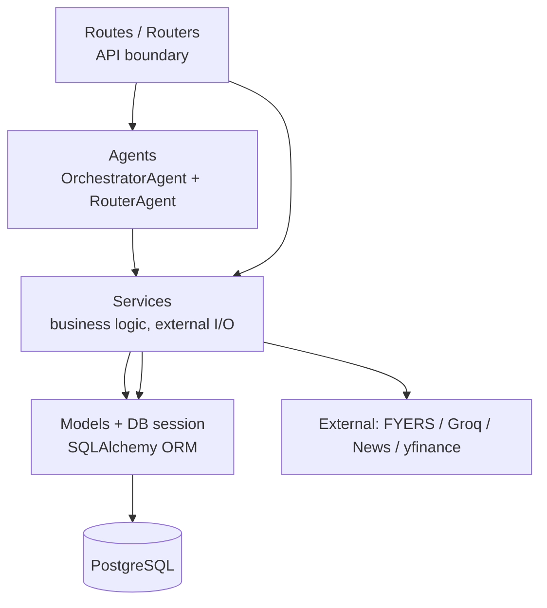
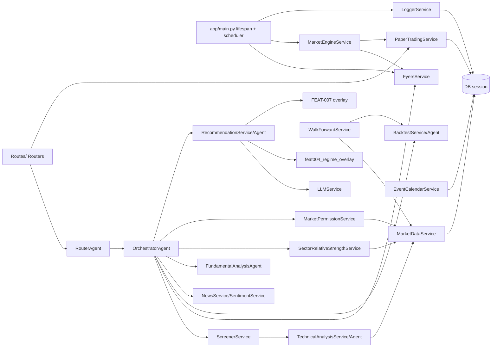

# Backend Architecture

> Documents the `backend/app/` FastAPI application as it currently exists.
> Cross-references: [SystemOverview](./SystemOverview.md) · [DatabaseSchema](./DatabaseSchema.md) · [DataFlow](./DataFlow.md) · [APIInventory](./APIInventory.md)

## Table of Contents

1. [Folder Structure](#1-folder-structure)
2. [Layered Architecture](#2-layered-architecture)
3. [API Layer](#3-api-layer)
4. [Services](#4-services)
5. [Business Logic](#5-business-logic)
6. [Repositories](#6-repositories)
7. [Database Access](#7-database-access)
8. [Scheduler](#8-scheduler)
9. [Background Workers](#9-background-workers)
10. [Recommendation Engine](#10-recommendation-engine)
11. [Scanner](#11-scanner)
12. [Backtesting](#12-backtesting)
13. [AI Modules](#13-ai-modules)
14. [Dependency Graph](#14-dependency-graph)
15. [Cross-Module Communication](#15-cross-module-communication)
16. [Configuration](#16-configuration)
17. [Middleware](#17-middleware)
18. [Observability](#18-observability)
19. [Logging](#19-logging)
20. [Dependency Injection](#20-dependency-injection)

---

## 1. Folder Structure

```
backend/
├── main.py                      # import shim so `uvicorn main:app` works from backend/
├── app/
│   ├── main.py                  # FastAPI app, lifespan, scheduler jobs, middleware
│   ├── middleware.py            # CorrelationIdMiddleware (defined, not added in main)
│   ├── config/
│   │   ├── settings.py          # Pydantic BaseSettings singleton
│   │   └── sector_mappings.json # symbol → sector-index for FEAT-007
│   ├── core/
│   │   ├── deps.py              # FastAPI dependency providers (get_current_user, etc.)
│   │   ├── security.py          # Argon2, JWT create/decode
│   │   ├── token_crypto.py      # Fernet broker-token encryption (enc:v1: prefix)
│   │   ├── redis.py             # RedisBlocklist + RateLimiter
│   │   ├── response_cache.py    # in-process TTL cache (thread-safe)
│   │   ├── logger.py            # setup_logging (console + rotating files)
│   │   ├── log_manager.py       # named rotating loggers (scanner/fyers/trading/http/error)
│   │   ├── server_state.py      # last_shutdown / last_startup timestamps (JSON file)
│   │   ├── task_supervisor.py   # supervised long-running asyncio tasks
│   │   └── gap_replay.py        # offline paper-trade fill/exit replay on startup
│   ├── db/
│   │   ├── base.py              # DeclarativeBase with naming_convention MetaData
│   │   ├── session.py           # async+sync engines, session factories, get_db, alembic gate
│   │   ├── locks.py             # Postgres advisory locks (SingletonLease, xact lock)
│   │   ├── scan_store.py        # raw-SQL JSONB latest-scan persistence/restore
│   │   ├── scan_logger.py       # RotatingFileHandler latest_scan.log
│   │   └── mongo.py             # lazy pymongo client (transactions collection)
│   ├── models/                  # SQLAlchemy ORM (see DatabaseSchema.md)
│   ├── schemas/                 # Pydantic request/response models (analysis, auth, etc.)
│   ├── routes/                  # 14 primary routers mounted via api_router
│   ├── routers/                 # 2 standalone routers (walk_forward, event_calendar)
│   ├── agents/                  # multi-agent recommendation orchestration
│   ├── services/                # 53 service modules (business logic)
│   ├── observability/
│   │   ├── metrics.py           # Prometheus counters/gauges + render_metrics()
│   │   └── scan_diagnostics.py  # forensic ScanContext + structured scan logs
│   └── utils/
│       ├── logger.py            # configure_logging + get_logger
│       ├── symbol.py            # canonical_symbol normalization
│       └── redis_lock.py        # distributed_lock (fencing-token)
├── alembic/                     # 30-revision Alembic tree (preferred; checked at startup)
├── scripts/                     # import_stocks_master.py, one-off maintenance scripts
└── data/
    └── nse_trading_holidays.json
```

A second, smaller Alembic tree lives at the repo root (`alembic/` with 2 revisions). The startup gate `check_alembic_head()` validates against `backend/alembic.ini`'s heads.

---

## 2. Layered Architecture

The backend is **layered but permissive** — there is no hard enforcement that services never touch routes directly. The intended layering is:



- **Routes** declare dependencies (`get_db`, `get_current_user`) and delegate to agents/services. They never call SQLAlchemy directly except for a few admin endpoints (logs, token diagnostic, candidates) for low-level queries.
- **Agents** are the recommendation-pipeline composition layer; they instantiate and call services (and external I/O via services).
- **Services** encapsulate domain logic (FyersService, ScreenerService, RecommendationService, BacktestService, MarketDataService, PaperTradingService, MarketEngineService, etc.). Several services also issue raw SQL (`db/scan_store.py`, partition manager, retention, locks).
- **Models** are pure SQLAlchemy declarative mappings; no behavior beyond hooks (e.g. `ExecutionEvent.before_update` makes it append-only).

---

## 3. API Layer

- **Routers** (see [APIInventory](./APIInventory.md) for the complete table of 116 endpoints):
  - `routes/` — `auth`, `analysis`, `paper_trading`, `stocks`, `scanner`, `system`, `token`, `broker_tokens`, `settings`, `workstation`, `logs` (incl. WebSocket), `health`, `fyers`, `scheduler`. Assembled by `routes/__init__.py` into `api_router` (no shared prefix; each router declares its own `prefix=`).
  - `routers/` — `walk_forward` (`/api/walk-forward`), `event_calendar` (`/api/events`). Included directly in `main.py`.
- **Two endpoints mounted on `app` directly** (not via `api_router`):
  - `GET /scanner/health` — `ScreenerService().get_metrics()`.
  - `GET /metrics` — Prometheus exposition via `observability.render_metrics()`.
- **Schema boundary**: Pydantic schemas in `app/schemas/` (`analysis.py`, `auth.py`, `fyers_token.py`, `health.py`, `paper_trading.py`, `user_profile.py`, `workstation.py`). `AnalysisMode` is exported from `__init__.py`.

---

## 4. Services

A summary of the 53 service modules by responsibility. Detailed signatures are captured in the in-codebase analysis; only the role and key collaborators are listed here.

| Service | File | Role |
|---------|------|------|
| **FyersService** | `fyers_service.py` | Process-wide singleton (`FyersService.shared()`). FYERS REST OHLCV/LTP/quote/profile, incremental fetch, token validation, in-memory OHLCV/LTP caches, exceptions taxonomy (`FyersAuthExpiredError`, `FyersAuthInvalidError`, `FyersRateLimitError`, `FyersAPIError`, `FyersInvalidSymbolError`). |
| **ScreenerService** | `screener_service.py` | Cache-first vectorized scanner. Partitions symbols into cache-hits vs needs-fetch, bulk loads DB histories, worker-pools Fyers calls, computes traits/screener-score, emits `ScreenerConditionResult`. |
| **RecommendationService** | `recommendation_service.py` | Composes dynamic-weighted composite score, BUY/WATCH/REJECT label, applies FEAT-004 and FEAT-007 overlays, builds trade plans. |
| **BacktestService** | `backtest_service.py` | Pass-1 legacy/gross + Pass-2 realistic net backtest with NSE cost model, position sizing, intrabar exits. |
| **NewsService** | `news_service.py` | Configurable news API (Marketaux shape) + DuckDuckGo fallback. |
| **SentimentService** | `sentiment_service.py` | Documents → sentiment score/label. |
| **LLMService** | `llm_service.py` | Groq chat completions (JSON mode) for reasoning / research / confidence / insights / sentiment. |
| **MarketDataService** | `market_data_service.py` | PostgreSQL `HistoricalCandle` upsert/query, partition-aware multi-symbol load, staleness checks. |
| **MarketEngineService** | `market_engine_service.py` | Singleton `market_engine` background loop; FYERS websocket + 1m reconciliation; fills paper orders; auto-exits positions. |
| **PaperTradingService** | `paper_trading_service.py` | User-scoped paper accounts: orders/positions/trades/transactions/notifications/alerts/journals/workspace; fill + auto-exit helpers. |
| **SectorRelativeStrengthService** | `sector_rs_service.py` | SR-003 sector RS (`sector_mappings.json`) overlay using NIFTY50 ROC20 difference formula. |
| **MarketPermissionService** | `market_permission_service.py` | SR-004 market regime (NIFTY50 EMA50 + INDIAVIX + benchmark breadth) → `new_entry_allowed`, `risk_multiplier`. |
| **AnalyticsService** | `analytics_service.py` | Strategy drift tracking; analytics. |
| **DailyAnalyticsService** | `daily_analytics_service.py` | Daily PnL + journals + AI annotations. |
| **AuthService** | `auth_service.py` | signup/login/google/reset/sessions. |
| **TokenService** | `token_service.py` | FYERS token lifecycle, in-memory cache, encryption at rest, OAuth exchange. |
| **BrokerTokenService** | `broker_token_service.py` | Generic broker-token CRUD with `enc:v1:` encryption. |
| **TradingHoursService** | `trading_hours_service.py` | NSE 9:15–15:30 IST, holidays from `data/nse_trading_holidays.json`. |
| **UniverseService** | `universe_service.py` | Load `stocks_master` active symbols. |
| **WalkForwardService** | `walk_forward_service.py` | Champion vs Challenger walk-forward windows. |
| **EventCalendarService** | `event_calendar_service.py` | Event ingestion (priority resolution), upcoming events, coverage audit. |
| **LatestScanService** | `latest_scan_service.py` | Persist/load full scan snapshot (`ScanSnapshot` + `ScanSnapshotRecord`). |
| **WorkstationService** | `workstation_service.py` | Markets overview, universes, saved scans, alerts, risk settings. |
| **ResearchService** | `research_service.py` | Institutional-style swing research payload (~20 helpers). |
| **RankingService** | `ranking_service.py` | Sort by `(-score, symbol)`; BUY/WATCH rankings; best intraday/swing. |
| **TechnicalAnalysisService** | `technical_analysis_service.py` | Vectorized `ta` indicators over multi-index DataFrame. |
| **RetentionService** | `retention_service.py` | Periodic deletion per retention windows. |
| **LockService / DLS** | `lock_service.py` | DB-row `SystemLock` distributed lock + heartbeat. |
| **PartitionManager** | `partition_manager.py` | Idempotent `CREATE TABLE … PARTITION OF …` for candle tables. |
| **LoggerService** | `logger_service.py` | Singleton async queue → `SystemLog` batch insert + WebSocket fan-out + PII masking. |
| **DBLogger** | `db_logger.py` | Lightweight `log_to_db` (single-row insert). |
| **DiagnosticsService** | `diagnostics_service.py` | In-process ring-buffer scanner/scheduler/Fyers/dashboard metrics. |
| **LiveObservability** | `live_observability.py` | Live signal/state machine dashboard data. |
| **CacheState / ScannerCache / ResearchCache** | `cache_state.py` / `scanner_cache.py` / `research_cache.py` | In-process caches/diagnostics. |
| **ReconciliationFramework / CandleReconciliationService** | `reconciliation_framework.py` / `candle_reconciliation_service.py` | Candle continuity utilities. |
| **OHLCVStore / CandleStore** | `ohlcv_store.py` / `candle_store.py` | Cached candle accessors. |
| **MarginEngine / MarketInfoService / MarketDataFeed / RankingService / UserProfileService / AuditService / EmailService / Feat004RegimeOverlay / PersistenceService / ResearchPersistenceService** | various | Smaller domain helpers (see source for signatures). |

---

## 5. Business Logic

Domain logic lives in the **services + agents** layers. The system has a clearly delineated **recommendation / scanner hierarchy**:

- **ScreenerService.screen_symbols_swing** — pure scoring pipeline (data quality → broad trend → conditions → weighted score → match threshold `screener_score >= 52 AND broad_eligibility`).
- **OrchestratorAgent.run_screener** — multi-stage universe walk + invocation of `run_full` on the shortlist.
- **OrchestratorAgent.run_full / _analyze_symbol_post_bulk** — concurrent per-symbol agent execution (technical precomputed in bulk; backtest / news / fundamentals + sector overlay + market permission + recommendation + strict-buy gate + challenger building + persistence).
- **RecommendationService.build** — composite scoring with dynamic weights, overlays (FEAT-004/007), trade plans.
- **BacktestService.run** — Pass-1 gross vs Pass-2 realistic (NSE cost model).
- **MarketEngineService** — operating-system-style loop reconciling live ticks into paper-trade state.

No business logic sits in the route layer except thin transforms (e.g., `_calculate_52_week_range`, `_build_technical_extras` in `routes/analysis.py`).

---

## 6. Repositories

There is **no dedicated repository pattern**. Database access is performed via:

- **SQLAlchemy ORM session** (`AsyncSessionLocal` / `SessionLocal`) directly inside services.
- **`db/scan_store.py`** — raw `text()` SQL for `market_data.scan_results` JSONB (no ORM model for that table).
- **`services/market_data_service.py`** — bulk `INSERT … ON CONFLICT DO UPDATE` upserts on `HistoricalCandle`.
- **`services/partition_manager.py`** — DDL for partition tables.
- **`services/retention_service.py`** — bulk `DELETE` per retention windows.
- **`services/lock_service.py`** — `SystemLock` row-level locks.
- A few route handlers issue raw `select(...)` (logs, token diagnostic, candidates/today).

Models expose no repository methods; they are pure schema.

---

## 7. Database Access

See [DatabaseSchema.md](./DatabaseSchema.md) for the full schema. Concurrency / pool configuration (in `db/session.py`):

| Setting | Async engine (`asyncpg`) | Sync engine (`psycopg2`) |
|---------|-------------------------|--------------------------|
| `pool_pre_ping` | True | True |
| `pool_size` | 20 | 80 |
| `max_overflow` | 10 | 20 |
| `pool_recycle` | 240 s | 240 s |
| `statement_timeout` (PG pragma) | 30 s | 30 s |
| `lock_timeout` | 5 s | 5 s |
| `idle_in_transaction_session_timeout` | 30 s | 30 s |
| `command_timeout` | 120 s | — |
| `statement_cache_size` (asyncpg) | 0 (disabled) | — |

- `AsyncSessionLocal = async_sessionmaker(autoflush=False, autocommit=False, expire_on_commit=False)`.
- `SessionLocal = sessionmaker(autocommit=False, autoflush=False, expire_on_commit=False)`.
- Pool forensics event listeners log `DB_POOL_STATUS` on checkout and `DB_RECONNECT` on invalidate.
- `dispose_async_pool(reason)` recovers the pool after stale prepared-plan errors (`is_stale_prepared_plan_error`).
- `check_alembic_head()` is required at startup (auto-stamp only in development env).

---

## 8. Scheduler

A single module-level `AsyncIOScheduler(timezone="Asia/Kolkata")` defined in `app/main.py:70`. A listener subscribed to `EVENT_JOB_SUBMITTED | EVENT_JOB_EXECUTED | EVENT_JOB_ERROR | EVENT_JOB_MISSED` logs per-job timing and records each run into `diagnostics.record_scheduler_run`. Jobs are registered inside `lifespan` with `replace_existing=True`:

| # | Job ID | Cron | Status | Purpose |
|---|--------|------|--------|---------|
| 1 | `market_engine_spin_up` | `mon-fri 08:55` | active | `market_engine.request_start()` |
| 2 | `pre_market_deep_scan` | `mon-fri 09:00` | **DISABLED** (commented) | would run full `OrchestratorAgent.run_screener` Swing scan |
| 3a | `intraday_heartbeat_1a` | `mon-fri 09:15,09:30,09:45` | active | `market_engine.heartbeat()` |
| 3b | `intraday_heartbeat_1b` | `mon-fri 10:00–14:45 every 15m` | active | `market_engine.heartbeat()` |
| 3c | `intraday_heartbeat_2` | `mon-fri 15:00,15:15,15:30` | active | `market_engine.heartbeat()` |
| 4 | `market_engine_cool_down` | `mon-fri 15:30` | active | `market_engine.request_stop()` |
| 5 | `track_strategy_drift_job` | `fri 16:00` | active | `AnalyticsService().track_strategy_drift()` |
| 6 | `retention_cleanup` | `daily 02:15` | active | `RetentionService(db).cleanup()` (logs 30d, events 365d, candles 1825d, replays 90d, snapshots 30d) |

`scheduler.start()` only runs when `not settings.quarantine_mode`. `nightly_candle_sync()` (`main.py:784`) is defined but **not registered as a scheduler job**.

External scheduler entrypoint: `POST /scheduler/daily-scan` requires the `X-Scheduler-Secret` header to equal env `SCHEDULER_SECRET`; it invokes `ScanExecutionService.execute_scan(trigger_source="cron")` and returns 202 if a scan is already running.

---

## 9. Background Workers

| Worker | Owner | Trigger | Loop body |
|--------|-------|---------|-----------|
| **MarketEngineService `_run_loop`** | `market_engine.start_loop()` (lifespan) | continuous (62 async) | `_reconcile_session` → sync desired symbols, start/stop `FyersMarketDataFeed`, `_on_tick` → `_process_symbol` fills orders / auto-exits positions. |
| **`_reconciliation_loop`** | `market_engine` | every 5 min | `_reconcile_ohlcv_sequence` sweeps OPEN positions older than 5 min through 1m candles to catch exits the live tick missed. |
| **Legacy `_monitor_positions_background`** | `task_supervisor.start("legacy-alert-monitor", ...)` (lifespan) | every 5 s | Polls `PaperAlert` and `WorkstationAlert` price-trigger rules via `FyersService.fetch_ltp`. |
| **LoggingService flush worker** | `logger_service.start()` — lazily started on first log call | continuous | Drains `asyncio.Queue` (maxsize 10 000) and batch-inserts `SystemLog` rows (50/batch); on queue full, writes JSONL fallback. |
| **Gap replay** | `core/gap_replay.run_gap_replay` (lifespan, once) | once at startup | Replays offline 1m candles to fill pending LIMIT BUY orders and exit OPEN positions for stop/target hits. |
| **Partition verification** | `partition_manager.verify_and_create_partitions` (lifespan, once) | once at startup | Idempotent `CREATE TABLE IF NOT EXISTS … PARTITION OF …`. |
| **Heartbeat DBA** | `LockService._heartbeat_loop` (per acquired DLS) | every `ttl/3` | Refreshes `SystemLock.expires_at`/`heartbeat_at`. |

All long-loop workers are guarded by `TaskSupervisor` (crash → log + 2s sleep + restart) except `LoggingService` worker (managed by the singleton itself).

---

## 10. Recommendation Engine

The recommendation pipeline is composed in `OrchestratorAgent.run_full` / `_analyze_symbol_post_bulk`:

```mermaid
sequenceDiagram
    participant O as OrchestratorAgent
    participant T as TechnicalAnalysisAgent
    participant B as BacktestAgent
    participant N as NewsAnalysisAgent
    participant F as FundamentalAnalysisAgent
    participant SRS as SectorRelativeStrengthService
    participant MP as MarketPermissionService
    participant R as RecommendationAgent
    participant RS as RecommendationService
    participant LLM as LLMService
    participant FEAT4 as feat004_regime_overlay
    participant FEAT7 as RecommendationService._apply_feat007_overlay
    participant GATE as _enforce_strict_buy_gate
    participant DB as AsyncSessionLocal

    O->>O: prefetch_all (concurrent OHLCV via MarketDataService + FyersService)
    O->>T: technical_agent.run_bulk(candles_by_mode, mode) [vectorized]
    par per-symbol asyncio.gather (Semaphore=6)
        O->>B: BacktestAgent.run(symbol, mode, candles, execution_model)
        O->>N: safe_news_run(symbol) → NewsService + SentimentService
        O->>F: FundamentalAnalysisAgent.run(symbol) via yfinance
    end
    O->>SRS: evaluate_sector_overlay(symbol, scan_date) → sector_rs_20, sector_roc20, nifty50_roc20
    O->>R: RecommendationAgent.run(...)
    R->>LLM: build_reasoning(context dict) → bullets/risk/invalidation/summary
    R->>RS: RecommendationService.build(...)
    RS->>RS: calculate_dynamic_weights (standard vs catalyst)
    RS->>RS: composite score → label BUY≥72 / WATCH≥55 / REJECT
    RS->>FEAT4: apply_feat004_regime_overlay (FAV/NEU/CAU/DEF/ABS)
    RS->>FEAT7: _apply_feat007_overlay (STRENGTH/WEAK; SHADOW log-only / ACTIVE applies delta)
    RS->>RS: _build_trade_plans (entry/stop/targets from ATR range)
    alt recommendation.action == BUY
        O->>GATE: _enforce_strict_buy_gate (strong_live_data AND tech≥75 AND R/R≥1.25)
        GATE-->>O: possibly downgrade BUY → WATCH
    end
    O->>MP: evaluate_market_permission(scan_date) → new_entry_allowed, risk_multiplier
    O->>O: build challenger (combine sector overlay + market permission) — cap score ≤71 on downgrade
    O->>DB: _persist_analysis → insert AnalysisHistory + BacktestHistory rows
```

### Scoring & thresholds (exact)

| Constant | Value | Source |
|----------|-------|--------|
| Minimum swing candles for screener | 220 | `ScreenerService.MINIMUM_SWING_CANDLES` |
| Required candles for swing indicators | 240 | `TechnicalAnalysisService.get_required_candle_count` |
| Screener match threshold | `broad_eligibility AND screener_score >= 52` | `_process_single_symbol` |
| Recommendation BUY | score ≥ 72 | `RecommendationService.build` |
| Recommendation WATCH | score ≥ 55 | same |
| Strict-buy-gate technical floor | `best_technical.score >= 75` | `_enforce_strict_buy_gate` |
| Strict-buy-gate R/R floor | `primary_plan.risk_reward_ratio >= 1.25` | same |
| FEAT-004 default deltas | FAV +2.0, NEU 0.0, CAU −3.0, DEF −5.0, ABS 0.0 | `settings.feat004_*` |
| FEAT-004 BUY downgrade thresholds | CAU 74.0, DEF 77.0 | `settings.feat004_buy_downgrade_threshold_cau/def` |
| FEAT-007 deltas | strength +1.5, weak −3.0 | `settings.feat007_*` |
| FEAT-007 BUY downgrade threshold | 74.0 | `settings.feat007_buy_downgrade_threshold` |
| SR-003 / SR-004 challenger cap | `min(score, 71.0)` when downgraded | `_analyze_symbol_post_bulk` |
| Backtest minimum candles | 35 | `BacktestService.run` |
| Backtest "favorable" verdict | `total_return>0 AND win_rate>=45 AND profit_factor>=1` | `BacktestService.run` |

---

## 11. Scanner

`OrchestratorAgent.run_screener` walks prioritized universes (`NIFTY500 → NIFTY100 → FNO → CUSTOM`) and **stops at the first stage that yields BUY candidates**. Within a stage the shortlist is capped at `request.top_n`. Detailed flow is in [DataFlow.md](./DataFlow.md#1-scanner-flow).

ScreenerService internals:

1. `MarketDataService.get_candle_meta_batch(symbols, "1D")` — partition cache-hit vs needs-fetch.
2. `load_histories_batch(preload_symbols, "1D", stored_symbol_map)` — bulk load existing histories.
3. For cache-miss symbols, `FyersService.fetch_incremental_ohlcv` runs under a worker pool (`fyers_service._network_pool`).
4. `MarketDataService.upsert_candles_multi(pending_upserts)` — chunked PostgreSQL upsert.
5. Forward-fill + reindex to business days; concat frame parts into a multi-index `(timestamp, symbol)` DataFrame.
6. `TechnicalAnalysisService.analyze_bulk_from_frame(combined_frame, Swing)` — vectorized indicators.
7. Per-symbol `_process_single_symbol` → data quality, broad trend (`close>sma_50>sma_200`, avg vol > 100k), condition set, weighted score, `matched = broad_eligibility AND screener_score >= 52`.
8. Sort by `(-screener_score, symbol)`, take top-N, return `ScreenerConditionResult` list.

yfinance fallback (`ScreenerService.fallback_fetch_yfinance`) is available but only used when Fyers is unconfigured.

---

## 12. Backtesting

`BacktestService.run` runs two passes:

- **Pass 1 — Legacy/Gross**: same-day-close fills, 100% equity deployment, zero cost. Produces all `gross_*` metrics (never overwritten).
- **Pass 2 — Realistic**: next-bar-open fills, slippage, full NSE transaction cost model (`brokerage, stt, exc_trans, sebi, stamp_duty, gst 18%, dp_charge, slippage`), `PercentEquityPositionSizer`, intrabar stop/target exits, gap handling, force-close-at-end (delivery) when not `skip_on_missing_next_bar`.

Routing: `execution_model == "LEGACY"` → primary fields = Pass 1; `REALISTIC` → primary fields = Pass 2. `gross_*` fields are always preserved. Cost scenarios: `LOW_COST` (slippage 0.02%), `BASE_COST` (0.05%, ₹20 cap), `STRESS_COST` (0.15%).

Walk-forward evaluation (`WalkForwardService.run_walk_forward_evaluation`) builds a market-regime DataFrame (NIFTY50 EMA50 + INDIAVIX + benchmark above-EMA50 breadth), then runs Champion (no gating) vs Challenger (VIX/breadth gating) across rolling windows, persisting `WalkForwardSummary` and `VetoHistory`.

---

## 13. AI Modules

| Module | Provider | Inputs | Outputs |
|--------|----------|--------|---------|
| `LLMService.build_reasoning` | Groq (`LLM_3_70B` default) | context dict (technical signal/score, news label/score, backtest verdict/return, fundamental score, current price, modes) | `{bullets, risk_factors, invalidation_signals, summary}` (JSON mode) |
| `LLMService.build_research_summary` | Groq | `symbol, facts` | equity research summary |
| `LLMService.build_ai_confidence_explanation` | Groq | `symbol, facts, conf_label` | confidence explanation |
| `LLMService.build_research_insights` | Groq | `symbol, facts` | swing research notes (bullets/risks/bottom_line) |
| `LLMService.analyze_sentiment` | Groq | `symbol, headlines[]` | sentiment score ∈ [−1.0, 1.0] |
| `RecommendationAgent.run` → `RecommendationService.build` | — | LLM reasoning + all agent outputs | `FinalRecommendation` (composite score, label, trade plans, FEAT overlays) |
| `ResearchService.build` | Groq + `~20 helpers` | OHLCV + company info + technical/backtest extras | research payload (never invents missing data) |

LLM calls fall back to deterministic `_fallback_reasoning`/etc. when `GROQ_API_KEY` is unset or the call fails. All Groq requests use `response_format={"type": "json_object"}`.

---

## 14. Dependency Graph

Module-level ownership (simplified to the most important call edges):



---

## 15. Cross-Module Communication

- **In-process only**. No RPC, no message bus. All calls are direct Python imports.
- **Async bridges**: sync services reaching async code use `asyncio.to_thread` and (from sync) the captured event loop in `db.session.main_event_loop`. `PaperTradingService` is sometimes instantiated against a sync `SessionLocal()` and other times against an `AsyncSessionLocal()` depending on caller.
- **Worker pool**: `FyersService._network_pool` (a `ThreadPoolExecutor`) and `AsyncIOSemaphore` instances gate OHLCV concurrency.
- **Singletons**: `FyersService.shared()`, `market_engine`, `trading_hours`, `diagnostics`, `logger_service`, `settings` — module-level instances used directly.
- **Redis**: JWT blocklist + rate limiter; not used as a service bus.
- **WebSockets**: `/api/logs/stream` (logs) — server-push only; populated by `logger_service`. No general pub/sub WS bus.
- **FYERS websocket**: `FyersMarketDataFeed` (owned by `market_engine`) subscribes to live ticks for active paper-trade symbols.

---

## 16. Configuration

`Settings` (`pydantic_settings.BaseSettings`, `env_file = ROOT_DIR/.env`):

| Field | Env alias | Default | Notes |
|-------|-----------|---------|-------|
| `app_name` | `APP_NAME` | `Trading System` | |
| `app_env` | `APP_ENV` | `development` | "test" triggers test-env lifespan. |
| `quarantine_mode` | `QUARANTINE_MODE` | False | Bypasses scheduler/engine/alert monitor/gap-replay. |
| `app_host` / `app_port` | — | `127.0.0.1` / `8000` | |
| `frontend_url` | `FRONTEND_URL` | `http://localhost:5173` | |
| `database_url` | `DATABASE_URL` | `postgresql+asyncpg://…` | Normalized `postgres://` / `postgresql://` → `+asyncpg`; `ssl=…` → `sslmode=…`. |
| `redis_url` | `REDIS_URL` | `redis://localhost:6379/0` | |
| `cors_origins_raw` | `CORS_ORIGINS` | `http://localhost:5173,…` | |
| `google_client_id` | `GOOGLE_CLIENT_ID` | `""` | |
| `fyers_app_id` / `fyers_secret_id` / `fyers_pin` / `fyers_redirect_uri` | `FYERS_*` | `""` | OAuth + auth. |
| `fyers_access_token` | `FYERS_ACCESS_TOKEN` | `""` | (Legacy; runtime uses DB-stored token.) |
| `mongo_url` / `mongo_db_name` | — | `""` | Optional MongoDB. |
| `nifty500_csv_path` / `nifty500_symbols_raw` / `nifty_next_500_symbols_raw` / `nifty1000_symbols_raw` / `universe_symbols_raw` / `bse500_symbols_raw` / `bse1000_symbols_raw` / `fyers_screener_symbols_raw` | various `*_SYMBOLS` | see file | CSV preferred for NIFTY500. |
| `require_universe_data` | `REQUIRE_UNIVERSE_DATA` | True | False allows degraded start. |
| `news_provider` / `news_api_key` / `news_base_url` | `NEWS_*` | `marketaux` / `""` / `https://api.marketaux.com/v1/news/all` | |
| `llm_provider` / `llm_api_key` / `llm_model` | `LLM_PROVIDER` / `GROQ_API_KEY` / `LLM_MODEL` | `groq` / `""` / `LLAMA_3_70B` | |
| `admin_email` / `smtp_*` | `ADMIN_EMAIL` / `SMTP_*` | `""` / 587 / `""` / `""` / `""` / `""` | Email (password reset). |
| `advisory_disclaimer` | `ADVISORY_DISCLAIMER` | (long string) | |
| `feat004_*` (15 fields) | `FEAT004_*` | disabled / SHADOW | Market-regime overlay (see §10). |
| `feat007_*` (7 fields) | `FEAT007_*` | disabled / SHADOW | Sector RS overlay. |
| `feat008_*` (4 fields) | `FEAT008_*` | enabled / REALISTIC | Execution model. |

Env vars consumed **outside** `Settings`:

- `JWT_SECRET`, `JWT_REFRESH_SECRET`, `ACCESS_TOKEN_EXPIRE_MINUTES` (default 1440), `REFRESH_TOKEN_EXPIRE_DAYS` (default 7) — `core/security.py`.
- `TOKEN_ENCRYPTION_KEY` (Fernet; fallback `JWT_SECRET`) — `core/token_crypto.py`.
- `SCHEDULER_SECRET` — header check on `/scheduler/daily-scan`.
- `FYERS_TOKEN_CACHE_MINUTES` (default 60) — `services/token_service.py`.
- `ENVIRONMENT` / `APP_ENV`, `TEST_ARTIFACT_DIR`, `RUN_ID`, `RENDER_SERVICE_ID`, `RENDER_INSTANCE_ID`.

---

## 17. Middleware

Activated in `app/main.py`:

| Order (outer→inner) | Middleware | Notes |
|--------------------|-----------|-------|
| 1 | `GZipMiddleware(minimum_size=500)` | JSON compression. |
| 2 | `CORSMiddleware` | Credentials + regex origins (Vercel/Render/localhost); `allow_origins` also includes static localhost entries. |
| 3 | `@app.middleware("http") log_http_requests` | Request/response timing; slow flag ≥1000ms; injects `X-Response-Time-Ms` + `Server-Timing`; logs POST/PUT/DELETE to DB; converts unhandled exceptions to 500 with `log_to_db`. |

`app/middleware.py::CorrelationIdMiddleware` (propagates `X-Correlation-ID`) is **defined** but is **not added** in `main.py` — correlation IDs also arrive in `logger_service` entries via a separate field.

---

## 18. Observability

- **Prometheus** (`observability/metrics.py`, optional `prometheus_client`):
  - `trading_order_executions_total{event_type,symbol}` (Counter).
  - `trading_duplicate_execution_suppressed_total{kind}` (Counter).
  - `trading_db_commit_seconds` (Histogram).
  - `trading_ws_clients{stream}` (Gauge).
  - `trading_logger_queue_depth` (Gauge).
  - Exposed at `GET /metrics` via `render_metrics()`.
- **`ShadowRunDiagnostics` (singleton `diagnostics`)** — in-memory ring buffers: `scanner_runs` (50), `scheduler_runs` (100), `dashboard_snapshots` (100), FYERS metrics, scanner memory before/after, last scan status/error/success. Consumed by `/system/shadow-run/*` endpoints.
- **`scan_diagnostics.py`** — forensic per-scan `ScanContext` with `begin_scan` / `end_scan`, token forensic (`hash_token_prefix`), structured `SCAN_ENVIRONMENT` block, `NO_DATA_ROOT_CAUSE`, `SCAN_SUMMARY`, and `RECENT_RENDER_RESTART` / `TOKEN_POSSIBLY_STALE` warnings. Pure observability (no business-logic side effects).

---

## 19. Logging

- **`core/logger.py::setup_logging()`** — root logger DEBUG; console (INFO) + rotating main log (5 MB ×5) + token-specific log (`app.token`) + error-only log.
- **`core/log_manager.py`** — named rotating loggers: `app.scanner` (`latest_scan.log`), `app.fyers_api` (`fyers_api.log`), `app.paper_trading` (`paper_trading.log`), `app.http` (`api.log`), `app.errors` (`errors.log`).
- **`services/logger_service.py` (singleton `logger_service`)**:
  - Async queue (maxsize 10 000) → batched `SystemLog` inserts (50/batch) inside one `db.begin()`.
  - Sensitive-data masking (`SENSITIVE_FIELDS = {access_token, client_id, client_secret, password, pin, auth_code}`) applied recursively to dict/list/str.
  - Error hashing (SHA-256 → 16 hex) for fingerprinting.
  - WebSocket fan-out to `/api/logs/stream` subscribers (max queue 500 each); updates the `trading_ws_clients` Prometheus gauge.
  - On queue full → JSONL fallback (`backend/fallback_logs.jsonl`).
- **`services/db_logger.py::log_to_db`** — lightweight single-row insert (used by HTTP middleware; swallows DB errors to `print`).

---

## 20. Dependency Injection

`core/deps.py` provides the auth/session providers. Auth relies exclusively on the **HttpOnly `access_token` cookie** (never a client-supplied user id):

| Provider | Returns | Notes |
|----------|---------|-------|
| `_extract_user_id_from_request(request)` | `uuid.UUID` | Reads cookie → `decode_access_token` → `sub`. Raises 401 on missing/invalid. |
| `get_current_user(request, db=Depends(get_db))` | `User` | Async `select(User).where(User.id == user_id)`. Raises 401 if not found. |
| `get_current_active_user(current_user=Depends(get_current_user))` | `User` | Adds `is_active` check (403 if inactive). |
| `get_current_user_id_sync(request)` | `uuid.UUID` | Sync path for paper-trading sync routes. |
| `get_current_user_sync(request, db=Depends(get_sync_db))` | `User` | Sync `db.get(User, user_id)`. |

Underlying session providers (in `db/session.py`):

| Provider | Engine | Notes |
|----------|--------|-------|
| `get_db()` | `AsyncSessionLocal` | Async generator; rollback on exception; one-shot `dispose_async_pool("stale_prepared_plan")` on asyncpg `InvalidCachedStatementError`. |
| `get_sync_db()` | `SessionLocal` | Sync generator; rollback on exception. |

JWT: HS256, secrets from `JWT_SECRET` / `JWT_REFRESH_SECRET`; access token carries `jti` (added to Redis blocklist on logout); refresh token stored hashed in `user_sessions.refresh_token_hash`. Default expiries: 24h (access), 7d (refresh), env-overridable.