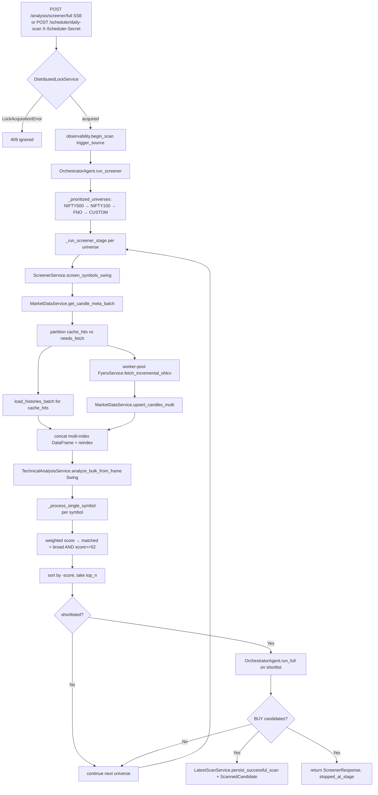
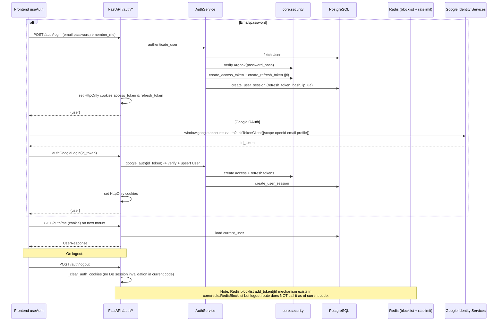
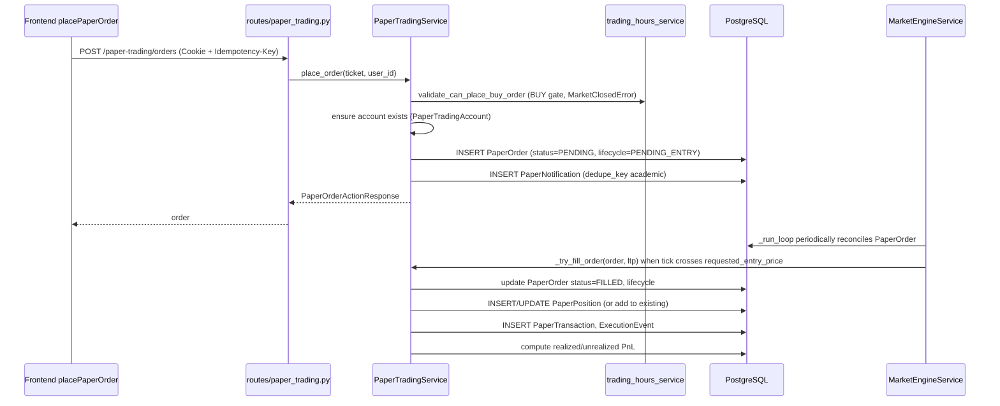
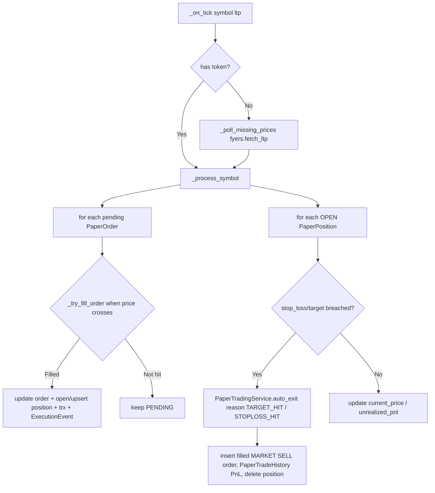
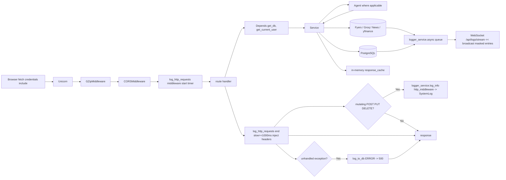
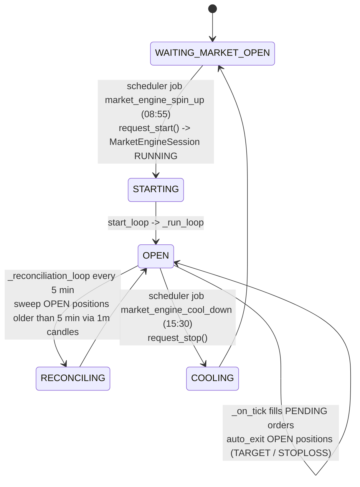
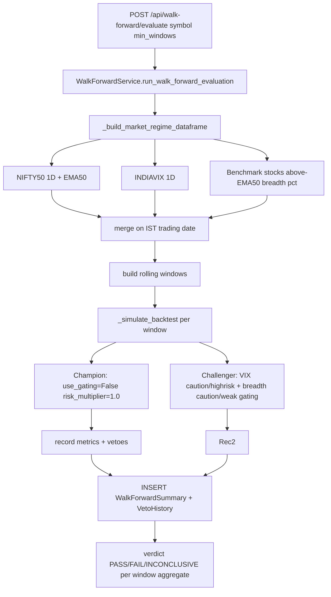
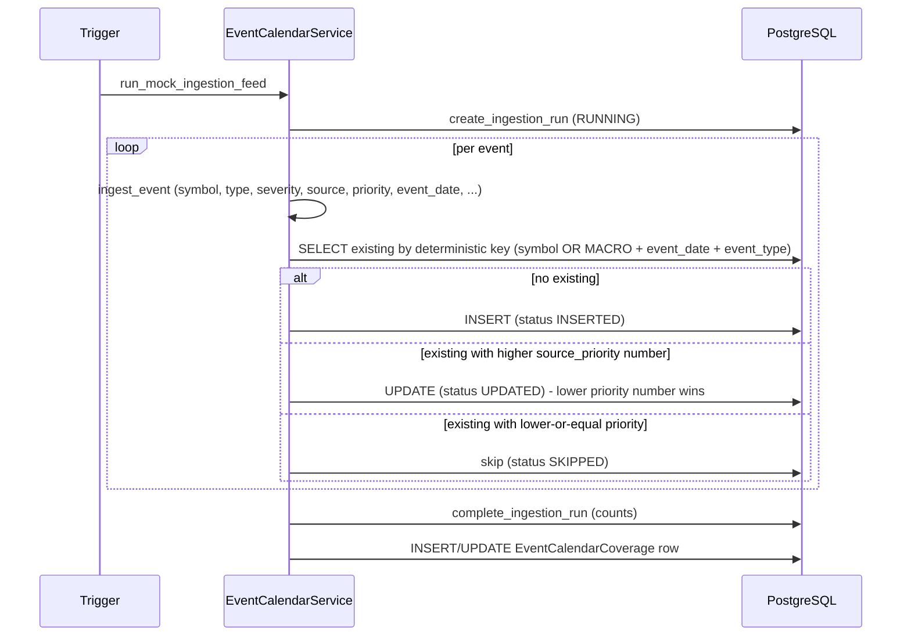

# Data Flow

> Runtime flow of the major pipelines and cross-cutting concerns.
> Cross-references: [SystemOverview](./SystemOverview.md) · [BackendArchitecture](./BackendArchitecture.md) · [DatabaseSchema](./DatabaseSchema.md) · [APIInventory](./APIInventory.md)

## Table of Contents

1. [Scanner Flow](#1-scanner-flow)
2. [Recommendation Flow](#2-recommendation-flow)
3. [Backtesting Flow](#3-backtesting-flow)
4. [Authentication Flow](#4-authentication-flow)
5. [News Flow](#5-news-flow)
6. [Paper Trading Flow](#6-paper-trading-flow)
7. [API Request Flow](#7-api-request-flow)
8. [Database Flow](#8-database-flow)
9. [Market Engine Live Tick Flow](#9-market-engine-live-tick-flow)
10. [Gap Replay Flow](#10-gap-replay-flow)
11. [Walk-Forward Flow](#11-walk-forward-flow)
12. [Event Calendar Flow](#12-event-calendar-flow)

---

## 1. Scanner Flow

Triggered via `POST /analysis/screener/full` (SSE) or `POST /scheduler/daily-scan` (custom secret). Backend entrypoints (`routes/analysis.py::screener_full`, `routes/scheduler.py::daily_scan`) call `ScanExecutionService.execute_scan` which serializes scan runs through a `DistributedLockService` lock and emits SSE progress frames; ultimately invokes `OrchestratorAgent.run_screener`.



**Stage-stopping rule**: scanner halts at the first universe stage producing any `buy_candidate_symbols`; subsequent universes are skipped. Within a stage, the shortlist is capped at `request.top_n` (default 20).

SSE frames emitted: `progress` (stage + %), `result` (final `ScreenerResponse`), `complete`.

Side effects:
- Upserts `HistoricalCandle` rows (cache refresh).
- Inserts `ScannedCandidate` + `ScanSnapshot` + `ScanSnapshotRecord`.
- Updates `ShadowRunDiagnostics` (`set_scanner_success`, `record_scanner_run`).
- Emits `SCAN_SUMMARY`, `NO_DATA_ROOT_CAUSE` via `observability.scan_diagnostics.end_scan`.

---

## 2. Recommendation Flow

`OrchestratorAgent.run_full` runs after the scanner shortlists symbols (or directly via `POST /analysis/full`).

```mermaid
sequenceDiagram
    participant O as OrchestratorAgent
    participant MDS as MarketDataService
    participant FY as FyersService
    participant TA as TechnicalAnalysisService
    participant B as BacktestAgent
    participant N as NewsAnalysisAgent
    participant F as FundamentalAnalysisAgent
    participant SR as SectorRelativeStrengthService
    participant MP as MarketPermissionService
    participant R as RecommendationAgent
    participant LLM as LLMService
    participant RS as RecommendationService
    participant FE4 as feat004_regime_overlay
    participant Gate as _enforce_strict_buy_gate
    participant DB as AsyncSessionLocal

    O->>MDS: load_full_history per symbol (Cache hit → OHLCVPoint[])
    O->>FY: fetch_ohlcv fallback (cache miss)
    O->>TA: run_bulk(candles_by_mode, mode) [vectorized]
    par per symbol asyncio.gather (Semaphore 6)
        O->>B: run(symbol, mode, candles, execution_model)
        O->>N: safe_news_run(symbol)
        O->>F: run(symbol) -> yfinance .info
    end
    O->>SR: evaluate_sector_overlay(symbol, scan_date)
    O->>R: RecommendationAgent.run(...all inputs...)
    R->>LLM: build_reasoning(context)
    R->>RS: RecommendationService.build(...)
    RS->>RS: calculate_dynamic_weights (standard vs catalyst)
    RS->>RS: composite_score → BUY>=72 / WATCH>=55 / REJECT
    RS->>FE4: apply_feat004_regime_overlay (FAV/NEU/CAU/DEF/ABS)
    RS->>RS: _apply_feat007_overlay (sector RS, SHADOW | ACTIVE)
    RS->>RS: _build_trade_plans
    alt action == BUY
        O->>Gate: _enforce_strict_buy_gate (live data AND tech>=75 AND R/R>=1.25)
        Gate-->>O: possibly downgrade BUY -> WATCH
    end
    O->>MP: evaluate_market_permission(scan_date) {new_entry_allowed, risk_multiplier}
    O->>O: build challenger (cap score <=71 on downgrade; prepend downgrade bullets)
    O->>DB: _persist_analysis → insert AnalysisHistory + BacktestHistory
```

### Composite scoring formula

- Standard weights: tech 0.50, fundamental 0.25, backtest 0.25, news 0.0.
- Catalyst weights (trigger when `abs(sentiment_score) >= 0.75` or `current_volume > 3 * avg_volume`): tech 0.20, fund 0.30, backtest 0.20, news 0.30.
- Raw components scaled into range; backtest score clamped to `[±20, 100]`; news and fundamentals multiplied by 100.
- `score = Σ(raw_i × weight_i)`; label thresholds in §10 of [BackendArchitecture](./BackendArchitecture.md).
- FEAT-004 overlay: `classify_market_regime(benchmark_ohlcv)` → `FAV | NEU | CAU | DEF | ABS`; `apply_regime_score_modifier` only mutates score in `ACTIVE` stage (SHADOW = log only); FAVORABLE cap (no `WATCH → BUY` promotion), CAUTIOUS/DEFENSIVE BUY→WATCH downgrade when adjusted score ≤ threshold.
- FEAT-007 overlay: sector state from `sector_rs_20 = sector_roc20 − nifty50_roc20` (`>=0` STRENGTH else WEAK); same SHADOW-vs-ACTIVE gate; REJECT immutable; STRENGTH cap (no `WATCH → BUY`); WEAK BUY → WATCH if adj ≤ 74.0.
- SR-003 / SR-004 challenger: builds `challenger_recommendation` from sector overlay + market permission; downgrade capped at score ≤ 71.0; original action preserved alongside.

---

## 3. Backtesting Flow

`BacktestService.run` always runs two passes. Routing of primary metrics depends on `execution_model` (`REALISTIC` = default).

```mermaid
flowchart TD
    In[BacktestAgent.run -> BacktestService.run]
    In --> Norm[normalize_execution_model]
    Norm --> MinLen{candles < 35?}
    MinLen -->|Yes| Empty[return _empty_result]
    MinLen -->|No| Ind[Compute EMA9/20 EMA20/50 RSI14 MACD rolling_avg_vol]
    Ind --> P1[Pass 1 Legacy/Gross<br/>same-day fill, 100% equity, zero cost]
    P1 --> P1Out[gross_* metrics<br/>total_return cagr max_dd win_rate profit_factor sharpe]
    Ind --> P2[Pass 2 Realistic<br/>next-bar-open fills, slip, NSE costs, %equity sizing]
    P2 --> P2Out[net_* metrics + monthly_returns + best/worst trade]
    P1Out --> Route{execution_model?}
    P2Out --> Route
    Route -->|LEGACY| Primary1[primary = Pass1, gross-only]
    Route -->|REALISTIC| Primary2[primary = Pass2, costs populated]
    Primary1 --> Verdict{verdict = favorable? total_return>0 AND win_rate>=45 AND profit_factor>=1}
    Primary2 --> Verdict
    Verdict --> Out[BacktestResult (gross_* always preserved, feat008_* audit bps)]
    Out --> Persist[insert BacktestHistory on _persist_analysis]
```

NSE cost components in Pass 2: `brokerage, stt (delivery 0.1% / intraday 0.025% sell), exc_trans, sebi, stamp_duty (buy 0.015% / intraday 0.003%), gst 18% on (brokerage + exc + sebi), dp_charge ₹13.5 sell-delivery, slippage ±rate`.

Cost scenarios (consistent across backtest & walk-forward): `LOW_COST` slippage 0.02%, `BASE_COST` 0.05% (₹20 cap), `STRESS_COST` 0.15%.

---

## 4. Authentication Flow



### Dependency chain

- `core/deps.get_current_user` reads cookie → `decode_access_token` → async `select(User)`.
- `core/deps.get_current_active_user` adds `is_active` check.
- `core/deps.get_current_user_id_sync` and `get_current_user_sync` are for the sync paper-trading paths.

### Renewal

`POST /auth/refresh` requires the `refresh_token` cookie → `decode_refresh_token` → `auth_service.create_user_session` → newly issued access + refresh cookies.

### Rate limiting

`core/redis.RateLimiter`:
- `is_rate_limited(key, max_requests, window_seconds)` — `INCR ratelimit:{key}` with TTL.
- `check_lockout(key, max_attempts, lockout_minutes)` — locks out after repeated failures.
- `increment_attempt(key)` (per attempt) and `reset_attempts(key)` (on success).

---

## 5. News Flow

`NewsAnalysisAgent.run(symbol)` wraps `NewsService` + `SentimentService`. Called concurrently with Backtest and Fundamental agents in `_run_agents_concurrently` (wrapped in `safe_news_run` so failures return neutral defaults).

```mermaid
flowchart TD
    Run[NewsAnalysisAgent.run symbol] --> News[NewsService.fetch_recent_news]
    News --> Check{news_api_key and news_api_url configured?}
    Check -->|Yes| API[GET news_api_url/search?q=symbol NSE news<br/>parse top 10 articles → ArticleItem]
    Check -->|No| DDG[GET api.duckduckgo.com/?q=symbol NSE news&format=json<br/>parse RelatedTopics[:10]]
    API --> Articles
    DDG --> Articles
    Articles{articles?} -->|empty| Neutral[return ([], 0.5, "Neutral", "No recent news found...")]
    Articles -->|non-empty| Sent[SentimentService.summarize symbol articles]
    Sent --> Out[(articles, sentiment_score, label, summary)]
    Out --> Scope1[LLM context dict in RecommendationAgent]
    Out --> Scope2[calculate_dynamic_weights news_catalyst if abs score>=0.75]
    Out --> Scope3[composite raw_news = sentiment_score * 100]
    Out --> Scope4[AnalysisHistory.sentiment_score on persist]
    Out --> Scope5[SR-003 challenger downgrade summary text]
```

The output feeds the recommendation pipeline as a 0.30-weighted catalyst component when sentiment magnitude is extreme or volume is a catalyst.

LLM sentiment scoring via `LLMService.analyze_sentiment` returns a value in `[-1.0, 1.0]` (0.0 on failure).

---

## 6. Paper Trading Flow

### Order placement

`POST /paper-trading/orders` (requires `Idempotency-Key` header) → `PaperTradingService.place_order`. Idempotency is enforced at the service using the `paper_trading_orders.idempotency_key` unique constraint (and the `idempotency_records` table for cross-operation idempotency).



### Position auto-exit (live tick path)

`MarketEngineService._on_tick(symbol, ltp)` → `_process_symbol(symbol, ltp)`:



### Reconciliation sweep

`MarketEngineService._reconciliation_loop` (every 5 min) → `_reconcile_ohlcv_sequence` fetches 1m candles via `fyers.fetch_ohlcv(symbol, intraday, "1", lookback_days)` for OPEN positions older than 5 min, then re-applies the same exit logic to candles the live tick may have skipped.

### Gap replay (startup)

On the singleton pod, after the API is available, `core/gap_replay.run_gap_replay(db, fyers)` replays the offline window `[last_shutdown, now]` once using the `paper_trading` logger and `ReplaySession` for idempotency (see [§10](#10-gap-replay-flow)).

```mermaid
flowchart TD
    Start[lifespan -> run_gap_replay] --> Lst[read last_shutdown]
    Lst --> NoShutdown{missing?} -->|Yes| Skip[skipped_reason no prior shutdown]
    NoShutdown -->|No| Gaplt{gap < 2min?} -->|Yes| Skip2[skipped_reason too small]
    Gaplt -->|No| Key[build replay_key f"{start}:{end}"]
    Key --> Rs{ReplaySession exists?}
    Rs -->|Yes, COMPLETED| Done[skip]
    Rs -->|No| Insert[INSERT ReplaySession RUNNING]
    Insert --> Pre[pre-fetch 1m candles for all OPEN positions + PENDING orders per account]
    Pre --> Markets[filter candles to market hours _is_market_hours 9:15-15:30 IST]
    Markets --> Fill[replay PENDING LIMIT BUY fills when candle.low <= order_price]
    Fill --> FillDB[adjust cash, position avg, PaperTransaction, ExecutionEvent REPLAY_ENTRY_FILLED dedupe]
    FillDB --> Exit[replay OPEN positions earliest target/stop hit across candles]
    Exit --> ExitDB[filled MARKET SELL order, PaperTradeHistory PnL, credit account, delete position, ExecutionEvent REPLAY_EXIT_FILLED]
    ExitDB --> Ck[checkpoint_symbol per-symbol]
    Ck --> Commit[ReplaySession COMPLETED]
    Commit --> WriteStartup[server_state.write_startup_time]
```

### Other paper-trading endpoints

- `GET /paper-trading/dashboard` — full snapshot (account, pending orders, positions, trades, price cache, summary).
- `GET /paper-trading/positions`, `GET /paper-trading/orders/pending`, `GET /paper-trading/orders/history`, `GET /paper-trading/trades`, `GET /paper-trading/account/transactions`.
- `POST /paper-trading/positions/{id}/close`, `POST /paper-trading/positions/squareoff-all`, `PATCH /paper-trading/positions/{id}` (update SL/target).
- `POST /paper-trading/orders/{id}/cancel`, `DELETE /paper-trading/orders/{id}`, `PUT /paper-trading/orders/{id}` (modify).
- Engine: `POST /paper-trading/engine/start|stop`, `GET /engine/status`, `POST /engine/heartbeat`.
- Notifications, alerts, journal, analytics, daily-analytics.
- `POST /paper-trading/from-recommendation` — prefill a ticket from a recommendation (no write).
- `GET /paper-trading/gap-replay-summary` — returns `app.state.last_gap_replay`.

---

## 7. API Request Flow



---

## 8. Database Flow

### Async path

`Depends(get_db)` yields an `AsyncSessionLocal`; on exception the route's `async with` rolls back; `is_stale_prepared_plan_error` triggers one-shot `dispose_async_pool(reason="stale_prepared_plan")`.

### Sync path

`Depends(get_sync_db)` yields a `SessionLocal` (psycopg2 engine, `pool_size=80`, `max_overflow=20`). Used by sync paper-trading routes and inside `asyncio.to_thread` workers that call sync services.

### Bulk OHLCV upsert

`MarketDataService.upsert_candles(symbol, timeframe, df)` and `upsert_candles_multi(pending_upserts)` use chunked PostgreSQL `INSERT ... ON CONFLICT DO UPDATE` (900 rows/chunk) with exponential backoff + jitter.

### Raw-SQL JSONB

`db/scan_store.py` performs `text()` SELECT/UPDATE on `market_data.scan_results` (no ORM model for this table) for the latest scan payload (used by `loadLatestScan` on the frontend and the dashboard restore path).

### Connection forensics

PG connect-time pragmas: `statement_timeout=30s`, `lock_timeout=5s`, `idle_in_transaction_session_timeout=30s`. Event listeners log `DB_POOL_STATUS` on checkout and `DB_RECONNECT` on invalidate.

### Advisory locks

`db/locks.acquire_singleton_lease("trading-system:singleton-workers")` uses `pg_try_advisory_lock` (SHA-256 → signed 64-bit key) to elect one worker pod; `transaction_advisory_lock` wraps `pg_try_advisory_xact_lock` for per-transaction locks. On non-PostgreSQL dialects these are no-ops (acquired=True).

---

## 9. Market Engine Live Tick Flow

`MarketEngineService` (singleton `market_engine`) drives FYERS websocket subscriptions reconciling paper-trade state.



The market engine's desired symbols are derived from OPEN `PaperPosition`s and PENDING `PaperOrder`s across all `PaperTradingAccount`s. The `FyersMarketDataFeed` owns the websocket; on token issues it is stopped and `request_start` retried on the next heartbeat.

Heartbeat scheduler jobs (`intraday_heartbeat_1a/1b/2`) call `market_engine.heartbeat()` to log drift between desired and actual subscribed symbols and update `last_heartbeat_at`.

---

## 10. Gap Replay Flow

(See [§6 above](#gap-replay-startup).)

Idempotency on restart:
- `ReplaySession.replay_key` (unique) keyed by `"start_iso:end_iso"` — if `COMPLETED` the replay is skipped.
- `ExecutionEvent.dedupe_key` (`replay-fill:...` and `replay-exit:...`) prevents double-fill/double-exit when the same replay is re-triggered.
- Per-symbol checkpointing writes `ReplaySession.checkpoint_symbol`.

After completion, `server_state.write_startup_time()` records the new startup — preventing the next restart from replaying the same window twice.

---

## 11. Walk-Forward Flow

`POST /api/walk-forward/evaluate?symbol=&min_windows=` → `WalkForwardService.run_walk_forward_evaluation(symbol, min_windows)`:



Outputs are queryable via `GET /api/walk-forward/results` and `GET /api/walk-forward/vetoes`.

---

## 12. Event Calendar Flow



- `POST /api/events/ingest/mock` triggers idempotent mock ingestion.
- `GET /api/events/upcoming?symbol=&scan_date=&days_ahead=` filters events strictly `<=` scan_date-zero-time (anti-look-ahead).
- `GET /api/events/coverage?source=` returns the latest coverage audit rows.

Look-ahead bias protection: events are filtered to `effective_end_date IS NULL OR >= scan_date`, and only events whose `event_date` (or `announced_at`) is strictly `<= scan_date` (IST midnight) are emitted to the recommendation pipeline.