# Database Schema

> Documents every SQLAlchemy ORM table in `backend/app/models/`, plus raw-SQL tables not surfaced as ORM models.
> Relationships are recorded **exactly as declared in code**. Inferred/assumed relationships are not added.
> Cross-references: [SystemOverview](./SystemOverview.md) · [BackendArchitecture](./BackendArchitecture.md) · [DataFlow](./DataFlow.md)

## Table of Contents

1. [Declarative Base & MetaData](#1-declarative-base--metadata)
2. [Engine & Session Configuration](#2-engine--session-configuration)
3. [Tables by Domain](#3-tables-by-domain)
   - 3.1 [Auth (`auth.py`)](#31-auth-authpy)
   - 3.2 [User Profile (`user_profile.py`)](#32-user-profile-user_profilepy)
   - 3.3 [Broker Tokens (`broker_token.py`, `fyers_token*.py`)](#33-broker-tokens)
   - 3.4 [Stocks (`stock.py`)](#34-stocks-stockpy)
   - 3.5 [Analysis History (`analysis.py`)](#35-analysis-history-analysispy)
   - 3.6 [Market Data (`market_data.py`)](#36-market-data-market_datapy)
   - 3.7 [Paper Trading (`paper_trading.py`)](#37-paper-trading-paper_tradingpy)
   - 3.8 [Live Trading (`live_trading.py`)](#38-live-trading-live_tradingpy)
   - 3.9 [Workstation (`workstation.py`)](#39-workstation-workstationpy)
   - 3.10 [Research (`research.py`)](#310-research-researchpy)
   - 3.11 [Event Calendar (`event_calendar.py`)](#311-event-calendar-event_calendarpy)
   - 3.12 [Walk-Forward (`walk_forward.py`)](#312-walk-forward-walk_forwardpy)
   - 3.13 [Idempotency & Infrastructure](#313-idempotency--infrastructure)
   - 3.14 [System Logging (`system_log.py`)](#314-system-logging-system_logpy)
   - 3.15 [Raw-SQL-only tables](#315-raw-sql-only-tables)
4. [ER-style Relationship Map](#4-er-style-relationship-map)
5. [Partition Tables](#5-partition-tables)
6. [Alembic Migrations](#6-alembic-migrations)

---

## 1. Declarative Base & MetaData

`backend/app/db/base.py`:

- `Base(DeclarativeBase)` — shared by all ORM models.
- `metadata = MetaData(naming_convention=...)` with conventions:
  - `ix` → `ix_%(column_0_label)s`
  - `uq` → `uq_%(table_name)s_%(column_0_name)s`
  - `ck` → `ck_%(table_name)s_%(constraint_name)s`
  - `fk` → `fk_%(table_name)s_%(column_0_name)s_%(referred_table_name)s`
  - `pk` → `pk_%(table_name)s`

`base.py` deliberately does **not** import the model modules; they register with `Base.metadata` via `app/models/__init__.py` import-side-effects and via explicit imports inside both `alembic/env.py` files.

> Note: Some models (`event_calendar`, `walk_forward`, `user_profile`, `fyers_token_history`, plus `StockMaster`, `StrategyPerformanceLog`, `ScannedCandidate`, `PaperTransaction`, `PaperAlert`, `ReplaySession`) are **not** re-exported by `models/__init__.py` but still register their tables when the module is imported by Alembic env or specific services.

---

## 2. Engine & Session Configuration

`backend/app/db/session.py`:

| Setting | Async engine (`asyncpg`) | Sync engine (`psycopg2`) |
|---------|--------------------------|--------------------------|
| `pool_pre_ping` | True | True |
| `pool_size` | 20 | 80 |
| `max_overflow` | 10 | 20 |
| `pool_recycle` | 240 s | 240 s |
| PG `statement_timeout` | 30 s | 30 s |
| PG `lock_timeout` | 5 s | 5 s |
| PG `idle_in_transaction_session_timeout` | 30 s | 30 s |
| `command_timeout` (asyncpg) | 120 s | — |
| `statement_cache_size` (asyncpg) | **0** (disabled, avoids stale-plan errors) | — |

Session factories:
- `AsyncSessionLocal = async_sessionmaker(autoflush=False, autocommit=False, expire_on_commit=False)`.
- `SessionLocal = sessionmaker(autocommit=False, autoflush=False, expire_on_commit=False)`.

`check_alembic_head()` enforces schema lineage at startup against `backend/alembic.ini`'s heads (auto-stamp only in `development` env). Pool is disposed post-DDL via `dispose_async_pool(reason="post_alembic_startup")`. Forensics: `DB_POOL_STATUS` logged on connection checkout; `DB_RECONNECT` on invalidate. `is_stale_prepared_plan_error()` detects asyncpg `InvalidCachedStatement` and one-shot disposes the pool.

SQLite override is supported in test env (`app_env == "test"`) with a `JSONB → JSON` SQLite compiler patch.

---

## 3. Tables by Domain

All column names below mirror the **Python attribute name** unless annotated `(DB column name)`. Where `default=datetime.utcnow` (naive) is used the resulting column has no timezone; `DateTime(timezone=True)` columns with `default=_now` (`_now = lambda: datetime.now(timezone.utc)`) get explicit UTC.

### 3.1 Auth (`auth.py`)

#### `users`

- **PK**: `id` UUID (default `uuid.uuid4`)
- **Columns**:
  - `email` String(255) — unique, indexed, not null
  - `full_name` String(255) — not null
  - `password_hash` String(255) — not null
  - `google_id` String(255) — nullable
  - `provider` String(50) — default `"email"`, not null
  - `profile_picture` Text — nullable
  - `is_active` Boolean — default True, not null
  - `is_email_verified` Boolean — default False, not null
  - `role` String(50) — default `"Trader"`, not null
  - `reset_password_token` String(255) — nullable
  - `reset_password_expires_at` DateTime(tz) — nullable
  - `created_at` DateTime(tz) — server_default `func.now()`, not null
  - `updated_at` DateTime(tz) — server_default `func.now()`, onupdate `func.now()`, not null
  - `deleted_at` DateTime(tz) — nullable
- **Relationships**: `sessions → UserSession` (cascade `all, delete-orphan`); `devices → Device`; `audit_logs → AuditLog`; `otps → OTP`.
- **FKs out**: none.

#### `user_sessions`

- **PK**: `id` UUID
- **FK**: `user_id → users.id` (indexed, not null); `device_id → devices.id` (nullable)
- **Columns**: `refresh_token_hash` String(255) not null; `ip_address` String(45) nullable; `user_agent` Text nullable; `is_active` Boolean default True not null; `expires_at` DateTime(tz) not null; `created_at`, `last_active_at` DateTime(tz) server_default `func.now()`.
- **Relationships**: `user → User`; `device → Device`.

#### `devices`

- **PK**: `id` UUID
- **FK**: `user_id → users.id` (indexed, not null)
- **Columns**: `device_fingerprint` String(255) not null; `device_name` String(255) not null; `biometric_public_key` Text nullable; `is_trusted` Boolean default False not null; `created_at`, `last_used_at` DateTime(tz) server_default `func.now()`.
- **Relationships**: `user → User`; `sessions → UserSession`.

#### `audit_logs`

- **PK**: `id` UUID
- **FK**: `user_id → users.id` (indexed, nullable)
- **Columns**: `event_type` String(100) not null; `ip_address` String(45) nullable; `user_agent` Text nullable; `metadata_` JSONB (column attribute `metadata_`; DB column name `"metadata"`) nullable; `created_at` DateTime(tz) server_default `func.now()` indexed not null.
- **Relationships**: `user → User`.

#### `otps`

- **PK**: `id` UUID
- **FK**: `user_id → users.id` (indexed, not null)
- **Columns**: `otp_hash` String(255) not null; `purpose` String(50) not null; `expires_at` DateTime(tz) not null; `is_used` Boolean default False not null; `created_at` DateTime(tz) server_default `func.now()`.
- **Relationships**: `user → User`.

### 3.2 User Profile (`user_profile.py`)

#### `user_profiles`

- **PK**: `id` UUID (default `uuid.uuid4`)
- **FK**: `user_id → users.id` (ondelete `CASCADE`, unique, indexed, not null)
- **Columns**: `display_name`, `username`, `phone`, `country`, `state`, `city`, `language`, `timezone`, `currency`, `address`, `postal_code`, `date_of_birth` (all String/Text), `bio` Text, `trading_experience` String(50), `risk_profile` String(50), `avatar_url` Text.
- `preferences` JSONB nullable (notifications, scanner defaults, watchlist, themePreference, ...).
- `created_at` / `updated_at` DateTime(tz) server_default `func.now()`.
- **Relationships**: `user = relationship("User", backref="profile", uselist=False, lazy="joined")`.

### 3.3 Broker Tokens

#### `fyers_tokens` (`fyers_token.py`)

- **PK**: `id` Integer autoincrement
- **FKs**: none
- **Columns**: `access_token` Text not null; `created_at` DateTime(tz) default `datetime.utcnow`; `expires_at` DateTime(tz) nullable; `is_active` Boolean default True, **server_default `text("true")`**; `validated_at` DateTime(tz) nullable; `status` String(32) default `"active"` indexed; `access_token_saved_at` DateTime(tz) default `datetime.utcnow`; `last_error` Text nullable.
- Service invariant: `token_service.save_access_token` always operates on `id=1` and deactivates prior rows.

#### `fyers_token_history` (`fyers_token_history.py`) *(not re-exported in `models/__init__.py`)*

- **PK**: `id` Integer autoincrement
- **Columns**: `access_token_masked` String (no length); `saved_at` DateTime(tz) default `datetime.utcnow`; `status` String (no length) default `"active"`; `note` String (no length) nullable.
- Note: bare `String` columns (no length) — valid in Postgres.

#### `broker_tokens` (`broker_token.py`)

- **PK**: `id` Integer autoincrement
- **FK**: **none declared** — `user_id` is `UUID(as_uuid=True)` indexed but **no ORM `ForeignKey` to `users.id`**. Target is presumably `users.id` but is not enforced at the ORM level.
- **Unique constraint**: `UniqueConstraint("user_id", "broker", name="uq_broker_tokens_user_broker")`
- **Columns**: `broker` String(32) not null default `"FYERS"` indexed; `encrypted_token` Text not null; `encrypted_api_key`, `encrypted_api_secret` Text nullable; `token_expiry` DateTime(tz) nullable; `notes` Text nullable; `status` String(32) not null default `"active"` indexed; `is_active` Boolean not null default True; `last_validated_at` DateTime(tz) nullable; `last_error` Text nullable; `token_masked` String(512) nullable; `created_at`, `updated_at` DateTime(tz) default `datetime.utcnow` (update on change).
- Ciphertext prefix `enc:v1:` used by `core/token_crypto`.

### 3.4 Stocks (`stock.py`)

#### `watched_stocks`

- **PK**: `id` Integer indexed
- **FKs**: none
- **Columns**: `symbol` String(32) unique indexed; `display_name` String(80); `created_at` DateTime(tz) default `datetime.utcnow` indexed.
- **Relationships**: `analyses → AnalysisHistory` (cascade `all, delete-orphan`); `backtests → BacktestHistory`.

#### `stocks_master` *(not re-exported in `models/__init__.py`)*

- **PK**: `id` Integer indexed
- **FKs**: none
- **Columns**: `symbol` String(32) unique indexed; `company_name` String(128) nullable; `sector` String(128) nullable; `series` String(16) nullable; `isin` String(32) nullable; `universe` String(32) nullable indexed; `is_active` Boolean default True indexed; `created_at`, `updated_at` DateTime(tz) default `datetime.utcnow`.
- No relationships.

### 3.5 Analysis History (`analysis.py`)

#### `analysis_history`

- **PK**: `id` Integer indexed
- **FK**: `stock_id → watched_stocks.id` (indexed)
- **Columns**: `mode` String(16) indexed; `technical_score` Float; `sentiment_score` Float; `backtest_score` Float; `recommendation` String(12) indexed; `confidence` Float; `reasoning` Text; `created_at` DateTime(tz) default `datetime.utcnow` indexed.
- SR-003 & SR-004 audit columns: `mapped_sector` String(50); `sector_rs_20` Float; `sector_close_vs_ema20` Boolean; `sector_filter_triggered` Boolean; `original_signal` String(20); `challenger_signal` String(20); `reason_codes` String(100); `market_state`, `market_trend_state`, `market_breadth_state`, `market_volatility_state` String(20); `market_new_entry_allowed` Boolean; `market_risk_multiplier` Float. (All nullable.)
- **Relationships**: `stock → WatchedStock`.

#### `backtest_history`

- **PK**: `id` Integer indexed
- **FK**: `stock_id → watched_stocks.id` (indexed)
- **Columns**: `mode` String(16) indexed; `strategy_name` String(80); `total_return`, `cagr`, `max_drawdown`, `win_rate`, `profit_factor` Float; `trade_count` Integer; `verdict` String(20); `created_at` DateTime(tz) default `datetime.utcnow` indexed.
- FEAT-008 audit (nullable): `gross_total_return`, `gross_cagr`, `gross_max_drawdown`, `gross_win_rate`, `gross_profit_factor`, `gross_sharpe_ratio`; `cost_scenario` String(20); `total_transaction_costs`, `total_slippage` Float; `position_sizing_pct` Float.
- **Relationships**: `stock → WatchedStock`.

#### `strategy_performance_log` *(not re-exported in `models/__init__.py`)*

- **PK**: `id` Integer indexed
- **FKs**: none
- **Columns**: `symbol` String(25) indexed; `screened_date` DateTime(tz) indexed; `initial_score` Float; `dominant_agent` String(50); `realized_return_5d/10d/20d` Float nullable; `created_at` DateTime(tz) default `datetime.utcnow`.

#### `scanned_candidates` *(not re-exported in `models/__init__.py`)*

- **PK**: `id` Integer indexed
- **FKs**: none
- **Columns**: `symbol` String(25) indexed; `scanned_at` DateTime(tz) default `datetime.utcnow` indexed; `screener_name` String(100); `technical_score` Float nullable; `technical_signal` String(20) nullable; `screener_score` Float nullable; `matched` Boolean default False.

### 3.6 Market Data (`market_data.py`)

#### `blacklisted_symbols`

- **PK**: `symbol` String(50)
- **Columns**: `reason` Text nullable; `created_at` DateTime(tz) default `datetime.utcnow` indexed.

#### `historical_candles`

- **PK**: `id` Integer indexed
- **FKs**: none
- **Columns**: `symbol` String(50) indexed not null; `resolution` String(20) indexed not null; `timestamp` DateTime(tz) indexed not null; `open`, `high`, `low`, `close`, `volume` Numeric(18,8) not null; `source` String(20) not null default `"FYERS"`; `created_at`, `updated_at` DateTime(tz) default `datetime.utcnow` indexed.
- **Constraints**: `UniqueConstraint("symbol", "resolution", "timestamp", name="uq_historical_candle")`.
- **Indexes**: `idx_hist_candles_sym_res_ts (symbol, resolution, timestamp)`; `idx_hist_candles_sym_ts (symbol, timestamp)`.
- Backed by Postgres partition tables (see §5).

#### `latest_scan_results`

- **PK**: `id` Integer indexed
- **FKs**: none
- **Columns**: `symbol` String(50) unique not null; `signal_type` String(50) not null; `score`, `confidence` Numeric(18,8) nullable; `scanned_at`, `created_at`, `updated_at` DateTime(tz) default `datetime.utcnow` indexed.

#### `scan_snapshots`

- **PK**: `id` Integer indexed
- **FKs**: none
- **Columns**: `scan_id` String(36) unique not null indexed; `scan_timestamp` DateTime(tz) not null indexed; `scan_duration_ms` Integer not null; `total_scanned`, `valid_symbols`, `buy_count`, `watch_count`, `rejected_count` Integer not null; `status` String(50) not null default `"completed"`; `error_type` String(255) nullable; `created_at` DateTime(tz) default `datetime.utcnow`.

#### `scan_snapshot_records`

- **PK**: `id` Integer indexed
- **FK**: `scan_id` String(36) → `scan_snapshots.scan_id` (ondelete `CASCADE`) indexed not null
- **Columns**: `symbol` String(50) not null indexed; `recommendation` String(20) not null; `score`, `close_price` Numeric(18,8) not null; `sma50`, `sma200`, `rsi`, `macd` Numeric(18,8) nullable; `volume` Integer nullable; `reason` Text nullable; `created_at` DateTime(tz) default `datetime.utcnow`.

#### `scanner_sessions`

- **PK**: `session_id` String(36)
- **Columns**: `status` String(20) nullable; `started_at`, `completed_at` DateTime(tz) nullable; `progress_percentage` Integer nullable; `symbols_total`, `symbols_completed`, `symbols_failed` Integer nullable; `current_symbol` String(50) nullable; `created_at`, `updated_at` DateTime(tz) default `datetime.utcnow` indexed.

#### `scanner_symbol_tracking`

- **PK**: `id` Integer indexed
- **FK**: `session_id` String(36) → `scanner_sessions.session_id` (ondelete `CASCADE`) not null
- **Columns**: `symbol` String(50) not null; `status` String(20) not null default `"PENDING"`; `retry_count` Integer default 0; `last_error` Text nullable; `worker_id` String(100) nullable; `processed_at` DateTime(tz) nullable.
- **Unique constraint**: `UniqueConstraint("session_id", "symbol", name="uq_scanner_session_symbol")`.

#### `system_locks`

- **PK**: `lock_name` String(100)
- **Columns**: `locked_by` String(200) not null; `locked_at`, `expires_at`, `heartbeat_at` DateTime(tz) default `datetime.utcnow` not null.
- Used by `services/lock_service.DistributedLockService` (DB-row distributed lock).

### 3.7 Paper Trading (`paper_trading.py`)

`DEFAULT_PAPER_STARTING_BALANCE = Decimal("1000000.00")`.

#### `paper_trading_accounts`

- **PK**: `id` Integer indexed
- **FK**: `user_id` UUID(as_uuid=True) → `users.id` (ondelete `CASCADE`), nullable, **unique**, indexed.
- **Columns**: `name` String(80) default `"Primary Paper Account"`; `base_currency` String(8) default `"INR"`; `starting_balance` Numeric(18,2) default 1000000.00; `cash_balance` Numeric(18,2) default 1000000.00; `max_risk_per_trade` Numeric(18,8) default 0.02; `created_at`, `updated_at` DateTime(tz) default `datetime.utcnow` indexed.
- **No `relationship()`** despite FK.

#### `paper_trading_positions`

- **PK**: `id` Integer indexed
- **FK**: `account_id` → `paper_trading_accounts.id` indexed
- **Columns**: `status` String(16) default `"OPEN"` indexed; `lifecycle_state` String(32) default `"OPEN_POSITION"` indexed; `symbol` String(32) indexed; `qty`, `avg_entry_price`, `current_price` Numeric(18,8) (`current_price` default 0.0); `realized_pnl`, `unrealized_pnl` Numeric(18,2) default 0.0; `stop_loss`, `target` Numeric(18,8) nullable; `monitor_enabled` Boolean default True, **server_default `text("true")`**; `paused_reason` String(64) nullable; `last_evaluated_at`, `last_reconciled_at` DateTime(tz) nullable; `notes` Text nullable; `source_signal` String(16) nullable; `source_score`, `source_confidence` Numeric(18,8); `created_at`, `updated_at` DateTime(tz) indexed.
- **Partial unique index**: `Index("idx_unique_open_position", "account_id", "symbol", unique=True, postgresql_where=status == 'OPEN')`.
- **Composite index**: `idx_positions_active_symbol (symbol, status, lifecycle_state, monitor_enabled)`.

#### `paper_trading_orders`

- **PK**: `id` Integer indexed
- **FK**: `account_id` → `paper_trading_accounts.id` indexed
- **Columns**: `symbol` String(32) indexed; `side` String(8) indexed; `order_type` String(12) indexed; `lifecycle_state` String(32) default `"PENDING_ENTRY"` indexed; `product_type` String(8) default `"CNC"`; `qty` Numeric(18,8); `order_price`, `stop_price`, `stop_loss`, `target` Numeric(18,8) nullable; `status` String(16) indexed; `requested_entry_price` Numeric(18,8) nullable; `monitor_enabled` Boolean default True, server_default `text("true")`; `paused_reason` String(64) nullable; `last_evaluated_at` DateTime(tz) nullable; `last_seen_ltp` Numeric(18,8) nullable; `notes` Text nullable; `source_signal`, `source_score`, `source_confidence`, `filled_price` Numeric(18,8) nullable; `idempotency_key` String(128) unique indexed not null default `f"internal:{uuid.uuid4()}"`; `created_at`, `updated_at`, `filled_at`, `cancelled_at` DateTime(tz).
- **Indexes**: `idx_orders_active_symbol (symbol, status, lifecycle_state, monitor_enabled)`; `idx_orders_account_status_created (account_id, status, created_at)`.

#### `paper_trading_trade_history`

- **PK**: `id` Integer indexed
- **FK**: `account_id` → `paper_trading_accounts.id` indexed
- **Columns**: `symbol` String(32) indexed; `qty`, `entry_price`, `exit_price` Numeric(18,8); `pnl`, `pnl_percent` Numeric(18,2); `notes` Text nullable; `source_signal`, `source_score`, `source_confidence` Numeric(18,8) nullable; `opened_at`, `closed_at` DateTime(tz) indexed; `exit_reason` String(32) nullable; `exit_source` String(32) nullable; `created_at`, `updated_at` DateTime(tz).

#### `paper_trading_notifications`

- **PK**: `id` Integer indexed
- **FK**: `account_id` → `paper_trading_accounts.id` indexed
- **Unique constraint**: `UniqueConstraint("account_id", "dedupe_key", name="uq_notification_account_dedupe")`
- **Columns**: `message` Text; `level` String(16) default `"info"`; `event_type` String(48) nullable indexed; `entity_type` String(32) nullable; `entity_id` Integer nullable; `dedupe_key` String(128) nullable indexed; `is_read` Boolean default False, **server_default `text("false")`**; `created_at` DateTime(tz) indexed.

#### `paper_trading_transactions` *(not re-exported)*

- **PK**: `id` Integer indexed
- **FK**: `account_id` → `paper_trading_accounts.id`
- **Columns**: `timestamp` DateTime(tz) indexed default `datetime.utcnow`; `symbol` String(32) nullable indexed; `action` String(16) indexed; `qty` Integer nullable; `price` Float nullable; `amount` Float; `balance_after` Float nullable.

#### `paper_trading_alerts` *(not re-exported)*

- **PK**: `id` Integer indexed
- **FK**: `account_id` → `paper_trading_accounts.id`
- **Columns**: `symbol` String(32) indexed; `condition` String(4); `target_price` Float; `status` String(16) default `"ACTIVE"` indexed; `triggered_at`, `triggered_price` DateTime(tz)/Float nullable; `created_at`, `updated_at` DateTime(tz).

#### `paper_trading_daily_journals`

- **PK**: `id` Integer indexed
- **FK**: `account_id` → `paper_trading_accounts.id` (not null)
- **Table args**: `UniqueConstraint("account_id", "journal_date", name="uq_paper_journal_account_date")`; `Index("idx_paper_journal_account_date", "account_id", "journal_date")`.
- **Columns**: `journal_date` String(10) indexed not null (YYYY-MM-DD IST); `observations`, `mistakes`, `lessons`, `tomorrow_plan` Text nullable; `created_at`, `updated_at` DateTime(tz).

#### `market_engine_sessions`

- **PK**: `id` Integer indexed
- **FKs**: none
- **Unique constraint**: `UniqueConstraint("trading_date", name="uq_market_engine_session_trading_date")`
- **Columns**: `trading_date` String(10) indexed; `status` String(32) default `"STOPPED"` indexed; `requested_start_at`, `started_at`, `stopped_at`, `last_heartbeat_at`, `last_tick_at` DateTime(tz) nullable; `websocket_connected` Boolean default False, server_default `text("false")`; `token_status` String(32) default `"UNKNOWN"`; `paused_reason` String(64) nullable; `monitored_symbols_count` Integer default 0; `created_at`, `updated_at` DateTime(tz).

#### `paper_trading_execution_events`

- **PK**: `id` Integer indexed
- **FK**: none declared — `order_id`, `position_id` are bare `Integer` indexed (no FK enforced).
- **Unique constraint**: `UniqueConstraint("dedupe_key", name="uq_execution_event_dedupe")`
- **Indexes**: `idx_execution_events_order_type (order_id, event_type)`; `idx_execution_events_position_type (position_id, event_type)`.
- **Columns**: `event_id` String(36) unique indexed not null default uuid4; `event_type`, `from_state`, `to_state` String(48/32/32); `symbol` String(32) nullable indexed; `price` Numeric(18,8); `message` Text; `dedupe_key` String(128) nullable indexed; `created_at`, `updated_at` DateTime(tz).
- **Append-only** — `@event.listens_for(ExecutionEvent, "before_update")` raises `ValueError`.

#### `market_replay_sessions` *(not re-exported; `ReplaySession`)*

- **PK**: `id` Integer indexed
- **FKs**: none
- **Columns**: `replay_key` String(160) unique not null indexed; `status` String(24) default `"RUNNING"` indexed; `gap_start`, `gap_end` DateTime(tz) not null indexed; `checkpoint_symbol` String(32) nullable; `started_at`, `completed_at`, `created_at`, `updated_at` DateTime(tz); `error_message` Text nullable.

### 3.8 Live Trading (`live_trading.py`)

Note: Trading system is advisory-only — live-trading plumbing exists but is **not connected to broker order placement in the runtime API surface**. (No `/live/...` routes are mounted in `main.py`.)

#### `live_accounts`

- **PK**: `id` Integer indexed
- **FKs**: none
- **Check constraints**: `check_available_cash_non_negative (available_cash >= 0)`; `check_reserved_cash_non_negative (reserved_cash >= 0)`.
- **Columns**: `name` String(80) default `"Primary Live Account"`; `base_currency` String(8) default `"INR"`; `starting_balance`, `available_cash`, `reserved_cash` Numeric(18,2) (defaults 100000.00/100000.00/0.0); `max_risk_per_trade` Numeric(18,8) default 0.02.
- `buying_power` is a Python `@property`, not a column.

#### `live_positions`

- **PK**: `id` Integer indexed
- **FK**: `account_id` → `live_accounts.id` (ondelete `CASCADE`) indexed
- **Partial unique index**: `idx_unique_live_open_position (account_id, symbol) WHERE status = 'OPEN'`.
- **Columns**: `status` String(16) default `"OPEN"` indexed; `symbol` String(32) indexed; `qty`, `avg_entry_price`, `current_price` Numeric(18,8) (`current_price` default 0.0); `realized_pnl`, `unrealized_pnl` Numeric(18,2) default 0.0.

#### `live_orders`

- **PK**: `id` Integer indexed
- **FK**: `account_id` → `live_accounts.id` (ondelete `CASCADE`) indexed
- **Check constraint**: `check_valid_live_order_status` enumerating `CREATED, EXECUTING, BROKER_ACCEPTED, PARTIALLY_FILLED, FILLED, MODIFY_PENDING, CANCEL_PENDING, CANCELLED, REJECTED, EXPIRED, FAILED, RECONCILING, MANUAL_INTERVENTION_REQUIRED`.
- **Index**: `idx_live_orders_reconciliation (status, next_reconcile_at)`.
- **Columns**: `execution_id` String(36) unique indexed default uuid4; `symbol` String(32) indexed; `side` String(8) indexed; `order_type` String(12) indexed; `product_type` String(8) default `"CNC"`; `requested_qty`, `filled_qty` Numeric(18,8) (filled default 0.0); `order_price`, `stop_price` Numeric(18,8) nullable; `status` String(32) indexed; `idempotency_key` String(128) unique indexed not null; `broker_request_id`, `broker_order_id` String(64) unique indexed nullable; `reconciliation_attempts` Integer default 0; `next_reconcile_at`, `filled_at`, `cancelled_at` DateTime(tz) nullable; created/updated.

#### `order_execution_events`

- **PK**: `id` Integer indexed
- **FK**: `order_id` → `live_orders.id` (ondelete `CASCADE`) indexed
- **Columns**: `event_type` String(32) indexed; `previous_state`, `new_state` String(32); `reason` String(256) nullable; `metadata_json` JSONB nullable; `correlation_id` String(128) indexed nullable; `created_by` String(64) nullable; `event_timestamp` DateTime(tz) default now indexed; `created_at` DateTime(tz).

#### `broker_execution_logs`

- **PK**: `broker_trade_id` String(128) (non-Integer)
- **FK**: none declared (no `live_orders` FK; `broker_order_id` String(64) indexed `not null`).
- **Columns**: `execution_timestamp` DateTime(tz) not null; `side` String(8) not null; `qty`, `price` Numeric(18,8) not null; `payload_hash` String(64) nullable; `received_at` DateTime(tz) default now.

### 3.9 Workstation (`workstation.py`)

#### `saved_scans`

- **PK**: `id` Integer indexed
- **Columns**: `name` String(120) unique indexed; `mode` String(16) default `"swing"`; `timeframe` String(16) default `"1d"`; `lookback_window` Integer default 180; `top_n` Integer default 20; `universe` String(80) default `"NIFTY500"`; `symbols_json`, `filters_json` Text nullable; `is_active` Boolean default True, **server_default `text("true")`**; `created_at`, `updated_at` DateTime(tz).

#### `scan_history_snapshots`

- **PK**: `id` Integer indexed
- **Columns**: `scan_name` String(120) default `"Manual Scan"` indexed; `screener_name` String(120) default `"Nifty 500 Swing Scanner"`; `mode` String(16) default `"swing"` indexed; `timeframe`, `lookback_window`, `top_n`, `universe`; `scanned_symbols`, `shortlisted_count`, `buy_count`, `watch_count` Integer; `data_source` String(80) nullable; `payload_json` Text; `created_at` DateTime(tz).

> Distinct from `market_data.ScanSnapshot` (`scan_snapshots`).

#### `workstation_alerts`

- **PK**: `id` Integer indexed
- **Columns**: `alert_type` String(20) indexed; `name` String(120) indexed; `symbol` String(32) nullable indexed; `condition` String(8) nullable; `target_price` Float nullable; `scan_name` String(120) nullable; `status` String(16) default `"ACTIVE"` indexed; `last_triggered_at` DateTime(tz) nullable; `last_message` Text nullable.

#### `risk_settings`

- **PK**: `id` Integer indexed
- **Columns**: `profile` String(24) default `"moderate"`; `default_position_size_pct` Float default 10.0; `max_risk_per_trade_pct` Float default 2.0; `updated_at` DateTime(tz).

### 3.10 Research (`research.py`)

All research tables use plain `Integer` FKs but **no `relationship()`** declarations except where noted. `_now = lambda: datetime.now(timezone.utc)`.

#### `research_sessions`

- **PK**: `id` Integer indexed
- **FKs**: none declared (target of others)
- **Columns**: `session_label` String(200) indexed; `symbol` String(25) nullable indexed; `status` String(20) default `"ACTIVE"`; `started_at`, `ended_at` DateTime(tz) nullable; `metadata_json` Text (NOT JSONB); `created_at`, `updated_at` DateTime(tz).

#### `research_ideas`

- **PK**: `id` Integer indexed
- **FK**: `session_id` → `research_sessions.id`; `parent_idea_id` → `research_ideas.id` (self-FK, nullable)
- **Columns**: `symbol` String(25) nullable indexed; `component_tag` String(80) indexed; `title` String(300); `description` Text; `situation_tags` Text; `evidence_level`, `lifecycle_stage`, `bucket` String; `required_data`, `safe_fallback`, `rollback_criteria` Text; `confidence_score` Float nullable; `is_active` Boolean default True.

#### `research_critiques`

- **PK**: `id` Integer indexed
- **FK**: `idea_id` → `research_ideas.id`
- **Columns**: `critique_type` String(40); `content` Text; `severity` String(20) default `"MEDIUM"`; `resolved` Boolean default False.

#### `research_syntheses`

- **PK**: `id` Integer indexed
- **FK**: `session_id` → `research_sessions.id`
- **Columns**: `title` String(300); `synthesis_text` Text; `source_idea_ids` Text (serialized ids, not FK); `confidence_score` Float nullable; `status` String(20) default `"DRAFT"`.

#### `research_decisions`

- **PK**: `id` Integer indexed
- **FK**: `session_id` → `research_sessions.id`; `synthesis_id` → `research_syntheses.id` (nullable); `idea_id` → `research_ideas.id` (nullable)
- **Columns**: `decision_type` String(40) indexed; `rationale` Text; `status` String(20) default `"PENDING"`; `executed_at` DateTime(tz) nullable.

#### `research_rollout_states`

- **PK**: `id` Integer indexed
- **FK**: `decision_id` → `research_decisions.id`
- **Columns**: `rollout_phase` String(40) indexed; `status` String(20) default `"PENDING"`; `observations` Text nullable; `gating_checks_passed` Boolean nullable; `started_at`, `completed_at` DateTime(tz) nullable.

### 3.11 Event Calendar (`event_calendar.py`) *(not re-exported in `models/__init__.py`)*

#### `event_calendar`

- **PK**: `id` Integer indexed
- **FKs**: none
- **Columns**: `symbol` String(16) nullable indexed; `event_scope` String(20) indexed (COMPANY/SECTOR/MARKET/GLOBAL); `event_type` String(50) indexed (EARNINGS/AGM/DIVIDEND/SPLIT/INTEREST_RATE/GDP/...); `severity` String(10) indexed (LOW/MEDIUM/HIGH/CRITICAL); `source` String(50); `source_priority` Integer; `event_date` DateTime(tz) indexed; `event_time` String(10) nullable (HH:MM); `announced_at` DateTime(tz) nullable indexed; `effective_start_date`, `effective_end_date` DateTime(tz) nullable; `title` String(200); `summary`, `raw_reference` Text nullable; `is_confirmed` Boolean default True; `created_at`, `updated_at` DateTime(tz) default UTC now.

#### `event_calendar_coverage`

- **PK**: `id` Integer indexed
- **Columns**: `coverage_date` DateTime(tz) indexed; `source` String(50) indexed; `scope` String(20) indexed; `symbols_checked`, `records_loaded` Integer default 0; `coverage_status` String(20) (COMPLETE/INCOMPLETE); `freshness_status` String(20) (FRESH/STALE); `warnings` Text nullable; `created_at` DateTime(tz) default UTC now.

#### `event_ingestion_run`

- **PK**: `id` Integer indexed
- **Columns**: `source` String(50) indexed; `started_at`, `completed_at` DateTime(tz) (default UTC); `status` String(20) (RUNNING/COMPLETED/FAILED); `records_seen`, `inserted_count`, `updated_count`, `skipped_count`, `error_count` Integer default 0; `notes` Text nullable.

### 3.12 Walk-Forward (`walk_forward.py`) *(not re-exported)*

#### `walk_forward_summary`

- **PK**: `id` Integer indexed
- **FKs**: none
- **Columns**: `symbol`, `window_label` String; `start_date`, `end_date` DateTime(tz); `champ_net_return`, `chal_net_return`, `champ_trade_count`, `chal_trade_count`, `veto_count`, `veto_rate`, `champ_expectancy`, `chal_expectancy`, `champ_profit_factor`, `chal_profit_factor`, `champ_drawdown`, `chal_drawdown`, `champ_win_rate`, `chal_win_rate`, `opt_vix_caution`, `opt_vix_highrisk`, `opt_breadth_caution`, `opt_breadth_weak` Float; `verdict` String(20) (PASS/FAIL/INCONCLUSIVE); `created_at` DateTime(tz) default UTC.

#### `veto_history`

- **PK**: `id` Integer indexed
- **FKs**: none
- **Columns**: `window_label` String(100); `scan_date` DateTime(tz) indexed; `symbol` String(16) indexed; `gate_name` String(50); `original_signal`, `challenger_signal` String(20); `veto_triggered` Boolean; `reason` Text; `engine_version` String(10) default `"1.0.0"`; `created_at` DateTime(tz) default UTC.

### 3.13 Idempotency & Infrastructure

#### `idempotency_records` (`idempotency.py`)

- **PK**: `id` Integer indexed
- **FKs**: none
- **Columns**: `idempotency_key` String(128) unique indexed not null; `operation_type` String(64) indexed not null; `entity_id` Integer nullable; `request_hash` String(128) nullable; `status` String(16) indexed not null; `created_at` DateTime(tz); `completed_at` DateTime(tz) nullable.
- **Index**: `idx_idempotency_key_status (idempotency_key, status)`.

#### `migration_checkpoints` (`infrastructure.py`)

- **PK**: `table_name` String(64) indexed
- **FKs**: none
- **Columns**: `last_processed_primary_key` Integer default 0; `last_processed_chunk` Integer default 0; `rows_migrated` Integer default 0; `started_at`, `updated_at` DateTime(tz); `migration_status` String(32) default `"IN_PROGRESS"`; `migration_run_id` String(128); `error_message` Text nullable.

### 3.14 System Logging (`system_log.py`)

#### `system_logs`

- **PK**: `id` Integer autoincrement indexed
- **Columns**: `timestamp` DateTime(tz) default `get_utc_now()` indexed; `level` String indexed; `source` String indexed; `module` String indexed; `endpoint` String; `message` String; `error_hash` String indexed; `traceback` Text; `structured_data` **JSON** (note: `JSON`, not JSONB); `correlationId`, `userId`, `symbol`, `orderId` String indexed; `environment` String default `"DEV"` indexed; `created_at` DateTime(tz) default `datetime.utcnow` indexed.

#### `dead_letter_jobs`

- **PK**: `id` BigInteger indexed
- **Columns**: `job_name` String(100) not null; `payload` JSON not null; `error_message` Text; `retry_count` Integer default 0; `failed_at` DateTime(tz); `created_at` DateTime(tz) indexed.

#### `api_request_logs`

- **PK**: `id` BigInteger indexed
- **Columns**: `provider` String(50) not null; `endpoint` String(200) not null; `status_code` Integer nullable; `latency_ms` Integer nullable; `error_message` Text; `created_at` DateTime(tz) indexed.

#### `service_health`

- **PK**: `service_name` String(100)
- **Columns**: `status` String(20) not null; `last_heartbeat` DateTime(tz) not null; `metadata_json` JSON; `created_at`, `updated_at` DateTime(tz) indexed.

### 3.15 Raw-SQL-only tables

These tables have **no ORM model** and are addressed by raw SQL:

| Table | Schema | Addressed by | Purpose |
|-------|--------|--------------|---------|
| `scan_results` | `market_data` | `db/scan_store.py` (`text()` statements) | JSONB storage of the latest scan payload |
| `candles_1d` | `market_data` | `services/partition_manager.py` | Yearly partition table — no table model present (Unable to determine absence unless supplied by raw SQL) |
| `candles_15m` | `market_data` | `services/partition_manager.py` | Monthly partition table |
| `candles_1m` | `market_data` | `services/partition_manager.py` | Monthly partition table |

> Whether `candles_1d` / `candles_15m` / `candles_1m` are the same data as `historical_candles` (logical vs physical) is **unable to be determined from repository ORM models** — they are created via raw DDL. `historical_candles` is the ORM model used by `MarketDataService.upsert_candles`.

---

## 4. ER-style Relationship Map

Relationships **declared via `ForeignKey`** in the ORM models:

```mermaid
erDiagram
    users ||--o{ user_sessions : "user_id"
    users ||--o{ devices : "user_id"
    users ||--o{ audit_logs : "user_id (nullable)"
    users ||--o{ otps : "user_id"
    devices ||--o{ user_sessions : "device_id (nullable)"
    users ||--|| user_profiles : "user_id (CASCADE)"
    paper_trading_accounts }o--|| users : "user_id (nullable, unique)"
    watched_stocks ||--o{ analysis_history : "stock_id"
    watched_stocks ||--o{ backtest_history : "stock_id"
    scan_snapshots ||--o{ scan_snapshot_records : "scan_id (CASCADE)"
    scanner_sessions ||--o{ scanner_symbol_tracking : "session_id (CASCADE + unique symbol)"
    paper_trading_accounts ||--o{ paper_trading_positions : "account_id"
    paper_trading_accounts ||--o{ paper_trading_orders : "account_id"
    paper_trading_accounts ||--o{ paper_trading_trade_history : "account_id"
    paper_trading_accounts ||--o{ paper_trading_notifications : "account_id"
    paper_trading_accounts ||--o{ paper_trading_transactions : "account_id"
    paper_trading_accounts ||--o{ paper_trading_alerts : "account_id"
    paper_trading_accounts ||--o{ paper_trading_daily_journals : "account_id (not null)"
    live_accounts ||--o{ live_positions : "account_id (CASCADE)"
    live_accounts ||--o{ live_orders : "account_id (CASCADE)"
    live_orders ||--o{ order_execution_events : "order_id (CASCADE)"
    research_sessions ||--o{ research_ideas : "session_id"
    research_ideas ||--o{ research_ideas : "parent_idea_id (self)"
    research_ideas ||--o{ research_critiques : "idea_id"
    research_sessions ||--o{ research_syntheses : "session_id"
    research_sessions ||--o{ research_decisions : "session_id"
    research_syntheses ||--o{ research_decisions : "synthesis_id (nullable)"
    research_ideas ||--o{ research_decisions : "idea_id (nullable)"
    research_decisions ||--o{ research_rollout_states : "decision_id"
```

### Notable implicit / non-enforced relationships

These appear logically related but are **not declared as FKs** in the ORM:

| Logical relationship | Status |
|---------------------|--------|
| `broker_tokens.user_id` → `users.id` | Indexed `UUID`, no FK constraint declared. Presumably intended but **not enforced** at the ORM level. |
| `paper_trading_execution_events.order_id` → `paper_trading_orders.id` | Bare `Integer` indexed, **no FK** to orders. |
| `paper_trading_execution_events.position_id` → `paper_trading_positions.id` | Bare `Integer` indexed, **no FK**. |
| `broker_execution_logs.broker_order_id` → `live_orders.broker_order_id` | Indexed String, **no FK**. |
| `scanner_symbol_tracking.session_id` → `scanner_sessions.session_id` | FK declared (only FK relationship in `scanner_*` pair, plus unique constraint on `(session_id, symbol)`). |
| `watched_stocks ← analysis_history / backtest_history` | FKs declared. |
| `latest_scan_results` / `scan_snapshots` / `scan_snapshot_records` | Internal FK from `scan_snapshot_records.scan_id → scan_snapshots.scan_id`; no link to `watched_stocks` or `scanned_candidates`. |

---

## 5. Partition Tables

`backend/app/services/partition_manager.py::verify_and_create_partitions` creates (idempotent `CREATE TABLE IF NOT EXISTS ... PARTITION OF ...`) under the `market_data` schema when the dialect is PostgreSQL:

| Parent/partition | Granularity | Range |
|------------------|-------------|-------|
| `candles_1d` | yearly | `current_year - 3` … `current_year + 1` |
| `candles_15m` | monthly | `-4` … `+1` months from current |
| `candles_1m` | monthly | `-4` … `+1` months from current |

The ORM model `historical_candles` is the (un-partitioned) table `historical_candles`; whether the `candles_*` partition tables hold the same data as `historical_candles` is **unable to be determined from the ORM models** alone (see [§3.15](#315-raw-sql-only-tables)).

---

## 6. Alembic Migrations

Two Alembic trees exist:

| Tree | `alembic.ini` location | Versions dir | # revisions | Notes |
|------|------------------------|-------------|-------------|-------|
| Root | `alembic.ini` (repo root) | `alembic/versions/` | 2 | `20260527_0001_execution_safety`, `a1db28bff739_add_scan_snapshots_and_scan_snapshot_`. |
| Backend | `backend/alembic.ini` | `backend/alembic/versions/` | 30 | Preferred; validated by `check_alembic_head()` at startup. Includes `7fa0ff0cccb8_baseline_schema`, `37f8c7e30b8b_add_auth_models`, `bb33b6e44683_market_data_cache_schema`, `93945ca775e0_live_execution_foundation`, `6927db3b020a_add_idempotency_records`, `6650a54dd6aa_d3a3_foundation_completion`, `53fddb49fce8_add_stocks_master_table`, `20260711_paper_account_user_isolation`, `20260711_paper_daily_journal`, `20260712_user_profiles`, `20260713_broker_tokens` (+mask/widen), `add_backtest_realism_metrics`, `add_event_calendar_tables`, `add_google_oauth_fields`, `add_market_regime_cols`, `add_research_persistence_tables`, `add_reset_password_fields`, `add_sector_rs_cols`, `add_walk_forward_tables`, `7b6abc0bf8bc_remove_refresh_token`, `beaf8450de15_add_refresh_token_fields`, `516667d3e077_remove_pin_hash_from_users`, `761f3802942c_add_validated_at_to_fyers_tokens`, `86d16197228e_migration_checkpoints`, `a05c3df8d52e_add_exit_source`, `a1030b12722b_restore_scan_snapshots`, `303dcf639306_add_last_reconciled_at_to_paperposition`. |

`check_alembic_head()` (in `db/session.py`) computes `alembic_version.current_heads()` against the backend tree's expected heads (`backend/alembic.ini`) and auto-stamps only in `development`. On mismatch it raises `RuntimeError` and the lifespan crashes the process (`main.py:383`).