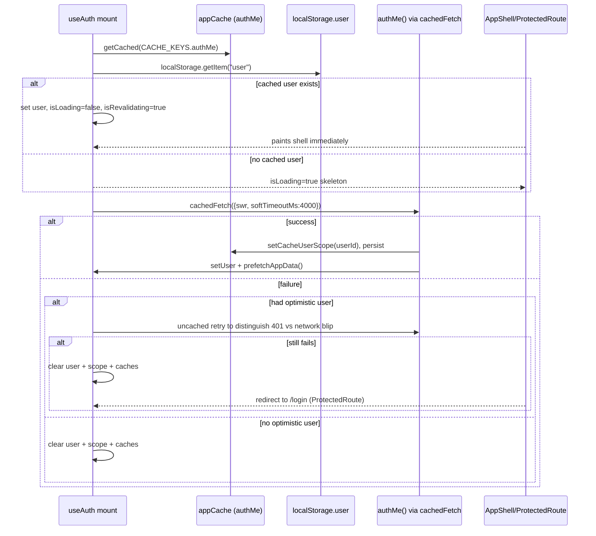
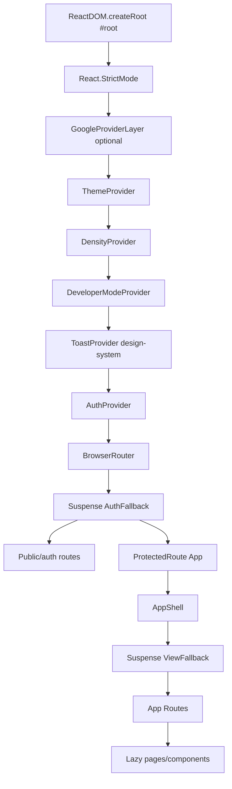

# Frontend Architecture

> Documents the `frontend/` React SPA as it currently exists.
> Cross-references: [SystemOverview](./SystemOverview.md) · [BackendArchitecture](./BackendArchitecture.md) · [APIInventory](./APIInventory.md)

## Table of Contents

1. [Folder Structure](#1-folder-structure)
2. [Routing](#2-routing)
3. [State Management](#3-state-management)
4. [API Layer](#4-api-layer)
5. [Authentication Flow](#5-authentication-flow)
6. [Shared Components](#6-shared-components)
7. [Design System](#7-design-system)
8. [Pages](#8-pages)
9. [Layout](#9-layout)
10. [Feature Organization](#10-feature-organization)
11. [UI Architecture](#11-ui-architecture)
12. [Build Configuration](#12-build-configuration)
13. [Testing](#13-testing)

---

## 1. Folder Structure

```
frontend/
├── index.html
├── vite.config.ts
├── tsconfig.json / tsconfig.node.json
├── tailwind.config.js
├── postcss.config.js
├── playwright.config.ts
├── vercel.json                 # SPA fallback for production hosting
├── .env.development / .env.production
├── e2e/                        # Playwright specs (auth_mobile.spec.ts, ...)
├── tests/                      # (additional test files)
├── dist/                       # build output
├── public/
└── src/
    ├── main.tsx                # providers + public/lazy auth routes + ProtectedRoute
    ├── App.tsx                 # authenticated App: routes 2-10 + scanner orchestration
    ├── api.ts                  # single API client surface (fetch-based)
    ├── api_auth.ts / api_auth_login.ts   # deprecated shims re-exporting from api.ts
    ├── config.ts               # API_BASE_URL / PRODUCTION_API_URL fallback
    ├── types.ts                # single 606-line discriminated-type barrel
    ├── styles.css
    ├── vite-env.d.ts
    ├── layout/
    │   ├── AppShell.tsx        # chrome (sidebar/topbar/bottom-nav/Profile dropdown)
    │   ├── navConfig.tsx       # RETAIL_NAV + ADMIN_NAV
    │   └── shell.css
    ├── design-system/          # tokens.css, components.css, components/, icons.tsx, index.ts
    ├── components/             # ~30 feature/building-block modules
    │   ├── swing/              # SwingDecisionDashboard, ScannerStatistics, ...
    │   ├── profile/            # UserProfilePage, ProfileCharts
    │   └── __tests__/          # Vitest units
    ├── pages/                  # route-level screens (Login,Signup,MarketsPage,...)
    ├── hooks/                  # useAuth, useTheme, useDensity, useDeveloperMode,
    │                          # useBackendHealth, useTradingDashboard, useResearchPrefetch, useInfrastructureHealth
    └── utils/                  # appCache.ts, apiErrors.ts, keepAlive.ts,
                                # prefetchAppData.ts, profileDataCache.ts,
                                # profilePrefs.ts, researchPrefetcher.ts, tradingHours.ts
```

---

## 2. Routing

Two-level routing. `main.tsx` wraps the app with the provider stack and renders **public Auth routes** + a catch-all authenticated `App`:

```mermaid
flowchart TD
    Main[main.tsx] --> RoutesPublic[Public Auth Routes lazy]
    Main --> MainCatch["* → ProtectedRoute(App)"]
    RoutesPublic --> Login["/login → pages/Login"]
    RoutesPublic --> Signup["/signup → pages/Signup"]
    RoutesPublic --> Forgot["/auth/forgot-password"]
    RoutesPublic --> Reset["/auth/reset-password"]
    MainCatch --> AppShell[AppShell]
    AppShell --> AppRoutes[App.tsx Routes]
    AppRoutes --> R0["/ and /home → Navigate /scanner"]
    AppRoutes --> RMarkets["/markets → MarketsPage (lazy, props from App state)"]
    AppRoutes --> RScan["/scanner → inline scanner list + lazy StockDetailPanel<br/>(?symbol= deep-link)"]
    AppRoutes --> RWatch["/watchlist → WatchlistPage"]
    AppRoutes --> RPaper["/paper and /paper/:section → PaperTradingPage (retailMode + prefill)"]
    AppRoutes --> RPerf["/performance → PerformancePage"]
    AppRoutes --> RProfile["/profile → UserProfilePage (retailMode)"]
    AppRoutes --> RLogs["/logs → Navigate /admin/logs"]
    AppRoutes --> RAdminLogs["/admin/logs → AdminRoute(SystemLogs)"]
    AppRoutes --> RAdminCmd["/admin/command → AdminRoute(CentralCommand)"]
    AppRoutes -> RFyers["/fyers/callback → FyersCallback (exchange auth_code)"]
    AppRoutes --> RCatch["* → Navigate /scanner"]
```

| Public route | Component | Notes |
|-------------|-----------|-------|
| `/login` | `pages/Login` | gates on `useBackendHealth` first. |
| `/signup` | `pages/Signup` | |
| `/auth/forgot-password` | `pages/ForgotPassword` | |
| `/auth/reset-password` | `pages/ResetPassword` | |

Authenticated routes are guarded by `ProtectedRoute` (must have a cached/validated user). `AdminRoute` additionally requires `useDeveloperMode().developerMode === true` (a client-side toggle, **not** a server role check). Heavy pages are `React.lazy()`-loaded with a `ViewFallback` scaffold.

---

## 3. State Management

**No Redux / Zustand / MobX / React Query.** All client state lives in:

1. **React Context providers** (`src/hooks/*.tsx`):
   - `AuthProvider` / `useAuth` — user session + `isLoading` / `isRevalidating`, optimistic hydration.
   - `ThemeProvider` / `useTheme` — `"dark" | "light"`, writes `<html data-theme>` + `.dark` / `.light`.
   - `DensityProvider` / `useDensity` — `"comfortable" | "compact"`, writes `<html data-density>`.
   - `DeveloperModeProvider` / `useDeveloperMode` — gates admin routes + nav items.
   - `ToastProvider` / `useToast` (from design-system) — toast queue (max 3 visible).
   - Leaf data hooks (no provider): `useBackendHealth`, `useTradingDashboard`, `useResearchPrefetch`, `useInfrastructureHealth`.

2. **`App.tsx` local `useState`** for scanner/dashboard control (timeframe, lookback, topN, selectedUniverse, filters, `screenerResult`, `scanHistory` persisted to localStorage, `selectedSymbol`, `detailViewOpen`, `paperTradingPrefill`, `progressData`, scan timing).

3. **Persistence layers**:
   - `localStorage` keys: `user`, `theme`, `ui_density`, `developer_mode`, `ui_sidebar_collapsed`, `scanHistory`.
   - `sessionStorage` + in-memory `Map` via the custom SWR cache (`utils/appCache.ts`).

### App Cache (`utils/appCache.ts`)

The de-facto data store for non-mutation reads:

- **Two-tier** — in-memory `Map` (hot) + `sessionStorage` keys prefixed `app_cache_v1_`.
- **TTL** — default 8 min; per-call `ttlMs`.
- **In-flight deduplication** — `inflight` map of `Promise`s keyed by scoped key.
- **Stale-while-revalidate** (`swr: true`) — returns fresh-or-stale immediately; triggers background revalidate.
- **Soft timeout** (`softTimeoutMs`, default 3000) — returns stale after wall-clock timeout and keeps revalidating in background (no timeout on background).
- **Multi-user isolation** — `setCacheUserScope(userId)` scopes keys as `${key}:u:${userId}`; switching users clears previous user's in-memory entries; cache cleared wholesale on logout.
- **Public surface** — `cachedFetch`, `getCached`, `getStaleCached`, `setCached`, `preheatCache`, `invalidateCache(prefix?)`, `CACHE_KEYS` (stable keys: `authMe`, `paperDashboard`, `paperAnalytics`, `fyersToken`, `marketStatus`, `latestScan`, `universes`, ...), `PROFILE_CACHE_KEYS` aliases.

---

## 4. API Layer

- **Transport**: native `fetch` (no Axios). All requests go through one chokepoint `fetchWithDiagnostics(path, init, label)` in `src/api.ts`.
- **Base URL** (`src/config.ts`): `VITE_API_URL` / `VITE_API_BASE_URL`. In PROD refuses localhost/empty and falls back to `PRODUCTION_API_URL = "https://trading-system-2-rl0x.onrender.com"`. Dev default `http://127.0.0.1:8000`. `apiUrl(path)` concatenates; `getWsBaseUrl()` derives WS origin.
- **Headers**: `Content-Type: application/json`, `Accept: application/json` (per-call override allowed).
- **Credentials**: every request sets `credentials: "include"` (cookie session — **no Authorization header injection**, no client-stored bearer).
- **Diagnostics**: dev-only `console.info` / `console.warn` with latency (`performance.now()`) gated on `window.__VITE_DEV__`.
- **Gateway/cold-start handling**: HTTP 502/503/504/521–524 throw `mapHttpError(...)` → `ApiClientError`; network `TypeError`s (`Failed to fetch`, CORS, mixed-content, localhost-in-prod) map to `mapNetworkError(...)` with stable codes (`NETWORK_LOST`, `SERVER_UNREACHABLE`, `SERVER_UNAVAILABLE`, `TIMEOUT`, `CORS`, `MIXED_CONTENT`, `LOCALHOST_IN_PROD`, `BACKEND_URL_BAD`). `toUserFacingApiMessage()` converts any thrown value to UI copy — raw "Failed to fetch" never reaches the UI.

### Exported endpoint helpers (full inventory)

(See [APIInventory.md](./APIInventory.md) for the matching backend routes.)

**Health / probing**
- `checkBackendHealth()` → `GET /health`

**Scanner**
- `runPresetScreener(mode, timeframe, symbols, topN, onProgress)` → `POST /analysis/screener/full` (SSE: `progress` / `result` / `complete` events); resolves `ScreenerResponse`.
- `loadLatestScan()` → `GET /analysis/scan/latest`.
- `getLatestScan()` → `GET /scanner/latest`.
- `loadTodayCandidates()` → `GET /analysis/candidates/today`.
- `fetchSymbolDetail(symbol)` → `GET /analysis/symbol/{symbol}/detail` (normalizes field-name variants).
- `fetchBatchLight(symbols)` → `POST /analysis/symbol/batch-light`.

**Paper trading — dashboard / account**
- `fetchPaperTradingDashboard(selectedSymbol?)` → `GET /paper-trading/dashboard`
- `fetchPaperAccountSummary()` → `GET /paper-trading/account/summary`
- `fetchMarketStatus()` → `GET /health/market-status`
- `fetchPaperQuote(symbol)` → `GET /paper-trading/symbols/{symbol}/quote`
- `resetPaperTradingAccount(startingBalance)` → `POST /paper-trading/account/reset`
- `updatePaperAccountCapital(amount)` → `PUT /paper-trading/account/capital`
- `fetchPaperAccountTransactions(page, per_page)` → `GET /paper-trading/account/transactions`
- `squareOffAllPositions()` → `POST /paper-trading/positions/squareoff-all`

**Paper trading — orders / positions**
- `placePaperOrder(ticket, idempotencyKey?)` → `POST /paper-trading/orders` (auto `Idempotency-Key`: `crypto.randomUUID()`)
- `updatePaperOrder`, `deletePaperOrder`, `cancelPaperOrder`, `fetchPendingPaperOrders`, `fetchPaperOrderHistory`
- `fetchPositions`, `closePaperPosition`, `updatePaperPosition`, `fetchPaperTrades`, `prefillPaperTrade`

**Paper trading — market engine**
- `startMarketEngine()` / `stopMarketEngine()` / `fetchMarketEngineStatus()` / `fetchPaperTradingEngineStatus()`

**Paper trading — analytics / journal**
- `fetchAnalytics`, `fetchDailyAnalytics`, `fetchDailyJournal`, `saveDailyJournal` (invalidates `paper_daily_*` caches)

**Notifications / alerts**
- `fetchUnreadNotifications`, `markNotificationsRead`, `fetchNotifications`, `markAllNotificationsRead`
- `fetchAlerts`, `createAlert`, `deleteAlert`

**Workstation**
- `fetchUniverses` (30-min cache), `fetchMarketOverview` (2-min), `fetchSavedScans`, `saveScannerPreset`, `deleteScannerPreset`, `fetchScanHistory(limit)`, `compareScan(scanId)`
- `fetchWorkstationAlerts`, `createWorkstationAlert`, `deleteWorkstationAlert`
- `fetchRiskSettings`, `updateRiskSettings`, `fetchApiHealth`, `invalidatePaperCaches`

**Broker tokens / FYERS OAuth** *(path literal `/api/...`)*
- `saveAccessToken(access_token)` → `POST /settings/token` (legacy; invalidates fyers caches)
- `fetchBrokerToken(broker)`, `saveBrokerToken(payload)`, `updateBrokerToken(payload)`, `deleteBrokerToken(broker)`, `validateBrokerToken(broker)`, `testBrokerConnection(payload?)` `\`/api/broker-tokens*\`
- `getTokenStatus`, `getTokenHistory(limit)`, `getFyersAuthUrl`, `exchangeFyersAuthCode(authCode)`

**Auth / user**
- `authSignup`, `authLogin`, `authGoogleLogin(idToken)` (15s AbortController timeout), `authMe`, `authLogout`, `fetchUserProfile`, `updateUserProfile`, `patchUserProfile`, `forgotPassword`, `resetPassword`

Re-exports: `toUserFacingApiMessage`, `ApiClientError`. The single-export modules `src/api_auth.ts` (`authSignup`) and `src/api_auth_login.ts` (`authLogin`) are **deprecated shims** that re-export from `api.ts` for import compatibility.

---

## 5. Authentication Flow

Session model: **cookie-based, server-side**. The only client-persisted identity is the cached `/auth/me` payload. `credentials: "include"` carries the browser session cookies on every request.

### useAuth (`AuthProvider`)



Public API on the hook: `user`, `isAuthenticated`, `isLoading`, `isRevalidating`, `login(user)`, `logout()` (clears state/caches + best-effort `authLogout`), `updateUser(partial)`.

### Route guards

- **`ProtectedRoute`** — renders children if `isAuthenticated`; if `isLoading` with no cached user shows a lightweight "Restoring session…" skeleton; otherwise `<Navigate to="/login" state={{from: location}}>`. Never blocks the shell once a cached session exists.
- **`AdminRoute`** — gated by `useDeveloperMode().developerMode` (**client-side toggle, not a server role**). Shows a "Restricted / Enable developer mode" Card when off; retail nav also hides admin destinations entirely.

### Login flows

- **Email/password** (`pages/Login.tsx`): gates on `useBackendHealth` (probes `/health` before sending credentials, surfacing "Server unavailable" instead of raw errors) → `authLogin({email, password, remember_me})` → `login(data.user)` → navigate to `location.state.from || /scanner`.
- **Google OAuth** (`components/GoogleSignInButton.tsx`): uses Google Identity Services directly (`window.google.accounts.oauth2.initTokenClient`), requesting `openid email profile`; captures `response.id_token`; gates on backend health; `authGoogleLogin(idToken)` → `login(data.user)`. Disabled when `VITE_GOOGLE_CLIENT_ID` missing.
- **Signup / Forgot / Reset**: thin pages calling `authSignup`, `forgotPassword`, `resetPassword`; routed through `throwIfAuthFailed` for Pydantic detail-array formatting.

### Session persistence on disk

- `localStorage["user"]` — cached `/auth/me` user object for optimistic restore.
- `sessionStorage["app_cache_v1_authMe"]` — fresh-or-stale cache entry.

---

## 6. Shared Components

`src/components/` (~30 top-level files):

- **Feature** — `PaperTradingPage`, `StockDetailPanel`, `ResearchDashboard`, `WorkstationPage`, `CentralCommand`, `SystemLogs`, `NotificationBell`, `FyersCallback`.
- **Route-protection** — `ProtectedRoute`, `AdminRoute`.
- **Building blocks** — `CandidateTable`, `AllAnalyzedStocksTable`, `FilterBar`, `ScannerProgress`, `StatusCards`, `SummaryRow`, `Skeleton`, `ThemeToggle`, `DashboardHeader`.
- **Auth widgets** — `AuthLayout`, `AuthInput`, `PasswordInput`, `PasswordStrength`, `GoogleSignInButton`.
- **Infra/ops** — `TokenStatus`, `LiveDataBadge`, `InfrastructureStatus`.
- **Niceties** — `InfoTooltip`, `BullIllustration`.
- **Subfolders**:
  - `swing/` — `SwingDecisionDashboard`, `ScannerStatistics`, `ScannerControls`, `QuickScannerActions`, `MarketStatus`, `DataFeedNotice`, barrel `index.ts`.
  - `profile/` — `UserProfilePage`, `ProfileCharts`.
  - `__tests__/` — `CandidateTable.test.tsx`, `MarketEngineHealthWidget.test.tsx` (Vitest).

Heavy pages are `React.lazy()`-mounted via `dynamic import().then(m => ({default: m.X}))`.

---

## 7. Design System

`src/design-system/` — a small bespoke design system (no component library dependency):

- `tokens.css` — CSS custom properties (`--bg`, `--text-muted`, ...).
- `components.css` — component CSS (`ds-btn`, `ds-label`, `ds-display`, `app-skel`, ...).
- `icons.tsx` — inline SVG icon set.
- `index.ts` — public barrel.
- `components/`:
  - `Button`, `Badge` + `StatusPill`, `Card` + `CardHeader`, `EmptyState`
  - `PnL` + `SignalBadge`, `Modal` + `ConfirmDialog`
  - `Toast` (`ToastProvider` / `useToast`, `MAX_VISIBLE = 3`, levels `success/error/warning/info/loading`, dedupe keys)
  - `Tabs` / `TabPanel`, `StatCard`, `SectionHeader`, `Accordion`

Import pattern: `import { Button, Card, EmptyState, useToast } from "./design-system"`.

Theming strategy: dual — Tailwind `dark:` variants on auth pages, CSS custom properties + `.dark`/`.light` + `data-theme` / `data-density` attributes on the retail shell. Theme + density persist to `localStorage` and apply via `useLayoutEffect` (avoid FOUC).

---

## 8. Pages

`src/pages/` (9 files):

| Page | Role |
|------|------|
| `Login` | Email/password + Google overlay, backend-health gated |
| `Signup` | Thin page |
| `ForgotPassword`, `ResetPassword` | Thin pages |
| `MarketsPage` | Owns market overview, swing dashboard, scan management, alerts; receives scanner props from `App.tsx` |
| `WatchlistPage` | Watchlist |
| `PerformancePage` | Performance |
| `SystemLogs` | Admin: log filters + streaming via `API_BASE_URL` direct |
| `SettingsSessions` | Sessions/settings admin |

`App.tsx` itself owns the heavy scanner orchestration (state + handlers) and the `/scanner` view. The `PaperTradingPage` lazy-loads with `retailMode` + recommendation prefill + scanner candidates.

---

## 9. Layout

`src/layout/`:

- **`AppShell.tsx`** — full chrome around `<App>`:
  - Desktop: collapsible sidebar (state persisted to `localStorage["ui_sidebar_collapsed"]`, auto-collapses ≤1280px). Top bar with BUY/SELL CTAs navigating to `/paper?side=BUY|SELL`. Profile dropdown (Profile / Preferences / Paper Desk / Sign out).
  - Mobile: top-bar hamburger opens a drawer (`app-mobile-scrim`); fixed bottom-nav of `RETAIL_NAV.slice(0,5)` + a Profile avatar; floating ⚡ scanner FAB.
  - Sidebar footer: Density `<select>`, Developer-mode checkbox, `<ThemeToggle>`.
  - Nav list = `developerMode ? [...RETAIL_NAV, ...ADMIN_NAV] : RETAIL_NAV`.
- **`navConfig.tsx`** — `NavItem` definitions:
  - `RETAIL_NAV`: Markets, Scanner, Watchlist, Paper Desk, Performance, Profile.
  - `ADMIN_NAV`: Central Command (`/admin/command`), System Logs (`/admin/logs`).
  - Each item has inline SVG `icon`, `path`, `match`, `testId`. `isNavActive(pathname, item)` matches a path or any child path.
- `shell.css` — layout/app-shell/app-sidebar/app-topbar/app-bottom-nav styling.

---

## 10. Feature Organization

- **Routes/caching** live in `App.tsx` + `api.ts` + `utils/appCache.ts`.
- **Heavy page components** are lazy-loaded and code-split via Vite manual chunks (recharts, vendor, profiles, analytics, admin, pages).
- **Scanner orchestration** is centralized in `App.tsx` (not in a page) and passed via props to `MarketsPage`.
- **Paper desk** is a single large lazy-loaded `PaperTradingPage` module.
- **Admin tooling** (`CentralCommand`, `SystemLogs`) is developer-mode-gated.

`src/utils/`:
- `appCache.ts` (cache core), `apiErrors.ts` + `apiErrors.test.ts`.
- `keepAlive.ts` — `startKeepAlive()` pings `/health` every 10 min to defeat Render cold-starts (started at boot in `main.tsx`).
- `prefetchAppData.ts` — post-login staggered prefetch (priority → paper → workstation via `requestIdleCallback` / `setTimeout`); `clearAllAppCaches`.
- `prefetchProfile.ts`, `profileDataCache.ts`, `profilePrefs.ts` — profile-scoped data + preference types.
- `researchPrefetcher.ts` — `markPrefetched(symbol)` to warm research when a symbol is selected.
- `tradingHours.ts` — `isMarketOpenForDisplay`, `checkCanPlaceBuyOrder`, `showMarketClosedAlert` (gates BUY orders outside NSE hours).

---

## 11. UI Architecture



Key properties:

1. **Single fetch chokepoint** (`fetchWithDiagnostics`) — uniform credentials, headers, error mapping, latency logging across every call.
2. **Optimistic-first auth** — shell paints from cache while background revalidation distinguishes 401 from network blips.
3. **No external state library** — Context + `useState` + custom SWR cache; the cache is the de-facto data store.
4. **Code-split everything heavy** — pages and large components are `lazy()`, with manual Rollup chunks for recharts / admin / analytics / profiles.
5. **Cookie-based sessions, no client tokens** — the only localStorage identity is the cached `/auth/me` payload; broker tokens live server-side (Fernet-encrypted).
6. **Resilient to Render cold starts** — keep-alive pinger, soft-timeout cache fallbacks, backend-health gating on auth screens.
7. **Strict role separation via Developer mode**, not server roles — engineering routes are both hidden from nav and blocked by `AdminRoute` for deep-link safety.

---

## 12. Build Configuration

### `package.json` scripts

| Script | Command | Purpose |
|--------|---------|---------|
| `dev` | `vite` | Dev server on `127.0.0.1:5173`; proxy `/api/*` → `http://127.0.0.1:8000` (strips `/api`). |
| `build` | `vite build` | Production bundle (manual chunks, esbuild minify, ES2020). |
| `preview` | `vite preview` | Local preview of build. |
| `test` / `test:watch` | `vitest run` / `vitest` | Unit tests (jsdom). |
| `e2e` | `powershell … run-e2e.ps1` | Wrapped Playwright runner. |
| `e2e:raw` / `e2e:ui` / `e2e:headed` / `e2e:auth-mobile` | `playwright test …` | Playwright variants. |

### `vite.config.ts`

- Plugin: `@vitejs/plugin-react`.
- Build: `target: "es2020"`, `esbuild` minify, `cssMinify: true`, `chunkSizeWarningLimit: 500`.
- **Manual chunks**: `recharts`, `vendor` (react/react-dom/react-router-dom), `profiles`, `analytics`, `admin`, `pages`.
- Dev proxy rewrites `/api/*` → backend root (port 8000), stripping `/api`.
- Vitest config embedded: `jsdom` env, globals, include `src/**/*.{test,spec}.*`, excludes `e2e/` + `*.spec.ts`.

### `tsconfig.json`

`target: ES2020`, `module: ESNext`, `moduleResolution: Node`, `jsx: react-jsx`, `strict: true`, `noEmit: true`, `resolveJsonModule`, `isolatedModules`, `skipLibCheck`. `noUnusedLocals`/`noUnusedParameters` disabled. Includes `src`, references `tsconfig.node.json`.

### Tailwind

`darkMode: "class"`, content scans `index.html` and `src/**/*.{js,ts,jsx,tsx}`. Tailwind mostly drives auth screens; the retail shell leans on hand-rolled CSS (design-system + `layout/shell.css` + `styles.css`).

### Environment files

- `.env.development` / `.env.production` — provide `VITE_API_URL`, `VITE_GOOGLE_CLIENT_ID`, `PRODUCTION_API_URL`.

---

## 13. Testing

- **Unit** — Vitest 4 + jsdom + `@testing-library/*`. Include pattern `src/**/*.{test,spec}.*`; excludes `e2e/`.
- **E2E** — Playwright 1.52 under `e2e/` and `tests/`. `playwright.config.ts` defines headless + headed variants; `auth_mobile.spec.ts` highlighted via `e2e:auth-mobile`.
- **Runner**: default `e2e` delegates to `../scripts/run-e2e.ps1`.