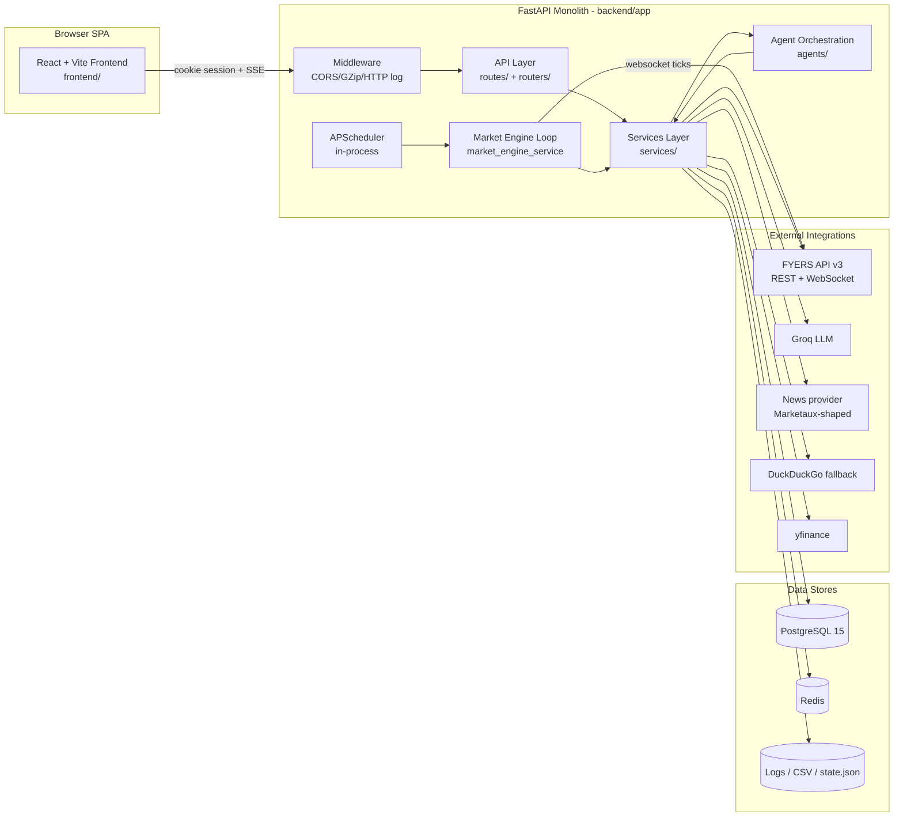
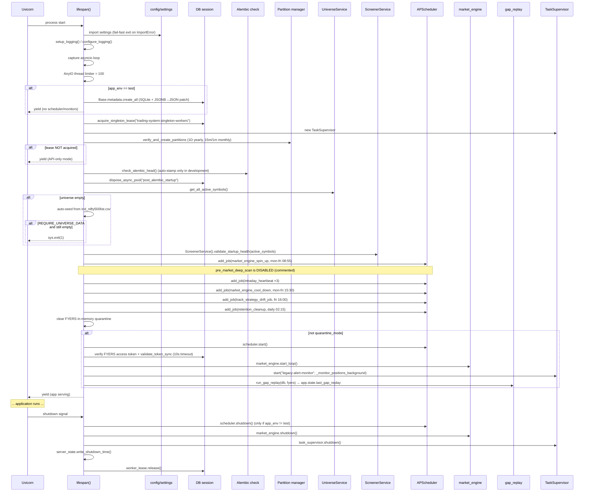
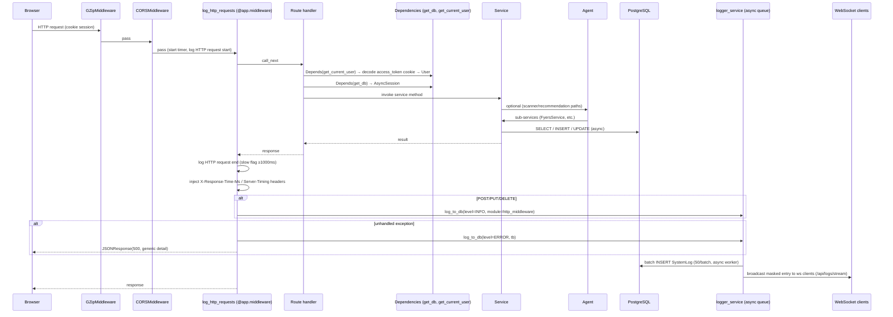

# System Overview

> Architecture freeze document for the `trading-system` repository.
> This document records the system **as it exists today**. It does not propose changes.
> Cross-references: [BackendArchitecture](./BackendArchitecture.md) · [FrontendArchitecture](./FrontendArchitecture.md) · [DatabaseSchema](./DatabaseSchema.md) · [DataFlow](./DataFlow.md) · [APIInventory](./APIInventory.md)

## Table of Contents

1. [Project Purpose](#1-project-purpose)
2. [High-Level Architecture](#2-high-level-architecture)
3. [Major Subsystems](#3-major-subsystems)
4. [Runtime Flow](#4-runtime-flow)
5. [External Dependencies](#5-external-dependencies)
6. [Technology Stack](#6-technology-stack)
7. [Startup Sequence](#7-startup-sequence)
8. [Overall Request Lifecycle](#8-overall-request-lifecycle)
9. [Deployment Topology](#9-deployment-topology)
10. [Environment & Secrets](#10-environment--secrets)

---

## 1. Project Purpose

`trading-system` is a **production-grade, advisory-only Indian-equities swing-trading research and paper-trading workstation**. It does **not** place live broker orders. Its responsibilities are:

- **Market-data ingestion** — daily and intraday OHLCV from the FYERS broker API, persisted to PostgreSQL.
- **Scanner pipeline** — vectorized, multi-stage screening of stock universes (NIFTY500 / NIFTY100 / FNO / CUSTOM) to surface swing-trading candidates.
- **Recommendation engine** — multi-agent analysis (technical, backtest, news/sentiment, fundamentals, LLM reasoning) producing a final BUY / WATCH / REJECT verdict per symbol, with trade plans and confidence breakdown.
- **Feature overlays** — FEAT-004 (market-regime overlay), FEAT-007 (sector relative-strength overlay), FEAT-008 (realistic execution/backtest model). SR-003 (sector challenger) and SR-004 (market permission challenger) wrap the recommendation with a second-opinion path.
- **Walk-forward validation** — offline Champion vs Challenger backtests across rolling windows, persisted as veto history.
- **Paper trading desk** — server-side paper accounts per user with order/position lifecycle, market-engine-driven fills (live FYERS tick websocket + 1m candle reconciliation), gap-replay on restart, journals, analytics, notifications.
- **Frontend SPA** — React/Vite retail workstation with scanner, paper desk, markets overview, watchlist, performance, profile, and admin tooling (Central Command, System Logs).
- **Observability & governance** — DB-backed structured logging with WebSocket fan-out, Prometheus metrics, forensic scan diagnostics, retention, distributed locking, singleton-worker lease for multi-pod safety.

The system advisory disclaimer (from `settings.advisory_disclaimer`): *"Advisory only. This system does not place live trades and is not financial advice."*

---

## 2. High-Level Architecture

The system is a **two-tier monolith with background workers**:

Key architectural properties:

- **Single FastAPI process** holding the scheduler, market engine loop, and API. A Postgres advisory-lock singleton lease (`trading-system:singleton-workers`) ensures **only one pod** per deployment runs the scheduler + market engine; other pods run API-only.
- **Async-first** backend (`asyncpg` + `AsyncSessionLocal`), with a parallel **sync** engine (`psycopg2` + `SessionLocal`) for OHLCV bulk loads and intra-thread work.
- **Cookie-based sessions** (HttpOnly `access_token` / `refresh_token`) — no client-side bearer tokens.
- **No Redis-backed HTTP cache** — in-process TTL response cache (`core/response_cache.py`); Redis is used only for JWT blocklist, login rate-limiting, and distributed locks.
- **No external message queue** — `LoggingService` uses an in-process `asyncio.Queue` + fan-out to WebSocket clients.

---

## 3. Major Subsystems

| # | Subsystem | Primary location | Description |
|---|-----------|-----------------|-------------|
| 1 | **API layer** | `backend/app/routes/`, `backend/app/routers/` | FastAPI routers; 116 endpoints (see [APIInventory](./APIInventory.md)). |
| 2 | **Services** | `backend/app/services/` (53 modules) | Business logic: FyersService, ScreenerService, RecommendationService, BacktestService, NewsService, LLMService, MarketDataService, MarketEngineService, PaperTradingService, etc. |
| 3 | **Agent orchestration** | `backend/app/agents/` | `OrchestratorAgent` + `RouterAgent` + specialized agents (Technical, Recommendation, Backtest, News, Fundamental, Ranking). |
| 4 | **Database** | `backend/app/models/`, `backend/app/db/` | SQLAlchemy ORM models, async+sync engines, partition manager, advisory locks, scan_store (raw JSONB). |
| 5 | **Scheduler** | `backend/app/main.py` (APScheduler `AsyncIOScheduler`) | 6 active cron jobs (engine spin-up, intraday heartbeats ×3, engine cool-down, drift tracker, retention). One job (`pre_market_deep_scan`) is **disabled** in code. |
| 6 | **Market engine** | `backend/app/services/market_engine_service.py` | Background async loop driving FYERS websocket + 1m candle reconciliation for paper-trade order/position management. |
| 7 | **Observability** | `backend/app/observability/`, `backend/app/services/diagnostics_service.py`, `logger_service.py`, `db_logger.py` | Prometheus metrics (`/metrics`), forensic scan diagnostics, in-process ring-buffer shadow-run telemetry, DB-backed `LoggingService` with sensitive-data masking + WebSocket fan-out. |
| 8 | **Auth** | `backend/app/services/auth_service.py`, `backend/app/core/security.py`, `core/deps.py` | Email/password (Argon2) + Google OAuth (GIS `id_token`); JWT access (24h) + refresh (7d); HttpOnly cookies; session table with revocation. |
| 9 | **Frontend** | `frontend/src/` | React 18 SPA, Context-based state, custom SWR cache, fetch wrapper, Tailwind + bespoke design system. |
| 10 | **Configuration** | `backend/app/config/settings.py` | Pydantic `BaseSettings` reading repo-root `.env`, with feature-flag blocks FEAT-004/007/008. |
| 11 | **Distributed coordination** | `backend/app/db/locks.py`, `app/utils/redis_lock.py`, `services/lock_service.py` | Postgres advisory locks (singleton lease), Redis Redlock-with-fencing token, DB-row `SystemLock` table. |
| 12 | **Migrations** | `alembic/` (repo root, 2 revisions) + `backend/alembic/` (30 revisions) | Two Alembic trees. Startup enforces head match via `check_alembic_head()`. |

---

## 4. Runtime Flow

The runtime has three loosely coupled loops running inside one process (only on the singleton pod):

1. **Request loop** — Uvicorn ASGI serving FastAPI. Each request traverses `GZipMiddleware → CORSMiddleware → log_http_requests middleware → router → dependency-injected service`.
2. **Scheduler loop** — `AsyncIOScheduler(timezone="Asia/Kolkata")` triggers cron jobs which mostly call into `market_engine` lifecycle methods and the retention service. The deep-scan job is currently disabled.
3. **Market engine loop** — `market_engine.start_loop()` runs `_run_loop` (reconcile websocket subscriptions and ticks → fill/exit paper orders/positions) and `_reconciliation_loop` (5-min OHLCV sweep for missed exits).

On startup the singleton pod also runs **gap-replay** (`core/gap_replay.run_gap_replay`) to back-fill paper-trading orders/positions that should have triggered while the server was offline, using 1m candles between `server_state.last_shutdown` and now.

A separate legacy `_monitor_positions_background` task (every 5s) still runs alongside the market engine to check the older `PaperAlert` and `WorkstationAlert` price-trigger rules.

---

## 5. External Dependencies

| Integration | Used by | Purpose |
|-------------|---------|---------|
| **FYERS API v3** (`fyers_apiv3.fyersModel`, REST + WebSocket) | `FyersService`, `MarketEngineService` (via `FyersMarketDataFeed`) | OHLCV fetch, incremental fetch, LTP, live tick websocket, OAuth auth-code exchange, token validation. |
| **Groq LLM** (`https://api.groq.com/openai/v1/chat/completions`) | `LLMService` | Reasoning bullets, research summaries, AI confidence explanation, research insights, sentiment scoring. JSON-only responses. |
| **News provider** (configurable `news_api_url` + `news_api_key`, Marketaux-compatible `/search` shape) | `NewsService` | Symbol news fetch. |
| **DuckDuckGo Instant Answers** (`https://api.duckduckgo.com/`) | `NewsService` | Fallback news source. |
| **yfinance** | `FundamentalAnalysisAgent`, `ScreenerService.fallback_fetch_yfinance` | Fundamentals (revenueGrowth, profitMargins, debtToEquity, trailingPE) and OHLCV fallback. |
| **PostgreSQL 15** | All persistence-bound services (async `asyncpg` + sync `psycopg2`) | Candle upsert/query, analysis history, paper trading, event calendar, walk-forward, scan snapshots, system logs. |
| **Redis** | `core/redis.py`, `utils/redis_lock.py`, `db/locks.py` (alt) | JWT jti blocklist, login rate-limiting/lockout, Redlock-with-fencing distributed locks. |
| **Google Identity Services** | Frontend Google sign-in | Provides `id_token` consumed by `/auth/google`. |
| **ta library** (pandas-ta style) | `TechnicalAnalysisService`, `BacktestService`, `SectorRelativeStrengthService`, `WalkForwardService` | RSI, EMA, MACD, SMA, VWAP, Supertrend. |
| **SMTP** (configurable) | `auth_service` password-reset / `email_service` | Password reset delivery (server configured, optional). |

---

## 6. Technology Stack

### Backend
- **Language**: Python 3 (runtime pinned via `runtime.txt`).
- **Framework**: FastAPI + Starlette; ASGI server: Uvicorn.
- **Scheduler**: APScheduler (`AsyncIOScheduler`, IST timezone).
- **ORM**: SQLAlchemy 2.0 (`Mapped`/`mapped_column`) with `asyncpg` async driver + `psycopg2` sync driver.
- **Migrations**: Alembic (two trees).
- **Settings**: `pydantic` + `pydantic-settings` (`BaseSettings`, `.env` at repo root).
- **Auth**: `passlib[argon2]`, `python-jose`/JWT, `redis.asyncio`, Google Identity Services.
- **Data**: `pandas`, `numpy`, `ta` technical-analysis library, `yfinance`.
- **Broker**: `fyers_apiv3` SDK, `httpx` for OAuth/REST.
- **LLM**: Groq via `httpx`/OpenAI-compatible client.
- **Observability**: `prometheus_client` (optional, gracefully stubbed), `psutil`.
- **Caching**: in-process `response_cache.py` (thread-safe TTL); no Redis HTTP cache.

### Frontend
- **Framework**: React 18.3 + React Router 7 + Vite 5 + TypeScript 5.8 (strict).
- **Styling**: Tailwind 3 + bespoke design-system (`tokens.css`, `components.css`).
- **Charts**: Recharts 2.15.
- **Auth**: `@react-oauth/google` (installed; runtime uses GIS script directly).
- **Transport**: native `fetch` with a custom `fetchWithDiagnostics` chokepoint; SSE consumed from `response.body.getReader()`.
- **State**: React Context + `useState` + custom SWR cache (`utils/appCache.ts`) — **no Redux / React Query / Axios**.
- **Testing**: Vitest + jsdom (units), Playwright (E2E).

### Infrastructure
- **Database**: PostgreSQL 15 (docker-compose uses `postgres:15-alpine`).
- **Cache/lock store**: Redis.
- **Deployment**: Render (`render.yaml` present); frontend on Vercel (`vercel.json` present).
- **Container**: `docker-compose.yml` defines only the Postgres service.

---

## 7. Startup Sequence

The FastAPI app uses one `lifespan` async context manager (`backend/app/main.py:233`). The exact sequence (only the singleton-worker pod executes the full path; non-lease pods run API-only and `yield` early):

Notes:

- Test env branch creates tables via `Base.metadata.create_all` and patches JSONB→JSON for SQLite; it skips the scheduler, market engine, alert monitor, and gap replay entirely.
- `quarantine_mode=True` bypasses scheduler start, market engine loop, alert monitor, and gap replay, but the singleton lease and partition/Alembic validation still run.

---

## 8. Overall Request Lifecycle

---

## 9. Deployment Topology

- **Backend**: deployed on Render as a web service (see `render.yaml`). In multi-pod setups, only the pod holding `trading-system:singleton-workers` runs scheduler/market-engine; all pods serve the API.
- **Frontend**: static Vite build deployed to Vercel (`vercel.json` — SPA fallback). Production API base URL is hard-coded fallback `https://trading-system-2-rl0x.onrender.com` in `frontend/src/config.ts` when `VITE_API_URL` is missing in PROD.
- **Database**: Postgres 15 (Render managed or local docker-compose).
- **Redis**: required for JWT blocklist and rate-limiting; connection via `REDIS_URL`.
- **Local dev**: `docker-compose.yml` boots only Postgres on port `5433`; backend run via `start_backend.ps1` / `uvicorn`; frontend via `npm run dev` (Vite proxy `/api` → `127.0.0.1:8000`).

---

## 10. Environment & Secrets

Configuration is centrally defined in `backend/app/config/settings.py` (`Settings` subclass of `pydantic_settings.BaseSettings`, `.env` at repo root). See [BackendArchitecture §Configuration](./BackendArchitecture.md#configuration) for the complete field table. Additional env vars consumed outside `Settings`:

- `JWT_SECRET`, `JWT_REFRESH_SECRET`, `ACCESS_TOKEN_EXPIRE_MINUTES`, `REFRESH_TOKEN_EXPIRE_DAYS` — `core/security.py`.
- `TOKEN_ENCRYPTION_KEY` (Fernet; falls back to `JWT_SECRET`) — `core/token_crypto.py`.
- `SCHEDULER_SECRET` — `X-Scheduler-Secret` header on `/scheduler/daily-scan`.
- `FYERS_TOKEN_CACHE_MINUTES` (default 60) — `services/token_service.py`.
- `ENVIRONMENT` / `APP_ENV` — logger environment label.
- `TEST_ARTIFACT_DIR`, `RUN_ID` — test log routing.
- `RENDER_SERVICE_ID`, `RENDER_INSTANCE_ID` — deployment identity for scan diagnostics.
- Frontend: `VITE_API_URL` / `VITE_API_BASE_URL`, `VITE_GOOGLE_CLIENT_ID`, `PRODUCTION_API_URL`.

Any field not present in `.env` and not in the env defaults listed above is **Unable to determine from repository** beyond defaults captured in `settings.py`.