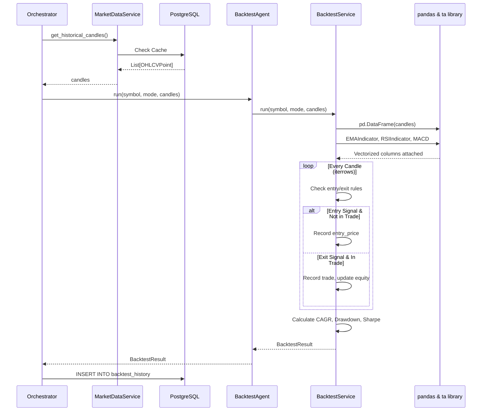
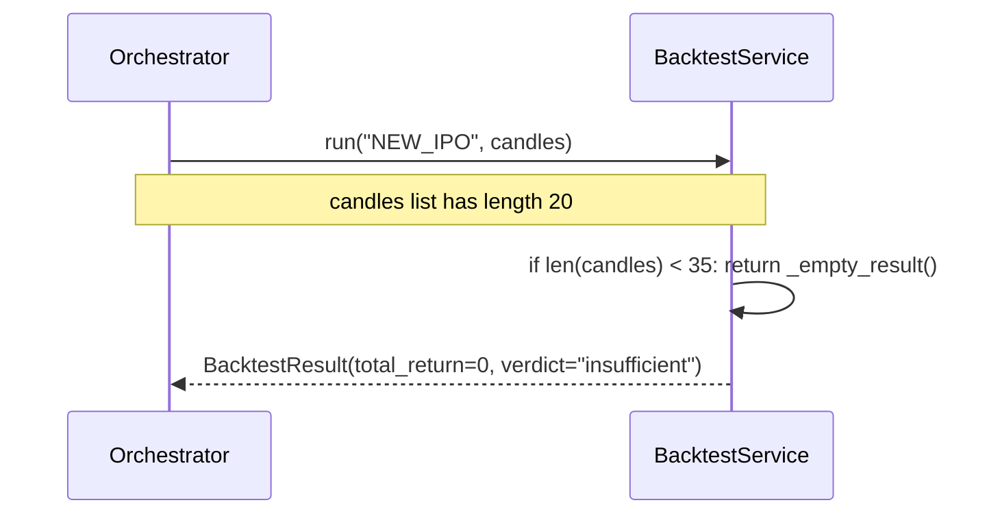

# Sequence Diagrams

## 1. Normal Backtest Execution

```mermaid
sequenceDiagram
    participant Orchestrator
    participant MarketDataService
    participant DB as PostgreSQL
    participant BacktestAgent
    participant BacktestService
    participant TA as pandas & ta library

    Orchestrator->>MarketDataService: get_historical_candles()
    MarketDataService->>DB: Check Cache
    DB-->>MarketDataService: List[OHLCVPoint]
    MarketDataService-->>Orchestrator: candles
    
    Orchestrator->>BacktestAgent: run(symbol, mode, candles)
    BacktestAgent->>BacktestService: run(symbol, mode, candles)
    
    BacktestService->>TA: pd.DataFrame(candles)
    BacktestService->>TA: EMAIndicator, RSIIndicator, MACD
    TA-->>BacktestService: Vectorized columns attached
    
    loop Every Candle (iterrows)
        BacktestService->>BacktestService: Check entry/exit rules
        alt Entry Signal & Not in Trade
            BacktestService->>BacktestService: Record entry_price
        else Exit Signal & In Trade
            BacktestService->>BacktestService: Record trade, update equity
        end
    end
    
    BacktestService->>BacktestService: Calculate CAGR, Drawdown, Sharpe
    BacktestService-->>BacktestAgent: BacktestResult
    BacktestAgent-->>Orchestrator: BacktestResult
    
    Orchestrator->>DB: INSERT INTO backtest_history
```

## 2. Insufficient Data (Short IPO)

```mermaid
sequenceDiagram
    participant Orchestrator
    participant BacktestService
    
    Orchestrator->>BacktestService: run("NEW_IPO", candles)
    Note over Orchestrator, BacktestService: candles list has length 20
    
    BacktestService->>BacktestService: if len(candles) < 35: return _empty_result()
    BacktestService-->>Orchestrator: BacktestResult(total_return=0, verdict="insufficient")
```
