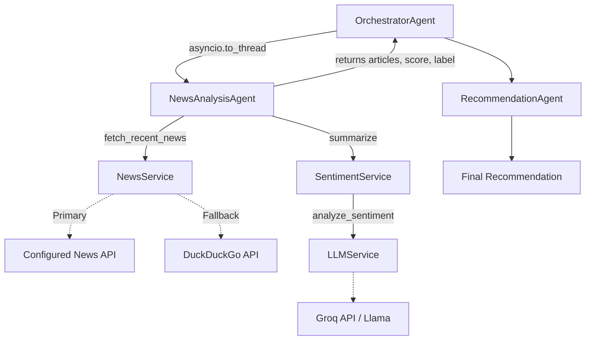

# 02 Architecture

## Complete News Analysis Architecture
The News Analysis Engine is built as an asynchronous, agent-driven subsystem within the Orchestrator. 

### Components
1. **Agents**:
   - `NewsAnalysisAgent`: Orchestrates the fetching and summarization of news.
   - `RecommendationAgent`: Ingests the news sentiment to calculate final trade scores.
   - `OrchestratorAgent`: Triggers the `NewsAnalysisAgent` concurrently with backtesting and fundamental analysis via `asyncio.gather`.
2. **Services**:
   - `NewsService`: Fetches raw articles from an external API (or DuckDuckGo fallback).
   - `SentimentService`: Processes articles and hands them to the LLM for scoring.
   - `LLMService`: Interfaces with Groq API (or a fallback) to compute a float sentiment score [-1.0, 1.0].
3. **Data Schemas**:
   - `ArticleItem`: Normalizes raw API responses into a structured format.

### Execution Context
- The `OrchestratorAgent._analyze_symbol_post_bulk` method calls `safe_news_run` in a background thread to prevent blocking the async event loop.

## Mermaid Architecture Diagram

