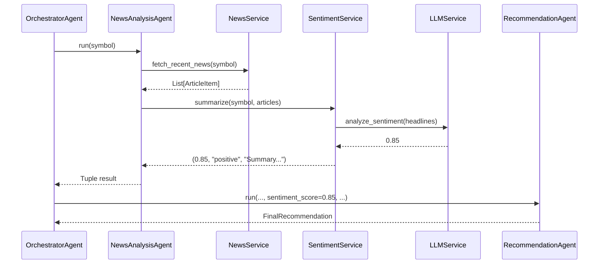
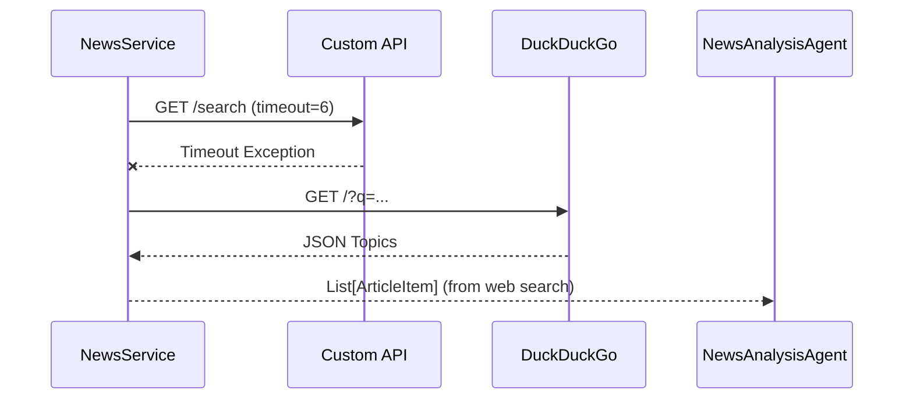

# 19 Sequence Diagrams

## Normal Flow

```mermaid
sequenceDiagram
    participant O as OrchestratorAgent
    participant NA as NewsAnalysisAgent
    participant NS as NewsService
    participant SS as SentimentService
    participant LLM as LLMService
    participant RA as RecommendationAgent

    O->>NA: run(symbol)
    NA->>NS: fetch_recent_news(symbol)
    NS-->>NA: List[ArticleItem]
    NA->>SS: summarize(symbol, articles)
    SS->>LLM: analyze_sentiment(headlines)
    LLM-->>SS: 0.85
    SS-->>NA: (0.85, "positive", "Summary...")
    NA-->>O: Tuple result
    O->>RA: run(..., sentiment_score=0.85, ...)
    RA-->>O: FinalRecommendation
```

## API Failure / Fallback

```mermaid
sequenceDiagram
    participant NS as NewsService
    participant API as Custom API
    participant DDG as DuckDuckGo

    NS->>API: GET /search (timeout=6)
    API--xNS: Timeout Exception
    NS->>DDG: GET /?q=...
    DDG-->>NS: JSON Topics
    NS-->>NewsAnalysisAgent: List[ArticleItem] (from web search)
```