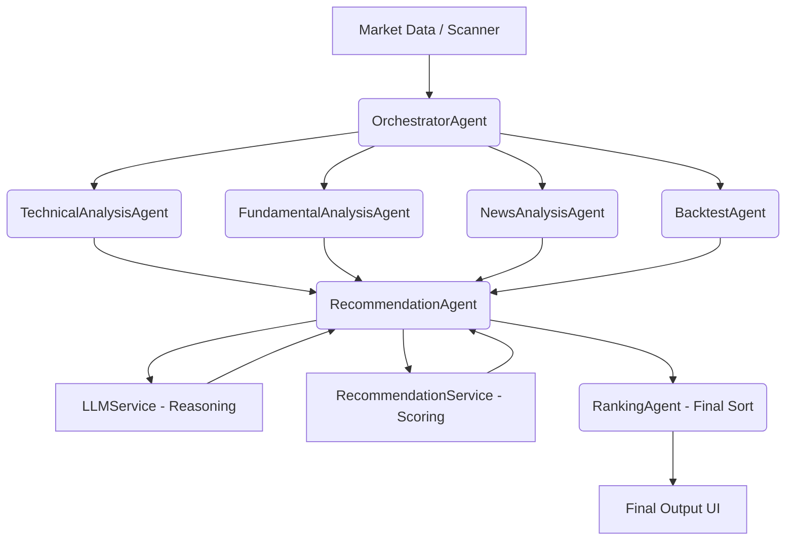
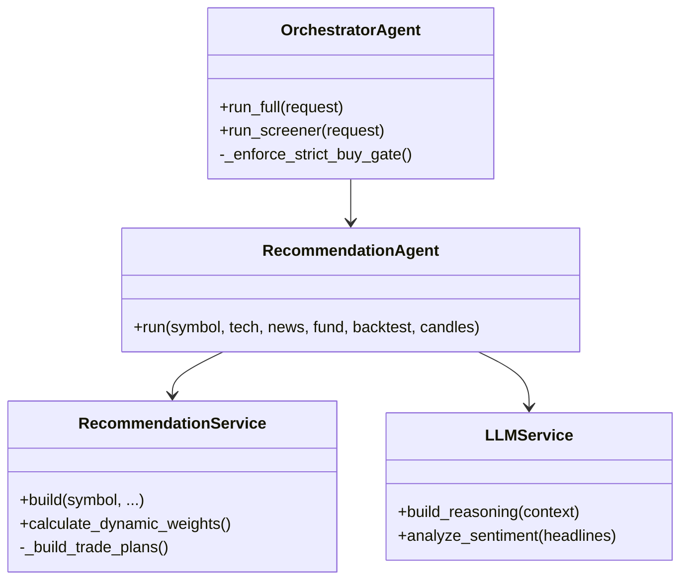

# Recommendation Engine: Architecture

## High-Level Overview

The Recommendation Engine is not a single monolith, but a loosely coupled, agent-driven orchestration architecture. It relies heavily on a map-reduce pattern where an `OrchestratorAgent` coordinates multiple independent analysis agents, and the `RecommendationAgent` acts as the final decision synthesizer.

## Core Components

### 1. Agents
- **`OrchestratorAgent`**: The entry point. Coordinates bulk pre-fetching of OHLCV data, delegates tasks concurrently to specific agents, and enforces strict gating rules (e.g., `_enforce_strict_buy_gate`).
- **`TechnicalAnalysisAgent`**: Executes vectorized technical analysis (EMA, SMA, MACD, RSI, VWAP) via `TechnicalAnalysisService` across single or multiple timeframes.
- **`FundamentalAnalysisAgent`**: Connects to `yfinance` to fetch revenue growth, profit margins, D/E, and P/E ratios, returning a normalized score from -1.0 to 1.0.
- **`NewsAnalysisAgent`**: Fetches recent headlines and uses the `LLMService` to score sentiment from -1.0 to 1.0.
- **`BacktestAgent`**: Runs historical simulations via `BacktestService` to see how the active technical setup performed in the past.
- **`RecommendationAgent`**: Coordinates `LLMService` (for AI reasoning generation) and `RecommendationService` (for numerical scoring and final classification).
- **`RankingAgent`**: Sorts candidates across the entire scanned universe based on their final `RecommendationScore`.

### 2. Services
- **`RecommendationService`**: Holds the core mathematical weighting logic (`calculate_dynamic_weights`), trade plan generation (`_build_trade_plans`), and assigns the final "BUY", "WATCH", or "REJECT" label based on calculated `score`.
- **`LLMService`**: Uses Groq (or fallback logic) to generate human-readable advisory bullets, risk factors, and invalidation signals.
- **`ScreenerService`**: Initial funnel that passes only eligible symbols into the recommendation pipeline.
- **`FyersService` / `MarketDataFeed`**: Providers of live and historical OHLCV data.

### 3. Repositories / Data Access
- **`candle_store.py` (SQLite `candle_cache.db`)**: Local cache for historical OHLCV candles to prevent repeated slow API calls.
- **`SessionLocal` (PostgreSQL)**: Persists final `AnalysisHistory`, `BacktestHistory`, and `WatchedStock` models.

### 4. Schedulers & Background Tasks
- The `MarketEngineService` runs a continuous background event loop (`_run_loop`) during market hours to poll and sync live tick data, keeping recommendations based on fresh data.

## Mermaid: Detailed Component Architecture

