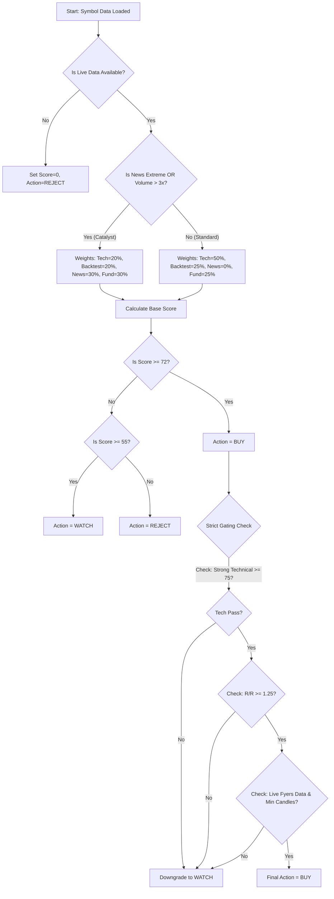

# Recommendation Engine: Decision Tree

This outlines the precise logical branching the Orchestrator and Recommendation engines use to arrive at a final state.

## Branch Explanations

1. **Data Availability:** If live OHLCV data is missing, analysis is completely aborted to prevent stale recommendations.
2. **Regime Detection:** Instantly determines if the market is trading normally or reacting to a sudden catalyst, setting weights accordingly.
3. **Thresholding:** Simple numerical thresholding translates continuous mathematical scores into discrete categorical labels (BUY, WATCH, REJECT).
4. **Strict Gating:** Even if the mathematical score is extremely high (e.g., 85), the Orchestrator applies safety vetoes. If the Technical score alone isn't strong enough, or the Risk/Reward ratio on the Trade Plan is poor, or the data source was "mocked" instead of live, it will refuse to authorize a BUY and downgrades to a WATCH.
