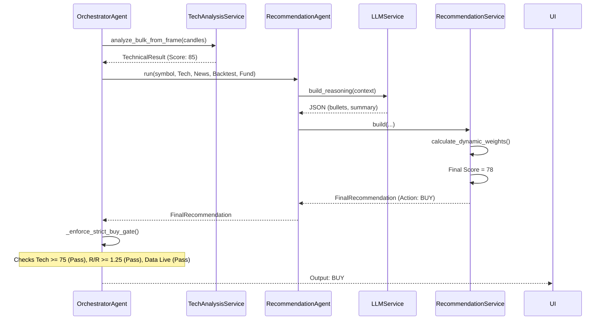
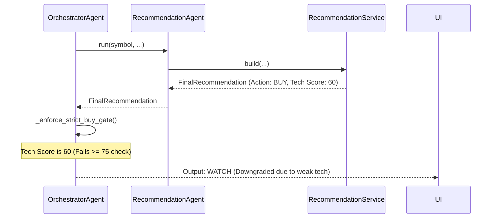
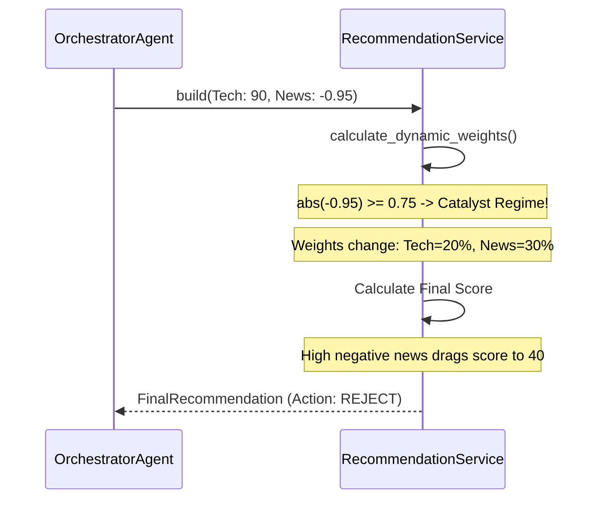
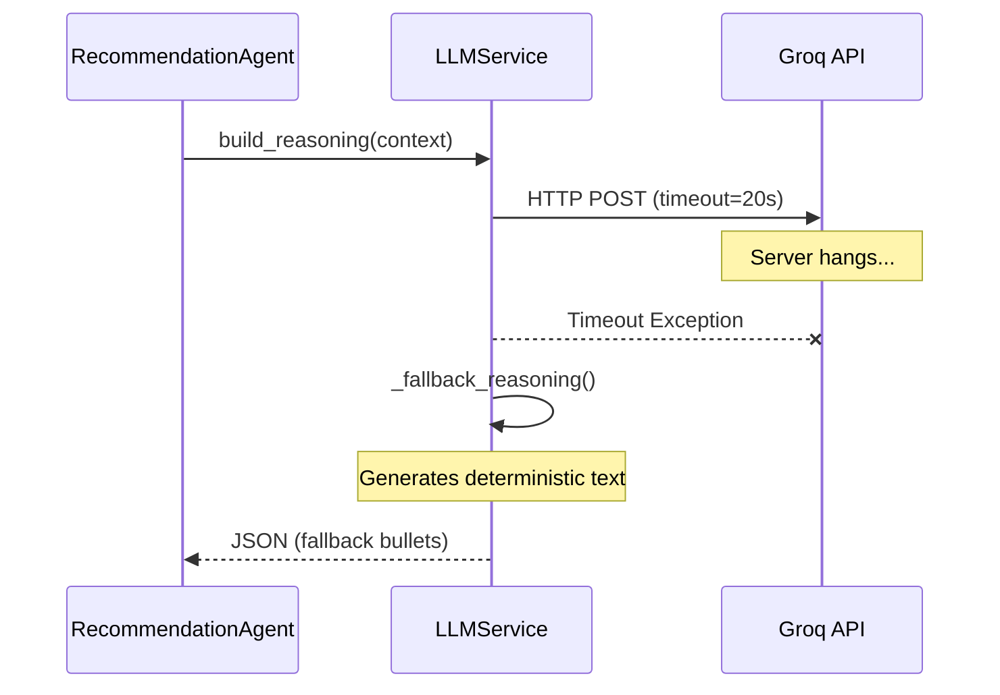

# Recommendation Engine: Sequence Diagrams

## 1. BUY Recommendation Flow

## 2. WATCH (Downgraded) Recommendation Flow

## 3. Conflict Resolution (Catalyst Overrides Tech)

## 4. AI Timeout (Graceful Degradation)

