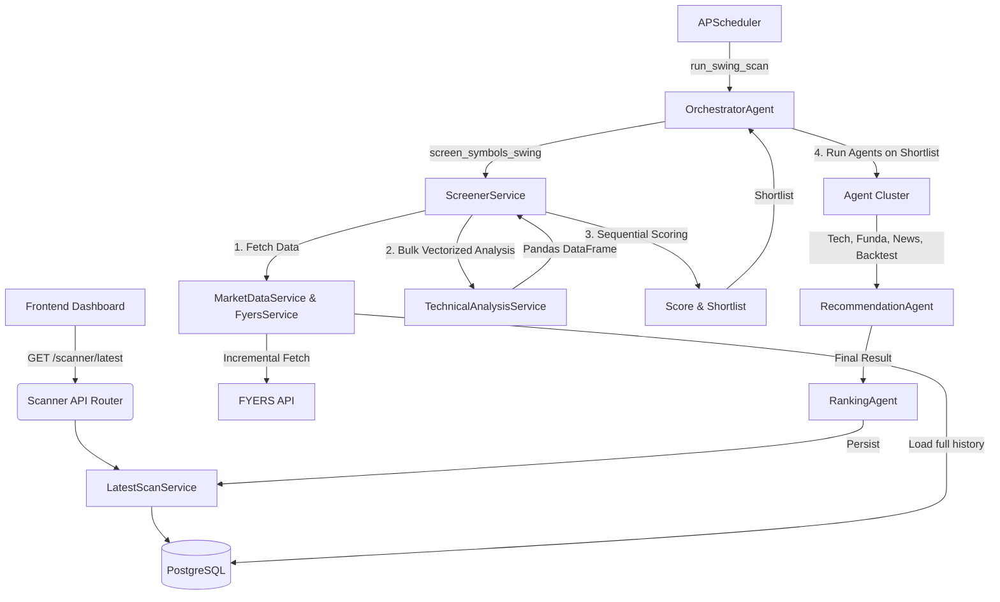

# Scanner Architecture

## Overview
The Scanner Engine is a multi-stage pipeline residing entirely in the backend (`backend/app`). It is designed to evaluate a large universe of stocks efficiently, applying mathematical indicators in bulk, scoring them, and shortlisting the best setups. The shortlisted setups are then passed to a cluster of AI agents for deep fundamental, technical, and news-based analysis.

## Core Components

1. **API / Scheduler Layer**
   - **`backend/app/routes/scanner.py`**: Exposes the `/scanner/latest` REST endpoint for the frontend dashboard to fetch the most recent scan results.
   - **`backend/app/main.py`**: The APScheduler instance manages background jobs like automated screening and pre-market deep scans (though currently disabled/manual).

2. **Orchestrator Layer**
   - **`OrchestratorAgent` (`backend/app/agents/orchestrator_agent.py`)**: The central brain. It coordinates the overall flow. It sequentially attempts to scan predefined universes (NIFTY500, NIFTY100, FNO). It hands off the bulk scanning to the `ScreenerService` and then pipes the shortlisted candidates into the sub-agents (`TechnicalAnalysisAgent`, `NewsAnalysisAgent`, `FundamentalAnalysisAgent`, `BacktestAgent`, `RecommendationAgent`).

3. **Screener Layer**
   - **`ScreenerService` (`backend/app/services/screener_service.py`)**: The workhorse. 
     - Coordinates fetching data for all symbols.
     - Calls `TechnicalAnalysisService.analyze_bulk_from_frame`.
     - Sequentially evaluates the mathematical score (`_weighted_score`) for each symbol using the tail of the candles.
     - Determines `matched` and `shortlisted` symbols based on broad trend eligibility and scores.

4. **Technical Analysis Engine**
   - **`TechnicalAnalysisService` (`backend/app/services/technical_analysis_service.py`)**: Responsible for all indicator mathematics.
     - Uses `pandas` and `ta` libraries to compute EMA, SMA, MACD, RSI, VWAP, Supertrend, Support/Resistance in a vectorized manner across the entire universe simultaneously (`analyze_bulk_from_frame`).

5. **Data Layer**
   - **`FyersService` (`backend/app/services/fyers_service.py`)**: Handles live connections to the FYERS API for incremental OHLCV data fetching. Includes fallback to Yahoo Finance (`yfinance`) when needed.
   - **`MarketDataService`**: Manages the local PostgreSQL database cache for candles to prevent repetitive network requests and rate limit issues.
   - **`LatestScanService` (`backend/app/services/latest_scan_service.py`)**: Persists the final output of the scanner to the database (`scan_snapshots` and `scan_snapshot_records` tables).

6. **Agent Cluster**
   - **`TechnicalAnalysisAgent`**: Evaluates chart structure.
   - **`FundamentalAnalysisAgent`**: Evaluates financials.
   - **`NewsAnalysisAgent`**: Fetches recent news and determines sentiment.
   - **`BacktestAgent`**: Runs the strategy over historical data to generate a backtest score.
   - **`RecommendationAgent`**: Consolidates all agent outputs to generate a final `BUY`, `WATCH`, or `REJECT` signal.
   - **`RankingAgent`**: Ranks the final candidates.

## Dependencies
- **PostgreSQL**: Stores historical OHLCV data (`daily_candles`, `intraday_candles`) and scan snapshots (`scan_snapshots`, `scan_snapshot_records`).
- **Redis (Optional/Implied)**: Used for ephemeral caching and locks, though the main scanner utilizes DB caching heavily.
- **FYERS API**: The primary market data provider for live and historical data.
- **yfinance**: Fallback data provider.
- **APScheduler**: Executes background cron jobs.

## Architecture Diagram

