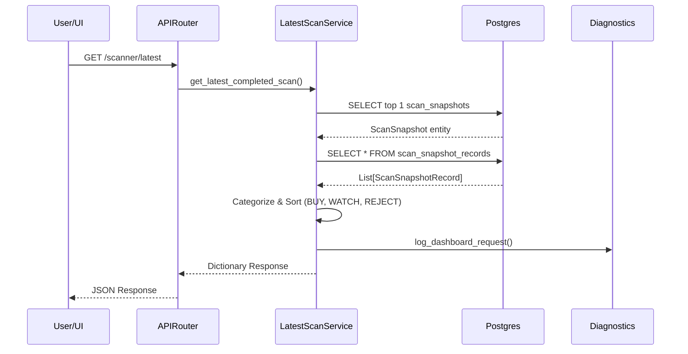

# Request Lifecycle

## HTTP Request: Dashboard Retrieval

When a user visits the dashboard, the frontend requests the latest scan data. The Scanner Engine itself generally runs asynchronously in the background via the scheduler, so the HTTP request simply fetches the persisted snapshot.

### 1. HTTP Request
**Endpoint**: `GET /scanner/latest`
**Router**: `backend/app/routes/scanner.py`
The FastAPI router receives the request. The request enters the middleware (`log_http_requests` in `main.py`) where start time is recorded.

### 2. Service Layer
**Service**: `LatestScanService`
The route handler instantiates `LatestScanService(db)` and calls `get_latest_completed_scan()`.

### 3. Database Layer
**Query**:
1. Selects the most recent snapshot: 
   ```sql
   SELECT * FROM scan_snapshots ORDER BY scan_timestamp DESC LIMIT 1;
   ```
2. If a snapshot is found, it fetches the associated records:
   ```sql
   SELECT * FROM scan_snapshot_records WHERE scan_id = :scan_id;
   ```

### 4. Data Processing
The service maps the database records (`ScanSnapshotRecord`) into three categorized lists based on the `recommendation` column:
- `buy_candidates`
- `watch_candidates`
- `rejected_candidates`

Each list is then sorted in descending order by `score`.

### 5. Observability & Telemetry
The endpoint logs a dashboard snapshot request to the `diagnostics` service, recording the `response_time_ms`, `snapshot_id`, and `record_count`.

### 6. Response
The constructed JSON dictionary is returned to the frontend.
```json
{
  "scan_timestamp": "2023-10-27T10:00:00Z",
  "buy_candidates": [...],
  "watch_candidates": [...],
  "rejected_candidates": [...]
}
```

## Sequence Diagram: Dashboard Request


