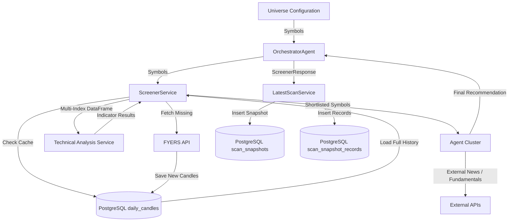

# Data Flow

The Scanner Engine's data flow is a complex pipeline that merges live API data, local database caching, in-memory vectorized transformations, and final persistence.

## 1. Trigger & Universe Selection
- **Source**: Static configuration (e.g., NIFTY500).
- **Consumer**: `OrchestratorAgent`.
- **Flow**: Passes a list of raw string symbols (e.g., `["RELIANCE", "TCS"]`) down to the `ScreenerService`.

## 2. Candle Fetch & DB Caching (The I/O Phase)
- **Component**: `MarketDataService` & `FyersService`.
- **Cache Check**: The system queries the `daily_candles` PostgreSQL table.
- **API Fetch**: If history is insufficient or a gap exists, it requests incremental data from FYERS API.
- **Persistence**: Newly fetched data is written to the `daily_candles` table.
- **Output**: A raw Pandas DataFrame for each symbol.

## 3. Data Cleaning & Normalization (The Frame Builder Phase)
- **Component**: `ScreenerService`.
- **Transformation**: 
  - Iterates over individual symbol DataFrames.
  - Forward-fills (`ffill`) missing dates (e.g., trading holidays or missing ticks).
  - Merges them into a single, multi-indexed Pandas DataFrame (`[timestamp, symbol]`).
- **Memory Shift**: Original single dataframes are discarded to free memory.

## 4. Bulk Vectorization (The CPU Phase)
- **Component**: `TechnicalAnalysisService`.
- **Input**: Multi-indexed DataFrame (containing Open, High, Low, Close, Volume).
- **Transformation**:
  - Uses Pandas `groupby(level="symbol")`.
  - Computes `transform` for EMAs, SMAs, MACD, RSI, and Supertrend.
- **Output**: Dictionary mapping `symbol` to `TechnicalAnalysisResult`. 
- **Memory Shift**: The large multi-indexed dataframe is discarded.

## 5. Scoring & Shortlisting
- **Component**: `ScreenerService`.
- **Input**: Computed indicators + trailing 30 candles of raw OHLCV.
- **Transformation**: Loops sequentially through symbols, computes `_weighted_score`.
- **Output**: Shortlist of top N matching `ScreenerConditionResult` objects.

## 6. Deep Agent Analysis
- **Component**: Agent Cluster (`NewsAnalysisAgent`, `FundamentalAnalysisAgent`, etc.).
- **Input**: Shortlisted symbols.
- **Transformation**: Connects to external APIs (News APIs) and historical endpoints to run Backtests. Consolidates into `RecommendationAgent`.
- **Output**: Final `ScreenerResponse`.

## 7. Final Persistence
- **Component**: `LatestScanService`.
- **Input**: `ScreenerResponse`.
- **Transformation**: 
  - Extracts metrics (total scanned, buy count, watch count, duration).
  - Maps candidates to `ScanSnapshotRecord`.
- **Destination**: Inserts into `scan_snapshots` and `scan_snapshot_records` tables in PostgreSQL.

## Data Flow Diagram

