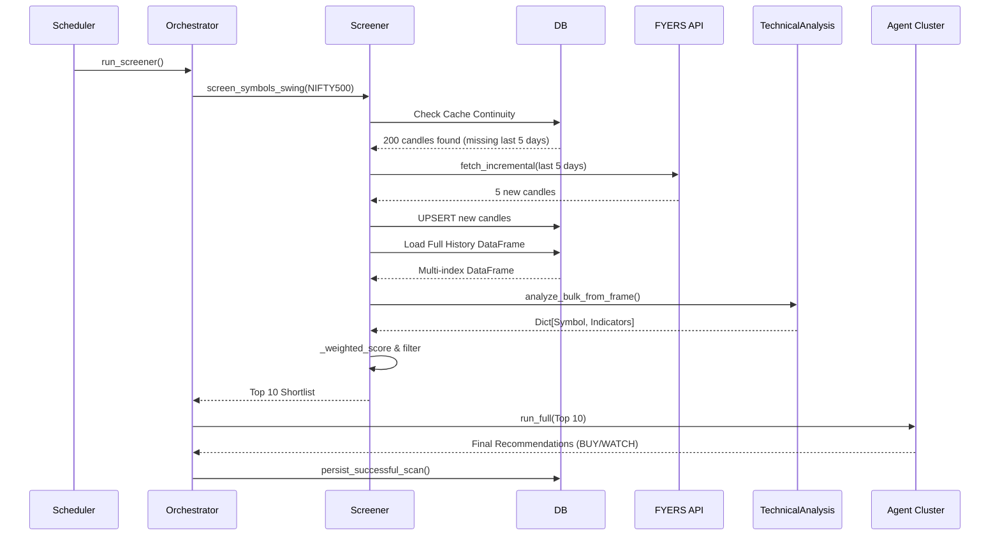
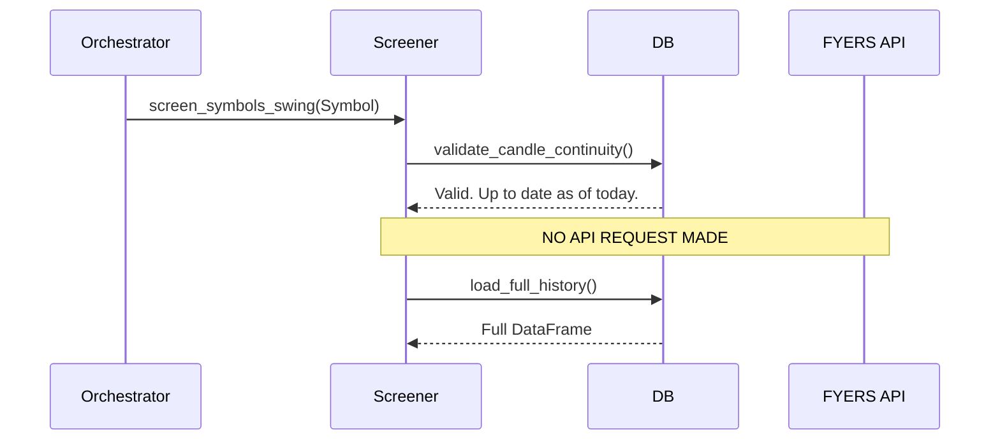
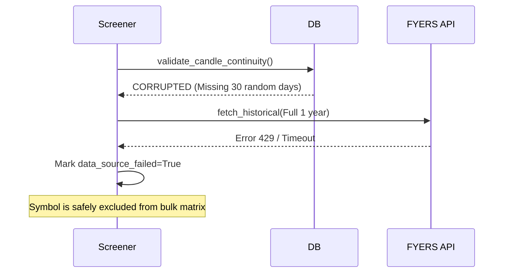

# Sequence Diagrams

## 1. Normal Execution (Happy Path)

```mermaid
sequenceDiagram
    participant Scheduler
    participant Orchestrator
    participant Screener
    participant DB
    participant API as FYERS API
    participant Tech as TechnicalAnalysis
    participant Agents as Agent Cluster

    Scheduler->>Orchestrator: run_screener()
    Orchestrator->>Screener: screen_symbols_swing(NIFTY500)
    
    Screener->>DB: Check Cache Continuity
    DB-->>Screener: 200 candles found (missing last 5 days)
    
    Screener->>API: fetch_incremental(last 5 days)
    API-->>Screener: 5 new candles
    Screener->>DB: UPSERT new candles
    
    Screener->>DB: Load Full History DataFrame
    DB-->>Screener: Multi-index DataFrame
    
    Screener->>Tech: analyze_bulk_from_frame()
    Tech-->>Screener: Dict[Symbol, Indicators]
    
    Screener->>Screener: _weighted_score & filter
    Screener-->>Orchestrator: Top 10 Shortlist
    
    Orchestrator->>Agents: run_full(Top 10)
    Agents-->>Orchestrator: Final Recommendations (BUY/WATCH)
    
    Orchestrator->>DB: persist_successful_scan()
```

## 2. Full Cache Hit

```mermaid
sequenceDiagram
    participant Orchestrator
    participant Screener
    participant DB
    participant API as FYERS API

    Orchestrator->>Screener: screen_symbols_swing(Symbol)
    Screener->>DB: validate_candle_continuity()
    DB-->>Screener: Valid. Up to date as of today.
    
    Note over Screener,API: NO API REQUEST MADE
    
    Screener->>DB: load_full_history()
    DB-->>Screener: Full DataFrame
```

## 3. API Failure / Corrupted Cache

```mermaid
sequenceDiagram
    participant Screener
    participant DB
    participant API as FYERS API

    Screener->>DB: validate_candle_continuity()
    DB-->>Screener: CORRUPTED (Missing 30 random days)
    
    Screener->>API: fetch_historical(Full 1 year)
    API-->>Screener: Error 429 / Timeout
    
    Screener->>Screener: Mark data_source_failed=True
    Note over Screener: Symbol is safely excluded from bulk matrix
```
