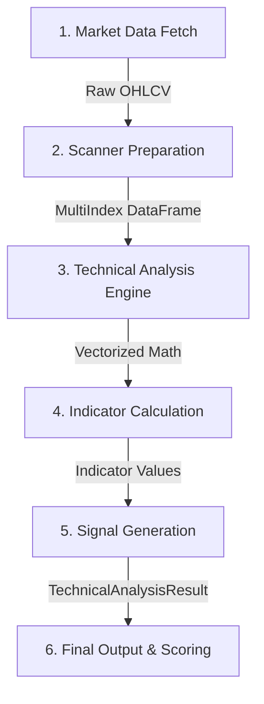

# Technical Analysis Engine: Execution Flow

The execution flow of the Technical Analysis Engine is a pipeline that transforms raw market data into actionable trading signals. It is primarily orchestrated by the `ScreenerService`.

## Complete Execution Pipeline

---

### Step 1: Market Data Fetch
* **Purpose:** Acquire the historical OHLCV (Open, High, Low, Close, Volume) data required for indicator calculation.
* **Input:** A list of symbols (e.g., `["NSE:HDFCBANK-EQ", ...]`) and a timeframe (e.g., `1D` for swing).
* **Output:** A collection of historical candles.
* **Dependencies:** `MarketDataService`, `FyersService`, Local SQLite Cache (`candle_cache.db`).
* **Process:** The system checks the local cache. If data is missing or incomplete (requires minimum 240 candles for SMA 200), it backfills incrementally from the Fyers API.

### Step 2: Scanner Preparation
* **Purpose:** Clean, normalize, and structure the raw data for high-performance vectorized processing.
* **Input:** Raw OHLCV collections per symbol.
* **Output:** A single, MultiIndex Pandas DataFrame (indexed by `[timestamp, symbol]`).
* **Dependencies:** Pandas, `ScreenerService`.
* **Process:** The `ScreenerService` aligns all symbols to a standard business-day calendar, forward-fills (`ffill()`) any missing data (gaps), and constructs a unified DataFrame to prevent massive memory allocations associated with Python objects.

### Step 3: Technical Analysis Engine
* **Purpose:** Serve as the entry point for bulk mathematical processing.
* **Input:** MultiIndex DataFrame, `AnalysisMode` (e.g., `swing` or `intraday`).
* **Output:** Routing to specific calculation blocks based on the `AnalysisMode`.
* **Dependencies:** `TechnicalAnalysisService.analyze_bulk_from_frame`.

### Step 4: Indicator Calculation
* **Purpose:** Compute all required trend, momentum, and volume indicators simultaneously for all symbols.
* **Input:** Grouped Pandas DataFrame (`grouped = frame.groupby(level="symbol")`).
* **Output:** Calculated indicator series (EMA, SMA, MACD, RSI, Supertrend, VWAP, Support/Resistance).
* **Dependencies:** Pandas (`ewm`, `rolling`), internal custom math functions (`_calculate_supertrend`).
* **Process:** The engine applies vector transformations (e.g., `grouped["close"].transform(lambda x: x.ewm(span=20).mean())`). This is the most CPU-intensive step.

### Step 5: Signal Generation
* **Purpose:** Evaluate the calculated indicators against strict trading logic to produce a confidence score and a discrete signal.
* **Input:** The final calculated values of all indicators for the most recent candles (the "tail").
* **Output:** A technical score (0.0 to 100.0) and a signal (`bullish`, `neutral`, `bearish`).
* **Dependencies:** Hardcoded logical filters within `TechnicalAnalysisService` (e.g., `core_trend_filter_pass`, `core_momentum_filter_pass`).
* **Process:** The engine iterates over the tail of the DataFrame for each symbol. It checks conditions like "Is Close > EMA 20?" and assigns weighted points. If hard filters fail, the signal defaults to `bearish` or `neutral`.

### Step 6: Final Output & Scoring
* **Purpose:** Combine the pure technical signal with broad market context to finalize the scan.
* **Input:** `TechnicalAnalysisResult` (from step 5).
* **Output:** `ScreenerConditionResult` containing the final `screener_score` and `matched` boolean.
* **Dependencies:** `ScreenerService._weighted_score`.
* **Process:** The `ScreenerService` takes the Technical Engine's output, applies broad trend eligibility (e.g., price > SMA 50 > SMA 200, average volume > 100k), and generates the final output for the user or downstream trading bots.
