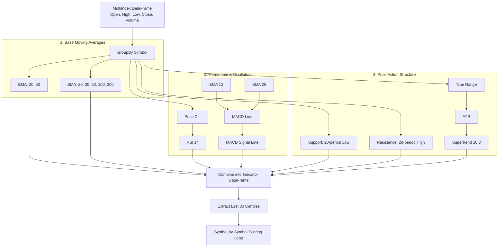

# Technical Analysis Engine: Indicator Pipeline

The Indicator Pipeline is a highly optimized, vectorized sequence of mathematical operations executed within `TechnicalAnalysisService.analyze_bulk_from_frame()`. 

To maximize performance, the pipeline relies on Pandas DataFrame `groupby` and `transform` functions, allowing calculations to occur across hundreds of symbols simultaneously without expensive Python loops.

## Pipeline Execution Order

The execution is strictly ordered because some indicators depend on the intermediate calculations of others (e.g., RSI depends on price differences, Supertrend depends on True Range).



## Step-by-Step Calculation Details

### 1. Grouping
```python
grouped = frame.groupby(level="symbol")
```
This isolates the timeseries data so that the moving average of one symbol does not bleed into the moving average of another.

### 2. Moving Averages (Trend)
Calculated directly via Pandas vectorized functions:
* **EMA:** Uses `ewm(span=X, adjust=False).mean()`. The `adjust=False` parameter ensures it exactly matches standard charting platforms like TradingView.
* **SMA:** Uses `rolling(window=X).mean()`.

### 3. MACD (Momentum)
* **Intermediate 1 (EMA 12):** `x.ewm(span=12).mean()`
* **Intermediate 2 (EMA 26):** `x.ewm(span=26).mean()`
* **MACD Line:** `EMA 12 - EMA 26`
* **Signal Line:** `MACD Line.ewm(span=9).mean()`

### 4. RSI (Momentum)
Requires custom intermediate math to calculate average gain and loss:
* **Intermediate 1 (Delta):** `x.diff()` (Price change from previous candle).
* **Intermediate 2 (Gain):** Isolate positive deltas, apply `ewm(alpha=1/14)`.
* **Intermediate 3 (Loss):** Isolate negative deltas, apply `ewm(alpha=1/14)`.
* **Intermediate 4 (RS):** `Gain / Loss`.
* **Final RSI:** `100.0 - (100.0 / (1.0 + RS))`.

### 5. Support & Resistance (Structure)
Calculated using rolling minimums and maximums over a 20-period window:
* **Support:** `grouped["low"].transform(lambda x: x.rolling(window=20).min())`
* **Resistance:** `grouped["high"].transform(lambda x: x.rolling(window=20).max())`

### 6. Supertrend (Structure/Volatility)
This is the only indicator that cannot be easily calculated with a single lambda transform due to its recursive path-dependent logic (it resets based on the previous candle's state).
* It utilizes a custom function `_calculate_supertrend`.
* **Intermediate 1 (True Range):** Max of (High-Low), abs(High-PrevClose), abs(Low-PrevClose).
* **Intermediate 2 (ATR):** `ewm` mean of True Range.
* **Intermediate 3 (Upper/Lower Bands):** `(High+Low)/2 +/- (Multiplier * ATR)`.
* **Final:** Iterates through the bands to flip the direction only when price closes across the active band.

## Final Output Generation
All Series are concatenated into a temporary `df_indicators` DataFrame. To save memory and processing time during the scoring phase, the pipeline groups this frame by symbol and extracts only the `.last()` row (and `.nth(-20)` for SMA trend detection). 

This tail data is then passed to the individual symbol scoring loop, leaving the heavy matrix math behind.
