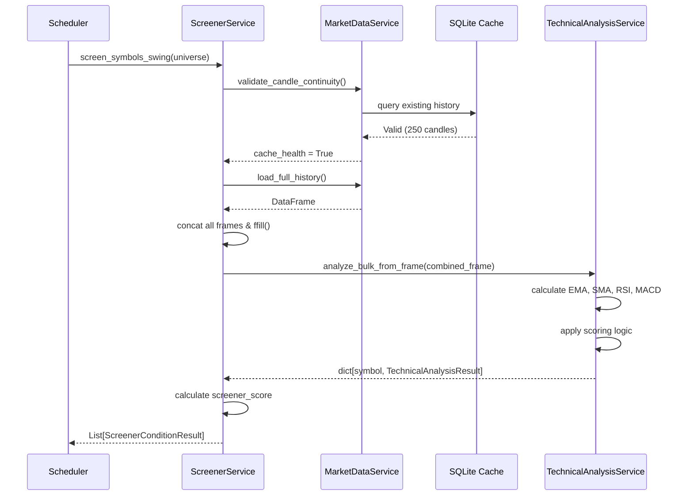
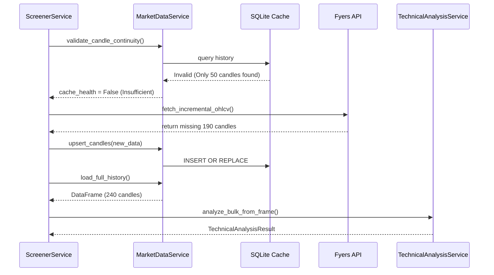
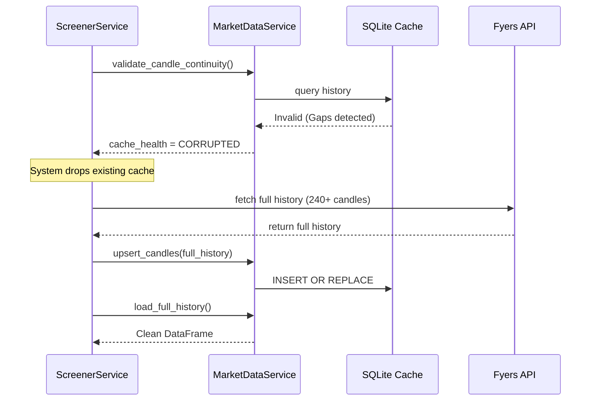
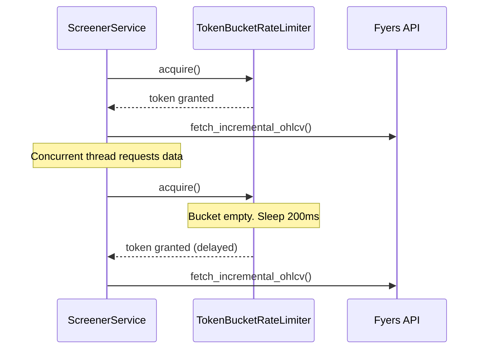
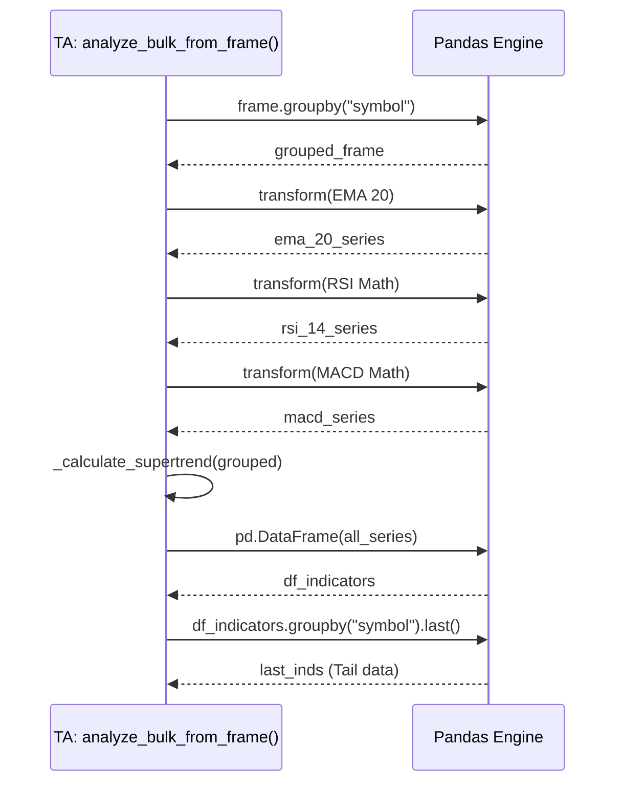
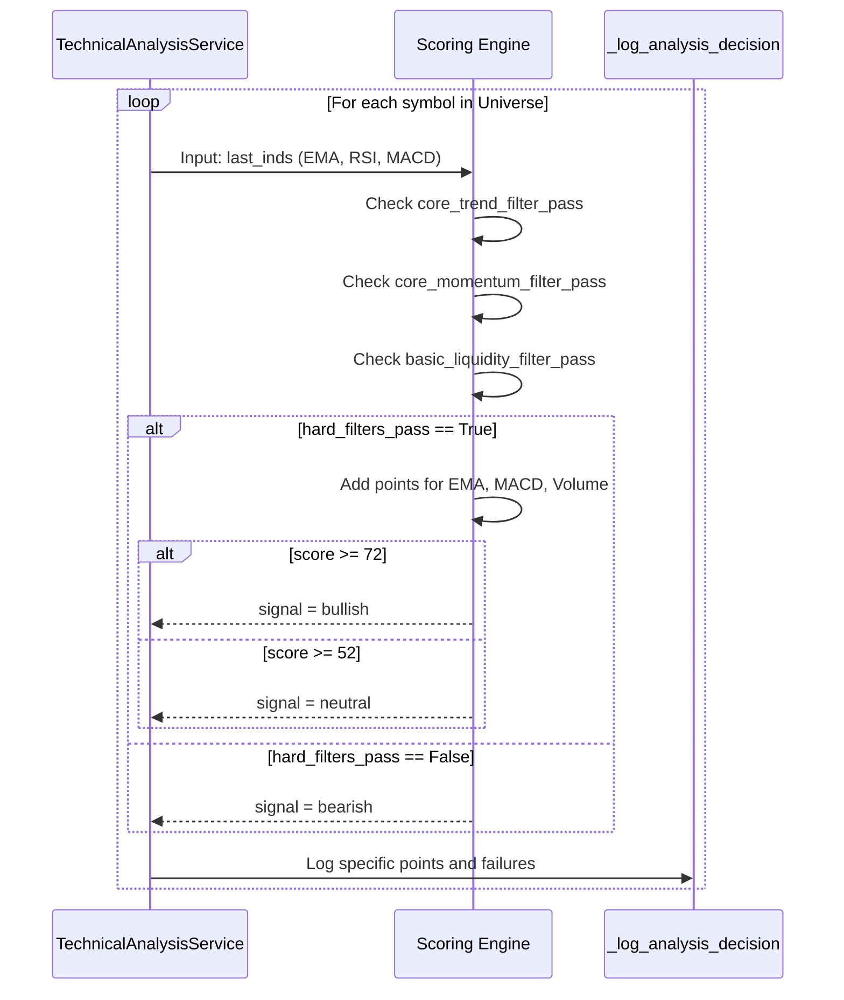

# Technical Analysis: Sequence Diagrams

These sequence diagrams detail the exact interactions between services during various execution scenarios.

## 1. Normal Calculation (Happy Path)

## 2. Cache Miss / Missing Data

## 3. Corrupted Cache / Forced Rebuild

## 4. API Delay / Rate Limit

## 5. Indicator Calculation Pipeline

## 6. Signal Generation

