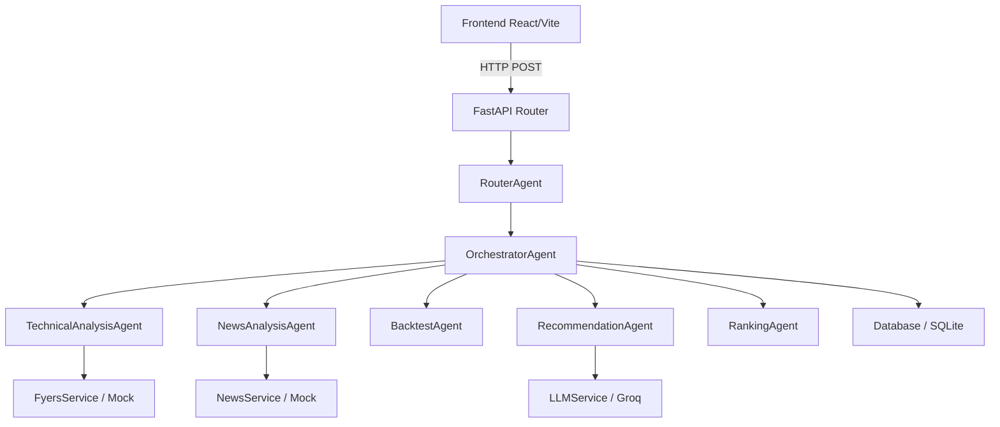
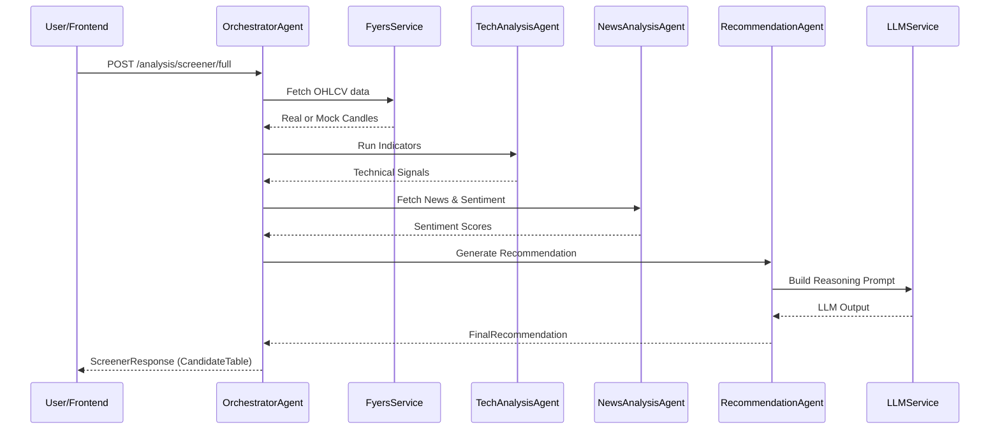

# Project Overview

## What Problem This Application Solves
The Stock Analysis And Recommendation System provides manual traders with a comprehensive, advisory-only platform to analyze stocks, backtest strategies, and simulate trades. It automates the heavy lifting of technical and news-based analysis and provides LLM-driven reasoning for buy, watch, or reject recommendations. It solves the problem of information overload by synthesizing market data into clear, ranked candidate lists.

## Explanations by Level

### Beginner Explanation
Imagine you want to buy stocks but don't know which ones are good right now. This app looks at real-time market data, reads the latest financial news, and acts like a smart assistant. It gives you a shortlist of the best stocks to buy and lets you practice trading them with fake money before risking real cash.

### Intermediate Explanation
The system is a full-stack application that connects to real-world market APIs (like FYERS) to pull OHLCV (Open, High, Low, Close, Volume) data. It runs a configurable screener over a universe of stocks (like the Nifty 500) to find promising candidates based on technical indicators. An AI model then summarizes the technical and news data to output a final recommendation. You can view these recommendations in a React frontend and use the built-in paper trading engine to test your ideas.

### Senior Engineer Explanation
This is a FastAPI-driven backend with a React/Vite frontend. The architecture is modular, utilizing an orchestrator-agent pattern where an `OrchestratorAgent` coordinates specialized agents (`TechnicalAnalysisAgent`, `NewsAnalysisAgent`, `RecommendationAgent`, etc.). The backend is primarily synchronous, with external data fetching (FYERS for market data, Marketaux for news, Groq for LLMs) wrapped in services with deterministic mock fallbacks for resilience. State is managed via SQLAlchemy ORM persisted to SQLite (default), including schemas for paper trading accounts, orders, and positions.

## End-to-End User Journey
1. **Screening**: The user logs into the frontend and runs a preset screener (e.g., Nifty 500 Swing).
2. **Analysis**: The system fetches market data, applies broad trend eligibility, computes screener scores, and shortlists the top 20-50 stocks.
3. **Review**: The user views the `CandidateTable` and clicks on a stock to open the `StockDetailPanel`.
4. **Recommendation**: The user reads the LLM-generated reasoning (BUY/WATCH/REJECT) based on technicals and news.
5. **Action (Paper Trading)**: The user clicks "Send to Paper Trading" to pre-fill a ticket and executes a simulated trade to track performance.

## Real Examples
- **Scenario A**: The user runs the screener. The system checks FYERS for real OHLCV data. If FYERS is down, it seamlessly falls back to mock candles, ensuring the user can still interact with the UI.
- **Scenario B**: A stock shows a strong MACD crossover. The `RecommendationAgent` queries the LLM with this technical data plus recent positive news sentiment. The LLM outputs a "BUY" recommendation with explicit reasoning.

## Main Modules
- **API / HTTP**: FastAPI routes (`analysis`, `stocks`, `paper-trading`, `health`).
- **Agents**: Orchestration logic (`OrchestratorAgent`, `RouterAgent`, `TechnicalAnalysisAgent`, `NewsAnalysisAgent`, `BacktestAgent`, `RecommendationAgent`, `RankingAgent`).
- **Services**: Domain logic (`TechnicalAnalysisService`, `BacktestService`, `FyersService`, `NewsService`, `LLMService`, `PaperTradingService`).
- **Models & Schemas**: SQLAlchemy DB models and Pydantic validation schemas.
- **Frontend**: Vite + React dashboard with components like `CandidateTable` and `StockDetailPanel`.

## Workflows

### Business Workflows
The core business workflow is generating actionable stock recommendations safely (advisory-only). The system limits liability by strictly maintaining paper trading environments and separating analysis from live execution.

### Trading Workflows (Paper Trading)
1. User requests account details via `/paper-trading/account`.
2. User submits a paper order via `/paper-trading/orders`.
3. `PaperTradingService` validates the order against available balance and current market price.
4. Position is opened and stored in the database.
5. User manages or closes the position via `/paper-trading/positions/{position_id}/close`.

### Recommendation Workflows
1. `OrchestratorAgent` gathers technical indicators and news sentiment.
2. `RecommendationAgent` formats a prompt for the `LLMService`.
3. The LLM evaluates the aggregated signals.
4. `RecommendationService` formats the LLM output into a `FinalRecommendation` (Score, Signal, Reasoning).

## Component Map

## Data Flow Overview

## Deployment Overview
Currently configured for local development and testing.
- **Backend**: `uvicorn backend.app.main:app --reload`
- **Frontend**: `npm run dev`
- **Database**: Local SQLite file (`Settings.database_url`).
- **Dependencies**: Python 3.x with `requirements.txt`, Node.js with `package.json`.

## Technical Stack
- **Backend**: Python, FastAPI, SQLAlchemy, Pydantic
- **Frontend**: React, Vite, TypeScript
- **Database**: SQLite
- **External Integrations**: FYERS (Market Data), Marketaux (News), Groq (LLM)

## Failure Scenarios
1. **Missing FYERS Credentials**: The system logs a warning and falls back to generating mock OHLCV candles.
2. **LLM API Timeout / Missing Key**: The `LLMService` utilizes a deterministic fallback generator to ensure the recommendation pipeline doesn't break.
3. **Database Lock**: Since SQLite is used by default, concurrent writes might fail or timeout. A single orchestrator flow is recommended for local use.

## Troubleshooting Guide
- **Frontend fails to connect**: Ensure the backend is running on `127.0.0.1:8000` and check CORS settings in FastAPI.
- **All stocks show mock data**: Verify `.env` file has valid `FYERS_APP_ID` and `FYERS_ACCESS_TOKEN`. Check `logs/trading_system.log` for explicit fallback messages.
- **Paper trading balance empty**: Hit the `/paper-trading/account/reset` endpoint to initialize the default balance.
- **ModuleNotFoundError on Backend**: Ensure you have activated your virtual environment and installed dependencies with `pip install -r backend/requirements.txt`.

## FAQ
**Q: Does this system execute real trades?**
A: No, the system is strictly advisory-only and features a paper trading module for simulated execution.

**Q: Can I use a different database?**
A: Yes, SQLAlchemy is used. You can change `DATABASE_URL` in the `.env` file to point to PostgreSQL or MySQL.

**Q: Why are requests slow?**
A: Services are implemented synchronously. If external APIs (FYERS, LLM) are slow, the FastAPI worker block until a response is received.

## Glossary
- **OHLCV**: Open, High, Low, Close, Volume. Standard market candle data.
- **FYERS**: The brokerage API used for fetching real-time market data.
- **Marketaux**: The external provider used for financial news fetching.
- **Paper Trading**: Simulated trading using fake money to practice strategies.
- **Screener**: A process that filters a large universe of stocks down to a smaller list based on specific criteria.
- **Groq**: Fast LLM inference provider used for generating stock recommendations.
