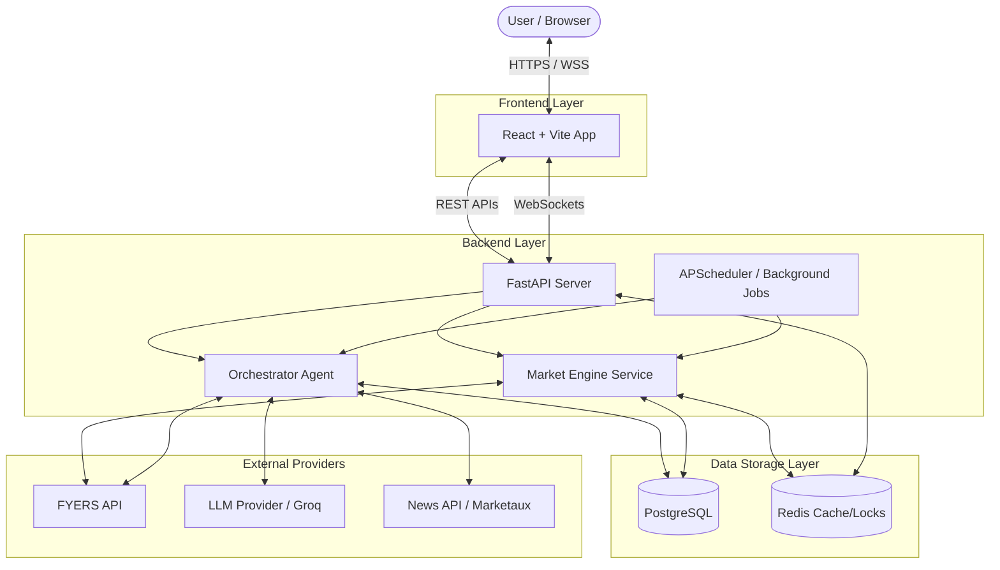
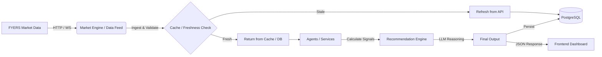
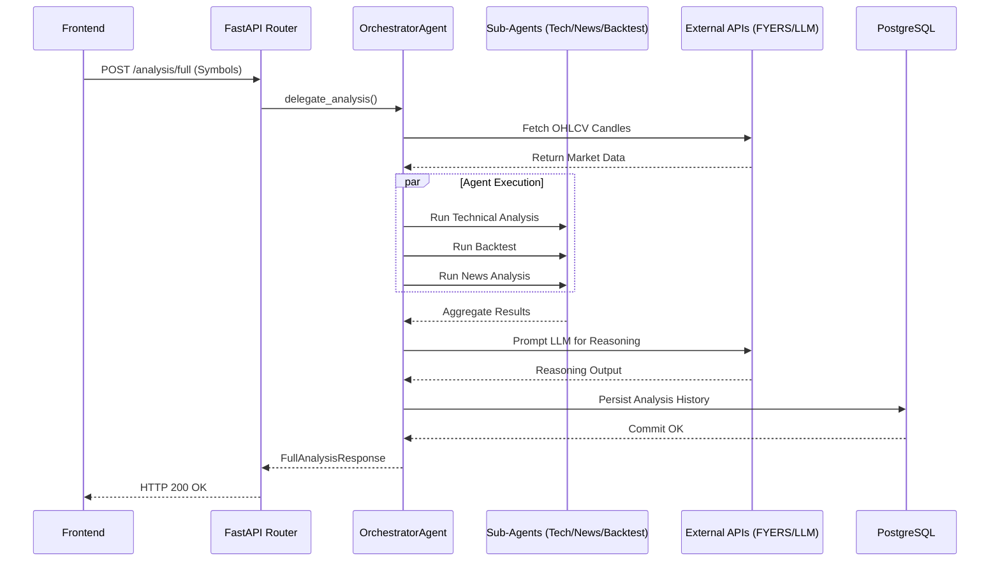
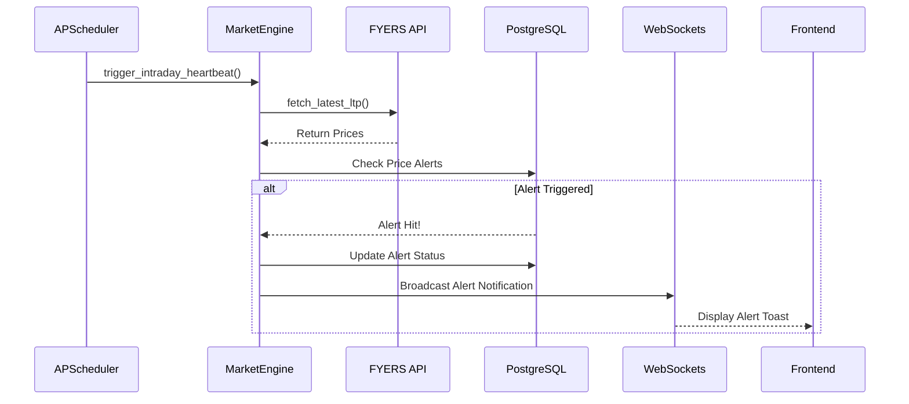

# System Architecture: Trading Analysis & Recommendation System

## 1. Architectural Overview Explanations

### For Beginners (The Restaurant Analogy)
Imagine our system is a high-end restaurant:
- **Frontend (React)** is the menu and the waiter. It takes your order and presents the final dish beautifully.
- **Backend (FastAPI)** is the kitchen. It coordinates the chefs (Agents) to prepare your dish.
- **Database (PostgreSQL)** is the pantry where ingredients (historical data, past analyses) are stored.
- **Redis** is the kitchen whiteboard. It makes sure two chefs don't try to cook the exact same meal at the same time (preventing duplicate work).
- **External APIs (FYERS)** are the grocery delivery trucks bringing fresh market data.
- **WebSockets** are the little bell that rings the instant your food is ready, delivering updates directly to your table without you having to ask.

### For Intermediate Engineers (3-Tier Application)
The system is a modern 3-tier web application built for financial analysis. The **React (Vite)** frontend provides a dashboard for users. It communicates with a Python **FastAPI** backend via standard REST endpoints and WebSockets for real-time updates. The backend interacts with a **PostgreSQL** database for durable storage (e.g., paper trading accounts, historical scan results) and uses **Redis** for distributed locking and caching. To function, the backend constantly polls or subscribes to the **FYERS API** for live stock data and uses LLMs for analysis reasoning.

### For Senior Engineers (Modular Monolith with Agentic Orchestration)
The system is an asynchronous modular monolith built on FastAPI, utilizing an agentic orchestration pattern. HTTP requests hit the `RouterAgent`, which delegates to an `OrchestratorAgent`. The Orchestrator manages concurrent sub-agents (Technical, News, Backtest) using `asyncio` and AnyIO thread pools. 
- **Persistence:** Relational data is stored in PostgreSQL, accessed asynchronously via SQLAlchemy. 
- **Concurrency & State:** Redis provides distributed primitives (`redis_lock.py`), such as singleton worker leases, ensuring that background tasks (e.g., `APScheduler` cron jobs) only run on a single pod in a scaled environment. 
- **Real-time:** Market data and log streams are pushed to the client via native WebSockets, avoiding REST polling overhead. 
- **Resilience:** The system features built-in fallback modes (quarantine mode, mock data generators) when the primary data ingress (FYERS) is unavailable or authentication expires.

---

## 2. Component Diagram

---

## 3. Data Flow Diagram

---

## 4. Request Flow Diagram (Example: Full Analysis)

---

## 5. Event Flow Diagram (Background Scheduler)

---

## 6. System Components: Details & Failure Scenarios

### Frontend
- **What it is:** A React application built with Vite and TailwindCSS.
- **Why it exists:** Provides the user interface for running screeners, viewing stock charts, reading analysis, and placing paper trades.
- **What talks to it:** The User. It talks to the Backend.
- **What happens if it fails:** The user cannot interact with the system visually. However, the backend scheduler will continue running automated jobs (e.g., pre-market deep scans).

### Backend (FastAPI)
- **What it is:** A Python-based API server handling business logic, background jobs, and agent orchestration.
- **Why it exists:** To act as the brain of the operation, executing complex financial logic securely away from the client.
- **What talks to it:** The Frontend talks to it. It talks to Postgres, Redis, and External APIs.
- **What happens if it fails:** The entire application goes down. Background jobs cease, real-time data stops, and the UI will show network errors.

### Database (PostgreSQL)
- **What it is:** The primary relational database.
- **Why it exists:** To permanently store application state, including paper trading balances, past analysis runs, user configurations, and system logs.
- **What talks to it:** The Backend (via SQLAlchemy ORM).
- **What happens if it fails:** The backend will throw 500 Internal Server Errors on almost all routes. Startup may fail completely if Alembic migrations cannot be verified.

### Redis
- **What it is:** An in-memory data store.
- **Why it exists:** Used for distributed locks (`singleton_worker_lease`) to ensure that if multiple backend instances (pods) are running, only one instance runs the background scheduled tasks (avoiding duplicate trades or scans).
- **What talks to it:** The Backend.
- **What happens if it fails:** Distributed locking fails. If running multiple pods, cron jobs may trigger multiple times simultaneously.

### WebSockets
- **What it is:** A persistent, bi-directional communication protocol over TCP.
- **Why it exists:** To push real-time data (like streaming logs during a long scan, or live price updates) to the frontend without the frontend needing to aggressively poll the API.
- **What talks to it:** The Backend pushes to it; the Frontend listens to it.
- **What happens if it fails:** The frontend falls back to REST polling (if implemented) or simply requires manual page refreshes to see updated data.

### External APIs (FYERS, LLM, News)
- **What it is:** Third-party services providing market data (FYERS), intelligence (LLM/Groq), and news articles (Marketaux).
- **Why it exists:** We do not own a stock exchange or a proprietary LLM model. We must source this data externally.
- **What talks to it:** The Backend.
- **What happens if it fails:** 
  - **FYERS:** The system will fallback to mock data or quarantine mode, rendering analyses inaccurate but preventing the app from crashing.
  - **LLM:** Recommendation reasoning will fail gracefully with default "No recommendation generated" messages.

### Authentication
- **What it is:** Currently implemented as an OAuth2 flow for the FYERS API access token. (Note: End-user application authentication is currently disabled/not present).
- **Why it exists:** FYERS requires a valid access token to pull market data.
- **What talks to it:** The Backend manages token persistence in the DB and uses it in `requests` headers.
- **What happens if it fails:** Token expires. The backend will log `TOKEN_EXPIRED`, abort automated screeners, and push an alert to the paper trading dashboard requiring the user to re-authenticate manually.

---

## 7. Real Examples

### Example 1: Running a Screener
1. User clicks "Run Screener" on the UI.
2. Frontend sends a `POST /analysis/screener/full` request to the backend.
3. Backend fetches the Nifty 500 list from configuration.
4. Orchestrator fetches historical candles for all 500 stocks from FYERS.
5. Technical Agent calculates indicators (RSI, EMA, etc.) and filters out bad setups.
6. The top 20 symbols are sent to the LLM for deep reasoning.
7. Postgres saves the run to `analysis_history`.
8. UI renders the candidate table.

### Example 2: Paper Trading Execution
1. User submits a paper trade for 10 shares of RELIANCE.
2. `PaperTradingService` deducts the required simulated margin from the user's `paper_trading_accounts` table.
3. A row is created in `paper_trading_orders`.
4. The Market Engine checks the live price of RELIANCE via FYERS.
5. Once the price crosses the limit order threshold, the order is updated to `FILLED`, and a new row is added to `paper_trading_positions`.

---

## 8. Failure Scenarios

| Failure | Symptoms | Mitigation / Fallback |
| :--- | :--- | :--- |
| **PostgreSQL Outage** | API throws 500s. App fails to boot. | Requires infrastructure intervention. Data relies on regular pg_dumps. |
| **FYERS Token Expiry** | Scanners abort. Log shows `FyersAuthExpiredError`. | App catches error, stops scanner, generates DB notification alerting user to login. |
| **LLM Rate Limit** | AI reasoning is blank or throws 429 errors. | Agent catches exception, returns default fallback recommendation (e.g., "HOLD"). |
| **Process Crash** | Backend stops. Active paper trades are not monitored. | On restart, backend runs `gap_replay()` to calculate fills/exits that should have happened while offline. |

---

## 9. Troubleshooting Guide

**1. "FYERS token expired" error during scan:**
- *Solution:* Open the dashboard, navigate to the settings or login panel, and complete the FYERS manual authentication flow to generate a new token.

**2. Database Migration Error on Startup (`check_alembic_head` failure):**
- *Solution:* The database schema is out of sync with the code. Run `alembic upgrade head` in the backend directory.

**3. Singleton Worker Warning in Logs (`Another instance owns singleton workers`):**
- *Solution:* This is normal if you have multiple backend containers running. If you only have one, clear the Redis lock key `trading-system:singleton-workers` manually.

**4. No data appearing on charts:**
- *Solution:* Check if the backend is running in `quarantine_mode`. If so, it is bypassing data fetching to prevent bad data ingestion. Check your `.env` configuration.

---

## 10. FAQ

**Q: Why use FastAPI instead of Django or Flask?**
A: Financial data processing involves heavily I/O bound tasks (fetching data for 500 stocks concurrently). FastAPI's native `asyncio` support makes this drastically faster than synchronous frameworks.

**Q: Why PostgreSQL over SQLite?**
A: The system outgrew SQLite. Postgres provides better concurrency, row-level locking (essential for the Market Engine's paper trading execution without race conditions), and JSONB support for complex backtest results.

**Q: Are real orders placed?**
A: No. The architecture is strictly advisory and for paper trading. There is no live execution module connected to a broker's transactional API.

---

## 11. Glossary

- **Agent:** A modular backend component responsible for a specific domain (e.g., TechnicalAnalysisAgent) that can operate independently.
- **LLM:** Large Language Model. Used to parse complex market data and output human-readable reasoning.
- **LTP:** Last Traded Price.
- **OHLCV:** Open, High, Low, Close, Volume. The standard format for candlestick data.
- **Paper Trading:** Simulated trading using fake money to test strategies.
- **Screener:** A process that filters a large universe of stocks down to a small watchlist based on specific criteria.
- **Singleton Lease:** A distributed lock ensuring a process only runs on one machine at a time.
- **Orchestrator:** The master controller that coordinates data fetching and sub-agent execution.
