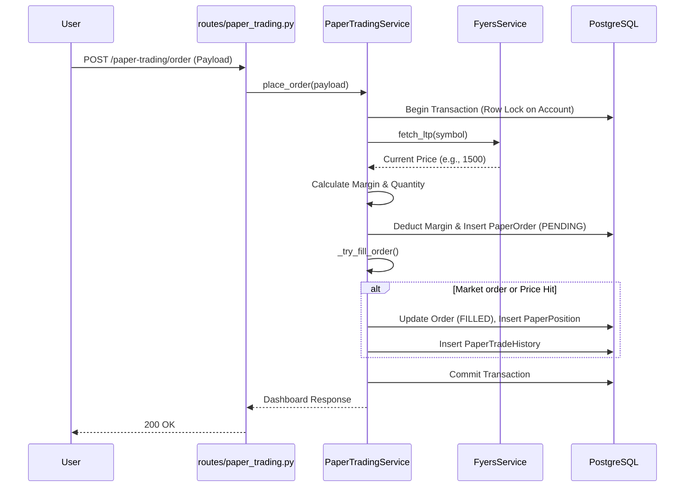
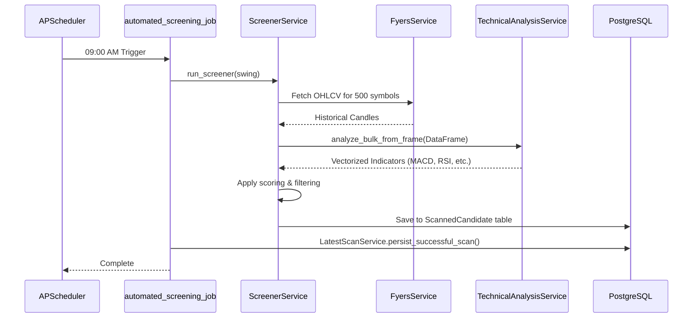

# Backend Architecture Documentation

## 1. Beginner Explanation
Imagine the trading system backend as a massive, automated restaurant kitchen. 
- The **Routes** are the waiters, taking orders from the customers (the frontend dashboard).
- The **Services** are the specialized chefs. One chef only looks at charts and patterns (TechnicalAnalysisService), another only handles the fake money (PaperTradingService), and another talks to the wholesale supplier (FyersService).
- The **Models and DB** are the pantry and the ledger, keeping track of every ingredient (stock) and transaction.
- The **Schedulers** are the kitchen timers, telling the chefs exactly when to start the morning prep (08:55 AM spin-up) and when to close down (15:30 PM cool-down).

## 2. Intermediate Explanation
The backend is a high-performance Python monolith built with **FastAPI**. It uses **asyncio** to handle concurrent operations, particularly necessary for dealing with thousands of network calls to the FYERS broker API. Data persistence is handled via **PostgreSQL** using `asyncpg` and **SQLAlchemy 2.0** ORM. The system architecture enforces a strict separation of concerns: Routers (API endpoints) do no business logic; they immediately delegate to Services. Services perform the logic and interact with the database via injected asynchronous sessions. Background tasks are managed by **APScheduler** to run time-critical financial operations like market data polling and end-of-day analytics without blocking API responses.

## 3. Senior Engineer Explanation
The backend architecture follows a Domain-Driven Design (DDD) inspired pattern within a modular monolith. It utilizes asynchronous SQLAlchemy sessions tied to FastAPI dependency injection (`Depends(get_db)`). For concurrency, it implements distributed locking via PostgreSQL advisory locks (`app.db.locks`) and Redis (`app.utils.redis_lock`) to ensure single-execution semantics across multiple horizontally scaled worker pods (e.g., preventing double-execution of the cron-based market screener). 

State machines govern entity lifecycles (e.g., `LiveStateMachine` for order execution states) ensuring atomicity using `SELECT ... FOR UPDATE` row-level locks to prevent race conditions during margin consumption. Market data is optimized using PostgreSQL table partitioning (`partition_manager.py`) for time-series data (OHLCV candles). The system is robust against failure, utilizing a `TaskSupervisor` for long-running asyncio tasks, and a `ReconciliationFramework` with exponential backoff for orphaned orders.

---

## 4. Folder Structure
```text
backend/app/
├── agents/         # AI integration and orchestration layer
├── config/         # Environment variables and application settings
├── core/           # Core lifecycle, global logger, server state, gap replay
├── db/             # SQLAlchemy engine config, locking mechanisms, Mongo connections
├── models/         # SQLAlchemy declarative ORM models
├── observability/  # System metrics and Prometheus/Grafana hooks
├── routes/         # FastAPI path operations (Controllers)
├── schemas/        # Pydantic validation models (DTOs)
├── services/       # Core business logic (The "Meat" of the application)
├── utils/          # Financial math, JSON sanitization, precision formatting
└── main.py         # FastAPI application factory, middleware, APScheduler configuration
```

---

## 5. Modules, Services, Models, and Endpoints

### Configuration & Core (`config/`, `core/`)
- **`config/settings.py`**: Validates `.env` and exposes standard Python attributes. Loads default universe symbols (NIFTY 500).
- **`core/gap_replay.py`**: Handles "offline gap replay" to fill paper trading orders that triggered while the server was down.
- **`core/task_supervisor.py`**: Restarts crashed background asyncio tasks.

### Database Layer (`db/`)
- **`db/session.py`**: Manages connection pooling, Alembic migration gate validation on startup.
- **`db/locks.py`**: Postgres advisory lock implementation for singleton background jobs.
- **`db/scan_store.py`**: Atomic JSONB persistence for screener payloads.

### Models (`models/`)
*(Responsibilities: Map Python classes to Postgres tables)*
- **`analysis.py`**: `AnalysisHistory`, `StrategyPerformanceLog`, `ScannedCandidate`.
- **`fyers_token.py`**: `FyersToken` (Stores active broker access tokens).
- **`live_trading.py`**: `LiveAccount`, `LiveOrder`, `OrderExecutionEvent` (Audit trail).
- **`market_data.py`**: `HistoricalCandle` (Partitioned time-series data).
- **`paper_trading.py`**: `PaperTradingAccount`, `PaperOrder`, `PaperPosition`.
- **`system_log.py`**: `SystemLog` (Async structured logging).
- **`workstation.py`**: `WorkstationAlert`, `ScanHistorySnapshot`.

### Schemas (`schemas/`)
*(Responsibilities: Pydantic Data Transfer Objects for API Validation)*
- **`analysis.py`**: `ScreenerRequest`, `StockAnalysisResult`.
- **`paper_trading.py`**: `PaperOrderCreateRequest`, `PaperTradingDashboardResponse`.
- **`workstation.py`**: `MarketOverviewResponse`, `RiskSettingsRequest`.

### Services (`services/`)
*(Responsibilities: Business logic isolation)*
1. **`AnalyticsService`**: Tracks strategy drift and past recommendation alpha.
2. **`BacktestService`**: Calculates historical win rates and CAGR using pandas and `ta`.
3. **`CandleReconciliationService`**: Finds and backfills missing 1-D / 1-Min candles.
4. **`FyersService`**: Integrates with the broker API (rate limiting, fetching LTP/OHLCV).
5. **`LiveStateMachine`**: Validates order state transitions (e.g., `PENDING` -> `FILLED`).
6. **`LLMService`**: AI integration for fundamental sentiment and risk factor generation.
7. **`LockService` / `LoggerService`**: Distributed background tasks and async batched logging.
8. **`MarginEngine`**: Safely consumes account cash using `FOR UPDATE` DB locking.
9. **`MarketDataFeed`**: Handles binary WebSocket streams from Fyers.
10. **`MarketEngineService`**: Infinite loop comparing tick data against stop-losses/targets.
11. **`PaperTradingService`**: Creates virtual orders, updates PnL, executes simulated fills.
12. **`RecommendationService`**: Dynamic weight calculation to output final BUY/WATCH lists.
13. **`ReconciliationFramework`**: Claims stuck orders using `SKIP LOCKED`.
14. **`ScreenerService`**: Bulk vectorized scanning of NIFTY 500 using pandas `transform`.
15. **`TechnicalAnalysisService`**: Optimized MACD, RSI, Supertrend calculations.
16. **`TokenService`**: Token validation, history, and memory caching.
17. **`WorkstationService`**: Manages UI state, market index tracking, and alerts.

### Routes (`routes/`)
- **`/analysis/screener/full`**: Triggers ad-hoc scanning.
- **`/paper-trading/*`**: Dashboard, order placement, position closing.
- **`/fyers/token`**: Accepts access tokens.
- **`/scanner/latest`**: Returns the last completed background scan.

---

## 6. Schedulers & Background Jobs
Configured via `APScheduler` in `main.py`:
- **`market_engine_spin_up`**: `08:55 AM Mon-Fri`. Pre-warms cache and connects WebSockets.
- **`pre_market_deep_scan` (`automated_screening_job`)**: `09:00 AM Mon-Fri`. Scans NIFTY 500 to generate today's buy lists.
- **`job_intraday_heartbeat`**: Every 15 minutes during market hours. Triggers market engine checks and alerts.
- **`market_engine_cool_down`**: `15:30 PM Mon-Fri`. Disconnects sockets and flushes caches.
- **`track_strategy_drift_job`**: `16:00 PM Friday`. Weekly strategy alpha calculation.
- **`job_retention_cleanup`**: `02:15 AM Daily`. Prunes old system logs and dead letters.

---

## 7. Call Chain Examples & Data Flow

### Call Chain Example 1: Placing a Paper Order


### Call Chain Example 2: Morning Screener Job


---

## 8. Failure Scenarios

1. **FYERS Token Expiry/Invalidation**: 
   - **Impact**: Market data fetches fail. Screener aborts. 
   - **Resolution Flow**: Background job logs an Error, throws `FyersAuthExpiredError`, updates System Diagnostics state to "Scanner Failed", and saves an Alert notification for the user to re-authenticate.
2. **PostgreSQL Connection Drops**: 
   - **Impact**: HTTP 500s. 
   - **Resolution Flow**: SQLAlchemy pool attempts to reconnect. The `LoggerService` caches logs in memory, and if DB insertion fails repeatedly, dumps them to `fallback_logs.jsonl`.
3. **Unexpected Server Crash during Market Hours**: 
   - **Impact**: Stop-losses might not be triggered in the paper trading engine.
   - **Resolution Flow**: Upon restart, `gap_replay.py` automatically fetches offline candles from the broker and back-calculates missed SL/TP hits before allowing new live ticks.
4. **Fyers API Rate Limits Hit**:
   - **Impact**: `FyersAPIError` raised.
   - **Resolution Flow**: `FyersService` utilizes a `CandleStore` cache (LTP cache and DB Historical Candles) to drastically reduce hits. If limit is hit, exponential backoff is triggered inside `CandleReconciliationService`.

---

## 9. Troubleshooting Guide

*   **Symptom**: The morning scan didn't generate any "Buy" candidates.
    *   **Check**: Ensure the FYERS access token is set and valid. Look at the `/api/logs` or `logs/trading_system.log` for `TOKEN_EXPIRED_ALERT`.
*   **Symptom**: Out of Memory (OOM) killer restarts the pod during the scan.
    *   **Check**: The NIFTY 500 bulk vectorization might be consuming too much memory. Review `DiagnosticsService` shadow run outputs. Verify `AnyIO` thread limit.
*   **Symptom**: Paper Orders are stuck in "PENDING" indefinitely during market hours.
    *   **Check**: Ensure `MarketEngineService` loop is running. Check `GET /health/heartbeat` to see when the engine last processed a tick. Ensure `MarketDataFeed` WebSocket is connected.
*   **Symptom**: Log files are growing infinitely.
    *   **Check**: Verify `job_retention_cleanup` ran at 02:15 AM. Ensure `log_manager.py` rotating file handler config is respected.

---

## 10. FAQ
**Q: How do I add more stocks to the screener?**
A: Modify the `ind_nifty500list.csv` or adjust the universe logic in `app.config.settings.py`.

**Q: Can I run the scan intraday?**
A: Yes, use the UI to trigger the `/analysis/screener/full` route. The system will use the cached daily candles up to yesterday, combined with intraday updates.

**Q: Where is live trading configured?**
A: Live trading endpoints utilize `app.models.live_trading` and the `LiveStateMachine`, interacting with Fyers API for order placement, though it mirrors the logic of `PaperTradingService`.

---

## 11. Glossary
*   **APScheduler**: The library used to run cron-like time-based jobs within the Python async event loop.
*   **Vectorization**: The process of applying operations to whole Pandas DataFrames simultaneously (in C) rather than iterating row by row in Python. Used heavily in `TechnicalAnalysisService`.
*   **Singleton Lease**: A distributed lock in PostgreSQL to ensure only one replica of the backend runs background schedulers.
*   **LTP**: Last Traded Price. Fetched frequently for evaluating trailing stops and margins.
*   **Gap Replay**: The process of recovering and processing market data that occurred while the backend server was offline.
