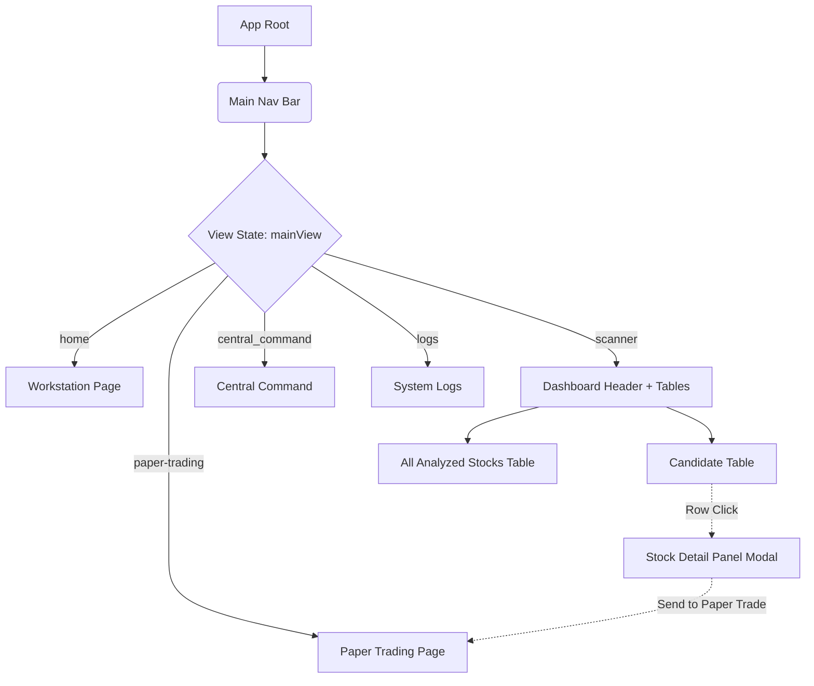
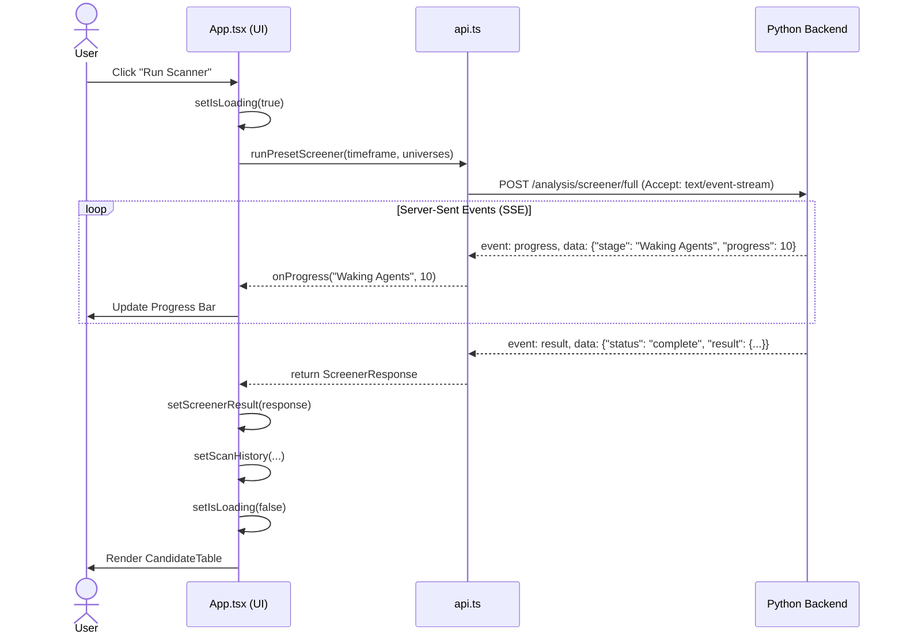

# Frontend Architecture

This document provides complete engineering documentation for the frontend of the trading system, built with React, Vite, TypeScript, and Tailwind CSS.

## 1. Audience-Specific Explanations

### Beginner Explanation
Imagine the frontend as the dashboard of a car. It shows you the speedometer (stock prices), fuel gauge (account balance), and a navigation screen (the stock screener). It doesn't actually make the car go—the engine (backend) does that. The frontend just takes your inputs (like clicking "Run Scanner") and tells the backend what to do, then displays the results nicely on your screen. 

### Intermediate Explanation
The frontend is a Single Page Application (SPA) built using React 18 and Vite. It uses TypeScript for type safety and Tailwind CSS for styling. Instead of traditional page navigation (where the browser loads a new HTML file for each page), we use a state variable (`mainView`) to conditionally render different parts of the app, like the Scanner, Paper Trading, or Logs. We communicate with a Python backend using standard HTTP `fetch` requests and Server-Sent Events (SSE) for real-time progress updates during long-running tasks like scanning stocks.

### Senior Engineer Explanation
The architecture follows a monolithic-component SPA design pattern orchestrated by a centralized `App.tsx` container. It manages global state natively via React Hooks (`useState`, `useMemo`, `useEffect`) avoiding heavy global stores like Redux to keep the bundle size small and performance high. 
- **Routing**: Minimalistic pseudo-routing using `window.history.replaceState` synced with a local `mainView` state, falling back to conditional rendering. 
- **API Layer**: Centralized in `api.ts`, utilizing a custom `fetchWithDiagnostics` wrapper for telemetry and failovers across base URLs. Long-polling operations like `runPresetScreener` utilize streaming chunk ingestion (`Accept: text/event-stream`) handled by a custom `TextDecoder` loop to provide low-latency UI progress bars.
- **Memoization**: Heavy usage of `useMemo` for filtering and sorting large datasets (e.g., computing `filteredRows` from `ScreenerResponse`) to prevent UI jank during re-renders.

## 2. Architecture Overview

### Technology Stack
- **Framework**: React 18, Vite
- **Language**: TypeScript
- **Styling**: Tailwind CSS, Vanilla CSS (`styles.css`)
- **State Management**: React Hooks (Prop Drilling, Context API minimal usage)
- **Networking**: native `fetch`, Server-Sent Events (SSE)

### Route Structure
While `react-router-dom` is present in the dependency tree, the primary application layout utilizes a tab-based conditional rendering system in `App.tsx`.
- `home`: Workstation overview (`WorkstationPage`)
- `scanner`: Main screening dashboard (`DashboardHeader`, `CandidateTable`)
- `central_command`: Hub for operational control (`CentralCommand`)
- `paper-trading`: Simulated trading environment (`PaperTradingPage`)
- `logs`: System event logs (`SystemLogs`)
- **Detail Modal**: Overlaid `StockDetailPanel` triggered by selecting a specific symbol row.

### Components
Key reusable components located in `src/components/`:
- `CandidateTable.tsx`: Virtualized/paginated display for shortlisted stocks.
- `StockDetailPanel.tsx`: Deep-dive technical view for a single asset.
- `PaperTradingPage.tsx`: Order entry and active position management.
- `DashboardHeader.tsx`: Control panel for configuring screener parameters.
- `ScannerProgress.tsx`: Visual feedback component interpreting SSE streams.

### Data Flow
1. **Action**: User triggers an event (e.g., "Run Scanner").
2. **API Call**: `App.tsx` calls `runPresetScreener` from `api.ts`.
3. **Streaming Response**: `api.ts` parses incoming SSE chunks and triggers an `onProgress` callback to update the UI via `setProgressPercent`.
4. **Result Ingestion**: On completion, the full JSON payload is saved to `screenerResult` state.
5. **Memoized Derivation**: `App.tsx` uses `useMemo` to construct `shortlistRows` and `filteredRows` based on the active `DashboardFilters`.
6. **Render**: `CandidateTable` receives `filteredRows` as props and updates the DOM.

## 3. Visual Models

### UI Navigation Map (Mermaid)



### Data Flow & API Integration Sequence



## 4. State Management & Hooks

Global UI state lives in `App.tsx`:
- `mainView`: Controls the active top-level tab.
- `filters`: Tracks search strings, score ranges, and signal types.
- `screenerResult`: Holds the massive raw JSON tree of the last scan.
- `paperTradingPrefill`: Temporarily holds trade parameters when jumping from the detail view to paper trading.

**Custom Hooks:**
- `useInfrastructureHealth.ts`: Polls backend status and broker connection health.
- `useTradingDashboard.ts`: Encapsulates polling logic for paper trading positions, orders, and PnL.

## 5. Real Examples

### 1. Prefilling a Paper Trade
When a user clicks "Buy" on a stock in the Scanner, the app packages the technical recommendation into a `RecommendationPrefillRequest`.
```typescript
function buildPaperTradingPrefill(row: CandidateRow): RecommendationPrefillRequest {
  const plan = row.analysisItem?.recommendation.trade_plans[0];
  return {
    symbol: row.symbol,
    suggested_entry: row.entryLow,
    suggested_stop: plan?.stop_loss ?? row.stopLoss ?? null,
    suggested_targets: [plan?.target_1, plan?.target_2].filter((value): value is number => typeof value === "number"),
    recommendation_meta: {
      signal: row.signal,
      score: row.score,
      confidence: Math.round((row.confidence ?? 0) * 100) / 100,
    },
  };
}
// Called via:
setPaperTradingPrefill(buildPaperTradingPrefill(row));
setMainView("paper-trading");
```

## 6. Authentication Flow

Authentication is focused on connecting to the broker (Fyers). The frontend monitors API error codes to detect expired tokens.
1. Any network call via `api.ts` that receives an HTTP error parses the detail.
2. If `detail.error_type === "FYERS_TOKEN_EXPIRED"`, the UI sets an explicit error message: "Fyers Access Token Expired — Please re-authenticate".
3. Users input their token via the `TokenStatus.tsx` component, which sends it to `/settings/token`.

## 7. Failure Scenarios

1. **Broker Token Expiry**: API calls fail. Frontend catches `FYERS_TOKEN_EXPIRED` and blocks further scanning until re-auth.
2. **Backend Unreachable**: `fetchWithDiagnostics` loops through `API_BASE_URLS`. If all fail, it throws an error. The UI catches this and renders a generic red error box (`#fee2e2` background) with a "Retry scan" button.
3. **SSE Connection Drop**: If the scanner stream drops mid-flight without sending `{status: "complete"}`, `api.ts` throws "Stream closed without sending a result". The UI resets `isLoading(false)` and displays the error.

## 8. Troubleshooting Guide

- **Symptom**: Scanner is stuck at 0%.
  - **Cause**: Backend is likely not emitting SSE events.
  - **Fix**: Check `SystemLogs` tab or backend terminal output. Ensure the backend FastAPI server is running with Uvicorn.
- **Symptom**: UI feels sluggish when filtering.
  - **Cause**: Re-renders not correctly memoized. 
  - **Fix**: Ensure `useMemo` dependency arrays in `App.tsx` are correct. Large dataset operations (like sorting `filteredRows`) must be wrapped in `useMemo`.
- **Symptom**: Fyers Token Invalid.
  - **Fix**: Use the Central Command tab to re-verify credentials or fetch a new auth token from the Fyers developer portal.

## 9. FAQ

**Q: Why doesn't the app use React Router?**
A: To maintain a highly persistent state without complex URL-based state hydration logic, the application uses a memory-based tab router. The single exception is `/logs` which replaces the history state to allow for direct links.

**Q: Why use `text/event-stream` instead of WebSockets?**
A: SSE (Server-Sent Events) is unidirectional and operates over standard HTTP. It's much simpler to implement for progress bars (Backend -> Frontend) and doesn't require maintaining a persistent bidirectional WebSocket connection for long-polling tasks.

**Q: Where are my scans saved?**
A: Scan history (`ScanHistoryItem[]`) is saved in `window.localStorage` under the key `"scanHistory"`. It maintains the last 20 snapshot references.

## 10. Glossary

- **SSE**: Server-Sent Events. A mechanism that allows the server to push updates to the web client over an HTTP connection.
- **Prefill**: Automatically populating an order ticket in the Paper Trading view using parameters calculated by the technical analysis engine.
- **Tailwind CSS**: A utility-first CSS framework used for rapid UI styling directly inside `className` attributes.
- **Monolithic Component**: A design pattern where a single parent (`App.tsx`) orchestrates the majority of the application's global state.
