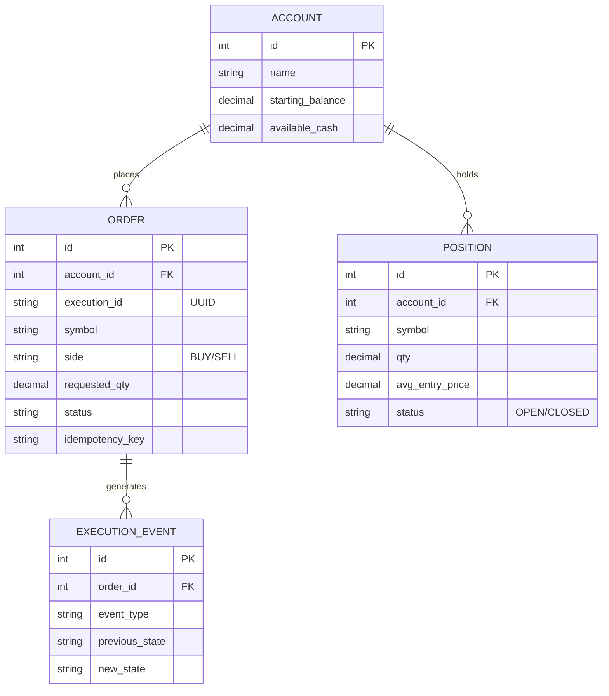
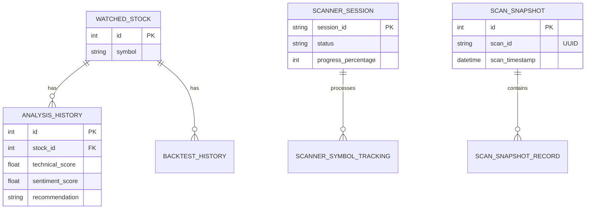
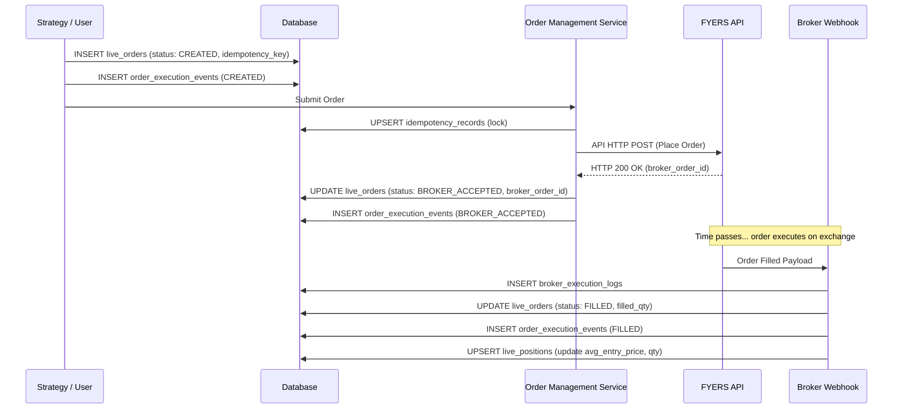

# Database Architecture Documentation

## 1. System Overviews

### Beginner Explanation
Imagine our trading database like a giant, super-organized digital filing cabinet for a financial firm. In one drawer, we keep "Accounts" (how much money we have). In another drawer, we have "Orders" (the shopping list of stocks we want to buy or sell). Whenever we actually buy something, it goes into the "Positions" drawer (what we currently own). We also have special drawers for "Paper Trading" (practice money) and "Live Trading" (real money), so we never mix them up. The database also remembers every "Scan" (when we search for good stocks) and "Log" (a diary of every single thing the system did).

### Intermediate Explanation
The database is built on a relational SQL model (using SQLAlchemy ORM in Python) and is logically partitioned into several domains: **Live Trading**, **Paper Trading**, **Market Data**, **Analysis & Scanning**, and **System/Infrastructure**. 
- The **Trading modules** (Live & Paper) mirror each other but are kept strictly separated to avoid accidental real orders. They contain Accounts, Orders, Positions, and Execution Events. 
- The **Market Data module** holds historical candles and tracks blacklisted symbols. 
- The **Analysis module** keeps the results of stock scans, backtest histories, and specific AI strategy performance logs. 
- The **System module** tracks API requests, service health, idempotency keys (to prevent double-processing), and logs. 

### Senior Engineer Explanation
The schema follows an event-sourced and state-machine-driven design for order execution and idempotency, adhering to high-reliability financial systems patterns.
- **Order State Management:** `live_orders` and `paper_trading_orders` are heavily constrained by status enums (e.g., `CREATED`, `EXECUTING`, `FILLED`, `REJECTED`). Transitions are recorded append-only in `order_execution_events` to provide a full audit trail.
- **Idempotency & Concurrency:** `idempotency_records` and `system_locks` handle distributed locking and prevent duplicate processing of webhooks or broker API calls. 
- **Decoupling:** Broker execution logs (`broker_execution_logs`) act as the raw ingest point for broker webhooks, which are later reconciled with our internal `live_orders` table via background workers.
- **Data Retention & Lifecycle:** High-velocity data like `historical_candles` and `system_logs` use composite indexes and are partitioned (logically) for time-series querying. Append-only logs form the core of the system's observability and debugging.

---

## 2. Mermaid Entity-Relationship (ER) Diagrams

### Core Trading Domain (Live & Paper)

### Analysis & Scanning Domain

---

## 3. Data Tables, Columns, and Relationships

### 3.1 Live Trading Domain
* **`live_accounts`**: Tracks real money account balances. Constraints prevent negative cash.
* **`live_orders`**: The core source of truth for real orders. Uses `idempotency_key` and unique `execution_id`. Links to `live_accounts.id`. Includes `reconciliation_attempts` for syncing with brokers.
* **`live_positions`**: Current open or closed holdings. Enforces uniqueness on `(account_id, symbol)` when status is 'OPEN'.
* **`order_execution_events`**: Append-only log of order state transitions (`previous_state` -> `new_state`). Links to `live_orders.id`.
* **`broker_execution_logs`**: Raw execution payloads received from the broker (e.g., FYERS webhooks).

### 3.2 Paper Trading Domain
Mirrors the live environment but adds tables for simulated transactions and notifications.
* **`paper_trading_accounts`**, **`paper_trading_positions`**, **`paper_trading_orders`**: Similar to live equivalents but with `lifecycle_state` for local simulated state machine processing.
* **`paper_trading_trade_history`**: Records completed PnL entries once positions are closed.
* **`paper_trading_transactions`**: Ledger of every cash movement.
* **`paper_trading_execution_events`**: Append-only execution events. Triggered by the `market_engine_sessions`.

### 3.3 Market Data & Analysis
* **`historical_candles`**: Massive time-series table holding OHLCV data. Indexed on `symbol`, `resolution`, `timestamp`.
* **`watched_stocks`**: The universe of stocks the system monitors.
* **`analysis_history` & `backtest_history`**: Point-in-time snapshots of AI/Algorithmic analysis on a stock.
* **`scanner_sessions` & `scanner_symbol_tracking`**: Manages the distributed orchestration of market-wide scans (e.g., scanning 500 stocks). Tracks which symbols succeeded or failed.
* **`latest_scan_results`**: Upserted table containing the most recent recommendations for quick dashboard querying.

### 3.4 Infrastructure & System
* **`system_logs`**: Centralized application logging database table. Includes `error_hash` and `correlationId` for easy grouping of identical errors.
* **`idempotency_records`**: Key-Value table for strict exactly-once processing (e.g., webhook handling).
* **`system_locks`**: Distributed locking mechanism (lock name, locked by, expires at) to prevent multiple workers from running the same cron job.
* **`api_request_logs`**: Latency and HTTP status code tracking for outgoing external API calls.
* **`dead_letter_jobs`**: Failed background tasks queue payload and retry count.

---

## 4. Data Lifecycle & CRUD Flows

### Order Execution CRUD Flow (Sequence Diagram)
When a user or AI strategy places a Live Order, the data flows as follows:

### Data Lifecycle & Archival
1. **Creation:** Market Data and Logs are generated continuously at high volumes. Orders and Positions are created upon strategy triggers.
2. **Updates:** Orders are updated only via state-machine transitions. Positions have their PnL updated dynamically.
3. **Retention/Archival:** 
   - `historical_candles` and `system_logs` grow indefinitely. In production, these should be partitioned by month.
   - `live_positions` that are closed are kept for historical PnL reporting, though eventually migrated to a data warehouse.
   - `broker_execution_logs` can be purged after 30 days as they are just raw webhook ingestions.

---

## 5. Real Examples

### `live_orders` Table Example
| id | execution_id | symbol | side | qty | status | idempotency_key | broker_order_id |
|---|---|---|---|---|---|---|---|
| 104 | `a1b2c3d4...` | RELIANCE | BUY | 10.0 | FILLED | `strat_rsi_1718000000` | `1234567890ABCD` |

### `order_execution_events` Table Example
| id | order_id | event_type | previous_state | new_state |
|---|---|---|---|---|
| 501 | 104 | STATE_TRANSITION | NULL | CREATED |
| 502 | 104 | STATE_TRANSITION | CREATED | BROKER_ACCEPTED |
| 503 | 104 | STATE_TRANSITION | BROKER_ACCEPTED | FILLED |

---

## 6. Failure Scenarios

1. **Broker Webhook Missed (Network drop):**
   - **Impact:** `live_orders` remains in `BROKER_ACCEPTED`, but the actual exchange order is `FILLED`.
   - **Mitigation:** The `reconciliation_attempts` and `next_reconcile_at` columns in `live_orders`. A background job queries orders not in terminal states and polls the broker API directly to correct the database state.
2. **Duplicate Webhook Received:**
   - **Impact:** We might try to add quantity to `live_positions` twice.
   - **Mitigation:** `broker_execution_logs` uses `broker_trade_id` as the Primary Key. The insert will throw a constraint violation, and the transaction is safely rolled back.
3. **Race Condition on Account Balance:**
   - **Impact:** Two concurrent market buys exceed the `available_cash`.
   - **Mitigation:** SQL `CheckConstraint('available_cash >= 0')` is applied. The second transaction attempting to deduct cash will trigger an IntegrityError and fail.

---

## 7. Troubleshooting Guide

* **Issue: "Order is stuck in CREATED state"**
  * *Check:* `api_request_logs` to see if the FYERS API call timed out. Check `dead_letter_jobs` to see if the OMS task crashed.
* **Issue: "Paper Trading isn't updating prices"**
  * *Check:* `market_engine_sessions`. Verify `websocket_connected` is True. Check `last_tick_at` timestamp.
* **Issue: "System is performing multiple duplicate scans"**
  * *Check:* `system_locks` table. Ensure the `lock_name="daily_market_scanner"` is present and hasn't expired prematurely.
* **Issue: "Database disk usage is spiking"**
  * *Check:* `historical_candles` size. Ensure you are not requesting 1-minute resolution data for the entire NIFTY 500 for the last 10 years without aggressive indexing and partitioning.

---

## 8. FAQ

**Q: Why do we have `idempotency_records` when `live_orders` has an `idempotency_key` column?**
A: `live_orders.idempotency_key` ensures we don't place the same order twice. `idempotency_records` is a generalized table used for *all* system actions (like webhook processing, sending Telegram alerts, or applying cash deposits).

**Q: Why are `live_positions` and `paper_trading_positions` completely separate tables?**
A: Hard isolation. A bug in a SQL join or a missing `WHERE is_paper = false` clause could disastrously merge fake money with real money, resulting in massive financial loss. Physical table separation prevents this.

**Q: Can we UPDATE an `order_execution_event`?**
A: No. There is a SQLAlchemy `@event.listens_for("before_update")` hook that actively prevents and raises an error if code attempts to modify an execution event. They are strict append-only audit trails.

---

## 9. Glossary

* **Idempotency:** A property guaranteeing that making a request multiple times will have the same effect as making it exactly once.
* **Append-Only Log:** A data structure where new data can be added, but existing data cannot be modified or deleted. Highly secure for auditing.
* **State Machine:** A behavioral model where an entity (like an Order) can only be in one of a finite number of statuses (States) and can only move to specific other statuses (Transitions).
* **OHLCV:** Open, High, Low, Close, Volume. The standard fields for representing a trading candle in `historical_candles`.
* **Dead Letter Job:** A failed background task that has exhausted all retries and is saved for manual inspection.
