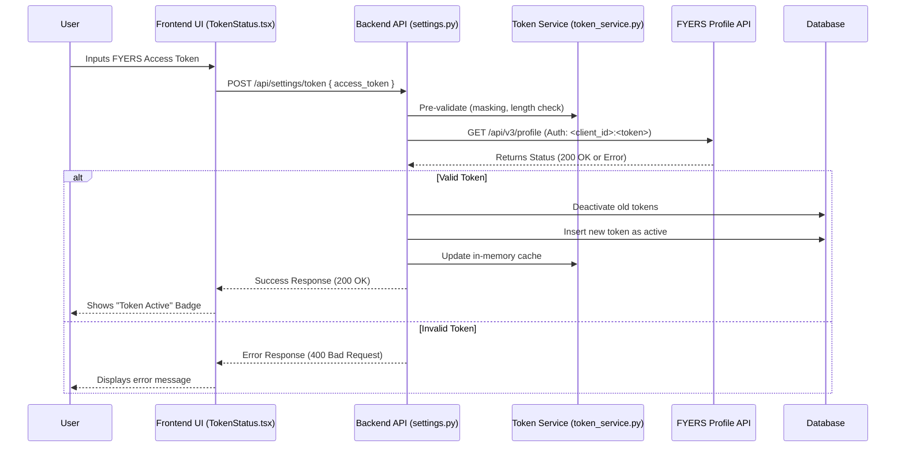
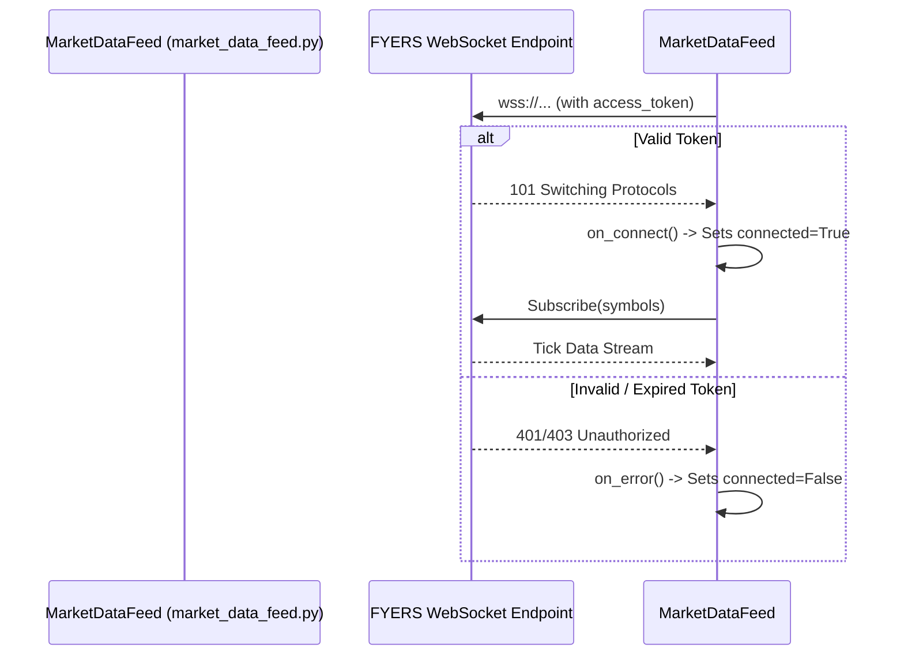

# Authentication Flow

## 1. Overview (Beginner Section)
This trading system utilizes a **Single-Tenant, Broker-First Authentication Flow**. Rather than a traditional username and password login for the application itself, the system relies exclusively on an **Access Token** provided by the FYERS API.
The user manually generates this token from their FYERS account and pastes it into the system's dashboard. Once saved, the backend actively validates the token and securely stores it to manage both historical data requests and live market data feeds. 

## 2. System Architecture (Intermediate Section)
The flow moves through three layers: the frontend UI where the token is captured, the settings API which validates and persists it, and the background services that utilize it (REST API wrapper and WebSocket data feed).

### Authentication Sequence Diagram


## 3. Deep Dive & Core Components (Expert Section)

### A. Frontend Layer
**`frontend/src/components/TokenStatus.tsx`**
*   **Inputs:** Manually pasted raw string token from user (`accessInput`).
*   **Outputs:** UI state indicating "Token Active", "No Token", or Error messages. 
*   **Business Logic:** Triggers `saveAccessToken` which calls `POST /api/settings/token`. Also polls `getTokenStatus` periodically to check the token's active status.
*   **Code Path:** User `onChange` sets `accessInput` -> User clicks "Save Token" -> `handleSave()` executes -> calls `saveAccessToken(accessInput)` from `api.ts`.

**`frontend/src/api.ts`**
*   **Inputs:** `access_token` string.
*   **Outputs:** Promise returning a success object or throwing an error.
*   **Business Logic:** Orchestrates the fetch request to the backend.

### B. Backend Settings & Token Management
**`backend/app/routes/settings.py`**
*   **Inputs:** `TokenValidateRequest(access_token: str)` payload via POST.
*   **Outputs:** Success JSON response containing masked token, or `HTTPException` on failure.
*   **Business Logic:**
    *   Constructs the FYERS `Authorization` header by verifying if `client_id` needs to be prepended to the token.
    *   **Active Validation**: Synchronously calls `https://api-t1.fyers.in/api/v3/profile`.
    *   Deactivates previous tokens by querying `update(FyersToken).where(FyersToken.is_active == True)`.
    *   Inserts the new token into the `FyersToken` table and records an audit log in `FyersTokenHistory`.
*   **Code Path:** `@router.post("/token") validate_and_save_token()` -> `_validate_token_with_fyers()` -> DB Update -> `db.commit()`.

**`backend/app/services/token_service.py`**
*   **Inputs:** Postgres `AsyncSession`.
*   **Outputs:** Active `access_token` string or `None`.
*   **Business Logic (Caching Behavior):** 
    *   **In-Memory caching:** To avoid slamming the database on every REST API request, the token is cached in memory using `_CACHED_TOKEN` and `_TOKEN_EXPIRY`.
    *   **TTL logic:** The cache lives for `FYERS_TOKEN_CACHE_MINUTES` (defaults to 60 minutes).
    *   **Fallback:** If the cache misses or is expired, `get_current_access_token` reads the latest active row from the `FyersToken` table and reinstates the cache.
*   **Code Path:** `get_current_access_token()` -> check `_CACHED_TOKEN` & TTL -> if miss, execute `get_fyers_token_row()` -> `_set_token_cache()`.

### C. Execution Layer (REST & WebSocket)
**`backend/app/services/fyers_service.py`**
*   **Inputs:** `token` (resolved via `token_service`).
*   **Outputs:** Dicts or Typed objects containing market data (LTP, OHLCV).
*   **Business Logic:**
    *   Utilizes the cached token to construct `FyersModel`.
    *   **Exception Catching:** Parses FYERS response codes. If `-16` (Expired) or `-15` (Invalid) is detected, raises `FyersAuthExpiredError` or `FyersAuthInvalidError`.
    *   Automatically invalidates the token in `token_service` cache upon authentication failure.

**`backend/app/services/market_data_feed.py` (WebSocket Behavior)**
*   **Inputs:** Valid `access_token`.
*   **Outputs:** Real-time data ticks passed to `on_tick` callback.
*   **Business Logic:**
    *   Initializes `data_ws.FyersDataSocket(access_token=token)`.
    *   **Handshake & Lifecycle**: The SDK uses the token to authenticate the WebSocket handshake. If the token is invalid, `on_error` is immediately triggered.
    *   **Resilience**: Operates on a daemon thread. `reconnect=True` handles transient network drops automatically without requiring token re-validation.
    *   **Keep-Alive**: Silently drops heartbeat payloads (`{"s": "ok"}`) while maintaining the authenticated stream.
*   **Code Path:** `start(token)` -> initialize `FyersDataSocket` -> spawn `Thread(target=_socket.connect)` -> listen to `on_message`, `on_error`, `on_close`.

### WebSocket Handshake Sequence


## 4. Examples

### Validating Token Request
```json
// POST /api/settings/token
{
  "access_token": "eyJ0eXAi...<token_body>...XYZ"
}
```

### Successful Save Response
```json
{
  "status": "ok",
  "message": "Token successfully verified and saved.",
  "saved_at": "2026-06-07T12:00:00.000Z",
  "token_preview": "eyJ0...XYZ"
}
```

## 5. Security & Fail-safes
*   **Token Masking**: At no point is the full access token logged to system logs. `_mask_token(token)` reduces logging strings to `1234...5678`.
*   **Database Expiry**: In `settings.py`, before a new token is inserted, *all* previous tokens are marked `is_active=False` ensuring only a singleton active token exists for any single-tenant instance.
*   **Stampede Protection**: Lock maps (`_ltp_locks`) protect token-based network requests so that an invalid token only fails once while awaiting renewal rather than flooding FYERS with unauthenticated requests.
