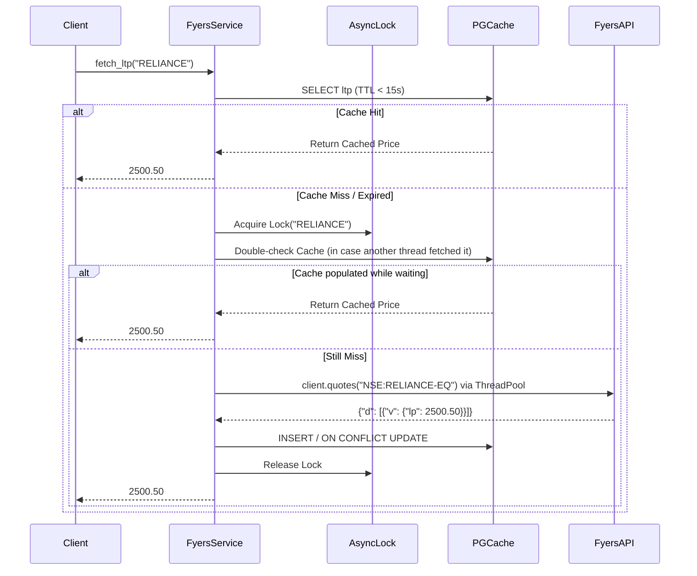
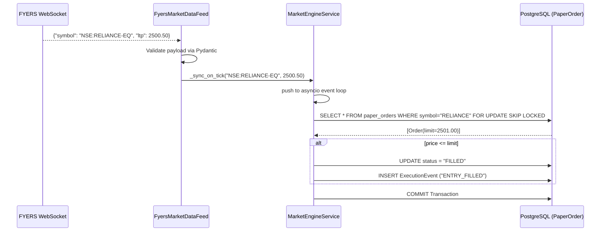

# FYERS API Integration Documentation

This document provides a comprehensive engineering overview of the FYERS API integration within the trading system. It details the file structures, data flow, caching mechanisms, market-hour behaviors, and the real-time simulation engine. 

---

## 1. Beginner Level: High-Level Overview

### What is FYERS?
FYERS is an Indian stockbroker offering a trading API (`fyers_apiv3`). Our system integrates with FYERS to fetch real-time market data (Last Traded Price - LTP), historical market data (OHLCV candles), and to stream live market quotes via WebSockets.

### What Does the Integration Do?
1. **Market Data Retrieval**: Retrieves minute and daily historical candles for technical analysis and backtesting.
2. **Real-time Pricing**: Gets the current price of assets (LTP) using the REST API and PostgreSQL caching.
3. **Live Market Streaming**: Connects to the FYERS WebSocket to stream live price updates for active paper-trading orders and open positions.
4. **Resiliency**: If FYERS is down or rate-limited, the system automatically falls back to alternative data sources like Yahoo Finance (`yfinance`) or cached data.

### Important Concepts
- **Market Hours**: The system is aware of Indian Standard Time (IST) market hours (09:00 to 16:00, Monday-Friday). It automatically suspends active streaming outside these hours to save resources.
- **Paper Trading Engine**: Instead of sending real orders to FYERS, this system uses FYERS solely for *market data* and simulates fills locally inside the `MarketEngineService`.

---

## 2. Intermediate Level: Files, Logic, and Code Paths

### 2.1 Core Files and Responsibilities

#### `backend/app/services/fyers_service.py`
This is the primary wrapper around the FYERS SDK.
- **Inputs**: Symbols (e.g., `NSE:RELIANCE-EQ`), resolutions (`1D`, `15m`), lookback windows, and API tokens.
- **Outputs**: Normalized `OHLCVPoint` objects, LTP floats, and metadata dictionaries.
- **Business Logic**: 
  - Validates and stores tokens.
  - Implements an advanced PostgreSQL + Memory caching layer.
  - Handles rate limiting (`HTTP 429`) with automatic backoff and a thread-safe semaphore (`_FYERS_HISTORY_SEMAPHORE`).
  - Blacklists invalid/delisted symbols (`_blacklist_symbol`) to prevent repeated failed requests.
  - Implements a fallback to `yfinance` when FYERS historical data requests fail.
- **Exact Code Path (Fetch LTP)**:
  `fetch_ltp` -> Checks PostgreSQL cache -> On miss, locks via `asyncio.Lock` -> `_fetch_fyers_ltp` -> Uses ThreadPoolExecutor to prevent blocking the async event loop -> Parses response -> Updates Postgres.

#### `backend/app/services/market_data_feed.py`
This handles the WebSocket integration for live data.
- **Inputs**: Access token, set of symbols to monitor.
- **Outputs**: Invokes callback functions (`on_tick`, `on_error`, `on_connection_change`).
- **Business Logic**:
  - Initializes `FyersWebsocket.data_ws` in a daemon thread.
  - Subscribes to `SymbolUpdate` channels.
  - Dynamically calculates subscription diffs (`to_add`, `to_remove`) via `sync_symbols` to minimize network payloads.
  - Validates incoming JSON payloads against a Pydantic schema (`FyersTickPayload`).
- **Exact Code Path (Live Feed)**:
  `start` -> `Thread(target=socket.connect).start()` -> FYERS pushes message -> `on_message` callback -> Normalizes dict -> Validates schema -> Calls `self.on_tick(symbol, price)`.

#### `backend/app/services/market_engine_service.py`
This is the state machine that consumes the live feed and simulates order execution.
- **Inputs**: Incoming price ticks from `FyersMarketDataFeed`.
- **Outputs**: Modifies PostgreSQL rows (`PaperOrder`, `PaperPosition`) and generates `ExecutionEvent`s.
- **Business Logic**:
  - Starts/Stops the feed based on market hours (`is_market_hours`).
  - Periodically polls FYERS REST API for missing prices if the WebSocket drops a tick (`_poll_missing_prices`).
  - Evaluates pending orders against the live tick to trigger `ENTRY_FILLED`.
  - Evaluates open positions against the live tick to trigger `TARGET_HIT` or `STOPLOSS_HIT`.
- **Exact Code Path (Order Execution)**:
  `_on_tick` -> `_process_symbol` -> Fetches active orders with `FOR UPDATE SKIP LOCKED` -> If price meets limit/market conditions -> `_try_fill_order` -> Updates DB to `ENTRY_FILLED` -> Generates notification.

### 2.2 Market Hours Behavior
The system strictly adheres to the NSE market schedule:
- Managed dynamically via `MarketEngineService._reconcile_session()`.
- **Logic**: Evaluates `is_market_hours()` (checks if day is Mon-Fri and time is between `09:00:00` and `16:00:00` IST).
- **Transitions**: 
  - **Market Close**: Transitions session to `WAITING_MARKET_OPEN`. Orders/Positions are moved to `MARKET_CLOSED_WAITING`. The WebSocket is gracefully disconnected.
  - **Market Open**: Orders/Positions transition back to `PENDING_ENTRY` / `OPEN_POSITION`. WebSocket reconnects and dynamically subscribes to required symbols.

### 2.3 Caching Behavior
Caching is vital to prevent API bans and improve dashboard latency.

1. **LTP Cache (Real-time Prices)**:
   - Stored in PostgreSQL `market_data.ltp_cache`.
   - Has a **15-second TTL**.
   - Handles cache stampedes (thundering herd) using an application-level `asyncio.Lock` keyed by the symbol.
2. **OHLCV Cache (Historical Candles)**:
   - **In-Memory**: Intraday candles are stored in a python dictionary with a 300-second TTL. Guarded by `threading.Lock`.
   - **Database (`candle_store.py`)**: Daily (`1D`) candles are persisted to PostgreSQL. If the cache is stale (older than 1 daily session), an incremental fetch (`fetch_incremental_ohlcv`) retrieves only the missing days and concatenates them with the DB cache using `combine_candles`.

---

## 3. Expert Level: Architecture & Concurrency Deep Dive

### 3.1 Concurrency and Asynchronous Isolation
FYERS SDK calls (like `client.quotes` or `client.history`) are synchronous and blocking. Because the application uses FastAPI (`asyncio`), blocking the main thread would stall the entire server.

**Solution implemented in `fyers_service.py`**:
```python
# Thread pool definition
_network_pool = concurrent.futures.ThreadPoolExecutor(max_workers=20, thread_name_prefix="fyers_net")

# Usage inside async fetch
response = await asyncio.wait_for(
    asyncio.get_running_loop().run_in_executor(
        FyersService._network_pool,
        lambda: client.quotes(data={"symbols": symbol})
    ),
    timeout=5.0
)
```
This guarantees that network latency from FYERS does not degrade the core ASGI event loop.

### 3.2 Real-time Order Matching Concurrency
`MarketEngineService._process_symbol()` executes whenever a WebSocket tick arrives. Since ticks can arrive concurrently across multiple threads/tasks, race conditions exist if two ticks try to fill the same order.

**Solution**:
The service uses `with_for_update(skip_locked=True)` in SQLAlchemy:
```python
order_query = select(PaperOrder).where(...).with_for_update(skip_locked=True)
```
This ensures that if a tick is currently processing an order, subsequent ticks for the same symbol will skip the locked row, preventing double-fills and deadlock scenarios.

### 3.3 WebSocket vs Polling Fallback
The WebSocket (`market_data_feed.py`) operates in a `daemon=True` background thread. However, WebSockets can silently drop packets. To ensure no entry/exit signals are missed, the engine runs a background polling sweep (`_poll_missing_prices`).
If a symbol hasn't received a tick via the WebSocket, the engine uses an `asyncio.Semaphore(10)` to batch REST API LTP calls and artificially inject them into the `_on_tick` pipeline.

---

## 4. Diagrams

### 4.1 LTP Fetch with Stampede Protection


### 4.2 Live Market Engine Execution Pipeline


---

## 5. Real Examples

### Example 1: Missing SDK / Credentials
If the FYERS credentials are not configured, the `OrchestratorAgent` automatically delegates data fetching to the fallback:
```json
{
  "symbol": "RELIANCE",
  "source": "NO_DATA",
  "mock_warning": true,
  "fallback_triggered": true
}
```

### Example 2: Market Closed Transition
If the clock hits 16:01 IST:
1. `_reconcile_session()` detects `is_market_hours()` is `False`.
2. DB Session status updates to `WAITING_MARKET_OPEN`.
3. Calls `_feed.stop(notify=False)`. WebSocket connection terminates.
4. `PaperOrder.lifecycle_state` updates from `PENDING_ENTRY` to `MARKET_CLOSED_WAITING`.

### Example 3: WebSocket Payload Normalization
FYERS sends a tick payload:
```json
{"s": "NSE:SBIN-EQ", "lp": 590.25, "v": 150293}
```
`market_data_feed.py` intercepts this, extracts `symbol` ("NSE:SBIN-EQ") and `ltp` (590.25), and safely ignores unknown keys before passing it to the engine. If a heartbeat `{ "s": "ok" }` is received, it is silently dropped without triggering an error.
