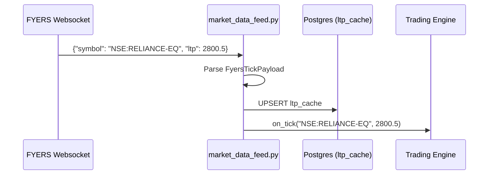
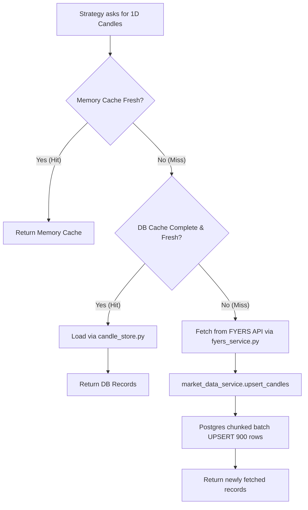

# 08 Market Data Pipeline

This document explains the architecture, flow, and database optimizations behind the Trading System's Market Data Pipeline. It is divided into three tiers of complexity: Beginner, Intermediate, and Expert.

## 1. Beginner: The 10,000-Foot View

The Market Data Pipeline is responsible for gathering, storing, and serving pricing data so the trading system can make decisions. Imagine it as the nervous system of the application:
1. **Live Pricing (LTP - Last Traded Price)**: Streams in real-time from the broker (FYERS) through a persistent Websocket connection. 
2. **Historical Data (Candlesticks/OHLCV)**: Downloaded in bulk for past days/months to calculate technical indicators (like Moving Averages).

### Real Stock Example
If you want to trade **NSE:RELIANCE-EQ**, the system:
1. Adds `NSE:RELIANCE-EQ` to its active "watch list" via Websockets.
2. Every time Reliance's price ticks on the exchange, the broker sends a tiny message (`{"symbol": "NSE:RELIANCE-EQ", "ltp": 2500.50}`) to our server.
3. Concurrently, it downloads the past 2 years of Reliance's daily prices (Open, High, Low, Close, Volume) and saves them in our database so it doesn't have to download them again tomorrow.

---

## 2. Intermediate: Files, Flows, and Logic

The pipeline spans several key files in `backend/app/services/`.

### 2.1 `market_data_feed.py` (The Websocket Adapter)
- **Role**: Manages the persistent, real-time data connection.
- **Inputs**: Fyers access token, `sync_symbols()` command with a list of symbols.
- **Outputs**: Triggers the `on_tick(symbol, ltp)` callback for every price change.
- **Business Logic**: 
  - Runs a background thread (`fyers-data-feed`) to prevent blocking the main web server.
  - Automatically filters out empty "heartbeat" messages.
  - Safely converts unstructured JSON into strongly typed `FyersTickPayload` objects.

### 2.2 `fyers_service.py` (The Broker Gateway)
- **Role**: Coordinates REST API calls to FYERS for historical data and fallback live quotes.
- **Inputs**: `fetch_ltp(symbol)`, `fetch_ohlcv(symbol, mode, resolution, lookback)`.
- **Outputs**: Returns current prices (`float`) or lists of `OHLCVPoint`.
- **Business Logic**:
  - Implements a tiered fallback strategy. If asked for a live quote, it first checks a fast PostgreSQL cache. If empty, it locks the request, fetches from FYERS, and updates the cache.
  - Manages a 300-second Memory Cache (`_ohlcv_cache`) for frequently requested historical charts.

### 2.3 `candle_store.py` (The Database Storage)
- **Role**: Handles reading/writing historical daily (`1D`) candles to PostgreSQL.
- **Inputs**: `store_candles(df)`, `load_candles(symbol)`.
- **Outputs**: Pandas DataFrames or lists of dictionaries.
- **Business Logic**:
  - Automatically identifies if the cache is "fresh" (`is_cache_fresh()`, `has_completed_daily_session()`) based on whether today is a weekend or if 30 minutes have passed.
  - Converts string dates into timezone-aware PostgreSQL timestamps.

---

## 3. Expert: Architecture, Caching, and Optimizations

At scale, a market data pipeline faces two massive hurdles: **Network Latency** and **Database Deadlocks**.

### 3.1 Tiered Caching Strategy
The system aggressively avoids hitting the FYERS API (to prevent `429 Too Many Requests`).
1. **L1: Thread-Safe Memory Cache** (`fyers_service.py`). Holds OHLCV data for 300 seconds. Locked via `threading.Lock()` to prevent cache stampedes.
2. **L2: Postgres LTP Cache** (`market_data.ltp_cache`). A highly-volatile table updated by websockets and REST calls. Quotes have a 15-second TTL.
3. **L3: Postgres Historical Cache** (`market_data.candles`). Persistent table for 1D candles. `market_data_service.py` validates cache integrity (checking for gaps, missing days, and staleness).

### 3.2 Database Optimizations (`market_data_service.py`)
Handling thousands of candles across hundreds of symbols requires strict database rules:
- **Chunked Batching**: `upsert_candles` divides large pandas DataFrames into chunks of exactly 900 records to prevent blowing out memory and transaction log limits.
- **Idempotent UPSERTs**: Uses PostgreSQL's `ON CONFLICT DO UPDATE`. If a candle for `NSE:TCS-EQ` on `2024-01-01` already exists, it updates the values rather than crashing or creating duplicates.
- **Exponential Backoff & Jitter**: When massive parallel scans occur, Postgres might throw an `OperationalError` (database locked). The pipeline catches this and sleeps for `0.5 * (2^(attempt-1)) + random(0, 0.5)` seconds before retrying, preventing deadlocks.
- **Silent Rollback Detection**: Explicitly reads back the database inside a new session (`verify_db`) to guarantee the commit succeeded.

### 3.3 Websocket Threading Behavior
The `FyersDataSocket` uses `litemode=True` (fetching minimal data) and runs in a `daemon=True` thread. Connection loss automatically triggers `on_connection_change(False)`, prompting the live state machine to switch gracefully back to REST polling.

### 3.4 Data Flow Diagrams

#### Realtime Data Flow (Websockets)

#### Historical Data Fetch Flow (OHLCV)

