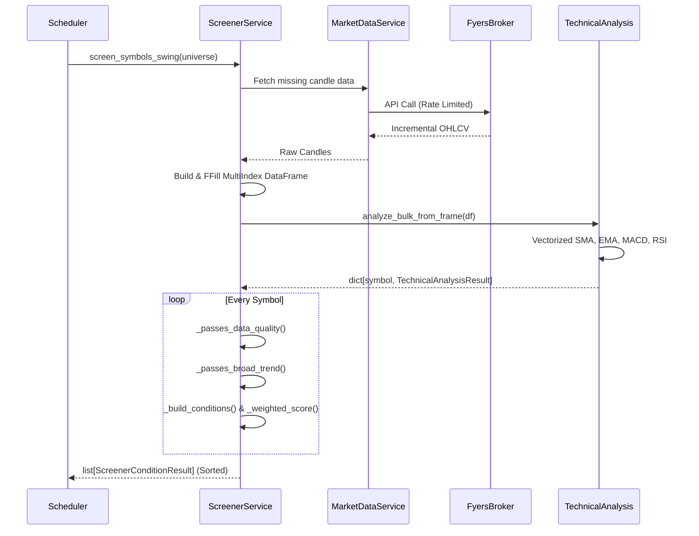

# Scanner Engine Architecture

The Scanner Engine is the core market discovery component of the trading system. It analyzes the broader market universe (e.g., Nifty 500) to identify high-probability trading setups based on technical indicators, market structure, and liquidity metrics. 

This document explains the engine's architecture, workflows, business logic, and code paths, structured for readers of all experience levels.

---

## 1. Beginner: What is the Scanner Engine?

At its core, the Scanner Engine is a filtering system. Imagine looking at 500 different stocks every day and trying to figure out which ones are primed for a breakout. Doing this manually takes hours. The Scanner Engine automates this by:
1. **Fetching historical data**: Pulling daily price and volume data for hundreds of stocks.
2. **Applying technical indicators**: Calculating moving averages (SMA, EMA), momentum (RSI, MACD), and trend direction (Supertrend).
3. **Scoring and Filtering**: Grading each stock out of 100 based on its technical strength and throwing out stocks that don't meet minimum liquidity or trend requirements.
4. **Generating shortlists**: Passing the highest-scoring stocks back to the trading system or dashboard.

### Market Hours Behavior
The Scanner Engine typically runs **post-market** (e.g., end-of-day for swing trading) to evaluate daily candles. It expects complete daily candles to make structural decisions (like Higher Highs / Higher Lows) and relies heavily on the `CANDLE_CACHE_DB` for speed.

---

## 2. Intermediate: Workflows & Business Logic

### Scanner Workflows
The swing scanning process follows an 8-step pipeline managed in `ScreenerService.screen_symbols_swing()`:

1. **Cache Validation & Backfill**: Checks if the local database has enough contiguous historical data (minimum 240 candles for swing analysis). If gaps are found, it fetches incremental missing data from the broker (FYERS).
2. **DataFrame Construction**: Merges and forward-fills (`ffill()`) missing data points into a single multi-index Pandas DataFrame containing the entire universe.
3. **Vectorized Bulk Analysis**: Passes the massive single DataFrame to the `TechnicalAnalysisService`, which calculates all technical indicators (EMA, SMA, RSI, MACD) in bulk using Pandas vectorization.
4. **Data Quality Validation**: Rejects symbols with insufficient history (< 220 candles) or low liquidity (less than 25 active trading days out of the last 30).
5. **Broad Trend Eligibility**: Filters out stocks that are in long-term downtrends. A stock must have its `close > SMA_50` and `SMA_50 > SMA_200`.
6. **Condition Building**: Evaluates over 20 boolean conditions (e.g., `macd_positive`, `hammer_or_gravestone`).
7. **Weighted Scoring**: Calculates a composite score (out of 100) combining the technical engine's score and individual screener condition weights.
8. **Final Shortlisting**: Sorts the results and flags stocks as `matched=True` if they pass broad trend eligibility and achieve a score $\ge 52$.

### The Scoring System
The final `screener_score` is a blend of:
- **Technical Score (50%)**: Derived from `TechnicalAnalysisService`, rewarding EMA alignments, RSI, and market structure.
- **Trend Rules (12 points)**: Broad trend eligibility.
- **Hard Filters (6 points)**: Passing core trend, momentum, and liquidity filters.
- **Moving Averages (9 points)**: Close > EMA20 (+4), EMA20 > EMA50 (+5).
- **Momentum (11 points)**: Supertrend positive (+4), MACD positive (+4), RSI supportive (+3).
- **Market Structure (12 points)**: Consecutive Higher Highs / Higher Lows (2D, 3D, 4D).
- **Volume & Candlestick (10+ points)**: Hammer/Gravestone patterns (+2), High volume (+6), and dynamic volume lift bonuses (up to +8).

### Execution Guards
- **Rate Limiting**: `TokenBucketRateLimiter` enforces strict limits (e.g., 5 calls/sec) on broker APIs to prevent bans.
- **Fallbacks**: If broker data fails, `fallback_fetch_yfinance()` kicks in to scrape Yahoo Finance.
- **Memory Optimization**: The system avoids Python objects (`OHLCVPoint`) for bulk operations, leveraging raw Pandas DataFrames to process thousands of stocks without excessive RAM usage.

---

## 3. Expert: Code Paths & Deep Dive

### 3.1. `screener_service.py`
This service acts as the orchestrator for the screening pipeline.

* **Inputs**: `symbols: list[str]`, `lookback_window: int`
* **Outputs**: `list[ScreenerConditionResult]`
* **Key Methods**:
  * `screen_symbols_swing()`: The entry point. Handles async concurrent fetching of missing symbol data, builds a multi-index DataFrame (`timestamp`, `symbol`), and dispatches to the technical analyzer.
  * `_process_single_symbol()`: Sequentially processes the vectorized results. Handles data quality gates, conditions evaluation, and scan logging.
  * `_passes_data_quality()`: Ensures the last 30 candles have at least 25 active volume days.
  * `_passes_broad_trend()`: Enforces the `close > SMA_50 > SMA_200` hierarchy and volume > 100k.
  * `_weighted_score()`: Applies the mathematical scoring weights logic.

### 3.2. `technical_analysis_service.py`
This service is a pure mathematical engine containing no side effects or API calls.

* **Inputs**: MultiIndex `pd.DataFrame` containing `open, high, low, close, volume`
* **Outputs**: `dict[str, TechnicalAnalysisResult]`
* **Key Methods**:
  * `analyze_bulk_from_frame()`: A highly optimized, vectorized function. It groups the DataFrame by `symbol` and uses Pandas `.transform()` to apply TA indicators (`ewm`, `rolling`) across the entire universe simultaneously. This avoids the $O(N)$ penalty of iterating through 500 symbols sequentially.
  * `_calculate_supertrend()`: Custom implementation of the Supertrend indicator (ATR multiplier).
  * `_is_hammer()` & `_is_gravestone_doji()`: Mathematical definitions of candlestick structures based on wick-to-body ratios.

### Memory & Concurrency Architecture
The Scanner Engine specifically addresses out-of-memory (OOM) issues encountered in earlier iterations. By passing a single DataFrame to `analyze_bulk_from_frame()` rather than converting rows to Pydantic objects, memory allocations are reduced by ~280MB per run. The `MarketDataService` handles the asynchronous IO bounds, while the `TechnicalAnalysisService` acts strictly CPU-bound.

---

## 4. Mermaid Flow Diagrams

### Scanner Engine E2E Workflow

---

## 5. Real Stock Screening Examples

### Example 1: Bullish Breakout (High Score - Shortlisted)
**Symbol:** `RELIANCE`
* **Context**: The stock is in a clear uptrend and experiencing a volume breakout.
* **Indicators**:
  * `close` (2950) > `SMA_50` (2800) > `SMA_200` (2600) -> *Broad Trend Eligibility Passed*
  * `EMA_20` > `EMA_50`
  * `RSI` = 62 (Supportive & Buy Zone)
  * MACD is positive.
  * Volume is 200% higher than the previous day.
* **Result**: `screener_score` = **86.5**. `matched=True`. Handed off for trading evaluation.

### Example 2: Failed Broad Trend (Rejected)
**Symbol:** `PAYTM`
* **Context**: The stock has short-term momentum but is in a long-term structural downtrend.
* **Indicators**:
  * `close` (450) > `SMA_50` (400)
  * `SMA_50` (400) **<** `SMA_200` (600) -> *Broad Trend Eligibility Failed*
  * High volume and MACD positive.
* **Result**: `screener_score` = **42.0**. `matched=False`. The short-term momentum is ignored because the macro trend is bearish.

### Example 3: Data Quality Failure (Rejected)
**Symbol:** `ILLIQUID_STOCK`
* **Context**: A penny stock with erratic trading.
* **Indicators**:
  * Only 15 active volume days in the last 30 days (multiple days with 0 volume).
* **Result**: Fails `_passes_data_quality()`. Scored **0.0** with condition `data_quality_failed=True`. Skipped entirely to protect the portfolio from slippage.
