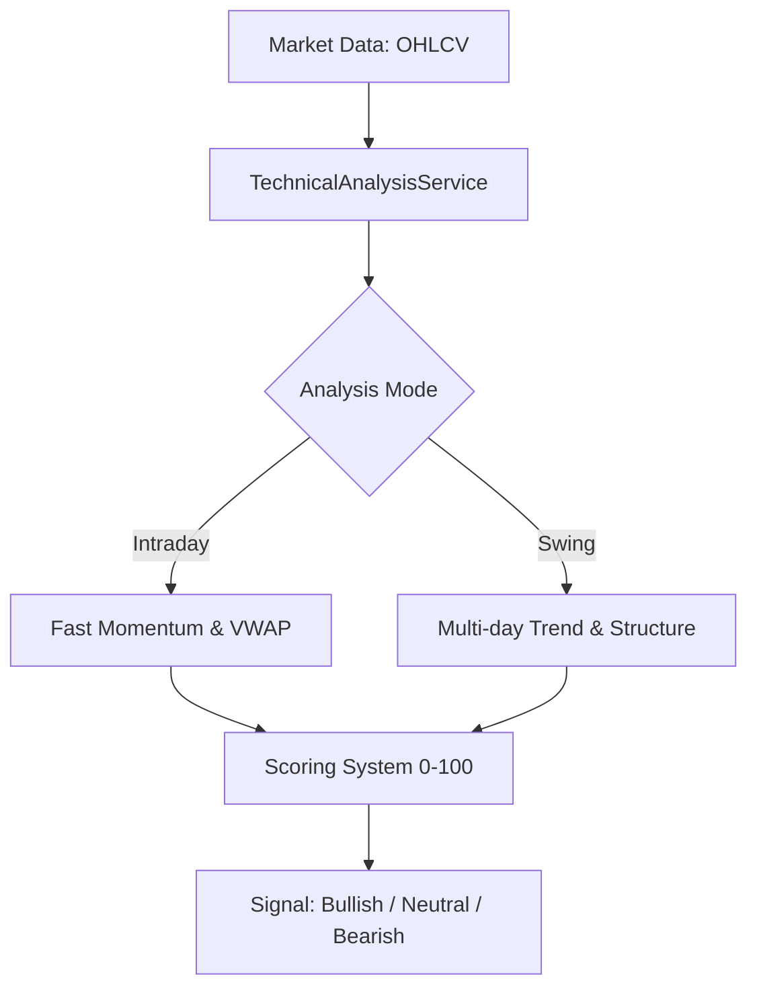

# Technical Analysis Engine Documentation

## 1. Overview
The Technical Analysis Engine is the core mathematical component responsible for evaluating market data (OHLCV - Open, High, Low, Close, Volume) and generating trading signals (Bullish, Neutral, Bearish). The logic is encapsulated in `backend/app/services/technical_analysis_service.py` within the `TechnicalAnalysisService` class.

---

## 2. Beginner Section: Understanding the Engine

### What does the Engine do?
At its core, the Technical Analysis Engine acts like a mechanical financial analyst. It looks at the price history of a stock and answers three questions:
1. **Trend:** Is the price going up or down? (Using Moving Averages & Supertrend)
2. **Momentum:** How fast is it moving? Is it overbought or oversold? (Using RSI & MACD)
3. **Conviction:** Is there real money behind the move? (Using Volume & Liquidity checks)

### High-Level Data Flow


---

## 3. Intermediate Section: Indicators & Protections

### Indicators Explained
The engine computes several classical technical indicators to form its decisions:

1. **EMA (Exponential Moving Average) & SMA (Simple Moving Average):**
   - **Usage:** EMA gives more weight to recent prices, making it faster to react. SMA is used for longer-term baseline trends.
   - **Calculations:** `ema_9`, `ema_20`, `ema_50` and `sma_20` to `sma_200`.

2. **RSI (Relative Strength Index - 14 Period):**
   - **Usage:** Measures momentum on a scale of 0 to 100.
   - **Engine Logic:** Calculated using exponential moving averages of gains and losses. A value above 50 is considered supportive, and 55-68 is the "Buy Zone".

3. **MACD (Moving Average Convergence Divergence):**
   - **Usage:** Measures the relationship between two moving averages (EMA 12 and EMA 26).
   - **Engine Logic:** `macd = ema_12 - ema_26`. A positive MACD (MACD line > Signal Line of 9-EMA) indicates bullish momentum.

4. **VWAP (Volume Weighted Average Price) & Volume Trends:**
   - **Usage:** Intraday relies heavily on VWAP. If the price is above VWAP, buyers are in control.
   - **Engine Logic:** Volume expanding over the last 5 days compared to 20 days is seen as a positive conviction signal.

5. **Supertrend:**
   - **Usage:** A trend-following indicator based on Average True Range (ATR).
   - **Engine Logic:** Uses a 10-period ATR with a 3.0 multiplier. If the price stays above the Supertrend line, the trend is positive.

6. **Market Structure (Breakouts & HH/HL):**
   - **Usage:** Looks for Higher Highs and Higher Lows (HH/HL) over a 2, 3, and 4-day period. This validates a breakout.

7. **Candlestick Patterns:**
   - Detects `Hammer` (bullish reversal) and `Gravestone Doji` (bearish reversal) based on body vs. wick proportions.

### False Positive Protections
To prevent bad data or illiquid stocks from triggering false signals, the engine employs strict defensive programming:
1. **Short-History Protection:** Skips analysis if the symbol has fewer than 20 candles (`len(sym_candles) < 20`).
2. **NaN Handling:** Safe fallbacks to `0.0` if an indicator cannot be calculated (`float(inds["ema_20"]) if not pd.isna(...) else 0.0`).
3. **Liquidity Filters:** 
   - `volume_above_50000`: Ensures at least 50k shares traded.
   - `price_above_100` and `price_below_500000`: Avoids penny stocks and anomaly prices.
4. **Hard Filters (Swing Mode):** A stock *must* pass Core Trend (`close > EMA20` & `Supertrend Positive`), Core Momentum (`MACD positive` & `RSI > 50`), and Basic Liquidity to even be considered for a "Bullish" rating.

---

## 4. Expert Section: Algorithms & Vectorization

### Code Paths
- **File:** `backend/app/services/technical_analysis_service.py`
- **Main Methods:** 
  - `analyze_bulk(universe_candles, mode)`: Converts raw `OHLCVPoint` objects into DataFrames.
  - `analyze_bulk_from_frame(frame, mode)`: A memory-optimized path utilizing a pre-built MultiIndex DataFrame to save ~280 MB of RAM allocation.

### Vectorization Architecture
To handle thousands of symbols efficiently, the engine avoids `for` loops where possible and uses Pandas vectorization:

- **Intraday Vectorization (`unstack` method):**
  The engine unstacks the DataFrame by symbol, calculating EMA, RSI, and MACD across all symbols simultaneously as columns in a matrix.
  
- **Swing Vectorization (`groupby` method):**
  Uses `grouped = frame.groupby(level="symbol")` combined with `.transform()`. This applies the rolling logic per-symbol but executes in C-optimized Pandas backend.
  ```python
  ema_20_series = grouped["close"].transform(lambda x: x.ewm(span=20, adjust=False).mean())
  rsi_14_series = grouped["close"].transform(calc_rsi)
  ```

### Scoring Matrix
The system assigns a mathematical score out of 100 based on weightings:

**Intraday Scoring (Max 100):**
- Close > VWAP (+20)
- EMA 9 > EMA 20 (+20)
- EMA 20 > EMA 50 (+15)
- MACD > Signal (+15)
- RSI 52-72 (+15)
- Volume Expanding (+15)
- Close > EMA 9 (+15)
- *Thresholds:* Bullish >= 68, Neutral >= 48

**Swing Scoring (Max 100):**
- Close > EMA 20 (+18)
- EMA 20 > EMA 50 (+12)
- Supertrend Positive (+16)
- MACD Positive (+12)
- RSI Supportive > 50 (+8)
- RSI in Buy Zone (+6)
- SMA 20d Uptrend (+8)
- Higher Timeframe Trend (+10)
- Volume/Liquidity bonuses (+11)
- Structural Score (HH/HL) (up to +12)
- *Thresholds:* Bullish >= 72, Neutral >= 52 (Must also pass `hard_filters`)

---

## 5. Real Stock Calculation Example

Let's trace a hypothetical stock, "XYZ", to see how the RSI and MACD math resolves in the Engine.

**Stock XYZ - Last 5 Days Close Prices:**
Day 1: 100, Day 2: 102, Day 3: 101, Day 4: 105, Day 5: 108

**1. RSI Calculation (14-period simplified):**
- *Gains:* +2, 0, +4, +3
- *Losses:* 0, -1, 0, 0
- The engine calculates Exponential Moving Average of gains and losses (`alpha=1/14`).
- Assuming Avg Gain = 2.25, Avg Loss = 0.25 -> RS = 2.25 / 0.25 = 9.0
- RSI = `100 - (100 / (1 + 9))` = **90.0** (Highly Overbought!)

**2. MACD Calculation:**
- EMA 12: Reacts faster to the move from 100 to 108.
- EMA 26: Lags behind.
- MACD Line (`EMA 12 - EMA 26`): Will be strongly positive because recent prices are spiking.
- Signal Line (`9 EMA of MACD`): Will trail the MACD line.
- Engine evaluates `macd_positive = bool(macd_value > macd_signal)`. Since MACD is spiking, this evaluates to `True` (+12 points in Swing Mode).

**3. Engine Output:**
Assuming Volume > 50,000 and price > 100, the stock passes the liquidity filter. With price > EMA 20, RSI > 50, and MACD positive, the stock passes the `hard_filters_pass`. The cumulative score would likely hit > 72, resulting in a **Bullish** `TechnicalAnalysisResult`.
