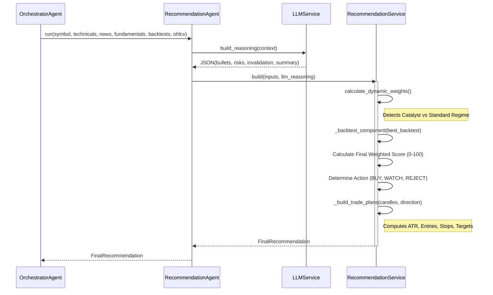

# 11: Recommendation Engine Architecture

## Overview
The Recommendation Engine is the final decision-making layer of the trading system. It aggregates technical indicators, sentiment analysis, fundamental data, and historical backtesting to produce a singular advisory rating: **BUY**, **WATCH** (Hold), or **REJECT** (Sell/Avoid). 

This document breaks down the engine's internal mechanics, scoring systems, and false-positive protections across three difficulty levels.

---

## 🟢 Beginner Section: How It Works

Imagine the Recommendation Engine as a committee of experts deciding whether to buy a stock. 

1. **The Technical Expert** looks at price charts and indicators (up to 50% of the vote).
2. **The Quantitative Expert** looks at historical backtests to see if the strategy actually works (up to 25% of the vote).
3. **The Fundamental Expert** evaluates the financial health of the company (up to 25% of the vote).
4. **The News Expert** reads the latest headlines (only steps in during major news events).

The engine tallies the scores out of 100:
- **72 to 100**: **BUY** 📈 (High confidence setup)
- **55 to 71**: **WATCH** 🔍 (Hold / Keep an eye on it)
- **0 to 54**: **REJECT** ❌ (Sell / Avoid)

### Example
**AAPL (Apple Inc.)**
- Technicals are strong (Score: 80/100).
- Backtests show this pattern wins 60% of the time.
- Fundamentals are solid.
- Final Engine Score: 78 -> **BUY**.

---

## 🟡 Intermediate Section: Business Logic & Data Flow

### The Files Involved
1. `backend/app/agents/orchestrator_agent.py`: Orchestrates the aggregation of all data (Technicals, News, Fundamentals, Backtests) and passes it to the `RecommendationAgent`.
2. `backend/app/agents/recommendation_agent.py`: Bridges the data with the `LLMService` to generate human-readable reasoning and risk factors, then triggers the `RecommendationService`.
3. `backend/app/services/recommendation_service.py`: The core math engine. It calculates dynamic weights, normalizes scores, generates the final score/action, and builds specific Trade Plans (Entry, Stop Loss, Targets).
4. `backend/app/services/llm_service.py`: Analyzes news sentiment (-1.0 to 1.0) and generates contextual reasoning.

### Recommendation Generation Step-by-Step

#### 1. Input Aggregation
The engine receives:
- `technical_results`: Vectorized technical scores (0-100) and signals (bullish/bearish).
- `sentiment_score`: News sentiment from LLM (-1.0 to 1.0).
- `fundamental_result`: Financial health score (-1.0 to 1.0).
- `backtests`: Historical performance of the setup.
- `candles_by_mode`: Price history (Volume, Open, High, Low, Close).

#### 2. Dynamic Weight Calculation
The engine adjusts its reliance on technicals based on the environment:
- **Standard Regime**: Technicals (50%), Backtest (25%), Fundamentals (25%), News (0%).
- **Catalyst Regime**: Triggered if Volume > 300% of average OR News Sentiment is extreme (`>= 0.75` or `<= -0.75`). 
  - *Shifted Weights*: News (30%), Fundamentals (30%), Technicals (20%), Backtest (20%).

#### 3. Component Normalization
- **Technical**: Used directly (0-100).
- **Backtest**: `Total Return * 4` (Capped between -20 and 100). Requires at least 5 historical trades.
- **News**: `Sentiment Score * 100` (-100 to 100).
- **Fundamentals**: `Fundamental Score * 100` (-100 to 100).

#### 4. Final Scoring & Decision
`Final Score = (Tech * Tech_Wt) + (Backtest * Backtest_Wt) + (News * News_Wt) + (Fund * Fund_Wt)`

- **BUY**: Score >= 72
- **WATCH (Hold)**: 55 <= Score < 72
- **REJECT (Sell/Avoid)**: Score < 55

---

## 🔴 Expert Section: Algorithms & Sequence Diagrams

### False Positive Protections
1. **Volume Catalyst Gating**: A purely technical breakout is penalized if it lacks volume backing. It requires 3x average volume to trigger catalyst weights.
2. **Backtest Trade Count Minimums**: The `_backtest_component` strictly returns `0.0` if `trade_count < 5`. This prevents low-sample-size anomalies from inflating the score.
3. **Sentiment Clamping**: Sentiment is bounded between -1.0 and 1.0 using Groq LLM constraints with `temperature=0.0` for deterministic parsing.
4. **Strict Buy Gate**: Orchestrator overrides (e.g., `_enforce_strict_buy_gate`) ensure that systemic market filters (e.g., VIX spikes, sector breadth) can downgrade a BUY to a WATCH.

### Sequence Diagram


### Decision Tree: Action Logic
```mermaid
graph TD
    A[Input Data Aggregation] --> B{Is Volume > 3x Avg OR |Sentiment| >= 0.75?}
    
    B -- Yes --> C[Catalyst Regime]
    C --> E[News: 30%, Fund: 30%, Tech: 20%, BT: 20%]
    
    B -- No --> D[Standard Regime]
    D --> F[Tech: 50%, BT: 25%, Fund: 25%, News: 0%]
    
    E --> G[Calculate Weighted Score 0-100]
    F --> G
    
    G --> H{Score >= 72?}
    H -- Yes --> I[Action: BUY]
    H -- No --> J{Score >= 55?}
    J -- Yes --> K[Action: WATCH / HOLD]
    J -- No --> L[Action: REJECT / SELL]
    
    I --> M[Generate Trade Plans ATR-based Entry/Stop]
    K --> M
    L --> M
```

### Advanced Trade Plan Generation Logic
The engine dynamically calculates Average True Range (ATR) over the last 10 candles to dictate risk/reward scaling:
- **Long Bias (`direction >= 0`)**:
  - Entry Low: `Current Price - (ATR * 0.25)`
  - Stop Loss: `Entry Low - (ATR * 0.90)`
  - Target 1: `Entry High + (ATR * 1.2)`
- **Short Bias (`direction < 0`)**:
  - Inverted logic with Stop Loss above current resistance.
- **Risk/Reward**: Calculated strictly as `|Target 1 - Mid_Entry| / |Mid_Entry - Stop_Loss|`.
