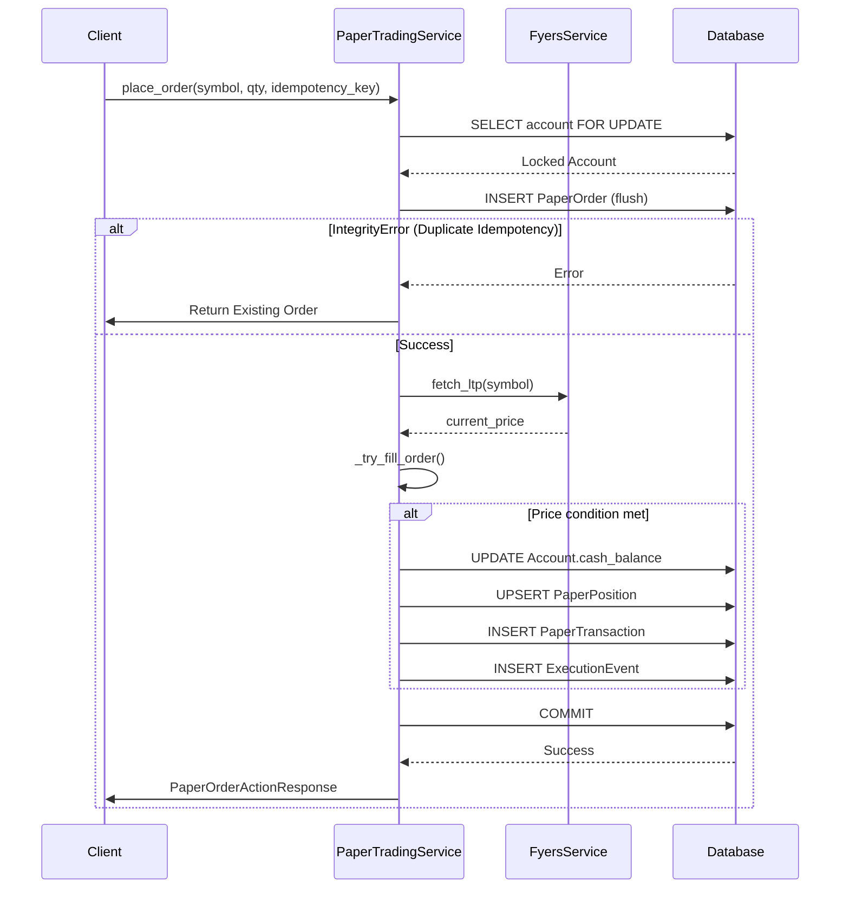
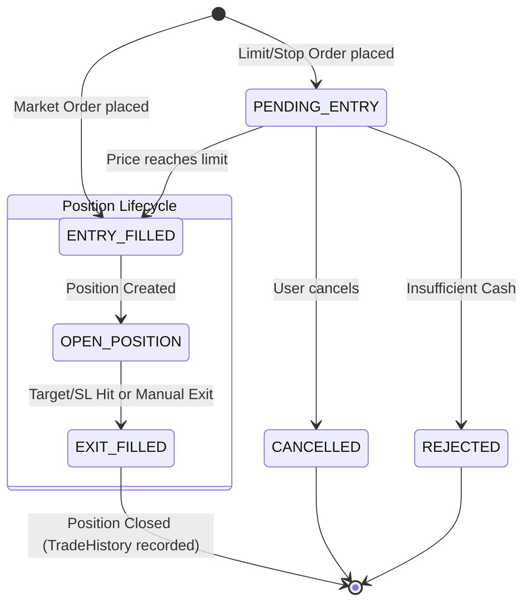

# 12_PAPER_TRADING_ENGINE

## 1. Introduction and Overview
The Paper Trading Engine simulates a live brokerage environment, allowing users and automated algorithms to test trading strategies without risking real capital. It maintains a fully functional order management system, position tracking, real-time portfolio margin constraints, and idempotency guarantees identical to a live exchange integration.

This document details the inner workings of the Paper Trading Engine.

---

## 2. Beginner Section: The Basics of Paper Trading

### What is Paper Trading?
Paper trading is "simulated trading." You are given fake money (e.g., ₹10,00,000) to buy and sell stocks using real-time market data. The system tracks how much you would have made or lost if you had used real money.

### Core Lifecycles

1. **Order Lifecycle**: When you want to buy a stock, you place an **Order**.
   - **PENDING**: The order is waiting for the market price to reach your desired price (Limit/Stop orders).
   - **FILLED**: The order was successfully executed.
   - **REJECTED**: The order failed (e.g., not enough money).
   - **CANCELLED**: You manually cancelled the order before it executed.

2. **Position Lifecycle**: Once a Buy order is FILLED, it becomes a **Position**.
   - A position means you "own" the stock.
   - It tracks your `avg_entry_price` and `current_price` to show how much you are winning or losing (Unrealized PnL).

3. **Trade History**: When you sell your position, it is closed. The final profit or loss is "Realized", and the transaction is recorded in your **Trade History**.

### Real Example
- **Step 1**: You have ₹10,00,000.
- **Step 2**: You place a Market BUY order for 100 shares of RELIANCE at ₹2,500.
- **Step 3**: The order is **FILLED**. Your cash drops to ₹7,50,000. You now have an OPEN position of 100 RELIANCE shares.
- **Step 4**: RELIANCE goes up to ₹2,600. Your position shows +₹10,000 Unrealized PnL.
- **Step 5**: You place a SELL order for 100 shares. The order is **FILLED**. Your position is closed. You receive ₹2,60,000 in cash.
- **Step 6**: Your final cash is ₹10,10,000. Trade History records a +₹10,000 Realized PnL.

---

## 3. Intermediate Section: File Architecture & Logic

The paper trading engine is governed by two primary files:

### A. `backend/app/models/paper_trading.py`
**Purpose**: Defines the database schemas (SQLAlchemy models) for storing the state of the simulation.
- **Inputs**: Database operations (Insert/Update) via SQLAlchemy.
- **Outputs**: Relational data representing accounts, orders, and positions.
- **Business Logic**: 
  - Enforces database-level constraints like `UniqueConstraint` on idempotency keys.
  - Generates UUIDs automatically.
  - Prevents updates to immutable logs via SQLAlchemy events (`prevent_execution_event_update`).

### B. `backend/app/services/paper_trading_service.py`
**Purpose**: The central processing unit of the simulation containing the core business logic.
- **Inputs**: User requests (via API payloads like `PaperOrderCreateRequest`), Market data (`current_price` from `FyersService`).
- **Outputs**: Actions (`PaperOrderActionResponse`), modified database state, Portfolio summaries.
- **Exact Code Paths**:
  - **`place_order`**: Receives an order -> Validates Idempotency -> Locks Account -> Creates `PaperOrder` -> calls `_try_fill_order`.
  - **`_try_fill_order`**: Evaluates `current_price` against order limits. If a match occurs, modifies `PaperOrder` status to `FILLED`, deducts/adds `cash_balance`, upserts `PaperPosition`, creates `PaperTransaction`, logs `ExecutionEvent`, and if closed, creates `PaperTradeHistory`.
  - **`auto_exit`**: Specifically used by background workers to exit positions hitting target/stop-loss. Enforces strict deduplication so it doesn't fire twice.

### PnL and Portfolio Calculations
Handled primarily inside `_build_account_summary` and `_serialize_position`:

1. **Unrealized PnL**:
   `Unrealized PnL = (Current Price - Average Entry Price) * Quantity`
2. **Realized PnL**:
   `Realized PnL = (Exit Price - Average Entry Price) * Quantity`
3. **Reserved Cash**:
   Limit BUY orders that are PENDING lock up capital.
   `Reserved Cash = sum(Limit Price * Quantity) for all PENDING BUY orders`
4. **Equity**:
   `Equity = Cash Balance + Total Position Value`
5. **Available Cash**:
   `Available Cash = Cash Balance - Reserved Cash`

---

## 4. Expert Section: Concurrency, Protections, and Edge Cases

Operating an order management system requires strict guarantees against race conditions. If an algorithmic scanner and a user simultaneously try to close a position, or double-click a "Buy" button, the system must not duplicate the trade or over-allocate margin.

### 4.1 Race Condition Protections

1. **Pessimistic Row Locking (`with_for_update`)**:
   Inside `_get_or_create_account(for_update=True)` and `auto_exit`, the system executes `SELECT ... FOR UPDATE`. This locks the specific `PaperTradingAccount` and `PaperPosition` rows in PostgreSQL. If multiple threads try to place an order simultaneously, they are serialized.
2. **Execution Event Deduplication**:
   Every state transition creates a `ExecutionEvent`. This table has a unique index on `dedupe_key`.
   - e.g., `dedupe_key = f"exit-filled:{position.id}:{reason}"`
   If thread A and thread B both trigger a Stop Loss, Thread A inserts the event. Thread B's insert will fail the unique constraint, safely aborting the duplicate sell order.
3. **Append-Only Immutable Logs**:
   A SQLAlchemy event listener (`@event.listens_for(ExecutionEvent, "before_update")`) throws a `ValueError` if any code attempts to UPDATE an execution event. This ensures audit trails are purely append-only.

### 4.2 Duplicate Order Protections (Idempotency)

When a client calls `place_order`, they must supply an `idempotency_key` (e.g., `uuid4()`). 
- The `PaperOrder.idempotency_key` column has a `UNIQUE` constraint.
- In `place_order`:
  ```python
  try:
      self.db.add(order)
      self.db.flush()
  except IntegrityError:
      self.db.rollback()
      return existing_order # Safely returns the previous successful result
  ```
- This prevents duplicate orders on network retries.

### 4.3 Failure Recovery Mechanisms

- **Atomic Transactions**: Orders, positions, account balance, transaction logs, and notifications are all committed in a single `self.db.commit()` call at the very end of `place_order`. If writing the transaction log fails, the entire order is rolled back, preventing phantom cash deductions.
- **Orphan Order Sweeping (`_refresh_pending_orders`)**: If a limit order was placed but market data disconnected, it stays `PENDING`. On subsequent account loads, `_refresh_pending_orders` iterates all pending orders and re-evaluates them against the latest `PriceSnapshot` cache, bridging the gap.

---

## 5. Visual Specifications

### Mermaid Sequence Diagram: Order Placement & Fill



### Mermaid State Diagram: Order & Position Lifecycle


