# 13_BACKTESTING_ENGINE.md

# Backtesting Engine Architecture

## 1. Executive Summary
The Backtesting Engine provides historical validation of trading strategies against asset price history (OHLCV data). It is designed to evaluate both intraday and daily intervals using dynamic technical indicators (EMA, MACD, RSI, Volume). The engine operates asynchronously, leverages CPU multithreading for Pandas-based computations, and features strict error-handling and race-condition protections to ensure stability in a concurrent execution environment.

---

## 2. Beginner Section

### What is the Backtesting Engine?
Before we risk real money on a trading idea, we want to know how it would have performed in the past. The backtesting engine simulates trading based on specific rules (like "buy when the trend goes up and momentum is strong") using historical stock data.

### High-Level Workflow
1. **Gather Data:** The system pulls historical price candles (Open, High, Low, Close, Volume) for a stock.
2. **Apply Indicators:** It calculates technical indicators like Moving Averages (EMA), Momentum (RSI), and MACD.
3. **Simulate Trading:** It iterates over the data, buying when entry conditions are met and selling when exit conditions trigger.
4. **Calculate Performance:** It computes the overall return, win rate, and maximum drawdown (how much the account lost from its peak).
5. **Save Results:** The final performance scorecard is saved to the database to help decide if the strategy is viable.

---

## 3. Intermediate Section

### Backtest Execution Flow

The following sequence diagram illustrates the lifecycle of a backtesting request, from orchestration to persistence.

```mermaid
sequenceDiagram
    participant O as OrchestratorAgent
    participant BA as BacktestAgent
    participant BS as BacktestService
    participant DB as Database (Postgres)

    O->>BA: run(symbol, mode, candles)
    Note over O,BA: Executed via asyncio.to_thread
    BA->>BS: run(symbol, mode, candles)
    
    rect rgb(30, 30, 30)
        Note over BS: Historical Data Flow
        BS->>BS: Convert candles to Pandas DataFrame
        BS->>BS: Sort & Fill Missing Data (ffill, bfill)
        BS->>BS: Calculate Indicators (EMA, RSI, MACD)
        BS->>BS: Iterrows() - Simulate Trade Entries & Exits
        BS->>BS: Compute Metrics (CAGR, Win Rate, Sharpe)
    end
    
    BS-->>BA: BacktestResult
    BA-->>O: BacktestResult
    
    O->>DB: _persist_analysis() -> Save to BacktestHistory
    DB-->>O: Success
```



### Historical Data Flow
1. **Ingestion:** Raw `OHLCVPoint` objects are received from the orchestrator.
2. **DataFrame Conversion:** Transformed into a Pandas DataFrame for vectorized operations.
3. **Cleansing:** Timestamps are normalized; missing values are patched using forward-fill (`ffill`) and backward-fill (`bfill`).
4. **Indicator Generation:** The `ta` library is used to compute fast/slow EMA windows, RSI, MACD, and rolling average volume. Window sizes dynamically adjust based on the `AnalysisMode` (intraday vs. daily).

---

## 4. Expert Section

### Algorithms and Trade Logic
The core strategy implemented in the engine dynamically shifts based on timeframe:
*   **Intraday:** `ema_rsi_volume` (Fast EMA 9, Slow EMA 20)
*   **Daily:** `sma_rsi_macd` (Fast EMA 20, Slow EMA 50)

**Entry Signal Logic (Bullish):**
Requires absolute confluence across trend, momentum, and volume.
*   `close > ema_fast` (Price is above fast trend)
*   `ema_fast > ema_slow` (Fast trend is above slow trend)
*   `macd > macd_signal` (MACD momentum is positive)
*   `rsi >= 50` (RSI shows bullish momentum)
*   `volume >= max(avg_volume, 1) * 0.8` (Volume is at least 80% of the 20-period moving average)

**Exit Signal Logic:**
Designed to cut losses and lock in profits when the trend breaks.
*   `close < ema_fast` OR `macd < macd_signal` OR `rsi < 45`

### Failure Recovery Mechanisms
1. **Graceful Fallbacks:** If the dataset has fewer than 35 candles (insufficient for indicator warmup), `BacktestService._empty_result()` intercepts the flow and returns an empty, harmless default result with verdict `insufficient`.
2. **Thread-Level Exception Handling:** In `OrchestratorAgent.run_backtest()`, the agent execution is enclosed in a `try...except` block. If `BacktestAgent` crashes (e.g., due to malformed data), the orchestrator catches it, logs the error, and yields a fallback `BacktestResult` without killing the parent batch analysis.
3. **Math Safety:** Metrics like `profit_factor`, `win_rate`, and `sharpe_ratio` are wrapped in safeguards to prevent `ZeroDivisionError` when a backtest yields zero trades or zero losses.

### Race Condition Protections
1. **Isolated State:** The `BacktestService` does not use class-level variables for equity, positions, or trade lists. All simulation state (`equity`, `position_entry`, `trades`) is strictly confined within the scope of the `run()` method. This ensures that concurrent calls across different threads never mutate each other's data.
2. **I/O Thread Segregation:** While the orchestrator loop runs asynchronously in the main event loop, the backtest computations are CPU-bound. `OrchestratorAgent` uses `asyncio.to_thread()` to offload the heavy Pandas operations to worker threads, preventing event loop starvation.
3. **Sequential Database Writes:** All backtest simulations complete in parallel, but database persistence (`_persist_analysis()`) runs synchronously afterward. This prevents overlapping transactions and potential deadlocks on the `BacktestHistory` table.

### Performance Optimization
1. **Vectorization:** Indicators are pre-calculated entirely via vectorized `ta` operations on the Pandas DataFrame prior to the iteration loop, drastically reducing per-row computation time.
2. **Payload Compression:** The `equity_curve` is truncated to the last 50 data points (`curve = equity_curve[-50:]`). This significantly reduces the JSON payload size sent to the frontend while preserving the most relevant visual data.

---

## 5. Exact Code Paths & File Responsibilities

### `backend/app/agents/orchestrator_agent.py`
*   **Role:** Concurrency coordinator.
*   **Inputs:** `symbol`, `mode`, `candles`.
*   **Outputs:** Aggregate `AnalysisHistory` including backtest results.
*   **Code Path:** `run_analysis()` -> `_run_agents_concurrently()` -> `run_backtest()` -> `asyncio.to_thread()` -> `_persist_analysis()`.

### `backend/app/agents/backtest_agent.py`
*   **Role:** Facade for orchestrator decoupling.
*   **Inputs:** `symbol`, `mode`, `candles`.
*   **Outputs:** `BacktestResult`.
*   **Code Path:** Initializes `BacktestService` and passes parameters via `run()`.

### `backend/app/services/backtest_service.py`
*   **Role:** Core simulation engine and business logic.
*   **Inputs:** `symbol`, `mode`, `candles`.
*   **Outputs:** `BacktestResult` (with trades, CAGR, win rate).
*   **Algorithms:** Iterative backtester using dynamic EMA/MACD/RSI thresholds.
*   **Code Path:** `run()` -> DataFrame construction -> Indicator calculation -> `iterrows()` loop -> Scorecard aggregation.

### `backend/app/models/analysis.py` (Database Persistence)
*   **Role:** Storage schema for backtesting results.
*   **Schema:** `BacktestHistory` table.
*   **Columns:** `stock_id`, `mode`, `strategy_name`, `total_return`, `cagr`, `max_drawdown`, `win_rate`, `profit_factor`, `trade_count`, `verdict`.

---

## 6. Real Example of a Backtest Run

Below is a trace of an actual backtest run, indicating how an input dataset yields a structured scorecard.

**Input Payload (Abstracted):**
```json
{
  "symbol": "RELIANCE",
  "mode": "daily",
  "candles": [
    {"timestamp": "2023-01-01T00:00:00Z", "open": 2400, "high": 2450, "low": 2390, "close": 2440, "volume": 1000000},
    {"timestamp": "2023-01-02T00:00:00Z", "open": 2440, "high": 2500, "low": 2430, "close": 2490, "volume": 1500000}
    // ... 100+ candles
  ]
}
```

**Simulation Timeline:**
1. **Warmup Phase:** The first 50 candles are skipped as `ema_slow` (50-period) is populated.
2. **Entry Signal Triggered (2023-03-15):** Price crosses above fast EMA. MACD is positive. RSI is 55. Volume is 120% of average. The engine records `position_entry = 2500`.
3. **Exit Signal Triggered (2023-04-10):** Price drops below fast EMA. The engine records `exit_price = 2600`.
4. **Trade Registered:** P&L = +4.00%. Equity increases from $100,000 to $104,000.

**Output Structure (BacktestResult):**
```json
{
  "mode": "daily",
  "strategy_name": "sma_rsi_macd",
  "total_return": 4.0,
  "cagr": 12.5,
  "max_drawdown": 1.2,
  "win_rate": 100.0,
  "profit_factor": 4.0,
  "trade_count": 1,
  "verdict": "favorable",
  "sharpe_ratio": 0.0,
  "best_trade": {
    "entry_date": "2023-03-15",
    "exit_date": "2023-04-10",
    "entry_price": 2500.0,
    "exit_price": 2600.0,
    "pnl_percent": 4.0
  },
  "worst_trade": { ... },
  "equity_curve": [
    {"label": "2023-03-15", "equity": 100000.0},
    {"label": "2023-04-10", "equity": 104000.0}
  ],
  "monthly_returns": [
    {"month": "2023-04", "return": 4.0}
  ]
}
```
This structured result is parsed by the orchestrator and merged into the master `AnalysisHistory` response for the frontend.
