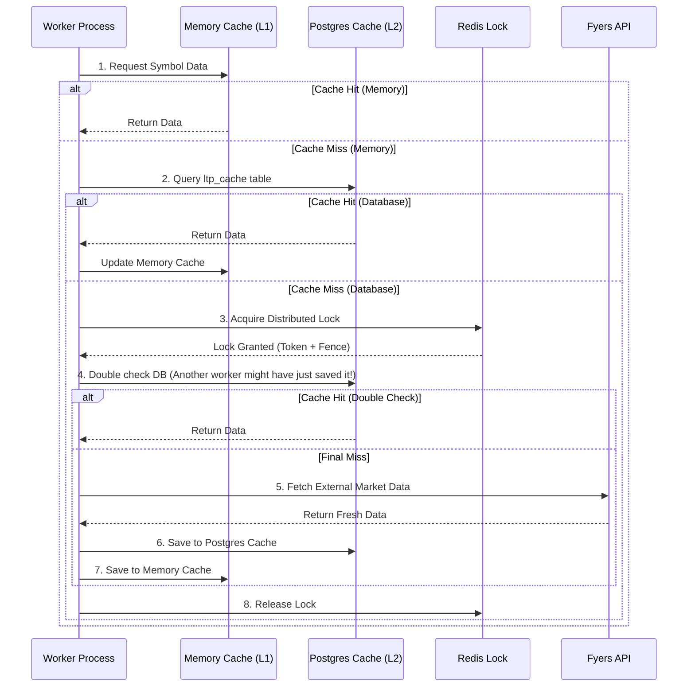

# 14_CACHE_AND_REDIS

## 🟢 Beginner: High-Level Concepts

In this trading application, fetching live market data from APIs (like Fyers) is slow and subject to strict rate limits. To solve this, we use **Caching** — temporarily storing data we've already downloaded so we can reuse it instantly.

Because the system runs multiple identical "workers" (pods or processes) at the same time, they could accidentally fetch the exact same data twice, wasting time and API limits. To prevent this, we use **Redis** (a lightning-fast memory database) as a strict traffic cop. 

- **Cache**: Stores Market Data (LTP, OHLCV Candles) in memory and in a fast database.
- **Redis Lock**: Acts as a "Do Not Disturb" sign. When one worker is fetching Apple's stock data, it grabs a Redis lock. If a second worker wants Apple's data, it sees the lock, waits a moment, and then just reads the result from the cache.

### Key Components
1. **In-Memory Cache**: Python dictionaries holding the absolute newest data for instant access.
2. **PostgreSQL Cache (`ltp_cache`)**: A special unlogged database table that acts as a fast shared cache between different workers.
3. **Redis Locks**: Ensures that only one process can perform a high-cost operation (like scanning or API fetching) at a time.

---

## 🟡 Intermediate: Cache Lifecycle and Data Flow

### The Cache Flow

When the system needs the Last Traded Price (LTP) or OHLCV (Open, High, Low, Close, Volume) data:

1. **Check Memory (L1 Cache)**: It first checks local RAM (`_ohlcv_cache` or `_ltp_source_cache`). If it's there and not expired (TTL check), it returns it instantly.
2. **Check Shared DB (L2 Cache)**: If not in memory, it checks the shared PostgreSQL `ltp_cache` table. This allows Worker B to benefit from data just downloaded by Worker A.
3. **Acquire Lock**: If it's nowhere to be found, it must hit the external API. First, it acquires a thread lock or Redis distributed lock to prevent a race condition.
4. **Fetch External**: It calls the external broker API (Fyers).
5. **Update Caches**: It saves the result in the L2 (DB) cache and L1 (Memory) cache with a specific Time-To-Live (TTL).

### Cache Hit / Miss Mermaid Diagram

### TTL (Time-to-Live) Logic

Cached data cannot live forever, or trading algorithms will run on stale prices.
- **OHLCV Data**: Typically has a 300-second (5 minute) TTL in memory.
- **LTP Data**: Updated rapidly. DB rows have an `updated_at` timestamp.

---

## 🔴 Expert: Race Conditions, Failures, and Code Paths

At the expert level, we must handle distributed race conditions, zombie processes, and split-brain scenarios.

### 1. Race Condition Protections

The system employs a **Redlock-inspired** distributed locking mechanism (`redis_lock.py`) using **Fencing Tokens**.

- **The Problem**: Worker A acquires a lock, but then freezes (e.g., Garbage Collection pause). The lock expires in Redis. Worker B acquires the lock. Worker A wakes up and thinks it still has the lock, and both workers write to the database simultaneously, corrupting data.
- **The Solution**: Redis generates an incrementing `fencing_token`. Every lock acquisition gets a sequentially higher number. Downstream storage (if implemented to check it) can reject writes from older tokens.
- **Safe Release**: A lock is only released by its owner. We use a Lua script (`RELEASE_LUA`) to ensure atomic `GET` and `DEL`: it verifies the UUID token matches before deleting the key.

### 2. Failure Recovery Mechanisms

- **Stale DB Locks**: For long-running system locks (`lock_service.py`), a `heartbeat_at` timestamp is maintained. If a worker dies, its heartbeat stops. Another worker detects the `expires_at` and `heartbeat_at` have lapsed, and performs an atomic steal (`UPDATE ... WHERE locked_by = old_owner`).
- **Redis Connection Loss**: If Redis is unavailable, locking fails gracefully or blocks the specific distributed operation to prevent unsafe state corruption.
- **Cache Contradiction**: If the DB cache and API contradict, the system uses reconciliation services (`candle_reconciliation_service.py`) to heal broken cache gaps.

---

## File-by-File Breakdown

### `backend/app/utils/redis_lock.py`
Provides the core Redlock implementation.
- **Inputs**: `lock_name` (string), `timeout` (int).
- **Outputs**: Yields a `FencedLock` object containing `name`, `token`, and `fencing_token`.
- **Business Logic**: Uses `SET NX EX` (Set if Not eXists with Expiration) to ensure atomic lock acquisition. Generates a UUID token and an incrementing fencing token.
- **Exact Code Path**:
  1. Generate UUID `token`.
  2. Increment Redis key `{lock_name}:fence` to get `fencing_token`.
  3. `await redis_client.set(lock_name, token, nx=True, ex=timeout)`.
  4. Yield to application.
  5. On context exit, execute Lua script to check token ownership and `DEL` key safely.

### `backend/app/services/fyers_service.py`
Manages the L1 memory cache and interacts with L2 DB cache.
- **Inputs**: Symbol name, resolution, mode.
- **Outputs**: LTP (float) or OHLCV candles (List of `OHLCVPoint`).
- **Business Logic**: Uses local `asyncio.Lock()` and `threading.Lock()` to prevent concurrent identical API calls within the same pod. It implements the Double-Checked Locking pattern.
- **Exact Code Path**:
  1. `cached = FyersService._ohlcv_cache.get(cache_key)`
  2. Check TTL: `if cached and now < cached[2]: return cached[1]`
  3. Enter `with FyersService._ohlcv_thread_locks[cache_key]:`
  4. Double-check `_ohlcv_cache`.
  5. Fetch from external API.
  6. Call `_store_ohlcv_cache()` to update memory and persist.

### `backend/app/services/candle_store.py`
Handles persistence and fetching of bulk candle data.
- **Inputs**: Symbols list, resolution.
- **Outputs**: Pandas DataFrames of OHLCV data.
- **Business Logic**: Writes into the PostgreSQL `market_data.ltp_cache` table. Uses `INSERT` queries to update the `updated_at` timestamp.
- **Exact Code Path**:
  1. Executes `INSERT INTO market_data.ltp_cache (symbol, ltp, updated_at)` to refresh L2 cache.
  2. Fallback to reading `ltp_cache` when requested.

### `backend/app/services/lock_service.py`
Manages system-level DB locks (non-Redis) for very long-running background tasks.
- **Inputs**: `lock_name`, `ttl_seconds`.
- **Outputs**: Boolean acquisition success.
- **Business Logic**: Inserts or updates a row in `SystemLock`. Runs a background asyncio task `_heartbeat_loop` to continually bump the `expires_at` column.
- **Exact Code Path**:
  1. `INSERT` into `SystemLock`. If `IntegrityError`, it exists.
  2. `SELECT` existing lock. If stale (heartbeat old), execute atomic `UPDATE ... WHERE locked_by = old_owner`.
  3. Start `_heartbeat_loop` task.

---

## Real World Example

**Scenario**: A scheduled cron job triggers 3 worker pods simultaneously to scan the "NIFTY 50" stocks for an EMA crossover.
1. All 3 pods attempt to acquire the global distributed Redis lock `scan:nifty50`.
2. Pod A sends `SET scan:nifty50 <uuid_A> NX EX 300`. It succeeds.
3. Pod B and Pod C send `SET scan:nifty50 <uuid_B> NX ...`. They fail and either wait or skip the scan.
4. Pod A iterates through 50 symbols. For `RELIANCE`, it checks local memory (Miss), checks DB `ltp_cache` (Miss).
5. Pod A acquires an internal `asyncio.Lock()` for `RELIANCE`, fetches from Fyers API, and saves it to `ltp_cache`.
6. Later, a user opens their dashboard requesting `RELIANCE`. Pod B receives the request.
7. Pod B checks local memory (Miss), checks DB `ltp_cache` (Hit! Saved by Pod A). 
8. Pod B returns the data instantly without calling the Fyers API.
9. Pod A finishes the scan and runs the Lua release script, freeing `scan:nifty50`.
