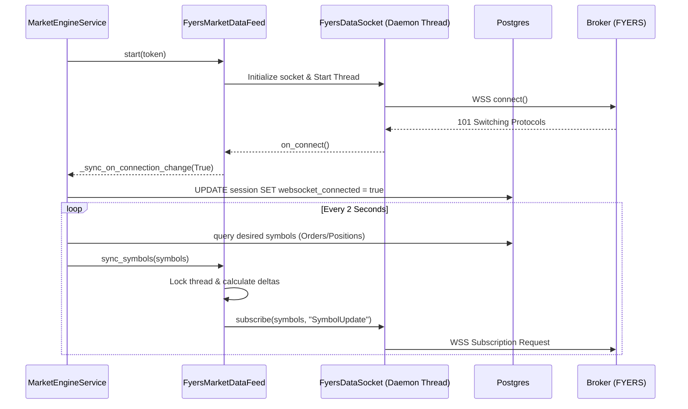
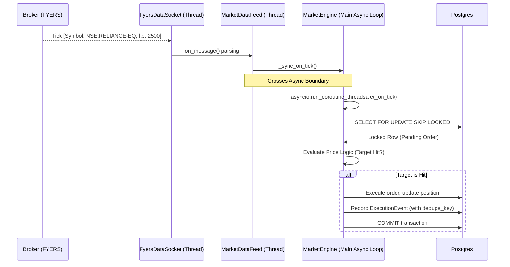
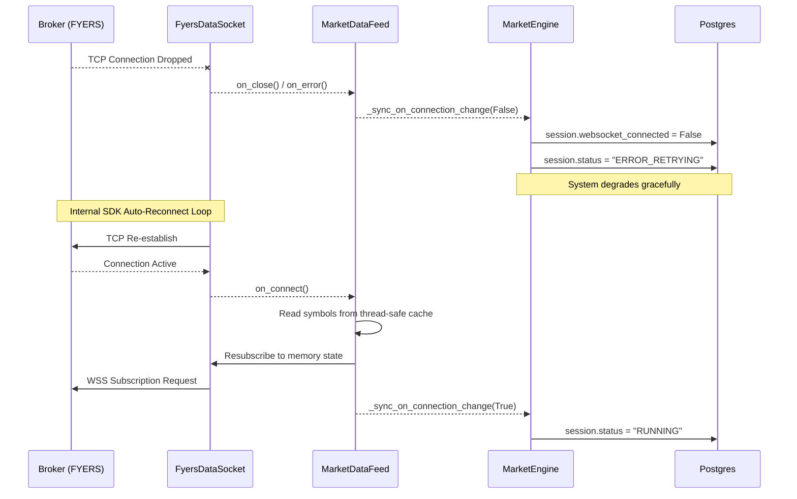

# WebSocket Architecture

This document provides a comprehensive engineering reference for the WebSocket architecture powering the trading system's live market data ingestion. It is divided into Beginner, Intermediate, and Expert sections to cater to different levels of technical familiarity.

---

## 1. Beginner Section: Conceptual Overview

In a live trading system, retrieving prices using standard HTTP REST requests is too slow and heavily rate-limited. To receive live, sub-second market prices (ticks), the system uses a **WebSocket**. 

A WebSocket is a persistent, two-way connection established between our trading server and the broker (FYERS). Once connected, the broker continuously "pushes" price updates to our system the millisecond they happen. 

### Key Concepts
* **Connection**: The initial handshake. Once opened, the connection is kept alive.
* **Subscription**: Telling the broker exactly *which* stock symbols we want prices for (e.g., `NSE:RELIANCE-EQ`). 
* **Ticks**: The actual price update packets streaming in.
* **Disconnection / Reconnection**: If the internet drops or the broker resets, the socket disconnects. The system must automatically retry and re-subscribe to the symbols it was watching.

---

## 2. Intermediate Section: Component Breakdown

The WebSocket system is divided across two main Python files to separate networking logic from business logic.

### File 1: `market_data_feed.py` (`FyersMarketDataFeed`)
This file is the "Thin WebSocket Adapter". It strictly handles the network connection and JSON parsing.

* **Inputs**:
  * `token`: The FYERS authentication token required to open the WebSocket.
  * `symbols`: A dynamic `set[str]` of stock symbols to subscribe to.
  * `callbacks`: Functions passed from the engine to trigger on specific events (`on_tick`, `on_error`, `on_connection_change`).
* **Outputs**: 
  * Parsed ticks (symbol and last traded price).
  * Connection state changes (Boolean connected/disconnected).
* **Business Logic**:
  * **Threading**: Initializes the official FYERS SDK `data_ws.FyersDataSocket` and runs it in a background daemon thread (`Thread(target=self._socket.connect)`).
  * **Payload Parsing**: Silently absorbs "heartbeat" payloads and extracts the `symbol` and `ltp` (Last Traded Price) from incoming messages using Pydantic schemas.
  * **Dynamic Subscriptions (`sync_symbols`)**: Compares a new list of symbols against the currently subscribed list, and issues delta `subscribe()` and `unsubscribe()` commands to the broker.
* **Code Path**:
  * `start()` -> Creates `Thread` -> FYERS Socket connects -> `on_connect()` triggers `sync_symbols()`.

### File 2: `market_engine_service.py` (`MarketEngineService`)
This is the core execution brain. It receives raw price updates from the data feed and cross-references them against active orders and positions.

* **Inputs**:
  * Tick events (`symbol`, `price`) delivered by the `FyersMarketDataFeed`.
  * The current state of the database (Pending Orders, Open Positions).
* **Outputs**:
  * Executed orders (`FILLED`), triggered stop-losses, and triggered profit targets.
  * Database state updates (`MarketEngineSession` status, `last_seen_ltp`).
* **Business Logic**:
  * **The Engine Loop (`_run_loop`)**: Continuously monitors the database every 2 seconds to determine which symbols *should* be monitored based on active paper trades.
  * **Tick Processing (`_process_symbol`)**: When a tick arrives, it queries the database for active orders matching that symbol. If the price crosses a threshold, it executes the trade.
  * **Token & Hours Enforcement**: Pauses the socket if the market is closed or the token is expired (`PAUSED_TOKEN_EXPIRED`).
* **Code Path**:
  * Background Thread Tick -> `_sync_on_tick` -> Bridges to Asyncio Main Loop -> `_on_tick` -> `_process_symbol` -> Database execution.

---

## 3. Expert Section: Race Conditions, Failure Recovery, & Async Boundaries

The WebSocket implementation relies on sophisticated fault-tolerance mechanisms to ensure system stability under high-throughput conditions.

### A. The Async Boundary Bridge
The FYERS WebSocket SDK operates synchronously and blocks the thread it runs on. Since our FastAPI backend relies heavily on `asyncio`, directly calling async database operations from the WebSocket's synchronous callbacks would result in `RuntimeError: asyncio.run() cannot be called from a running event loop` or thread safety violations.

**Protection:** 
The `_sync_on_tick` method uses `asyncio.run_coroutine_threadsafe(self._on_tick(symbol, price), self._loop)`. This safely delegates the coroutine execution back to the main event loop thread without blocking the high-speed WebSocket ingestion thread.

### B. Race Condition Protections
High-frequency ticks can result in the same symbol being evaluated concurrently, leading to double-fills or phantom positions.

1. **Postgres Row-Level Locking (`SKIP LOCKED`)**: 
   Inside `_process_symbol`, the `SELECT` query for orders/positions enforces `with_for_update(skip_locked=True)`. If two simultaneous ticks attempt to evaluate the same pending order, the database engine locks the row for the first tick. The second tick silently skips the locked row, preventing duplicate executions.
2. **Thread Locking (`threading.Lock`)**:
   Inside `market_data_feed.py`, `sync_symbols` uses `self._lock` to ensure that calculating the `to_add` and `to_remove` delta sets is atomic. This prevents concurrent modifications to `self._symbols` while the WebSocket is simultaneously trying to read them during a reconnection.
3. **Idempotency Keys (`dedupe_key`)**:
   When an event occurs (e.g., Target Hit), `_record_event()` generates a unique key (e.g., `exit-filled:123:TARGET_HIT`). It checks both the un-flushed SQLAlchemy session (`db.new`) and the actual database to guarantee duplicate notifications and execution events are not created.

### C. Systemic Failure Recovery
1. **Network Drops**: The FYERS socket is initialized with `reconnect=True`. If the network drops, `on_close` sets `session.websocket_connected = False` and `status = ERROR_RETRYING`. The SDK automatically reconnects, triggering `on_connect`, which instantly resubscribes to `self._symbols` from memory without requiring engine intervention.
2. **Token Expiry**: If the socket receives an authorization error, `_on_feed_error` transitions the engine into `PAUSED_TOKEN_EXPIRED`. All active orders are placed into `TOKEN_EXPIRED_PAUSED` state to prevent partial state corruption.
3. **Scheduler Starvation Isolations**: To prevent the heavy 755-symbol websocket subscription loop from starving the connection pool, pre-market deep scans and intraday heartbeats are temporally isolated (e.g., scans run strictly before market open to avoid colliding with `09:15` WebSocket stampedes).

---

## 4. Sequence Diagrams

### I. Connection & Subscription Flow
When the system starts, it bridges the asyncio loop with the threaded WebSocket socket.

### II. Live Market Data & Execution Flow
How a raw tick safely navigates from the background thread, across the async boundary, and executes an order in the database.

### III. Disconnect & Failure Recovery Flow
How the system automatically repairs itself following an upstream network drop.

