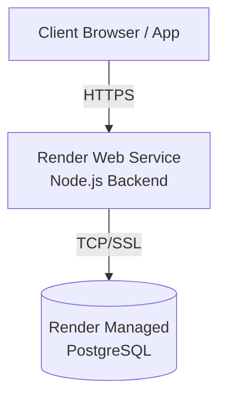
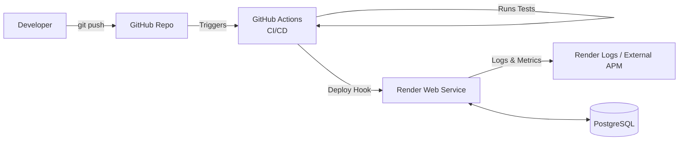
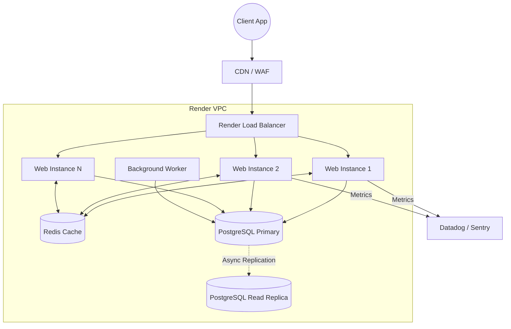

# Deployment Architecture Guide

This document provides a comprehensive guide to the deployment architecture of the trading system. It covers how the application is hosted, managed, monitored, and scaled in a production environment using Render, PostgreSQL, and modern CI/CD practices.

---

## 1. Beginner: The Basics of Deployment

At the beginner level, the focus is on understanding where the application lives, how it gets there, and how it securely connects to its dependencies.

### What is Deployment Architecture?
Deployment architecture defines the physical and logical infrastructure required to run the application in a live environment. It involves servers, databases, networking, and the processes used to update the software.

### Hosting on Render
We use [Render](https://render.com/) as our cloud hosting provider. Render is a Platform-as-a-Service (PaaS) that simplifies deployment by automatically building and running our application from a code repository (like GitHub).

*   **Web Services:** The Node.js/Express backend runs as a Render Web Service.
*   **Static Sites:** The React frontend can be hosted as a Render Static Site.
*   **Background Workers:** Any background task (like continuous market data fetching) can be run as a Render Background Worker.

### PostgreSQL Database
The trading system relies on PostgreSQL for robust, relational data storage. Render provides managed PostgreSQL databases, which means they handle backups, maintenance, and basic scaling.

### Environment Variables & Secrets Management
Applications need configuration that changes depending on where they run (e.g., local development vs. production).
*   **Environment Variables:** Variables like `PORT` or `NODE_ENV` configuration.
*   **Secrets:** Sensitive data like `DATABASE_URL`, API keys (e.g., Binance, OpenAI), and JWT secrets.
*   **Management:** Never hardcode secrets in the source code. In Render, these are securely stored in the "Environment" tab of your service settings.

### Real Example: Basic Render Deployment
To deploy the backend:
1. Connect your GitHub repository to Render.
2. Create a new **Web Service**.
3. Set the Build Command: `npm install && npm run build`
4. Set the Start Command: `npm start`
5. Add the necessary Environment Variables (e.g., `DATABASE_URL`).

### Beginner Architecture Diagram



---

## 2. Intermediate: CI/CD, Monitoring, and Logging

Once the basic deployment is working, the next step is automation, reliability, and visibility.

### Continuous Integration / Continuous Deployment (CI/CD)
CI/CD automates the process of testing and deploying code. We use GitHub Actions to ensure code quality before it reaches Render.
*   **CI:** Runs unit tests and linters on every pull request.
*   **CD:** Automatically triggers a Render deployment when code is merged into the `main` branch.

#### Real Example: GitHub Actions CI/CD Workflow (`.github/workflows/deploy.yml`)
```yaml
name: CI/CD Pipeline

on:
  push:
    branches: [ main ]
  pull_request:
    branches: [ main ]

jobs:
  build-and-test:
    runs-on: ubuntu-latest
    steps:
      - uses: actions/checkout@v3
      - name: Use Node.js
        uses: actions/setup-node@v3
        with:
          node-version: '18.x'
      - run: npm ci
      - run: npm test

  deploy:
    needs: build-and-test
    if: github.ref == 'refs/heads/main'
    runs-on: ubuntu-latest
    steps:
      - name: Trigger Render Deploy
        run: curl -X POST ${{ secrets.RENDER_DEPLOY_HOOK_URL }}
```

### Health Checks
Render needs to know if the application is running correctly. We expose a `/health` endpoint that returns a `200 OK` status and basic system metrics. Render uses this endpoint; if it fails, Render can automatically restart the service.

```typescript
// Example Health Check Endpoint
app.get('/health', async (req, res) => {
  try {
    // Ping database to ensure connection is alive
    await prisma.$queryRaw`SELECT 1`;
    res.status(200).json({ status: 'UP', db: 'Connected', timestamp: new Date() });
  } catch (error) {
    res.status(503).json({ status: 'DOWN', db: 'Disconnected' });
  }
});
```

### Logging
Standard `console.log` is insufficient for production. We use structured logging (e.g., Winston or Pino) to output logs in JSON format. This makes it easier to search and filter logs in monitoring tools.
*   **Log Levels:** `error`, `warn`, `info`, `debug`.

### Monitoring
Monitoring involves tracking system metrics (CPU, Memory) and application metrics (request latency, error rates). Render provides built-in metrics, but we can also integrate external tools like Datadog or Sentry for error tracking.

### Intermediate Architecture Diagram



---

## 3. Expert: Advanced Architecture and Resilience

At an expert level, the system must handle high traffic, potential regional failures, and complex security requirements.

### Infrastructure as Code (IaC)
While Render provides a UI, experts define infrastructure in code using Render Blueprints (`render.yaml`). This ensures infrastructure is version-controlled and reproducible.

#### Real Example: `render.yaml` Blueprint
```yaml
services:
  - type: web
    name: trading-backend
    env: node
    buildCommand: npm install && npm run build
    startCommand: npm start
    plan: standard
    envVars:
      - key: DATABASE_URL
        fromDatabase:
          name: trading-db
          property: connectionString
      - key: NODE_ENV
        value: production

databases:
  - name: trading-db
    databaseName: trading
    user: admin
    plan: standard
```

### Horizontal Scaling and Load Balancing
Render allows horizontal scaling by increasing the number of instances for a Web Service. A built-in load balancer distributes incoming traffic across these instances. The application must be **stateless** (e.g., sessions stored in Redis, not in memory) to scale horizontally.

### High Availability (HA) and Disaster Recovery
*   **Database Replicas:** Setting up read replicas for PostgreSQL to offload read queries and provide a fallback if the primary database fails.
*   **Backups:** Automated daily backups with Point-in-Time Recovery (PITR) enabled.

### Advanced Secrets Management
For highly sensitive systems, Render's environment variables might be supplemented by an external secret manager like AWS Secrets Manager or HashiCorp Vault. The application fetches secrets dynamically at runtime, allowing for automated key rotation.

### Expert Architecture Diagram


