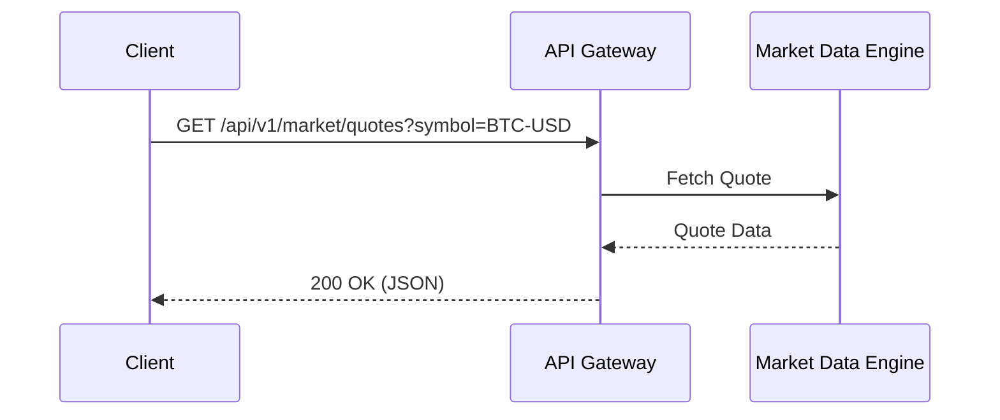
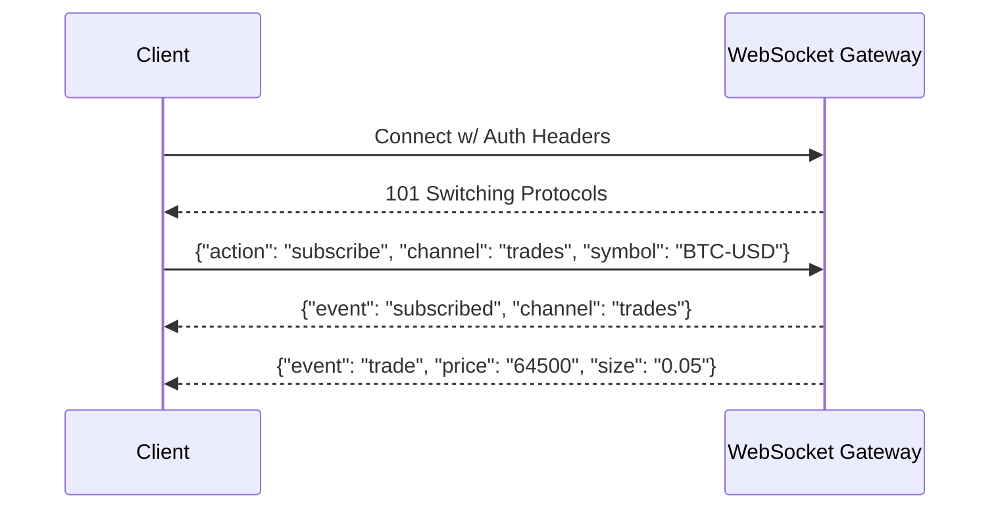

# 17. API Reference

This document provides a comprehensive guide to the Trading System API. It is divided into Beginner, Intermediate, and Expert sections to help you integrate seamlessly regardless of your experience level.

## Table of Contents
1. [General Concepts](#general-concepts)
   - [Authentication](#authentication)
   - [Rate Limiting](#rate-limiting)
   - [Error Handling](#error-handling)
2. [Beginner: Getting Started](#beginner-getting-started)
   - [Get Market Quotes](#get-api-v1-market-quotes)
   - [Place a Simple Order](#post-api-v1-orders)
3. [Intermediate: Portfolio & Streams](#intermediate-portfolio--streams)
   - [Get Portfolio Positions](#get-api-v1-portfolio-positions)
   - [Cancel an Order](#delete-api-v1-orders-order_id)
   - [WebSocket Market Data](#websocket-wsv1market)
4. [Expert: Advanced Trading & Webhooks](#expert-advanced-trading--webhooks)
   - [Deploy a Trading Strategy](#post-api-v1-strategies)
   - [Strategy Webhooks](#strategy-webhooks)
   - [High-Frequency Rate Limit Management](#high-frequency-rate-limit-management)

---

## General Concepts

### Authentication
All API endpoints require authentication using an API Key and an HMAC-SHA256 signature.

**Required Headers:**
- `X-API-KEY`: Your public API key.
- `X-API-SIGNATURE`: The HMAC-SHA256 signature of the payload using your secret key.
- `X-API-TIMESTAMP`: UNIX timestamp in milliseconds. Requests older than 5000ms will be rejected.

### Rate Limiting
The API imposes rate limits based on your account tier. Limits are communicated via response headers:
- `X-RateLimit-Limit`: Maximum requests per minute.
- `X-RateLimit-Remaining`: Requests remaining in the current window.
- `X-RateLimit-Reset`: UNIX timestamp when the limit resets.

**Failure Scenario:** Exceeding the rate limit returns a `429 Too Many Requests` status code. You should implement exponential backoff upon receiving a 429.

### Error Handling
Errors are returned as standard JSON responses with appropriate HTTP status codes (e.g., `400 Bad Request`, `401 Unauthorized`, `500 Internal Server Error`).

**Error Response Example:**
```json
{
  "error_code": "INSUFFICIENT_FUNDS",
  "message": "Account balance is insufficient for this order.",
  "details": {
    "required": 5000.00,
    "available": 1250.50
  }
}
```

---

## Beginner: Getting Started

### GET /api/v1/market/quotes

Fetch the current best bid and ask quotes for a specific trading pair.

**Sequence Diagram:**


**Request:**
```http
GET /api/v1/market/quotes?symbol=BTC-USD HTTP/1.1
Host: api.tradingsystem.com
X-API-KEY: your_api_key
X-API-TIMESTAMP: 1678886400000
X-API-SIGNATURE: hex_signature
```

**Response Example:**
```json
{
  "symbol": "BTC-USD",
  "bid": "64500.50",
  "ask": "64501.00",
  "timestamp": 1678886400123
}
```

### POST /api/v1/orders

Place a new market or limit order.

**Request:**
```json
{
  "symbol": "BTC-USD",
  "side": "BUY",
  "type": "LIMIT",
  "quantity": "0.1",
  "price": "64000.00",
  "time_in_force": "GTC"
}
```

**Response Example:**
```json
{
  "order_id": "ord_987654321",
  "symbol": "BTC-USD",
  "status": "OPEN",
  "created_at": 1678886450000
}
```

---

## Intermediate: Portfolio & Streams

### GET /api/v1/portfolio/positions

Retrieve current open positions across all assets.

**Response Example:**
```json
{
  "positions": [
    {
      "symbol": "ETH-USD",
      "quantity": "5.0",
      "average_entry_price": "3200.00",
      "unrealized_pnl": "150.00"
    }
  ],
  "total_value_usd": "16150.00"
}
```

### DELETE /api/v1/orders/{order_id}

Cancel an active order.

**Failure Scenario:** If the order is already filled or canceled, the system returns a `404 Not Found` or `400 Bad Request` with an `ORDER_NOT_ACTIVE` code.

**Response Example:**
```json
{
  "order_id": "ord_987654321",
  "status": "CANCELED"
}
```

### WebSocket /ws/v1/market

Stream real-time order book updates and trade executions.

**Sequence Diagram:**


---

## Expert: Advanced Trading & Webhooks

### POST /api/v1/strategies

Deploy an algorithmic trading strategy configuration programmatically.

**Request Example:**
```json
{
  "strategy_name": "MeanReversion_V2",
  "parameters": {
    "lookback_period": 20,
    "z_score_threshold": 2.0,
    "max_position_size": 1.5
  },
  "symbols": ["BTC-USD", "ETH-USD"]
}
```

**Response Example:**
```json
{
  "strategy_id": "strat_112233",
  "status": "DEPLOYED",
  "active_instances": 2
}
```

### Strategy Webhooks

When a strategy triggers an alert or an order fill, the system can push notifications to your registered endpoint.

**Webhook Payload Example:**
```json
{
  "event_type": "STRATEGY_ALERT",
  "strategy_id": "strat_112233",
  "timestamp": 1678887000000,
  "data": {
    "symbol": "BTC-USD",
    "signal": "LONG",
    "confidence": 0.95
  }
}
```

### High-Frequency Rate Limit Management

For HFT (High-Frequency Trading) integration, monitor the `X-RateLimit-Remaining` header.
If `Remaining` drops below 10% of `Limit`, defensively throttle requests or switch to batch order endpoints (`POST /api/v1/orders/batch`) to bundle up to 50 orders in a single HTTP request. This minimizes network overhead and prevents `429 Too Many Requests` penalties, which carry a 60-second cooldown lock at the expert tier.
