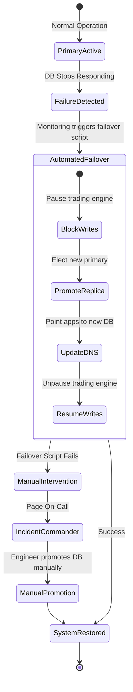

# 18. Production Operations

This document outlines the production operations for the trading system, covering monitoring, logging, incident response, and recovery procedures. It is designed to provide actionable guidance for operating the trading system securely and reliably.

---

## Level 1: Beginner (Core Concepts)

### What are Production Operations?
Production operations encompass all the activities required to keep a software system running smoothly in a live environment. For a trading system, this means ensuring high availability, low latency, and absolute data integrity.

### Key Pillars
1.  **Monitoring:** Watching the system's health (CPU, memory, order flow, latency).
2.  **Logging:** Recording events that happen in the system for auditing and debugging.
3.  **Alerting:** Notifying humans when the monitoring system detects an anomaly.
4.  **Incident Response:** The process of reacting to an alert, fixing the issue, and restoring service.
5.  **Runbooks:** Step-by-step guides for handling specific, known issues.

### Basic Logging & Monitoring
We use structured logging (JSON) to ensure logs can be easily queried. 
*   **Logs:** Contains application events, errors, and access records.
*   **Metrics:** Contains numerical data over time (e.g., requests per second, error rate).

**Example: A Simple Log Entry**
```json
{
  "timestamp": "2026-06-07T20:01:30Z",
  "level": "ERROR",
  "component": "OrderExecutionGateway",
  "message": "Connection to exchange lost",
  "exchange": "BINANCE",
  "error_code": "CONN_RST"
}
```

---

## Level 2: Intermediate (Runbooks & Incident Response)

### Operational Runbooks
A runbook is a documented procedure for handling a specific operational task or incident.

#### Example Runbook: High API Latency
*   **Symptom:** Monitoring shows API response times exceeding 500ms for more than 1 minute.
*   **Alert Triggered:** `HighApiLatency`
*   **Steps:**
    1.  **Acknowledge:** Acknowledge the alert in the paging system (e.g., PagerDuty).
    2.  **Investigate Load:** Check if incoming request volume has spiked (DDoS or normal market volatility).
    3.  **Check Database:** Inspect database CPU and active connections. Are there long-running queries?
    4.  **Check External Services:** Are the exchanges we connect to experiencing latency?
    5.  **Mitigation:** If load is too high, initiate rate limiting. If database is struggling, consider failing over to a read replica for non-critical queries.
    6.  **Resolve:** Once latency returns to normal (< 100ms), mark the incident as resolved.

### Incident Response Procedures
When a major issue occurs (e.g., trading halted, data corruption), we follow a structured incident response process.

1.  **Detection:** Alert fires or user reports an issue.
2.  **Triage:** Determine the severity (Sev-1 Critical, Sev-2 Major, Sev-3 Minor).
3.  **Mobilization:** Page the required engineers (Incident Commander, Subject Matter Experts).
4.  **Mitigation:** Stop the bleeding. This might mean halting trading, failing over, or rolling back a deployment.
5.  **Resolution:** Implement a permanent fix.
6.  **Post-Mortem:** Analyze *why* it happened and create action items to prevent it from happening again (Blameless RCA).

---

## Level 3: Expert (Advanced Recovery & Architecture)

### High-Availability Monitoring Architecture
In a high-frequency trading context, monitoring must be decoupled from the core trading loop so it doesn't add latency.
*   **Asynchronous Logging:** Logs are written to memory buffers and flushed asynchronously.
*   **Metrics Aggregation:** Trading engines push metrics via UDP (e.g., StatsD) to minimize blocking.
*   **Distributed Tracing:** Every order gets a unique `TraceID` that follows it through the entire microservice architecture (e.g., OpenTelemetry, Jaeger).

### Recovery Procedures & Failover

In the event of a catastrophic failure (e.g., AWS availability zone goes down), the system must recover quickly.

#### Incident Recovery Flow

The following diagram illustrates the automated and manual steps for recovering from a primary database failure.



#### Real Example: Recovering from a "Fat Finger" Deployment
*   **Scenario:** A bad configuration is deployed that causes the pricing engine to calculate incorrect spreads, resulting in money-losing trades.
*   **Detection:** Anomaly detection alert `NegativeSpreadDetected` fires.
*   **Immediate Mitigation (Kill Switch):** The on-call engineer triggers the global "Kill Switch" runbook.
    *   Command: `./scripts/kill_switch.sh --halt-all`
    *   Result: All new orders are blocked. Open orders are canceled.
*   **Recovery:**
    1.  Rollback the configuration via CI/CD pipeline to the previous known-good state.
    2.  Verify the fix in the staging environment.
    3.  Reconcile the database. Run the `position_reconciliation` script to determine exact losses and ensure exchange balances match local database balances.
    4.  Disable the kill switch. Command: `./scripts/kill_switch.sh --resume`
*   **Post-Mortem:** Add a pre-deployment check to validate spread configurations mathematically before they can be merged.

### Log Analysis & Auditing
For regulatory compliance, every action must be auditable.
*   **WORM Storage:** Audit logs are shipped to Write-Once-Read-Many (WORM) storage (e.g., AWS S3 with Object Lock) to prevent tampering.
*   **SIEM Integration:** Logs are streamed to a Security Information and Event Management (SIEM) system to detect insider threats or unauthorized access attempts.
