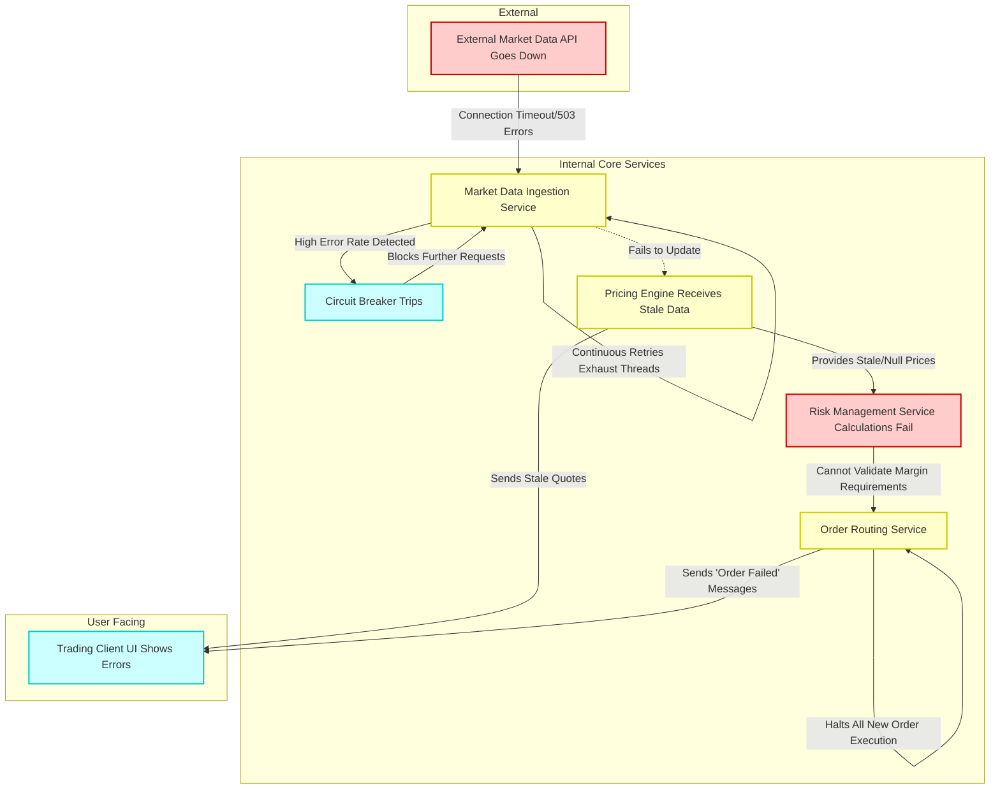

# 19. Risk and Failure Analysis

This document provides a comprehensive overview of the trading system's risk profile, potential failure scenarios, error handling strategies, and recovery procedures. It is structured to cater to different levels of technical understanding: Beginner, Intermediate, and Expert.

---

## 🟢 Beginner Level: Understanding System Stability

This section covers the fundamental concepts of system risks and limitations in a way that is accessible to all team members, including non-technical stakeholders.

### 1. Production Risks
Production risks are events or conditions that could negatively impact the live trading environment. The primary risks include:
*   **Downtime:** The system becoming completely unavailable to users or unable to execute trades.
*   **Data Inaccuracy:** Processing or displaying incorrect market data, leading to flawed trading decisions.
*   **Security Breaches:** Unauthorized access to trading accounts, sensitive financial data, or core system infrastructure.
*   **Financial Loss:** Direct monetary losses resulting from system bugs, incorrect order routing, or delayed execution.

### 2. Known Limitations
Every system has boundaries. Our current known limitations are:
*   **API Rate Limits:** External market data providers and broker APIs restrict the number of requests we can make per second. Exceeding these limits causes temporary bans.
*   **Processing Latency:** There is an inherent delay (latency) between a market event occurring and our system reacting to it. While optimized, it is not zero.
*   **Maximum Concurrent Users:** The current architecture is tested to support a specific number of simultaneous active user sessions before performance degrades.

### 3. Basic Failure Scenarios (The "What Ifs")
*   **What if the internet goes down?** The system will lose connection to market data and execution venues. Trading will halt until the connection is restored.
*   **What if an external API crashes?** We will be unable to fetch new data or place orders through that specific provider.
*   **What if a server fails?** If a primary server goes offline, the system may experience a temporary blip before backup systems (if configured) take over.

---

## 🟡 Intermediate Level: Technical Debt, Error Handling, and Recovery

This section dives into the technical mechanisms designed to prevent, manage, and recover from system failures. It is intended for developers, QA engineers, and system administrators.

### 1. Technical Debt
Technical debt refers to suboptimal code or architecture choices made for expediency that now hinder system stability or maintainability. Current areas of concern:
*   **Monolithic Components:** Certain legacy modules are tightly coupled, making it difficult to update one part without risking unintended consequences in another.
*   **Database Query Inefficiencies:** Some complex reporting queries cause high database load during peak market hours, potentially slowing down critical trading operations.
*   **Lack of Comprehensive Test Coverage:** Specific edge cases in order routing lack automated tests, increasing the risk of regressions during updates.

### 2. Error Handling Mechanisms
The system employs several strategies to handle errors gracefully:
*   **Retry with Exponential Backoff:** When a network request fails (e.g., API timeout), the system automatically retries the request. The wait time between retries increases exponentially to avoid overwhelming the target server.
*   **Circuit Breakers:** If a specific external service (e.g., a pricing API) fails repeatedly, the circuit breaker "trips" and temporarily blocks further requests to that service. This prevents cascading failures and allows the external service time to recover.
*   **Graceful Degradation:** If non-critical components fail (e.g., historical charting), the core trading engine continues to function, albeit with a reduced feature set.

### 3. Recovery Procedures
When a significant failure occurs, these procedures are followed:
*   **Automated Failover:** Critical databases and services are replicated. If the primary instance fails, traffic is automatically routed to the standby instance.
*   **Manual Intervention Protocols:** For complex failures, alerts are sent to the on-call engineering team. Runbooks are available detailing the steps to diagnose and manually restart or repair affected services.
*   **Data Reconciliation:** After an outage, automated scripts run to ensure internal ledgers match the records of our external brokerages, correcting any discrepancies caused by in-flight transactions during the crash.

---

## 🔴 Expert Level: Failure Cascades and Scaling Challenges

This section explores complex systemic risks, cascading failures, and the architectural challenges of future growth. It is designed for senior engineers, architects, and site reliability engineers (SREs).

### 1. Future Scaling Challenges
As trading volume and user base grow, the system will face significant architectural hurdles:
*   **Database Sharding and Partitioning:** The current monolithic database will become a bottleneck. We will need to implement sharding strategies to distribute data across multiple database instances without compromising transactional integrity.
*   **Geographic Distribution and Latency:** To serve a global user base with minimal latency, services must be deployed across multiple geographic regions, necessitating complex state replication and conflict resolution mechanisms.
*   **Microservices Complexity:** Transitioning to a fully microservices architecture introduces challenges in distributed tracing, service discovery, and managing eventual consistency across disparate data stores.

### 2. Real Examples of Past Failures
*   **The "Flash Crash" Throttling Incident (Q3 2025):** During extreme market volatility, order volume spiked 500%. Our order routing service hit the API rate limits of our primary broker. The resulting queue backup caused a memory exhaustion issue, crashing the routing service. *Resolution: Implemented dynamic rate limiting, queue size caps, and circuit breakers for external brokers.*
*   **Stale Data Cascade (Q1 2026):** A silent failure in the market data WebSocket connection resulted in stale prices being fed to the algorithmic trading engine. The engine executed trades based on outdated information, resulting in minor financial losses before manual intervention. *Resolution: Added strict staleness checks and heartbeat monitoring to all data feeds.*

### 3. Failure Cascades (System Dynamics)
Complex systems often fail due to unexpected interactions between components. The diagram below illustrates a potential cascading failure scenario.

#### Scenario: Market Data Provider Outage Cascade

**Analysis of the Cascade:**
1.  **Trigger:** An external dependency (Market Data API) fails.
2.  **Local Impact:** The Ingestion Service struggles, potentially exhausting local resources trying to reconnect.
3.  **Protection Mechanism:** The Circuit Breaker trips, saving the Ingestion Service but cementing the data outage.
4.  **Propagation:** The Pricing Engine, reliant on fresh data, begins serving stale information or fails to provide prices.
5.  **Critical Failure:** The Risk Management Service, which requires accurate prices to calculate margin and risk, cannot function safely.
6.  **System Halt:** To prevent unsafe trading, the Order Routing Service halts all new executions based on the failure of the Risk Management Service.
7.  **User Impact:** The end-user experiences a complete halt in trading capabilities and sees error messages in the client UI.

**Mitigation Strategy for this Cascade:**
*   Implement redundant market data providers (fallback feeds).
*   Enhance the Pricing Engine to explicitly flag stale data, rather than just passing the last known value.
*   Implement a "read-only" mode in the Trading Client when risk systems are degraded, allowing users to view portfolios but preventing new orders.
