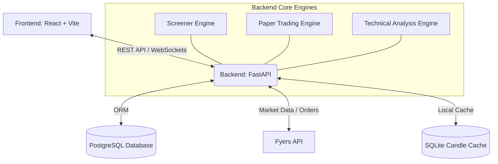
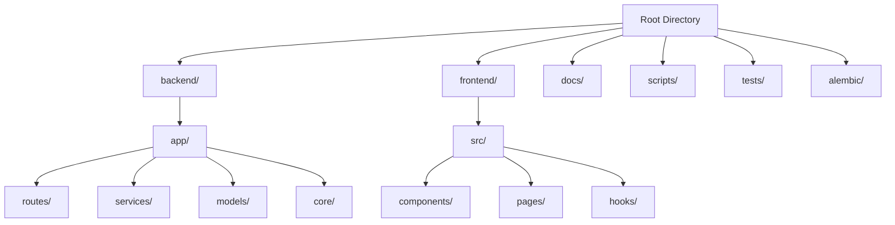
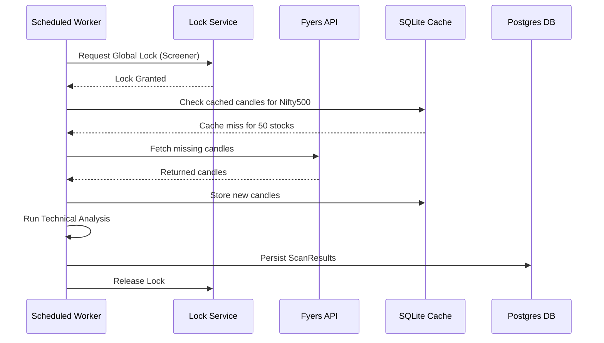

# Complete Code Walkthrough: Root to Deployment

This document provides a comprehensive, end-to-end walkthrough of the Trading System codebase. It is designed to help developers of all levels understand the structure, architecture, and connections between different components, from the root folder down to production deployment.

---

## 1. High-Level Architecture

The system is a modern, decoupled web application consisting of a React-based frontend, a FastAPI-based backend, a PostgreSQL relational database, and an SQLite-based cache layer. It integrates heavily with the external Fyers API for market data and trading.

---

## 2. Codebase Folder Structure

The repository is structured to separate concerns and isolate application layers cleanly.

---

## 3. Beginner Level Walkthrough

At the beginner level, the goal is to understand where things live and how a simple request flows through the system.

### Key Root Folders
- **`backend/`**: Contains the complete Python FastAPI application.
- **`frontend/`**: Contains the React + Vite frontend application.
- **`alembic/`**: Contains database migration scripts (tracking schema changes over time).
- **`docs/`**: Holds project documentation, architecture overviews, and knowledge base.
- **`tests/`**: Contains end-to-end and integration test scripts.

### Backend Entry Point
- **`backend/main.py`** & **`backend/app/main.py`**: The entry points for the FastAPI server. They initialize the application, configure middleware (CORS, error handling), and include all the API routers.

### Frontend Entry Point
- **`frontend/src/main.tsx`**: The main entry point for the React application. It mounts the root `<App />` component into the DOM.
- **`frontend/src/App.tsx`**: Sets up routing (using React Router) and global context providers.

### How a Request Flows (Example: Fetching Scans)
1. **Frontend Request**: The React application calls `api.ts` (e.g., `getScans()`).
2. **Backend Route**: The request hits the endpoint defined in `backend/app/routes/analysis.py` (e.g., `@router.get("/scans")`).
3. **Service Layer**: The route handler delegates the business logic to `backend/app/services/screener_service.py` (or `latest_scan_service.py`).
4. **Database Query**: The service uses an SQLAlchemy session to query the `ScanResult` table defined in `backend/app/models/`.
5. **Response**: The data is serialized into a Pydantic schema (`backend/app/schemas/`) and returned to the frontend.

---

## 4. Intermediate Level Walkthrough

At the intermediate level, we dive into the core business logic, integrations, and the service layer architecture.

### The Service Layer (`backend/app/services/`)
This is the heart of the application. Business logic is strictly kept out of route handlers and placed here.
- **`fyers_service.py`**: Handles all communication with the Fyers API. Manages rate limits, authentication, and token refreshing.
- **`market_data_service.py` & `candle_store.py`**: Responsible for fetching, standardizing, and caching historical market data.
- **`screener_service.py`**: Executes complex market scans across hundreds of stocks by retrieving data and applying technical indicators.
- **`technical_analysis_service.py`**: Implements indicators like SMA, EMA, RSI, MACD, and Bollinger Bands.
- **`paper_trading_service.py`**: Simulates a trading environment. It tracks virtual balances, processes paper orders against live/cached market data, and manages paper positions.

### Database and ORM (`backend/app/models/` & `backend/app/db/`)
- The system uses **SQLAlchemy** for database interactions.
- Models like `User`, `PaperOrder`, `PaperPosition`, and `ScanResult` map directly to PostgreSQL tables.
- **Alembic** (`alembic/`) tracks changes to these models. To update the database after changing a model, you generate an Alembic migration (`alembic revision --autogenerate`) and apply it (`alembic upgrade head`).

### Caching Mechanism
To avoid hitting Fyers API rate limits, the system heavily caches market data (candles).
- **`candle_cache.db`**: A local SQLite database specifically optimized for fast, synchronous read/write of market data.
- **`cache_state.py`**: Manages the cache invalidation and state verification.

---

## 5. Expert Level Walkthrough

At the expert level, we address concurrency, race conditions, real-time engines, and deep system patching.

### Concurrency and Locking (`lock_service.py` & `partition_manager.py`)
- The backend frequently encounters concurrent operations (e.g., multiple scheduled jobs trying to update market data simultaneously).
- **`lock_service.py`**: Implements distributed locking (typically via Postgres advisory locks or Redis) to ensure mutually exclusive access to critical paths (like writing to the `candle_cache.db` or triggering a global scan).
- **`partition_manager.py`**: Breaks down large datasets (e.g., processing 500 stocks) into manageable partitions for parallel processing without memory overflow.

### Real-time Engine & Observability
- **`live_state_machine.py`**: Manages the state transitions of active trading sessions, handling edge cases like network disconnects, API throttling, and market closures.
- **`live_observability.py`**: Hooks into the execution paths to generate real-time metrics and alerts, ensuring system health is verifiable.
- **`market_engine_service.py`**: The heavy-lifter for aggregating real-time data streams and broadcasting updates to the frontend via WebSockets.

### Hotfixes and Patching
- The root directory and backend contain scripts like `patch.py`, `patch_deadlock.py`, and `patch_screener.py`. These scripts are designed to apply runtime fixes or migrations dynamically when standard deployments are not feasible, particularly for resolving PostgreSQL deadlocks and optimizing long-running screener queries.

---

## 6. Deployment Architecture

The deployment targets cloud platforms (like Render or AWS) and relies heavily on environment variables and automated scripts.

### Environment Configuration
- The `.env` files dictate the behavior of the application. Critical variables include `DATABASE_URL` (Postgres connection), `FYERS_CLIENT_ID`, `FYERS_SECRET_KEY`, `FYERS_REDIRECT_URI`, and `JWT_SECRET_KEY`.

### Deployment Steps (Runbook summary)
1. **Infrastructure Provisioning**: A PostgreSQL instance is provisioned and the URL is set.
2. **Backend Deployment**: The FastAPI server is containerized or run via a PaaS (like Render). The build command installs Python dependencies (`pip install -r requirements.txt`). The start command typically runs `uvicorn app.main:app --host 0.0.0.0 --port 8000`.
3. **Database Migrations**: Before the application accepts traffic, the deployment script executes `alembic upgrade head` to ensure the Postgres schema is up-to-date.
4. **Frontend Deployment**: The React app is built using `npm run build`, generating static files in `frontend/dist`. These files are served via a CDN or a static web host (like Vercel or Render Static Sites).
5. **Post-Deployment Checks**: Verification scripts (e.g., `verify_endpoints.py`, `test_smoke.py`) are run against the production environment to validate connectivity, Fyers API token validity, and database integrity.

### Connection and Integration
Once deployed, the frontend connects to the backend via the `VITE_API_URL`. The backend securely connects to the managed PostgreSQL database and reaches out to the Fyers API using the secrets injected during deployment. The integration forms a robust, scalable trading analysis and execution platform.
