# Architecture Diagrams

This document contains Mermaid diagrams illustrating the various architectural components and data flows of the Trading System.

## Overall System Architecture

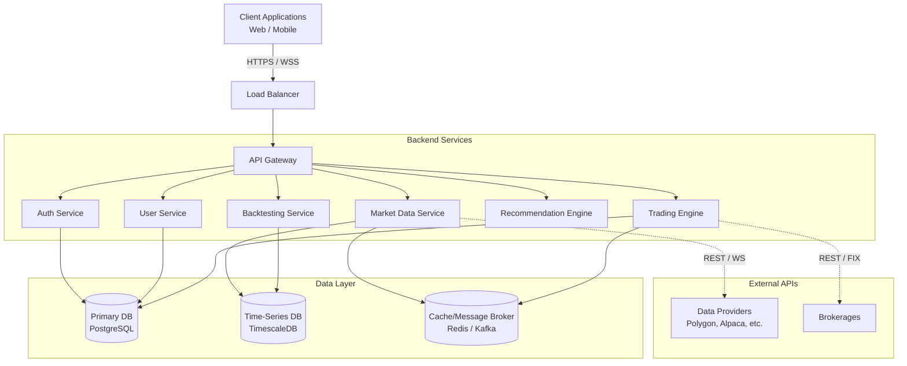

## Frontend Architecture

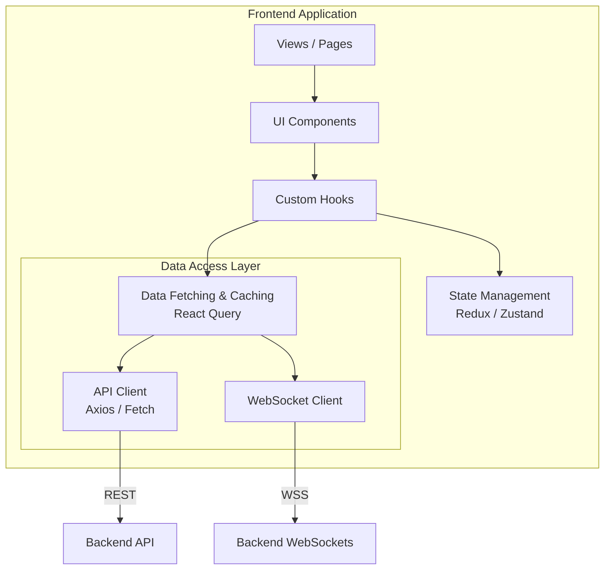

## Backend Architecture

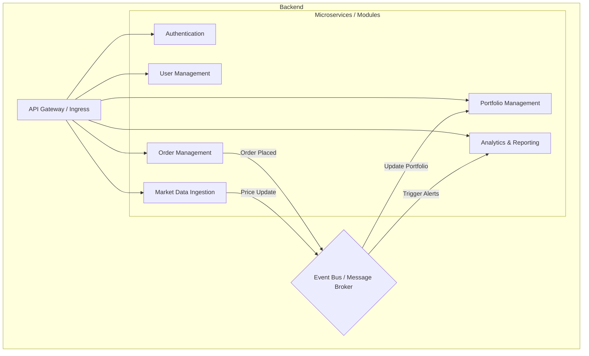

## Database Architecture

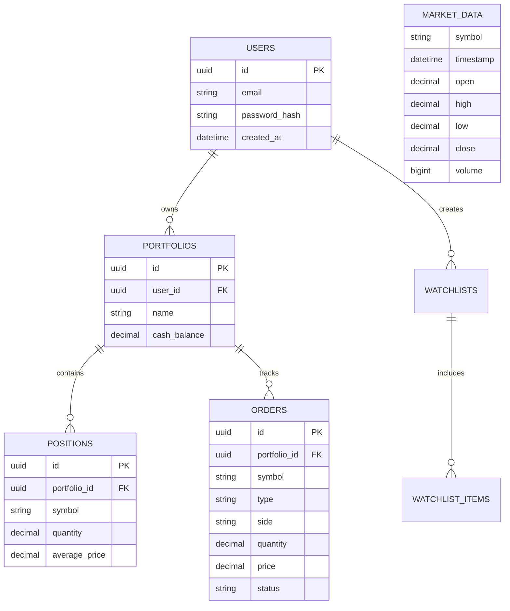

## Authentication Flow

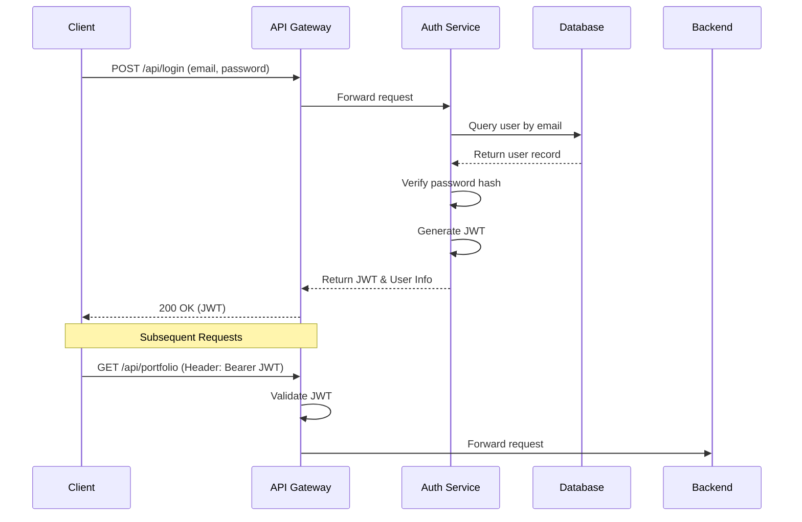

## Market Data Flow

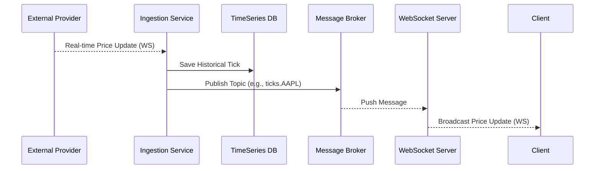

## Recommendation Flow

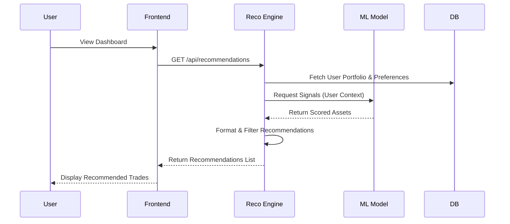

## Paper Trading Flow

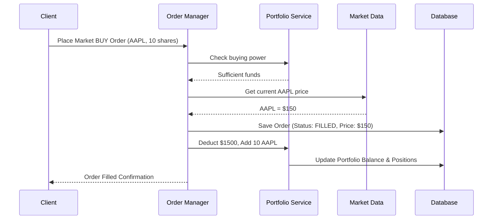

## Backtesting Flow

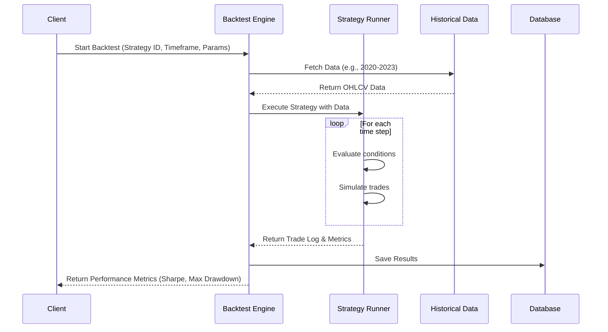

## WebSocket Flow

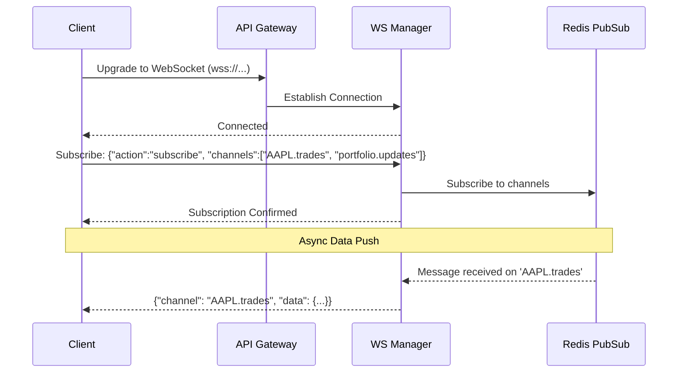

## Deployment Architecture

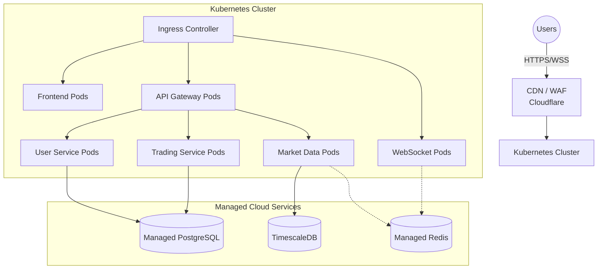
