# Database Entity Relationship Diagram

## Mermaid ER Diagram

```mermaid
erDiagram
    %% Core Tables
    watched_stocks {
        int id PK "Primary key"
        string symbol "Trading symbol"
    }
    fyers_tokens {
        int id PK
    }
    fyers_token_history {
        int id PK
    }

    %% Live Trading Domain
    live_accounts {
        int id PK "Primary account identifier"
    }
    live_positions {
        int id PK
        int account_id FK
    }
    live_orders {
        int id PK
        int account_id FK
    }
    order_execution_events {
        int id PK
        int order_id FK
    }
    broker_execution_logs {
        int id PK
    }

    %% Paper Trading Domain
    paper_trading_accounts {
        int id PK
    }
    paper_trading_positions {
        int id PK
        int account_id FK
    }
    paper_trading_orders {
        int id PK
        int account_id FK
    }
    paper_trading_trade_history {
        int id PK
        int account_id FK
    }
    paper_trading_notifications {
        int id PK
        int account_id FK
    }
    paper_trading_transactions {
        int id PK
        int account_id FK
    }
    paper_trading_alerts {
        int id PK
        int account_id FK
    }
    paper_trading_execution_events {
        int id PK
    }

    %% Analysis Domain
    analysis_history {
        int id PK
        int stock_id FK
    }
    backtest_history {
        int id PK
        int stock_id FK
    }
    strategy_performance_log {
        int id PK
    }
    scanned_candidates {
        int id PK
    }

    %% Market Data & Scanning Domain
    blacklisted_symbols {
        int id PK
    }
    historical_candles {
        int id PK
    }
    latest_scan_results {
        int id PK
    }
    scan_snapshots {
        string scan_id PK
    }
    scan_snapshot_records {
        int id PK
        string scan_id FK
    }
    scanner_sessions {
        string session_id PK
    }
    scanner_symbol_tracking {
        int id PK
        string session_id FK
    }
    system_locks {
        int id PK
    }
    market_engine_sessions {
        int id PK
    }
    market_replay_sessions {
        int id PK
    }

    %% System and Workstation
    system_logs {
        int id PK
    }
    dead_letter_jobs {
        int id PK
    }
    api_request_logs {
        int id PK
    }
    service_health {
        int id PK
    }
    saved_scans {
        int id PK
    }
    scan_history_snapshots {
        int id PK
    }
    workstation_alerts {
        int id PK
    }
    risk_settings {
        int id PK
    }
    idempotency_records {
        int id PK
    }
    migration_checkpoints {
        int id PK
    }

    %% Relationships
    watched_stocks ||--o{ analysis_history : "has"
    watched_stocks ||--o{ backtest_history : "has"
    
    live_accounts ||--o{ live_positions : "owns"
    live_accounts ||--o{ live_orders : "owns"
    live_orders ||--o{ order_execution_events : "generates"

    paper_trading_accounts ||--o{ paper_trading_positions : "owns"
    paper_trading_accounts ||--o{ paper_trading_orders : "owns"
    paper_trading_accounts ||--o{ paper_trading_trade_history : "records"
    paper_trading_accounts ||--o{ paper_trading_notifications : "receives"
    paper_trading_accounts ||--o{ paper_trading_transactions : "logs"
    paper_trading_accounts ||--o{ paper_trading_alerts : "configures"

    scan_snapshots ||--o{ scan_snapshot_records : "contains"
    scanner_sessions ||--o{ scanner_symbol_tracking : "tracks"
```

## Business Explanation

The database schema of the trading system is divided into several domains to effectively model both real-time execution and simulated operations:

1. **Live Trading Domain**: Manages real broker accounts (`live_accounts`), real active positions (`live_positions`), and executable orders (`live_orders`). Auditability is maintained via `order_execution_events` and `broker_execution_logs`.

2. **Paper Trading Domain**: Mirrors the live trading schema but safely insulates simulated funds and execution. Accounts (`paper_trading_accounts`) own multiple orders and positions. Lifecycle operations generate `paper_trading_trade_history`, `paper_trading_transactions`, and `paper_trading_notifications`. This isolation ensures testing algorithms does not impact live capital.

3. **Market Data & Scanning**: `scanner_sessions` oversee active scanner background tasks, managing state across multiple `scanner_symbol_tracking` items. `scan_snapshots` take point-in-time reads of the market grouped by `scan_snapshot_records`.

4. **Analysis Domain**: Aggregates computational metrics for strategy optimization. Includes `analysis_history` and `backtest_history`, which link back to the core `watched_stocks` table to connect stock identity with historical performance.

5. **System & Workstation**: Logs the physical and digital health of the application. Handles transient data like `api_request_logs`, operational settings like `risk_settings`, and system-wide assertions like `idempotency_records` and `system_locks` to prevent race conditions.
