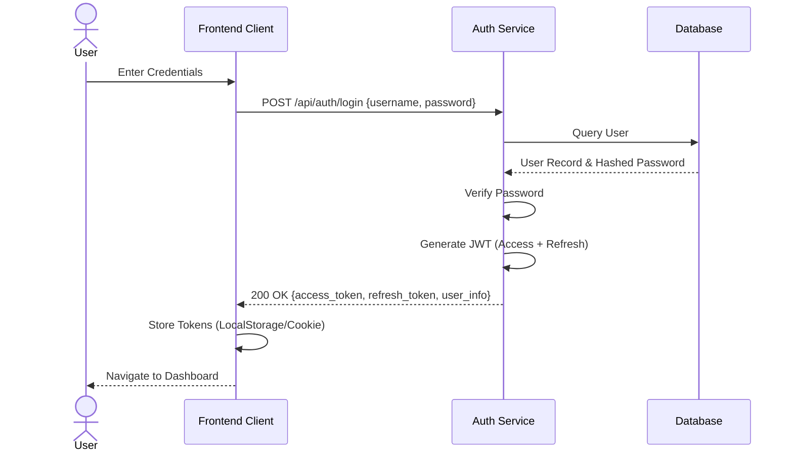
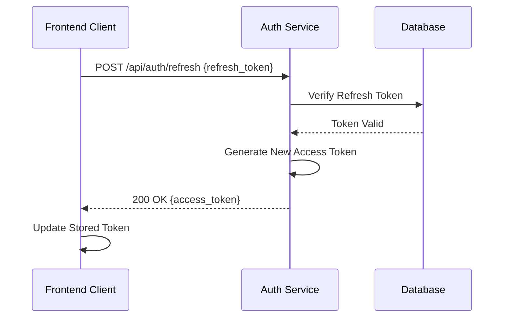
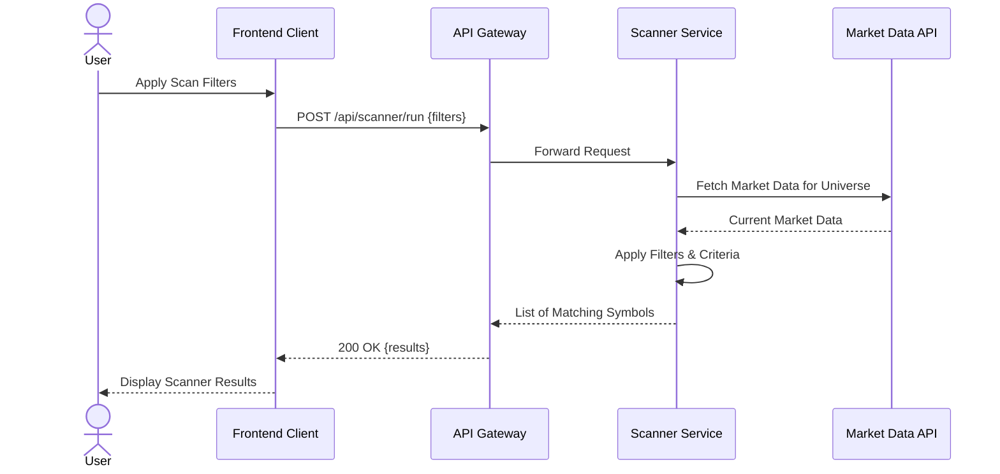
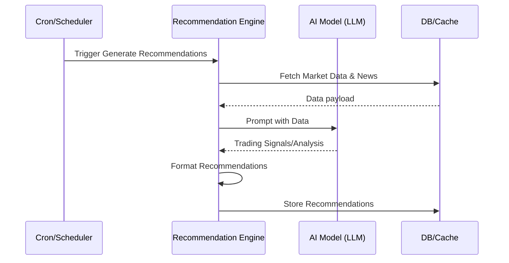
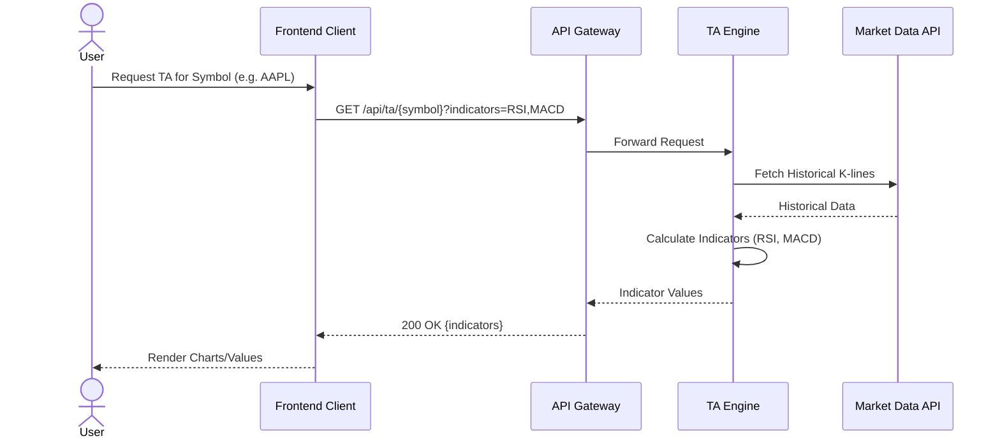
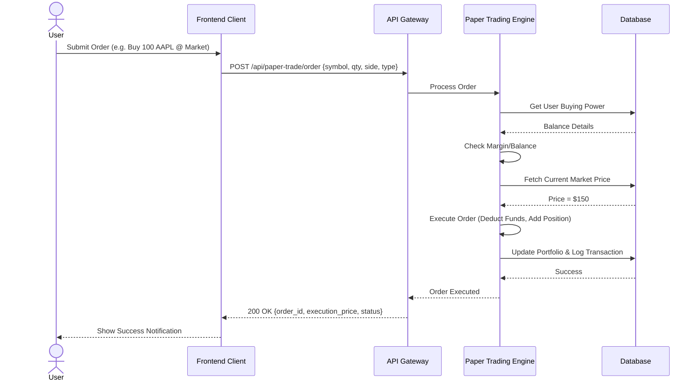
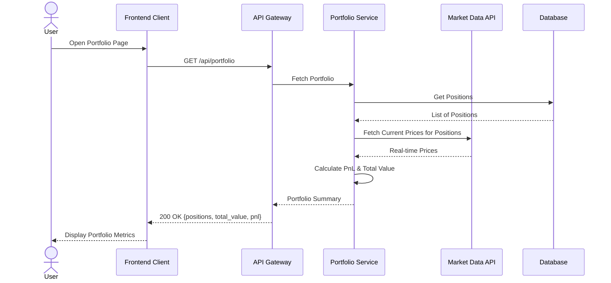
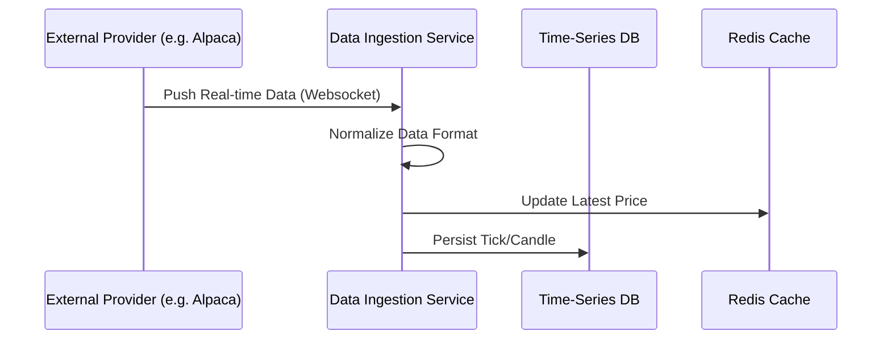
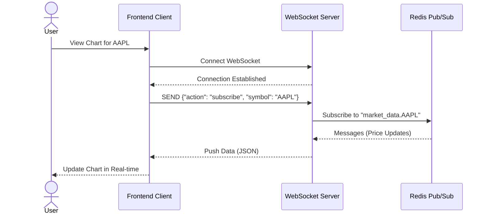
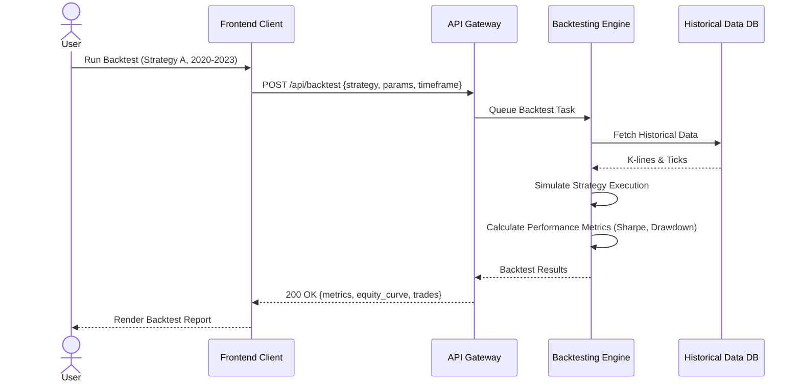

# Request/Response Flows

This document contains sequence diagrams for key request/response flows in the trading system.

## User Login

## Token Refresh

## Scanner Request

## Recommendation Generation

## Technical Analysis Request

## Paper Trade Execution

## Portfolio Refresh

## Market Data Update

## WebSocket Subscription

## Backtest Execution

