# Service Dependency Graph

This document illustrates the service dependencies across different layers in the trading system architecture, including API routes, core services, repositories, database infrastructure, external APIs, and background scheduling components.

```mermaid
graph TD
    %% Define Styles
    classDef external fill:#f9f,stroke:#333,stroke-width:2px;
    classDef api fill:#bbf,stroke:#333,stroke-width:2px;
    classDef service fill:#bfb,stroke:#333,stroke-width:2px;
    classDef worker fill:#fbf,stroke:#333,stroke-width:2px;
    classDef repo fill:#ffb,stroke:#333,stroke-width:2px;
    classDef infra fill:#ddd,stroke:#333,stroke-width:2px;

    subgraph External["External APIs"]
        FyersAPI[Fyers Trading & Data API]:::external
        LLMAPI[LLM / OpenAI API]:::external
    end

    subgraph APILayer["API Layer (FastAPI Routers)"]
        RouterAnalysis[Analysis Router]:::api
        RouterFyers[Fyers Router]:::api
        RouterPaperTrading[Paper Trading Router]:::api
        RouterScanner[Scanner Router]:::api
        RouterToken[Token Router]:::api
        RouterWorkstation[Workstation Router]:::api
    end

    subgraph ServiceLayer["Service Layer (Business Logic)"]
        SvcFyers[Fyers Service]:::service
        SvcMarketData[Market Data Service]:::service
        SvcMarketEngine[Market Engine Service]:::service
        SvcPaperTrading[Paper Trading Service]:::service
        SvcScreener[Screener Service]:::service
        SvcTA[Technical Analysis Service]:::service
        SvcToken[Token Service]:::service
        SvcWorkstation[Workstation Service]:::service
        SvcAnalytics[Analytics Service]:::service
        SvcLLM[LLM Service]:::service
    end

    subgraph Workers["Schedulers & Background Workers"]
        WorkerScanner[Scanner Background Worker]:::worker
        WorkerMarketData[Market Data Fetcher]:::worker
        WorkerReconciliation[Position Reconciliation Worker]:::worker
    end

    subgraph RepositoryLayer["Repository Layer (Data Access)"]
        RepoCandleStore[Candle Store Repository]:::repo
        RepoPersistence[Persistence Repository]:::repo
    end

    subgraph Infra["Infrastructure"]
        DB[(PostgreSQL)]:::infra
        Redis[(Redis Cache)]:::infra
        CandleCache[(SQLite Candle Cache)]:::infra
    end

    %% API Layer -> Service Layer
    RouterAnalysis --> SvcAnalytics
    RouterAnalysis --> SvcTA
    RouterFyers --> SvcFyers
    RouterPaperTrading --> SvcPaperTrading
    RouterScanner --> SvcScreener
    RouterToken --> SvcToken
    RouterWorkstation --> SvcWorkstation
    
    %% Service Layer Internal Dependencies
    SvcWorkstation --> SvcMarketData
    SvcWorkstation --> SvcPaperTrading
    SvcPaperTrading --> SvcMarketData
    SvcPaperTrading --> SvcMarketEngine
    SvcScreener --> SvcMarketData
    SvcScreener --> SvcTA
    SvcAnalytics --> SvcLLM
    SvcMarketData --> SvcFyers
    
    %% Service Layer -> External APIs
    SvcFyers --> FyersAPI
    SvcToken --> FyersAPI
    SvcLLM --> LLMAPI
    
    %% Background Workers -> Service Layer
    WorkerScanner --> SvcScreener
    WorkerMarketData --> SvcMarketData
    WorkerReconciliation --> SvcPaperTrading
    WorkerReconciliation --> SvcMarketData

    %% Service Layer -> Repository Layer / Infra
    SvcMarketData --> RepoCandleStore
    SvcMarketData --> Redis
    SvcPaperTrading --> RepoPersistence
    SvcScreener --> RepoPersistence
    SvcToken --> RepoPersistence
    SvcToken --> Redis
    SvcAnalytics --> RepoPersistence
    
    %% Repository Layer -> Infra
    RepoCandleStore --> CandleCache
    RepoCandleStore --> DB
    RepoPersistence --> DB
    
    %% Workers direct to DB (if applicable)
    WorkerScanner --> DB
    WorkerMarketData --> DB

```

