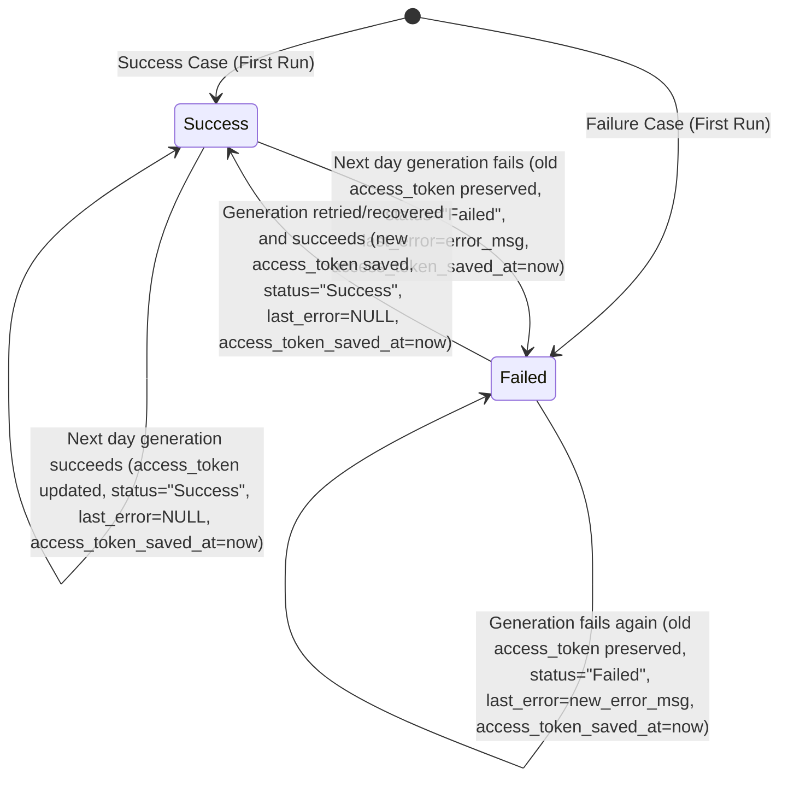

# Data Model Specification: Sprint 4 – Database Storage + Basic Monitoring

**Feature**: [spec.md](file:///D:/Work_Space/trading-system/specs/009-db-storage-monitoring/spec.md)
**Created**: 2026-07-20

---

## 1. Entity Schema: FyersToken

We use the existing database table `fyers_tokens` which represents the system-wide Fyers API access token and active login state.

### Fields and Schema Definition

| Column | SQLAlchemy Type | DB Type | Nullable | Default | Description |
| :--- | :--- | :--- | :--- | :--- | :--- |
| `id` | `Integer` | `INT` | `False` | Primary Key (1) | Singleton record ID. Maintained at `id = 1` for system-wide active token. |
| `access_token` | `Text` | `TEXT` | `False` | - | The Fernet-encrypted JWT access token string. |
| `created_at` | `DateTime(tz=True)` | `TIMESTAMPTZ` | `False` | `datetime.utcnow` | Timestamp when the token row was first created. |
| `expires_at` | `DateTime(tz=True)` | `TIMESTAMPTZ` | `True` | `None` | Expiration timestamp decoded from the JWT payload. |
| `is_active` | `Boolean` | `BOOLEAN` | `False` | `True` | Flag indicating whether this is the active system token. |
| `validated_at` | `DateTime(tz=True)` | `TIMESTAMPTZ` | `True` | `None` | Timestamp of the last successful validation against Fyers. |
| `status` | `String(32)` | `VARCHAR(32)`| `False` | `"active"` | Monitoring status: `"Success"`, `"Failed"`, `"active"`, `"inactive"`. |
| `access_token_saved_at` | `DateTime(tz=True)`| `TIMESTAMPTZ` | `False` | `datetime.utcnow` | The monitoring update timestamp (equivalent to `updated_at`). |
| `last_error` | `Text` | `TEXT` | `True` | `None` | The error message or exception details if token generation failed. |

---

## 2. Validation & Constraints

1. **Singleton Record**: The database must only contain one active row representing the system's Fyers Token, typically keyed at `id = 1`.
2. **Secret Encryption**: The `access_token` field must always store encrypted text. Writing raw plaintext access tokens is prohibited.
3. **UTC Timezones**: All datetime fields (`created_at`, `expires_at`, `validated_at`, `access_token_saved_at`) must be stored with timezone info (UTC).

---

## 3. Lifecycle & State Transitions

The state diagram below outlines the transition of the token record's monitoring parameters (`status`, `last_error`, `access_token`):

