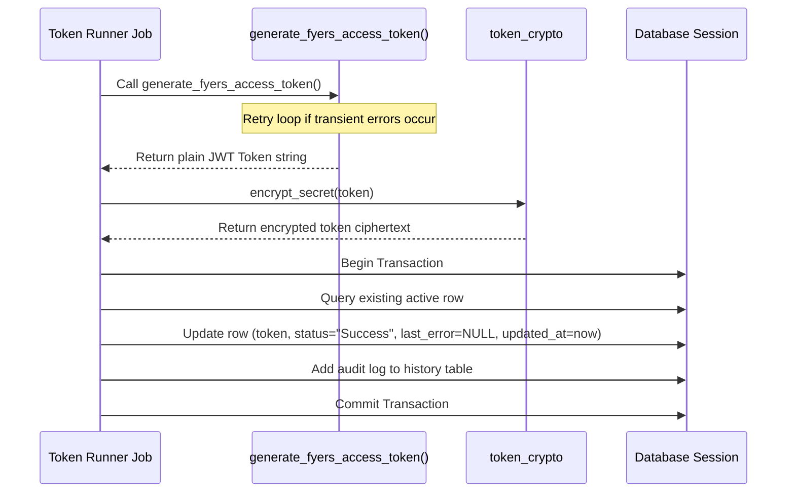
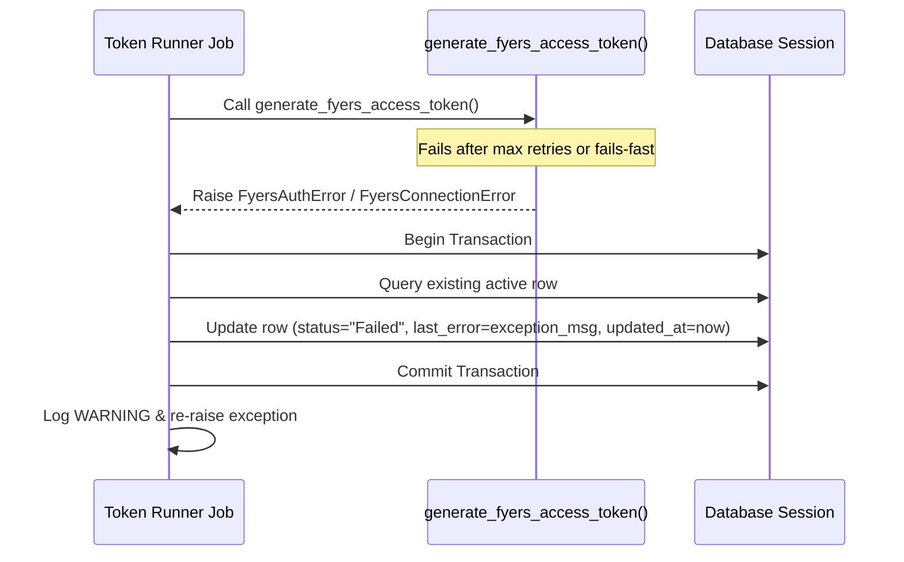

# Feature Specification: Sprint 4 – Database Storage + Basic Monitoring

**Feature Branch**: `009-db-storage-monitoring`  
**Created**: 2026-07-20  
**Status**: Draft  
**Input**: User description: "Generate a detailed technical specification for Sprint 4 of the Fyers Access Token Automation project. Sprint Name: Sprint 4 – Database Storage + Basic Monitoring. Context: Sprint 1, Sprint 2, and Sprint 3 are already completed. We now have a working and reliable function generate_fyers_access_token() that generates a Fyers access token using pure API calls + TOTP with retry logic (max 3 attempts). Objective of this Sprint: Store the generated access token in the database along with basic monitoring information (status, timestamp, and error message if any)."

---

## Overview

Sprint 4 extends the headless login automation utility (`generate_fyers_access_token()`) by integrating it with database storage and monitoring observability. During previous sprints, the core API/TOTP-based token generation and automated retry logic (max 3 attempts) were established. 

The objective of this sprint is to persist the outcome of the token generation run (whether it succeeded or failed) directly to the database. This allows other services to retrieve the active token from the database, and provides system operators with monitoring fields (`status`, `updated_at`, `last_error`) to track the health of the daily authentication process.

---

## User Scenarios & Testing *(mandatory)*

### User Story 1 - Persist Access Token on Success (Priority: P1)

As a background system scheduler, when the token generation process successfully generates a new Fyers access token, I want the token and transaction metadata to be automatically persisted to the database so that downstream trading services can access the active credential.

**Why this priority**: Without database storage, generated tokens are lost upon process completion. Storing them in a central, secure table is necessary for live trading operations.

**Independent Test**:
Can be fully verified by running the token generation runner with valid credentials and database connection, confirming that a new row is written (or the existing row is updated) in the database with the encrypted access token, `status` set to "Success", `last_error` cleared to NULL, and `updated_at` updated to the current system time.

**Acceptance Scenarios**:
1. **Given** valid Fyers credentials and a working database connection, **When** token generation succeeds, **Then** the database record is updated with the encrypted access token, `status` is set to "Success", `last_error` is set to NULL, and `updated_at` is set to the current UTC timestamp.

---

### User Story 2 - Record Failure and Diagnostic Info (Priority: P2)

As a system administrator, when the token generation process fails after all retry attempts (or fails fast on permanent configuration errors), I want the system to record a "Failed" status and the corresponding error message in the database so that I can monitor failures and debug issues quickly.

**Why this priority**: High observability is needed for automated processes. Recording failures and error messages in the database enables instant health monitoring and helps operators isolate bad configuration or network outages.

**Independent Test**:
Simulate a persistent connection or credential failure, run the token generation process, and verify that the database record is updated with `status` set to "Failed", `last_error` contains the exact exception message, and the previous token value is not deleted (to avoid prematurely locking out other systems if the old token is still valid).

**Acceptance Scenarios**:
1. **Given** a transient error that persists through all 3 retries, **When** token generation fails, **Then** the database is updated with `status` set to "Failed", `last_error` stores the final exception message, and `updated_at` is updated to the current UTC timestamp.
2. **Given** a permanent authentication or configuration error (e.g. invalid PIN), **When** the generator fails fast, **Then** the database is updated with `status` set to "Failed", `last_error` stores the configuration/PIN error message, and `updated_at` is updated to the current UTC timestamp.

---

### User Story 3 - Environment Parity (Priority: P3)

As a developer, I want the token storage and monitoring logic to operate independently in both Development and Production environments, updating the appropriate database target depending on the environment configuration, without requiring code modifications.

**Why this priority**: Promotes development safety by ensuring local testing does not overwrite production data, while reusing the same code path.

**Independent Test**:
Run the token generator in a local environment using development environment variables and confirm the development database is updated. Repeat the test in a staging/production environment configuration and verify that the production database is updated.

**Acceptance Scenarios**:
1. **Given** the environment is configured for Development, **When** the token generator executes, **Then** the local development database tables are updated.
2. **Given** the environment is configured for Production, **When** the token generator executes, **Then** the production database tables are updated.

---

### Edge Cases

- **Database Unavailability**: What if the database is unreachable when the generator attempts to write the outcome?
  - *Behavior*: The token runner must log the database error to standard error/logs, retry the connection up to a standard timeout using the existing database connection pool configuration, and raise a connection error. It must not hang indefinitely.
- **Wiping Valid Tokens on Failure**: Should a failed run overwrite or erase a working, previously stored token?
  - *Behavior*: No. To prevent trading disruption, a failed run must update `status` and `last_error` fields, but it MUST NOT delete or invalidate the previous valid `access_token` column, since that token might still be valid for a few hours.
- **Security & Decoupled Secret Storage**: How is the token stored safely?
  - *Behavior*: The access token must be encrypted using the project's standard encryption wrapper (`encrypt_secret`) prior to persistence, ensuring that no plaintext credentials exist in raw database dumps or database logs.

---

## Requirements *(mandatory)*

### Functional Requirements

- **FR-001**: The system MUST persist the generated access token to the database upon a successful token generation run.
- **FR-002**: The system MUST store monitoring information including the status of the run, the update timestamp, and the error message (if any) in the database.
- **FR-003**: The status field MUST be updated to "Success" on successful generation, and "Failed" on any failed attempt (both transient exhaustions and fail-fasts).
- **FR-004**: The system MUST capture and store the error message in the `last_error` field only if the process fails. If the process succeeds, the `last_error` field MUST be cleared (set to NULL).
- **FR-005**: The system MUST encrypt the access token before storing it in the database, using the project's cryptography module.
- **FR-006**: The system MUST reuse the existing database models, sessions, and configuration settings (e.g. `AsyncSessionLocal`, `SessionLocal`, Pydantic `settings`) to connect to and modify the database.
- **FR-007**: The database update MUST execute inside a transaction, ensuring atomicity of the token and status updates.

### Key Entities *(include if feature involves data)*

- **FyersToken** (mapped to the existing `fyers_tokens` database table):
  - Represents the persisted Fyers authentication state and monitoring status.
  - Key fields:
    - `id` (Integer, Primary Key)
    - `access_token` (Text, Encrypted token value)
    - `updated_at` / `access_token_saved_at` (DateTime with timezone, timestamp of last update)
    - `status` (String, e.g. "Success" or "Failed")
    - `last_error` (Text, Nullable, error description if the run failed)
    - `is_active` (Boolean, active flag)
    - `expires_at` (DateTime, Nullable, expiration timestamp extracted from JWT claims)

---

## Logic Flow

### Success Case

### Failure Case

---

## Success Criteria *(mandatory)*

### Measurable Outcomes

- **SC-001**: Following a successful run, the database is updated with the new token within 2.0 seconds of generation.
- **SC-002**: Under failure conditions, the database logs the exact error details and status "Failed" in under 2.0 seconds.
- **SC-003**: 100% of persisted access tokens are verified to be encrypted in the database, with zero plaintext occurrences.
- **SC-004**: The system operates with zero hardcoded database or broker credentials across development and production environments.

---

## Out of Scope

- Setting up OS-level cron schedules or third-party schedulers (e.g. Celery/APScheduler) to trigger the token generation daily.
- Building a web frontend user interface to monitor token status or trigger token generation manually.
- Automatically validating tokens against live broker endpoints periodically throughout the day.
- Encryption key rotation schedules.

---

## Assumptions

- The project database schema has migrated or will migrate using Alembic to support the necessary columns in `fyers_tokens`.
- The environment variables (`FYERS_CLIENT_ID`, `FYERS_PIN`, `DATABASE_URL`, etc.) are correctly set in the runtime context of the execution environment.
- The local clock of the runner system is synchronized (e.g. via NTP) to ensure accurate monitoring timestamps.
