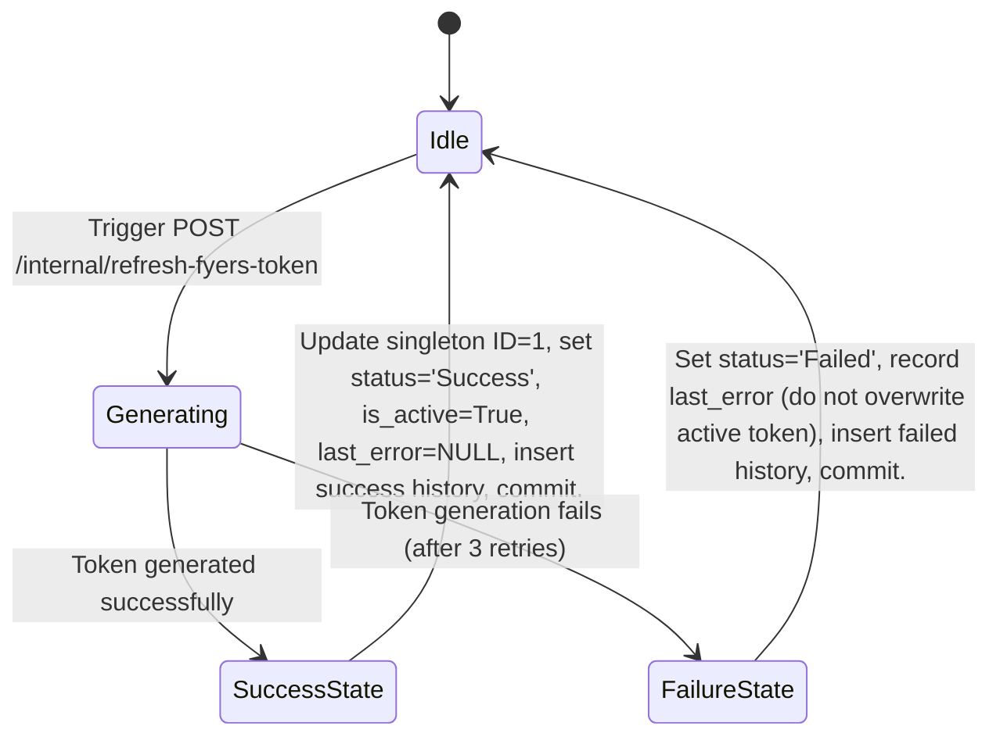

# Data Model: Sprint 5 – Internal API Endpoint

## Overview

This sprint reuses the existing database models implemented in Sprint 4. No schema migrations or model changes are required. The endpoint `POST /internal/refresh-fyers-token` interacts with these models through `generate_and_persist_fyers_token()`.

## Entities & Attributes

### 1. FyersToken (Database Table: `fyers_tokens`)
Stores the active Fyers broker session token and current connectivity/validation status. Represented as a singleton record (always `id = 1`).

| Field | Type | Description |
|---|---|---|
| `id` | Integer | Primary key, singleton ID (always 1). |
| `access_token` | String (Encrypted) | The active, encrypted JWT access token string used for broker API requests. |
| `is_active` | Boolean | Flags if the token is active (`True` on success, set to `False` for other rows). |
| `status` | String | Refresh outcome status: `"Success"` or `"Failed"`. |
| `last_error` | String (Nullable) | Holds the error/exception string if the last generation attempt failed. |
| `created_at` | DateTime (UTC) | Record creation timestamp. |
| `access_token_saved_at` | DateTime (UTC) | Timestamp when the active token was successfully written. |
| `validated_at` | DateTime (UTC) | Timestamp of the last validity check/upsert. |
| `expires_at` | DateTime (UTC) | Calculated token expiration timestamp decoded from the JWT. |

---

### 2. FyersTokenHistory (Database Table: `fyers_token_history`)
Maintains an audit trail of token generation and refresh execution logs.

| Field | Type | Description |
|---|---|---|
| `id` | Integer | Primary key, autoincrement. |
| `access_token_masked` | String | Masked preview of the generated token (first/last characters visible) for secure auditing. |
| `saved_at` | DateTime (UTC) | Timestamp when the refresh attempt occurred. |
| `status` | String | Execution outcome (`"Success"` or `"Failed"`). |
| `note` | String | Audit note (e.g., `"Automated headless token generation"`). |

## State Transitions

The endpoint triggers state updates inside the service layer as follows:

