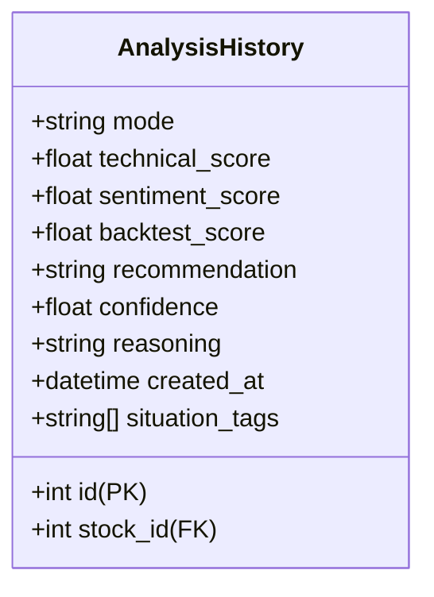
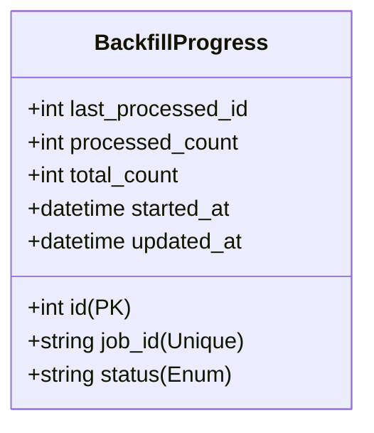
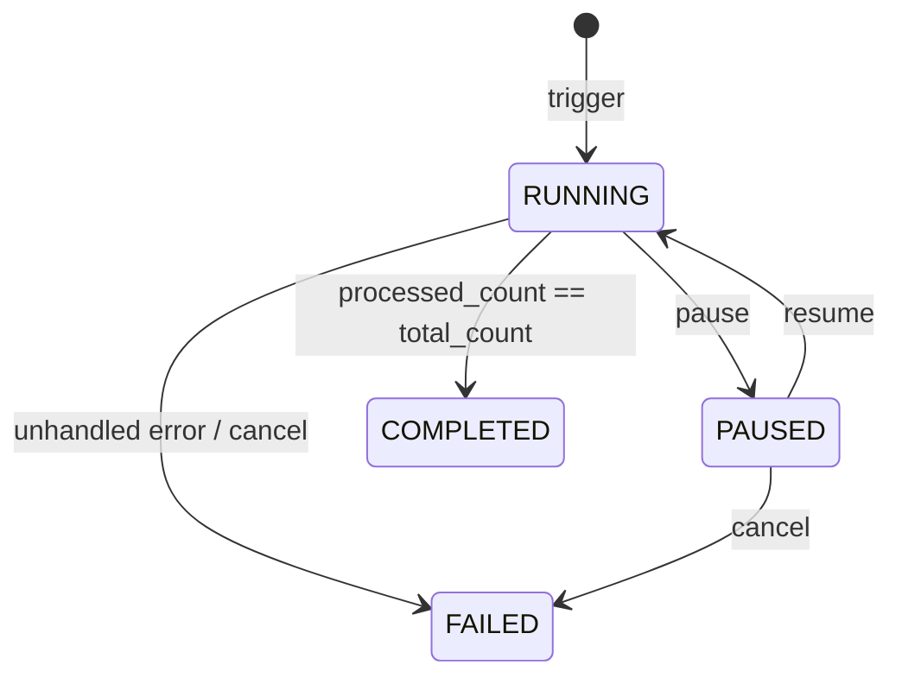

# Data Model: Taxonomy Alignment & Historical Backfill

This document specifies the schema modifications and new entities required to support situation tagging and backfilling.

## Database Schema Modifications

### 1. `analysis_history` (Existing Table - Updated)
We add a new `situation_tags` column to record the taxonomy classifications for each recommendation.

#### Column Details
- **Column Name**: `situation_tags`
- **Data Type**: `TEXT[]` (Array of Text)
- **Nullable**: `FALSE`
- **Server Default**: `'{}'` (Empty array)
- **Index**: GIN (Generalized Inverted Index) on `situation_tags` to allow high-performance containment queries (e.g., finding recommendations with specific tags).

---

### 2. `backfill_progress` (New Table)
Tracks the state of historical backfill execution runs.

#### Fields and Types
- `id` (Integer, Primary Key, Autoincrement)
- `job_id` (String(50), Unique, Indexed): Identifier for the backfill run.
- `last_processed_id` (Integer): The database ID of the last successfully processed record from `analysis_history`. Used as the cursor for keyset paging resumption.
- `status` (String(20), Default: `"RUNNING"`): Lifecycle status of the job. Allowed values: `RUNNING`, `PAUSED`, `COMPLETED`, `FAILED`.
- `processed_count` (Integer, Default: 0): Real-time counter of processed records.
- `total_count` (Integer): Total records matching the backfill criteria at the start of the job.
- `started_at` (DateTime(timezone=True), Default: Current time)
- `updated_at` (DateTime(timezone=True), Default: Current time, Auto-updated)

---

## Validation & State Transition Rules

### Tag Assignment Validation
- A record must always have at least one situation tag assigned.
- If no tags are determined by the deterministic classifier rules, the list must default to `['UNKNOWN']` or `['RANGE_BOUND']` (depending on signal presence).
- Supported situation tags are strictly constrained to:
  - `GOOD_NEWS_CATALYST`
  - `BAD_NEWS_CATALYST`
  - `EARNINGS_PLAY`
  - `MARKET_REGIME`
  - `RANGE_BOUND`
  - `UNKNOWN`

### Backfill Job State Machine
A backfill job transitions through the following lifecycle states:

- **RUNNING**: The job is active and processing batches.
- **PAUSED**: The job is temporarily suspended. No records are processed. The current `last_processed_id` cursor remains saved.
- **COMPLETED**: The job has successfully processed all matching records.
- **FAILED**: An error occurred or the job was cancelled. The cursor is preserved to support a retry/resumption attempt.
