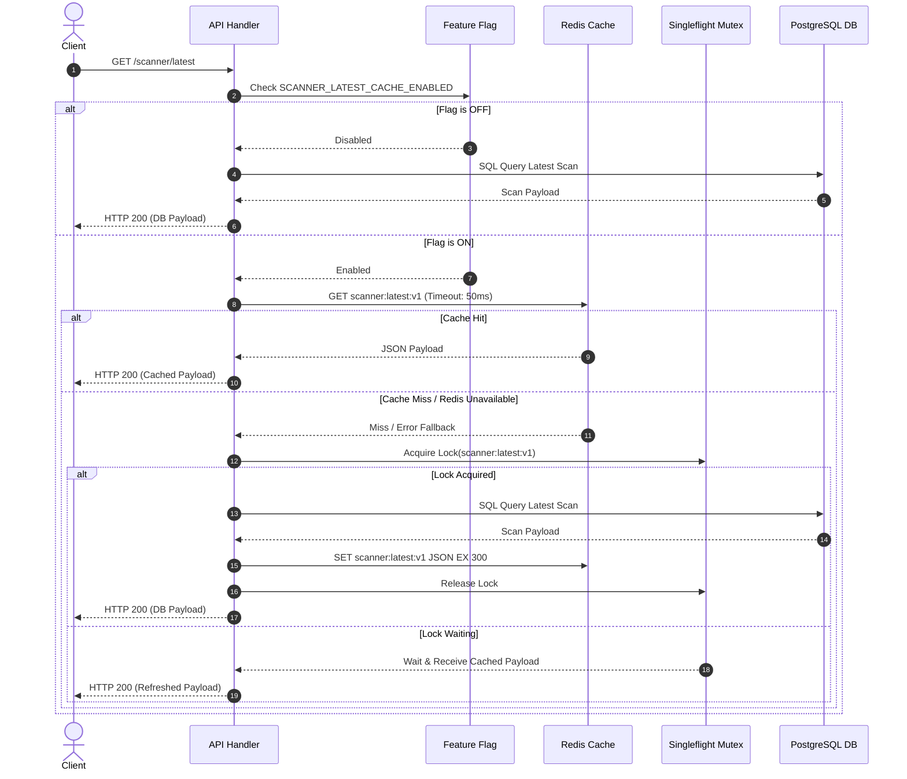
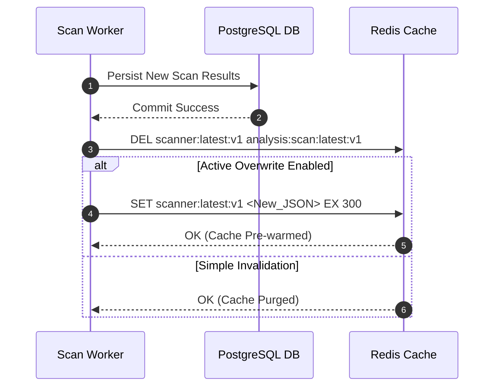

# Feature Specification: Scanner Dashboard Cache

**Feature Branch**: `017-scanner-dashboard-cache`  
**Created**: 2026-07-27  
**Status**: Draft  
**Input**: User description: "Sprint 1 Specification Generation - Scanner Dashboard Cache"

---

## Clarifications

### Session 2026-07-27
- Q: Post-Scan Cache Update Strategy → A: Active Pre-Warming (`SET`) - Background market scan completion worker serializes and writes the new scan payload directly to Redis (`SET`) immediately upon scan completion.

---

## 1. Problem Statement

### 1.1 Current Issue
The Scanner Dashboard frequently invokes two high-traffic read API endpoints:
- `GET /scanner/latest`
- `GET /analysis/scan/latest`

Currently, every single HTTP request to these endpoints issues direct SQL queries to the PostgreSQL database to fetch and assemble the latest scan results and analysis payloads.

### 1.2 Root Cause
There is no caching layer interposed between the API routing layer and the PostgreSQL database for scanner read operations. Each incoming client request forces full database query parsing, execution, payload serialization, and network transfer between the database server and the application service.

### 1.3 Business & Technical Impact
- **Repeated Database Reads**: Identical heavy queries are executed repeatedly even when the underlying scan dataset has not changed.
- **Unnecessary Network & I/O Overhead**: Large scanner JSON payloads are constantly re-queried from disk and transferred across internal networks.
- **Slower Dashboard Loading**: End-user dashboard render time is bound by database query latency (often >150ms-300ms depending on load).
- **PostgreSQL Resource Contention**: High frequency polling by active client dashboards consumes database connection pool slots and CPU cycles, degrading performance for concurrent transactional writes and processing workers.

---

## 2. Goal

### 2.1 Core Objective
Introduce a high-performance Redis cache layer for `GET /scanner/latest` and `GET /analysis/scan/latest` endpoints that serves pre-serialized scanner payloads directly from in-memory storage while keeping the public API response schema, headers, and status codes **100% unchanged**.

### 2.2 Target Improvements
- **Response Latency**: Reduce p95 endpoint response time from >150ms to <10ms for cached responses.
- **Database Query Volume**: Reduce PostgreSQL read query load for latest scan endpoints by >90%.
- **Resource Utilization**: Free up PostgreSQL connection pool capacity and CPU overhead for active scan worker execution.

---

## 3. Scope

### 3.1 Included Endpoints
- `GET /scanner/latest` (Retrieves latest market scan summary/results)
- `GET /analysis/scan/latest` (Retrieves latest deep analysis generated from scanner runs)

### 3.2 Affected Components
- **API Router & Controller Layer**: Request interceptor / cache lookup logic.
- **Cache Service / Interface**: Redis client wrapper handling read/write, serialization, and connection failure fallbacks.
- **Scan Completion Worker / Event Dispatcher**: Invalidation and active cache refresh hook triggered upon scan job completion.
- **Configuration & Feature Flag Service**: Managing runtime feature flag (`SCANNER_LATEST_CACHE_ENABLED`) and configuration settings (`SCANNER_LATEST_CACHE_TTL_SECONDS`).

### 3.3 Out of Scope (Sprint 1 Non-Goals)
- No changes to API response JSON structures, field names, or data types.
- No modifications to database schemas, tables, or indexes.
- No removal or refactoring of existing database query functions (must remain operational as baseline/fallback).
- No implementation of caching for historical scan query endpoints (`/scanner/history`, `/analysis/scan/{id}`).
- No modifications to scan calculation logic or signal generation algorithms.

---

## 4. User Scenarios & Testing *(mandatory)*

### User Story 1 - Fast Dashboard Loading via Cached Scanner Results (Priority: P1)

As a dashboard user, I want the latest scanner data (`GET /scanner/latest` and `GET /analysis/scan/latest`) to load almost instantly so that I can monitor active market signals without delay.

**Why this priority**: Core value proposition of Sprint 1. Directly resolves dashboard latency and eliminates redundant database queries.

**Independent Test**: Can be verified by executing consecutive GET requests to `/scanner/latest` with `SCANNER_LATEST_CACHE_ENABLED=true` and confirming that the second request returns in <10ms without triggering PostgreSQL query logs.

**Acceptance Scenarios**:
1. **Given** `SCANNER_LATEST_CACHE_ENABLED` is `true` and Redis is empty, **When** a user requests `GET /scanner/latest`, **Then** the system queries PostgreSQL, populates Redis cache with TTL `SCANNER_LATEST_CACHE_TTL_SECONDS`, and returns HTTP 200 with exact payload.
2. **Given** Redis contains cached key `scanner:latest:v1`, **When** a user requests `GET /scanner/latest`, **Then** the system returns HTTP 200 directly from Redis without issuing any SQL query to PostgreSQL.

---

### User Story 2 - Real-Time Cache Invalidation on New Scan Completion (Priority: P1)

As a trading system user, I want the cache to be invalidated or updated immediately when a new market scan finishes so that I never view outdated scan data.

**Why this priority**: Critical for data accuracy. Ensures eventual and near-instant consistency between latest scan state in DB and cache.

**Independent Test**: Trigger a scan run, verify cache key is updated or purged upon scan completion, and verify next API call returns the newly generated scan payload.

**Acceptance Scenarios**:
1. **Given** cached scan data exists in Redis, **When** a background scan process completes successfully, **Then** the scan worker invalidates/overwrites keys `scanner:latest:v1` and `analysis:scan:latest:v1` in Redis.
2. **Given** invalidation occurred, **When** the next `GET /scanner/latest` request arrives, **Then** it fetches the fresh scan result from PostgreSQL and repopulates Redis.

---

### User Story 3 - Manual Force Refresh & Bypass (Priority: P2)

As an admin or developer, I want to force a cache refresh via `?force=true` query parameter or `Cache-Control: no-cache` header so that I can bypass stale cached data during verification or debugging.

**Why this priority**: Essential operational utility for troubleshooting and ensuring immediate baseline verification.

**Independent Test**: Execute `GET /scanner/latest?force=true` while cache holds valid data; verify that PostgreSQL is queried and Redis cache is updated with fresh DB data.

**Acceptance Scenarios**:
1. **Given** valid cached data exists, **When** request contains `GET /scanner/latest?force=true` OR header `Cache-Control: no-cache`, **Then** the system bypasses Redis read, queries PostgreSQL, updates Redis cache, and returns HTTP 200.

---

### User Story 4 - Feature Flag Governance & Zero-Downtime Rollback (Priority: P2)

As a system operator, I want to toggle `SCANNER_LATEST_CACHE_ENABLED` between `true` and `false` dynamically so that I can instantaneously fall back to direct DB queries if Redis issues arise.

**Why this priority**: Safe deployment and zero-risk rollout compliance.

**Independent Test**: Set `SCANNER_LATEST_CACHE_ENABLED=false` and verify that all incoming requests query PostgreSQL directly, completely ignoring Redis cache lookups.

**Acceptance Scenarios**:
1. **Given** `SCANNER_LATEST_CACHE_ENABLED` is `false`, **When** `GET /scanner/latest` is requested, **Then** the system executes the pre-existing PostgreSQL query directly without reading or writing to Redis.

---

### User Story 5 - High-Availability Fallback on Redis Outage (Priority: P3)

As a system operator, I want the API to gracefully fall back to PostgreSQL if Redis becomes unreachable so that dashboard API availability remains 100%.

**Why this priority**: System resilience against infrastructure component failures.

**Independent Test**: Simulate Redis connection failure (e.g. stop Redis daemon); verify `GET /scanner/latest` still returns HTTP 200 fetched from DB with logged warning, avoiding 5xx errors.

**Acceptance Scenarios**:
1. **Given** Redis connection fails or times out (>50ms), **When** `GET /scanner/latest` is requested, **Then** the system catches the Redis exception, logs a warning metric, queries PostgreSQL directly, and returns HTTP 200 to the client.

---

### Edge Cases
- **Cache Stampede (Thundering Herd)**: When a key expires while 100 concurrent requests arrive simultaneously, only 1 request must hit PostgreSQL while the remaining 99 await the lock/singleflight result.
- **Partial Cache Corruption / Unparseable Payload**: If JSON deserialization from Redis fails, the system must log an error, evict the corrupted key, and fallback to PostgreSQL.
- **Empty / Null Scan Result**: If PostgreSQL returns no scan records (e.g., initial clean DB), null/empty payload should either be cached with a short TTL (10s) or bypass caching to prevent caching negative state permanently.
- **Redis Timeout**: Redis read operations must strictly time out at 50ms to ensure cache lookup never introduces latency worse than direct DB read.

---

## 5. Functional Requirements

### 5.1 Cache Lookup & Hit/Miss Behavior
- **FR-001**: System MUST inspect feature flag `SCANNER_LATEST_CACHE_ENABLED` on every endpoint request to `/scanner/latest` and `/analysis/scan/latest`.
- **FR-002**: System MUST perform Redis lookup using configured key names when `SCANNER_LATEST_CACHE_ENABLED` is `true`.
- **FR-003**: On Cache Hit, system MUST deserialize cached JSON string and return HTTP 200 with content-type `application/json` without executing SQL queries.
- **FR-004**: On Cache Miss, system MUST query PostgreSQL, serialize response payload, store payload in Redis with TTL `SCANNER_LATEST_CACHE_TTL_SECONDS`, and return response to caller.

### 5.2 Cache Invalidation & Force Refresh
- **FR-005**: System MUST perform active cache pre-warming (`SET`) on Redis keys `scanner:latest:v1` and `analysis:scan:latest:v1` immediately upon successful completion of a background scan job, ensuring instant cache hits for subsequent reads.
- **FR-006**: System MUST bypass cache read when incoming request contains query parameter `force=true` OR header `Cache-Control: no-cache`.
- **FR-007**: When force refresh is triggered, system MUST execute PostgreSQL query, overwrite existing Redis cache key with updated payload, and return HTTP 200.

### 5.3 Failure Handling & Concurrency
- **FR-008**: System MUST catch all Redis connection, read, write, and timeout exceptions (>50ms) gracefully without returning HTTP 5xx to client.
- **FR-009**: On Redis failure, system MUST log structured warning metric `scanner_cache_redis_errors_total` and fall back to PostgreSQL database read.
- **FR-010**: System MUST enforce a mutex lock or singleflight execution pattern during cache miss refill to prevent concurrent request stampedes on PostgreSQL.

---

## 6. Non-Functional Requirements

### 6.1 Performance
- **Response Latency**: Cache hit p95 latency MUST be <10ms (p99 <25ms).
- **Throughput**: Cache layer MUST support minimum 1,000 requests per second (RPS) per API instance with <5% CPU usage increase.
- **Database Load Reduction**: PostgreSQL read query count for target endpoints MUST decrease by >90% during active dashboard polling.

### 6.2 Reliability & Availability
- **System Availability**: Overall endpoint uptime MUST remain 99.99%. Redis unavailability MUST NOT degrade API endpoint availability.
- **Timeout Bound**: Cache operations MUST have an aggressive 50ms read timeout and 100ms write timeout.

### 6.3 Security
- **Data Protection**: Cache payload MUST contain identical sanitized data as current direct DB response. No tokens, secrets, or internal connection parameters stored in cache.
- **Access Control**: Cache keys MUST be isolated within dedicated key namespace (`scanner:latest:*`).

### 6.4 Backward Compatibility
- **API Contract Guarantee**: HTTP Response Headers, HTTP Status Codes, and JSON Body key-value structures MUST match baseline API specifications with 100% exact parity.

---

## 7. Architecture & Diagrams

### 7.1 Component Architecture Flow

```
+------------------+
|   Client / UI    |
+--------+---------+
         |
         | GET /scanner/latest
         v
+---------------------------------------------------------+
|                    API Route Handler                    |
|                                                         |
|  Check SCANNER_LATEST_CACHE_ENABLED?                    |
|    |-- NO  --> [ Query PostgreSQL DB directly ]         |
|    +-- YES --> [ Proceed to Cache Strategy ]            |
+------------------------+--------------------------------+
                         |
                         v
+---------------------------------------------------------+
|                  Redis Cache Manager                    |
|                                                         |
|  Force refresh requested (?force=true)?                 |
|    |-- YES --> [ Bypass Redis read, query DB, update ] |
|    +-- NO  --> [ Lookup Redis Key: scanner:latest:v1 ]  |
+------------+-------------------------------+------------+
             |                               |
     (Cache Hit)                     (Cache Miss / Error)
             |                               |
             v                               v
  +--------------------+         +-----------------------+
  | Return Redis JSON  |         | Acquire Singleflight  |
  |    (Latency <10ms) |         | Lock & Query Postgres |
  +--------------------+         +-----------+-----------+
                                             |
                                             v
                                 +-----------------------+
                                 | Populate Redis Cache  |
                                 |  (TTL: Configured)    |
                                 +-----------+-----------+
                                             |
                                             v
                                 +-----------------------+
                                 | Return DB Response    |
                                 +-----------------------+
```

### 7.2 Sequence Diagram: Cache Read Flow



### 7.3 Sequence Diagram: Scan Completion Invalidation Flow



---

## 8. Data Flow

```
[Request Arrives]
       │
       ▼
[Check Feature Flag: SCANNER_LATEST_CACHE_ENABLED]
       │
       ├── (OFF) ─────────────────────────────────────────────┐
       │                                                      │
     (ON)                                                     │
       │                                                      │
       ▼                                                      │
[Check Force Refresh: ?force=true or Cache-Control]           │
       │                                                      │
       ├── (YES) ──────────────────────────────┐              │
       │                                       │              │
      (NO)                                     │              │
       │                                       │              │
       ▼                                       │              │
[Redis Key Lookup: scanner:latest:v1]          │              │
       │                                       │              │
       ├── (HIT) ──► [Return Cached JSON]      │              │
       │                                       │              │
    (MISS/ERR)                                 │              │
       │                                       │              │
       ▼                                       ▼              ▼
[Acquire Singleflight Lock] ──────► [Execute PostgreSQL Query]
                                               │
                                               ▼
                                  [Serialize Response JSON]
                                               │
                                               ▼
                                  [Write Redis Key + TTL]
                                               │
                                               ▼
                                  [Return HTTP 200 Response]
```

---

## 9. Feature Flag Governance

### 9.1 Flag Definition
- **Name**: `SCANNER_LATEST_CACHE_ENABLED`
- **Type**: Boolean (`true` | `false`)
- **Default Value**: `false` (Safe initial rollout default)
- **Configuration Source**: Environment Variable / Dynamic Config Manager

### 9.2 Dynamic Behavior
- **ON (`true`)**: API requests navigate the full Redis cache lookup, cache populate, force-refresh, and stampede lock workflow.
- **OFF (`false`)**: API requests completely bypass Redis cache code paths and execute baseline PostgreSQL SQL queries directly. Zero Redis interaction occurs.

---

## 10. Configuration & Key Naming Convention

### 10.1 Configuration Settings

| Setting Name | Type | Default | Description |
|---|---|---|---|
| `SCANNER_LATEST_CACHE_ENABLED` | Boolean | `false` | Master toggle for scanner latest caching layer. |
| `SCANNER_LATEST_CACHE_TTL_SECONDS` | Integer | `300` | Expiration lifetime (in seconds) for cached scan payloads. |
| `REDIS_CACHE_READ_TIMEOUT_MS` | Integer | `50` | Maximum milliseconds to wait for Redis read response. |
| `REDIS_CACHE_WRITE_TIMEOUT_MS` | Integer | `100` | Maximum milliseconds to wait for Redis write response. |

### 10.2 Cache Key Naming & Versioning

To ensure zero key collisions, easy cache flushing, and seamless schema migrations:
- Endpoint `GET /scanner/latest`: `scanner:latest:v1`
- Endpoint `GET /analysis/scan/latest`: `analysis:scan:latest:v1`
- Lock Key (Stampede Prevention): `lock:scanner:latest:v1` and `lock:analysis:scan:latest:v1`

**Versioning Rule**: The `:v1` suffix represents payload schema version. If API schema changes in future sprints, incrementing key suffix to `:v2` instantly isolates cache without requiring manual Redis flushes.

---

## 11. Cache Strategy & Lifecycle

### 11.1 Cache Strategy Matrix

| Dimension | Specification |
|---|---|
| **Cache Pattern** | Cache-Aside (Read-Through wrapper) with Event-Driven Invalidation. |
| **Cache Key Format** | String key mapped to pre-serialized JSON string. |
| **Cache Lifetime (TTL)** | Configurable TTL (300 seconds default). |
| **Eviction Policy** | Redis volatile-lru (Least Recently Used for keys with TTL). |
| **Invalidation Mechanism** | Active post-scan completion key overwrite (`SET`) + passive TTL expiry. |
| **Pre-warming** | Mandatory post-scan worker direct cache write (`SET`) with `SCANNER_LATEST_CACHE_TTL_SECONDS` to ensure 100% cache hit for the first dashboard user after a scan. |
| **Consistency Model** | Eventual consistency bounded by scan completion events (immediate update upon scan completion). |

---

## 12. Failure Handling & Resiliency Matrix

| Failure Scenario | Detection Mechanism | System Behavior / Action | Client Impact |
|---|---|---|---|
| **Redis Connection Down / Unreachable** | Connection Refused / Timeout >50ms | Catch Exception -> Log Warning -> Query PostgreSQL DB directly. | Zero impact. Returns HTTP 200 from DB (slightly higher latency). |
| **Redis Write Failure** | Redis Write Timeout >100ms | Catch Exception -> Log Warning -> Return DB result to client. | Zero impact. Request succeeds; subsequent call will retry DB/Cache refill. |
| **Database Unavailable** | DB Connection Error | Return standard HTTP 500 / 503 error response (existing error handler). | HTTP 500/503 (Same as current baseline behavior). |
| **Corrupted Cache JSON Data** | JSON Parse Exception on Redis GET | Log Error -> Delete Corrupted Key (`DEL`) -> Query DB & Refill. | Zero impact. Client receives clean DB response. |
| **Cache Stampede (100 Concurrent Misses)** | High request spike on key expiration | Singleflight Mutex ensures 1 request queries DB; 99 wait & share result. | Zero impact. DB protected from thundering herd spike. |
| **Stale Cache Data** | Scan job completes | Event-driven invalidation immediately purges old key. | Zero impact. Client receives latest scan results. |

---

## 13. Key Entities *(Data Specification)*

- **ScannerLatestCacheEntry**:
  - `key`: String (`scanner:latest:v1` | `analysis:scan:latest:v1`)
  - `payload`: Text / JSON string (exact serialized endpoint response)
  - `cached_at`: Timestamp (ISO-8601 string)
  - `ttl_seconds`: Integer (Remaining TTL)

- **CacheControlDirective**:
  - `force_refresh`: Boolean (True if `?force=true` parameter or `Cache-Control: no-cache` header is present)

---

## 14. Success Criteria *(Measurable Outcomes)*

- **SC-001**: `GET /scanner/latest` and `GET /analysis/scan/latest` endpoint response times achieve p95 < 10ms for cached responses (down from baseline >150ms).
- **SC-002**: Database read query executions for target endpoints decrease by > 90% during active dashboard polling operations over a 24-hour period.
- **SC-003**: 100% exact response payload schema parity verified across cached vs DB-direct responses via automated test suite.
- **SC-004**: System handles 500 concurrent requests during cache miss/expiration with maximum 1 database query executed (zero thundering herd queries).
- **SC-005**: 100% API service uptime maintained during complete Redis daemon failure simulations (graceful DB fallback).

---

## 15. Risks & Mitigation

| Risk Description | Severity | Impact | Mitigation Strategy |
|---|---|---|---|
| **Stale Data Served to Dashboard** | Medium | User sees outdated scan signals | Event-driven active invalidation on scan worker completion + configurable TTL fallback (300s) + force refresh support (`?force=true`). |
| **Cache Stampede / Thundering Herd** | High | PostgreSQL CPU & Connection pool exhaustion during cache expiration spike | Enforce singleflight execution pattern / distributed lock for DB refill operations. |
| **Redis Outage Affecting API Uptime** | High | Endpoint failure / 500 internal errors across dashboard | Wrap all Redis operations in try/except blocks with aggressive 50ms timeouts and direct PostgreSQL fallback. |
| **Memory Growth on Redis Server** | Low | Redis OOM | Strict TTL on all keys (300s max) + key namespacing + volatile-lru eviction policy. |

---

## 16. Operational Metrics & Observability

The following metrics MUST be tracked and exposed via application monitoring dashboards:

1. **Cache Hit Count**: `scanner_cache_hits_total{endpoint="..."}` (Counter)
2. **Cache Miss Count**: `scanner_cache_misses_total{endpoint="..."}` (Counter)
3. **Cache Hit Ratio**: `scanner_cache_hit_ratio` = `hits / (hits + misses)` (Gauge, Target > 0.90)
4. **Redis Error Count**: `scanner_cache_redis_errors_total{op="..."}` (Counter)
5. **Force Refresh Count**: `scanner_cache_force_refreshes_total` (Counter)
6. **DB Query Reduction Rate**: Percentage reduction in SQL SELECT executions on scan tables.
7. **Endpoint Response Latency**: Histograms for `http_request_duration_seconds{endpoint="/scanner/latest", status="cached|db"}`

---

## 17. Testing Requirements

### 17.1 Unit Tests
- **Cache Lookup Unit Tests**: Verify hit returns cached payload; miss triggers DB query function.
- **Serialization Parity Tests**: Verify JSON output of cached response is bit-for-bit structurally identical to DB response.
- **Feature Flag Unit Tests**: Verify `SCANNER_LATEST_CACHE_ENABLED=false` bypasses Redis calls completely.
- **Force Refresh Unit Tests**: Verify `?force=true` and `Cache-Control: no-cache` bypass cache reads.

### 17.2 Integration & Fallback Tests
- **Redis Outage Simulation**: Mock Redis connection error / timeout and assert API returns 200 OK from DB.
- **Cache Invalidation Integration Test**: Execute scan completion job -> assert Redis key is invalidated / updated.

### 17.3 Concurrency & Load Tests
- **Stampede Test**: Dispatch 100 concurrent HTTP requests to `/scanner/latest` with empty cache -> assert DB query is executed exactly once.
- **Throughput Test**: Benchmark 1,000 RPS against cached endpoint -> assert p95 latency remains <10ms.

---

## 18. Rollout & Rollback Plan

### 18.1 Deployment Sequence
1. **Stage 1 (Pre-Deployment Validation)**: Deploy code with `SCANNER_LATEST_CACHE_ENABLED=false`. Verify zero impact on existing functionality.
2. **Stage 2 (Canary Enablement)**: Set `SCANNER_LATEST_CACHE_ENABLED=true` in staging / pre-production environment. Execute test suite.
3. **Stage 3 (Production Enablement)**: Set `SCANNER_LATEST_CACHE_ENABLED=true` in production environment.
4. **Stage 4 (Monitoring Phase)**: Monitor `scanner_cache_hit_ratio`, p95 latency, and PostgreSQL query metrics for 24 hours.

### 18.2 Rollback Trigger & Procedure
- **Trigger**: Any unexpected 5xx errors attributable to caching, or data stale reports > 5 minutes post-scan.
- **Procedure**: Immediately set the live flag `settings.scanner_latest_cache_enabled = false` (or restart the process with `SCANNER_LATEST_CACHE_ENABLED=false`). The flag is re-evaluated on every request, so in-process assignment reverts traffic to 100% direct PostgreSQL queries without a code redeploy. Changing only the OS environment variable of a running process requires a restart (or an explicit assignment into `settings`).

---

## 19. Assumptions

- **A-001**: Redis infrastructure (v6.0+) is available in the application deployment environment with sufficient memory capacity.
- **A-002**: Standard client applications understand standard HTTP caching behavior and accept `Cache-Control` headers.
- **A-003**: Scan completion events can trigger a python function hook in the background scan execution worker.
- **A-004**: Existing PostgreSQL query performance is stable and serves as a reliable baseline fallback.
